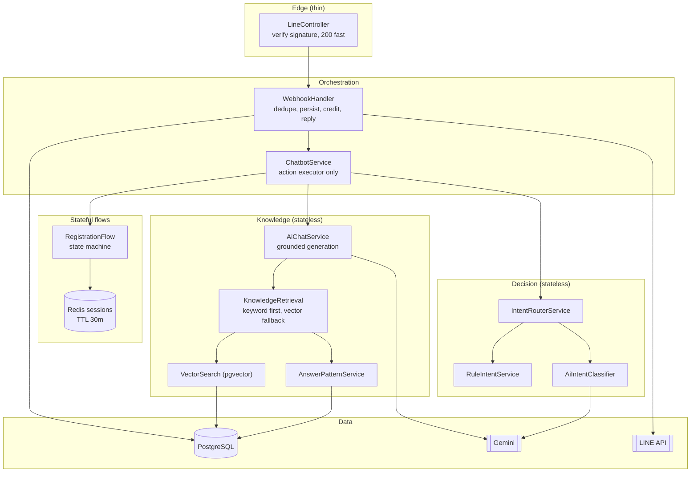

# AI Chatbot — Architecture Review & System Design

> Companion docs: [service-flow.md](./service-flow.md) (end-to-end flow + dependency diagrams) · [erd-database.md](./erd-database.md) (database ERD)
>
> Reviewed: 2026-07-06 · Scope: `src/`, `prisma/`, `package.json` · No code was modified.

---

## 1. Current Project Understanding

### 1.1 Stack

NestJS 11 (Fastify adapter) · TypeScript · Prisma 7 + PostgreSQL (`@prisma/adapter-pg`) · Gemini via `@google/genai` · LINE Messaging API (raw `fetch`) · socket.io admin gateway · Redis (ioredis, provisioned but **unused**) · Mongoose (connected at boot but **unused**) · BullMQ (installed, **unused**).

### 1.2 Module / Service Map

| Module | Services | Responsibility |
|---|---|---|
| `LineModule` | `LineController`, `LineWebhookService`, `LineService` | Webhook entry, chat persistence, LINE REST client (reply/push/profile) |
| `ChatbotModule` | `ChatbotService`, `IntentRouterService`, `RuleIntentService`, `ReplyTemplateService`, `UserSessionService` (+ registers `RegistrationFlowService`, `RegisterParser`, `RegisterValidator`) | Orchestration: session → route → action → reply |
| `AiModule` | `AiChatService`, `AiIntentClassifierService`, `AnswerPatternService`, `EmbeddingService`, `SemanticSearchService`, `KnowledgeRetrievalService` | Gemini classification + grounded answering + knowledge retrieval |
| `RegistrationModule` | `RegistrationService`, `RegistrationController` | Member creation (bcrypt, generated username/password), plus an **unvalidated public REST endpoint** |
| `NotificationModule` | `NotificationService`, `NotificationGateway` | socket.io `/admin` namespace, emits `CONTACT_ADMIN` |
| `CreditServiceModule` | `CreditService` | Global `CreditWallet` reserve/refund per LINE reply |
| `AdminModule`, `PaymentsModule`, `PipelineModule` | — | Empty stubs |
| `UsersModule` | `UsersService` | Member listing for the dashboard |
| `PrismaModule` / `RedisModule` | `PrismaService`, `REDIS_CLIENT` | DB access; Redis client exists but no service injects it |

### 1.3 Role of each key piece

- **`LineController` (webhook)** — receives `POST /api/line/webhooks`, loops over events, persists the incoming message, calls the chatbot, replies via `LineService`, persists the SYSTEM reply. It currently *orchestrates* (persistence + chatbot + credit + reply) instead of staying thin. The `x-line-signature` header is accepted but **discarded** (`void signature`).
- **`LineWebhookService`** — upserts `LineMember` (fetching the LINE profile on first contact), upserts the 1:1 `LineConversation`, appends `LineChatHistory` rows (USER / ADMIN / SYSTEM), serves the admin conversation/message endpoints.
- **`ChatbotService`** — the action executor. Loads session, asks `IntentRouterService` for a `RouteDecision`, then `switch (decision.action)` into registration, AI chat, knowledge answer, admin handoff, or templates. Also gates registration behind `CAN_REGISTER`.
- **`IntentRouterService`** — decision policy: CANCEL always wins → active `REGISTER` session continues (unless a ≥0.9 non-register rule interrupts) → rule ≥0.9 wins → otherwise Gemini classifier, with `< 0.6` confidence collapsing to `GENERAL_QUESTION`.
- **`RuleIntentService`** — deterministic keyword/menu matching (Thai + English): cancel words, menu `1`/`2`, register keywords, how-to-register, contact-admin. Pure function, no I/O.
- **`AiIntentClassifierService`** — one Gemini call returning `{intent, confidence}` JSON; invalid intents coerced to `UNKNOWN`; any failure returns confidence 0 (safe fallback). No timeout, no schema validation beyond intent whitelist.
- **`RegistrationFlowService` + `RegistrationService`** — session state machine (`WAITING_REGISTER_FORM → SEND_REGISTER_FORM → CURRENT_REGISTER`) driven by `RegisterParser` (labeled + inferred fields, Thai bank aliases) and `RegisterValidator`; `RegistrationService.register()` enforces phone/bank uniqueness and creates the `Member` with a generated username and random password.
- **`UserSessionService`** — a plain in-process `Map<string, ConversationSession>`. No TTL, no persistence, no locking, no eviction.
- **`AnswerPatternService`** — weighted lexical scoring over active `AnswerPattern` rows (keyword/example/intentKey/title/category, substring containment for unspaced Thai), min score 2, top 5.
- **Semantic / vector search** — `EmbeddingService` calls Gemini embeddings; **`SemanticSearchService.search()` is a stub**: it computes the embedding, logs the dimension, and returns `[]`. `AnswerPatternVector` is never read or written. `KnowledgeRetrievalService` (keyword-first, vector-fallback merger) is **dead code** — registered but injected nowhere; `AiChatService` re-implements its logic with different thresholds.
- **`AiChatService` (Gemini/LLM)** — two paths. `answerKnowLedge`: pattern search → single strong match returns the stored answer **verbatim** (no LLM) → multiple matches ground a Gemini prompt ("answer only from this context, else output the fallback message") → no matches falls to the (stub) vector search → fallback message. `answerGeneral`: small-talk prompt that forbids claiming business status. Prompts/tone/fallback come from the active `AiSetting` row with hard-coded defaults.
- **Prisma/PostgreSQL** — persistence for members, payments, chat history, knowledge, AI settings, credits. See [erd-database.md](./erd-database.md).

### 1.4 Message flow (summary)

```
LINE user → POST /api/line/webhooks
  → LineWebhookService.saveIncomingEvent   (LineMember/Conversation/History)
  → ChatbotService.handleTextMessage
      → UserSessionService.get
      → IntentRouterService.resolve  (rules → session → Gemini classifier)
      → action executor (register flow | knowledge | general chat | templates | handoff)
  → LineService.replyText (reply token)
  → LineWebhookService.saveSystemReplyMessage
```

Full sequence + per-scenario diagrams: [service-flow.md](./service-flow.md).

### 1.5 Drift between CLAUDE.md and code

- `CHECK_STATUS` action and the `needsBusinessData` / `needsKnowledgeSearch` classifier flags are documented but **not implemented** (`AiIntentAnalysis` is only `{intent, confidence}`).
- `START_AI_CHAT` / `CONTINUE_AI_CHAT` actions exist in `ChatbotService` but **no router path ever returns them** — dead branches. Menu `2` maps to `GENERAL_QUESTION`, so the literal text `"2"` is sent to Gemini instead of prompting "what would you like to ask?".
- Docs say `RegistrationService.start()`; actual entry is `RegistrationFlowService`.

---

## 2–4. Diagrams

- End-to-end flows and the service dependency diagram: **[service-flow.md](./service-flow.md)**
- Database ERD with notes on suspicious relations: **[erd-database.md](./erd-database.md)**

---

## 5. Best-Practice Target Architecture

The current layering (controller → chatbot orchestrator → router → executors) is fundamentally sound. The target is the same shape with sharper boundaries — not more layers.



### 5.1 Ideal module responsibilities

| Piece | Responsibility | Must NOT do |
|---|---|---|
| `LineController` | Verify signature, hand body to handler, return 200 | Orchestrate credit/persistence/chatbot |
| Webhook handler service | Dedupe by `lineMessageId`, persist in/out messages, credit reserve/refund, send reply | Intent logic |
| `ChatbotService` | Session load → route → dispatch action → reply string | Talk to Gemini, Prisma, or LINE directly |
| `IntentRouterService` | Pure decision policy over rule/session/AI signals | Execute anything |
| `RuleIntentService` | Deterministic matching, incl. every menu option the default message offers | LLM calls |
| `AiIntentClassifierService` | Classify only, timeout + validated JSON, low temperature | Answer users, trigger business actions |
| `RegistrationFlowService` | The only multi-step state machine; owns its session shape | Direct DB writes (delegates to `RegistrationService`) |
| `KnowledgeRetrievalService` | **Single** retrieval entry: keyword-first, vector-fallback, one threshold set | Exist in parallel with a duplicate in `AiChatService` |
| `AiChatService` | Prompt building + grounded generation + fallback | Retrieval scoring logic |
| Shared `GeminiClient` provider | One configured `GoogleGenAI` instance, timeouts, error mapping | Three ad-hoc `new GoogleGenAI(...)` as today |

### 5.2 Stateless vs stateful

**Stateless (keep them so):** rule intent, router, AI classifier, knowledge retrieval, answer generation, reply templates, LINE client. All derive output from input + DB reads.

**Stateful:**
- **Conversation session** (flow/step/data) — Redis, keyed by LINE user ID.
- **Admin-handoff status** — belongs on `LineConversation.status` in PostgreSQL (durable, dashboard-visible), *not* in the chat session. A `status = 'admin'` conversation should mute the bot until an admin closes it.
- **Chat history** — already in PostgreSQL, correct.

### 5.3 Sessions with Redis + TTL

```
Key      chat:session:{lineUserId}
Value    JSON { flow, step, data, updatedAt }
TTL      30 min, sliding (reset on every write)
Delete   on complete / cancel / handoff-resolution
Lock     SET chat:lock:{lineUserId} "1" NX PX 10000
         → if held, reply "กำลังดำเนินการ กรุณารอสักครู่" or drop; release after handling
```

- Keep the existing `get/set/clear` interface; make it `async` and swap the `Map` for Redis. Callers barely change.
- Sliding TTL means an abandoned register form self-cleans — this *is* the orphan-session fix; no cron needed.
- The NX lock serializes double-taps from the same user (the current `Map` has a read-modify-write race).
- Don't store anything in the session you can't afford to lose; completed registrations are already in PostgreSQL.

### 5.4 Mid-flow digressions

Keep it to **one level** — no digression stack (over-engineering for a LINE bot):

1. `CANCEL` always clears — already correct.
2. During `REGISTER`, a high-confidence informational rule (`REGISTER_HOW_TO`, knowledge question) → answer it, **keep the register session ACTIVE**, and append a resume hint ("ตอบคำถามแล้วครับ ส่งข้อมูลสมัครต่อได้เลย"). Current code answers but gives no resume hint.
3. During `REGISTER`, `CONTACT_ADMIN` → today this **overwrites the register session and loses the user's form data**. Instead: keep the register session, set `LineConversation.status = 'admin'`, notify; when the admin closes, the form data is still there (or TTL expires it naturally).
4. Low-confidence input during a flow stays in the flow (current behavior is correct — treat it as form input).

### 5.5 AnswerPattern + AnswerPatternVector working together

- `AnswerPattern` = the admin-authored source of truth (question examples, keywords, canonical answer). `AnswerPatternVector` = a derived index, 1:1, cascade-deleted — the schema is already right; it's just never populated or queried.
- **Write path:** on `AnswerPattern` create/update (admin CRUD), embed `title + description + questionExamples` and upsert the vector row with `embeddingModel` recorded. Re-embed all rows when the model changes (the column exists for exactly this).
- **Read path:** keyword scoring first (cheap, deterministic, Thai-substring aware — the existing `AnswerPatternService` is good). Only when the top keyword score is weak, embed the query once and run pgvector cosine top-5 with a similarity floor (~0.6; tune on real Thai traffic). Both paths return `KnowledgeItem[]` and both resolve to the same `AnswerPattern.answer` text — the vector is a recall mechanism, never a content source.
- Route **all** of this through `KnowledgeRetrievalService` and delete the duplicated logic inside `AiChatService`.

### 5.6 Avoiding Gemini hallucinations

Already good: grounded prompt with "answer only from this context, else emit the fallback verbatim"; strong single match bypasses the LLM entirely; classifier failures degrade to `UNKNOWN`. Keep and add:

1. **No context ⇒ no generation.** Never call Gemini for knowledge answers with an empty context (already true — preserve this invariant when implementing vector search; a low-similarity match is *not* context).
2. Direct-answer path (verbatim admin answer) stays the preferred outcome — deterministic and free.
3. Classifier: `temperature: 0`, strict JSON schema validation, 3–5s timeout.
4. Never put user PII (phone, bank account) into prompts; the register flow correctly never touches the LLM — keep it that way.
5. Log which `AnswerPattern` IDs backed each answer (needed to debug "why did the bot say that").
6. Maintain a small golden set of Thai Q→expected-pattern pairs and run it as a test whenever patterns or prompts change.

### 5.7 Where admin-editable content lives

| Content | Home | Status |
|---|---|---|
| Knowledge Q&A | `AnswerPattern` | ✅ already DB, needs CRUD API |
| System prompt / tone / fallback | `AiSetting` | ✅ already DB; enforce a single active row |
| Structural flow messages (menu, register form, validation errors) | Code (`ReplyTemplateService`) | ✅ keep in code — they're coupled to flow logic; moving them to DB is over-engineering |
| Registration on/off | `CAN_REGISTER` env | Acceptable; move to `AiSetting`-style config row only if admins need to toggle it without a deploy |

---

## 6. Current Gaps / Risks

Ordered by severity.

**Security**
1. **LINE signature never verified** ([line.controller.ts:36](../src/modules/line/line.controller.ts#L36) — `void signature;`). Anyone who finds the URL can forge webhook events, drive registrations, and burn Gemini credit. `fastify-raw-body` is already installed for exactly this.
2. **Credentials in chat history.** The register-success reply contains the plaintext password and is persisted verbatim into `LineChatHistory` by `saveSystemReplyMessage`, readable via the **unauthenticated** conversation endpoints.
3. **No auth on admin surfaces** — conversation list/read/send endpoints (duplicated on `/api/line/conversations` and `/api/conversations`), plus `POST /registration/register` accepting `body: any` with no validation, plus the socket.io gateway with `origin: '*'`.
4. Internal error messages are relayed to end users (`getRegistrationErrorMessage` returns raw `error.message`).

**Sessions**
5. **In-memory `Map`**: lost on restart (users stranded mid-registration), broken under >1 instance, and **unbounded** — `COMPLETED` register sessions and `CONTACT_ADMIN` sessions are never deleted (memory leak + orphan sessions). No TTL, no expiry messaging, no `EXPIRED` status ever set.
6. **No session lock** — two rapid messages from one user race on read-modify-write.
7. `CONTACT_ADMIN` during registration silently destroys the user's form data (§5.4).

**Intent routing**
8. Menu option **3** is offered in `defaultMessage()` but has no rule → falls through to the AI classifier instead of deterministic `CONTACT_ADMIN`.
9. Menu option **2** routes the literal `"2"` into `answerGeneral` (Gemini answers the message "2") because `START_AI_CHAT` is unreachable.
10. Dead actions/state: `START_AI_CHAT`, `CONTINUE_AI_CHAT`, `CHECK_STATUS` (documented, absent), the `GENERAL_QUESTION` session flow, `PENDING_REGISTER` step, `KnowledgeRetrievalService`. Dead code around routing *is* routing risk — nobody can tell intended from actual behavior.

**Knowledge / vector**
11. **Vector fallback is a stub** that still **pays for an embedding call** on every knowledge miss, then returns `[]` → fallback message. Wasted cost, zero recall.
12. **`AnswerPatternVector` has no migration** — no `CREATE EXTENSION vector`, no table DDL in `prisma/migrations/`. Schema and database have drifted; deploys from migrations alone will not have the table.
13. Retrieval logic duplicated between `AiChatService` and the unused `KnowledgeRetrievalService` with different thresholds.

**Webhook / delivery**
14. **No idempotency**: LINE redelivers on non-200/slow responses; `lineMessageId` is indexed but never checked → duplicate processing, duplicate Gemini spend.
15. Everything runs inline in the webhook request — profile fetch + up to 2 Gemini calls + DB writes. Reply tokens are single-use and short-lived; slow Gemini ⇒ dead token ⇒ throw ⇒ LINE retries the whole batch. One bad event poisons the loop for subsequent events.
16. **Credit accounting is inverted**: `reserveLineReplyCredit()` is commented out but `refundLineReplyCredit()` still runs on reply failure — every failure *increases* the balance and drives `usedTotal` negative.

**Coupling / hygiene**
17. `LineController` orchestrates four services; `ChatbotModule` re-provides registration internals (`RegistrationFlowService`, parser, validator) instead of importing them from `RegistrationModule`'s exports — module boundary blur.
18. Three separate `new GoogleGenAI(...)` instances reading `process.env` directly (bypassing `ConfigService`); no timeouts anywhere on Gemini or LINE `fetch` calls.
19. Boot-time dead weight: Mongoose connection is **required** at bootstrap (`MONGO_URI`, `asPromise()`) yet no model uses it; Redis and BullMQ provisioned but unused; `main.ts` hardcodes `app.listen(8080)` while logging the configured `PORT`.
20. **Zero tests** (jest configured, no spec files) — the parser, scorer, and router are pure functions begging for unit tests.

---

## 7. Recommended Final Flow

Target behavior per scenario (differences from today in **bold**):

| Scenario | Flow |
|---|---|
| Normal message | Verify signature → **dedupe by `lineMessageId`** → persist → no session → rule match or classifier → answer → persist reply. **If `conversation.status = 'admin'`, bot stays silent.** |
| Register start | `REGISTER` intent → create Redis session (TTL 30m) `SEND_REGISTER_FORM` → send form template. |
| Register continue | Active session wins routing → **acquire user lock** → parse + merge fields → missing → re-ask; complete + valid → create member → **push credentials via one-time channel or masked message, don't persist plaintext** → delete session. |
| Digression during register | High-confidence informational intent → answer it → session stays ACTIVE, TTL slides → **append resume hint**. |
| Knowledge question | `ANSWER_KNOWLEDGE` → keyword scoring → strong single match ⇒ verbatim admin answer; several ⇒ grounded Gemini; weak ⇒ **pgvector cosine top-5 with similarity floor** ⇒ grounded Gemini. |
| No knowledge found | Below floor everywhere ⇒ `AiSetting.fallbackMessage`, **never generate** — optionally auto-suggest contact-admin. |
| Contact admin | Rule (incl. **menu "3"**) or AI → set `LineConversation.status = 'admin'` **in DB** → socket notify → template reply → bot muted for that conversation → **register data preserved** → admin closes ⇒ status `open`. |
| Cancel | Any point: clear Redis session, confirm. (Already correct.) |
| Session expiry | TTL lapses silently; next message starts fresh. If it parses like register-form data with no session, reply "เซสชันหมดอายุแล้ว พิมพ์ 'สมัคร' เพื่อเริ่มใหม่". |

---

## 8. Refactor Roadmap

Each phase is shippable on its own; order = risk-reduction per unit of effort.

### Phase 1 — Minimal fixes (security + correctness, no re-architecture)
- Verify `x-line-signature` (HMAC-SHA256 over raw body; `fastify-raw-body` is installed).
- Guard the admin/conversation endpoints and `POST /registration/register` (a static bearer token is enough to start); remove the duplicate conversation controller; validate the webhook + registration bodies with the already-present `nestjs-zod`.
- Re-enable credit `reserve` or remove the orphan `refund`.
- Add rule for menu `3` → `CONTACT_ADMIN`; wire menu `2` → `START_AI_CHAT` (or delete the dead actions and prompt properly).
- Delete sessions on registration completion and after contact-admin; stop echoing raw `error.message` to users.
- Stop persisting the plaintext password into chat history (mask before `saveSystemReplyMessage`).
- Dedupe webhook events by `lineMessageId` (unique index + skip-if-seen).
- `main.ts`: listen on configured `PORT`; drop the Mongoose bootstrap (unused) — deleting it removes a whole failure mode.
- Skip the wasted embedding call while the vector path is a stub.

### Phase 2 — Redis session + TTL
- `UserSessionService` → Redis (`ioredis` client already provided): async `get/set/clear`, 30-min sliding TTL, JSON values.
- Per-user `SET NX PX` lock in `ChatbotService.handleTextMessage`.
- Remove the now-impossible orphan/restart/multi-instance issues from the ops checklist.

### Phase 3 — Digression handling
- Preserve register session across `CONTACT_ADMIN` (move handoff state to `LineConversation.status`; bot mutes while `'admin'`).
- Resume hints after answered digressions; expiry courtesy message (§7).
- Persist each `RouteDecision` (or structured-log it) — this is also the Phase 6 observability seed.

### Phase 4 — AnswerPatternVector integration
- Hand-written migration: `CREATE EXTENSION IF NOT EXISTS vector`, table DDL, HNSW (or ivfflat) index on `embedding`.
- Implement `SemanticSearchService.search()`: embed query → `$queryRaw` cosine top-5 join `AnswerPattern` → similarity floor → `KnowledgeItem[]`.
- Embed-on-write from AnswerPattern CRUD; backfill script for existing rows; record `embeddingModel`.
- Consolidate retrieval into `KnowledgeRetrievalService`; delete the duplicate path in `AiChatService`.

### Phase 5 — Admin dashboard / content management
- CRUD APIs: `AnswerPattern` (triggers re-embedding), `AiSetting` (enforce single active), conversation takeover open/close.
- Real auth (JWT + admin table — also gives `Payment.approveBy` something to reference).
- Restrict the socket.io gateway origin; emit handoffs to the namespace with conversation context instead of the raw session blob.

### Phase 6 — Observability, logging, testing
- Structured logs with a correlation ID per webhook event; count Gemini calls/tokens/latency per reply (credit costs money — measure it).
- Health endpoint (DB + Redis + LINE token check); alert on classifier failure rate and fallback-message rate (a rising fallback rate = knowledge gaps).
- Unit tests: `RuleIntentService`, `IntentRouterService` policy table, `RegisterParser` (Thai labeled/unlabeled/mixed input), `AnswerPatternService` scoring, plus the golden-set retrieval test (§5.6).
- E2E: webhook → reply with LINE + Gemini mocked.
- Update `CLAUDE.md` to match reality (remove `CHECK_STATUS`/flags or implement them).

**Deliberately not recommended** (over-engineering at this scale): microservices, an event bus, a digression stack, CQRS, moving reply templates to the DB, LangChain-style orchestration, a separate vector database — pgvector in the existing PostgreSQL is exactly right.
