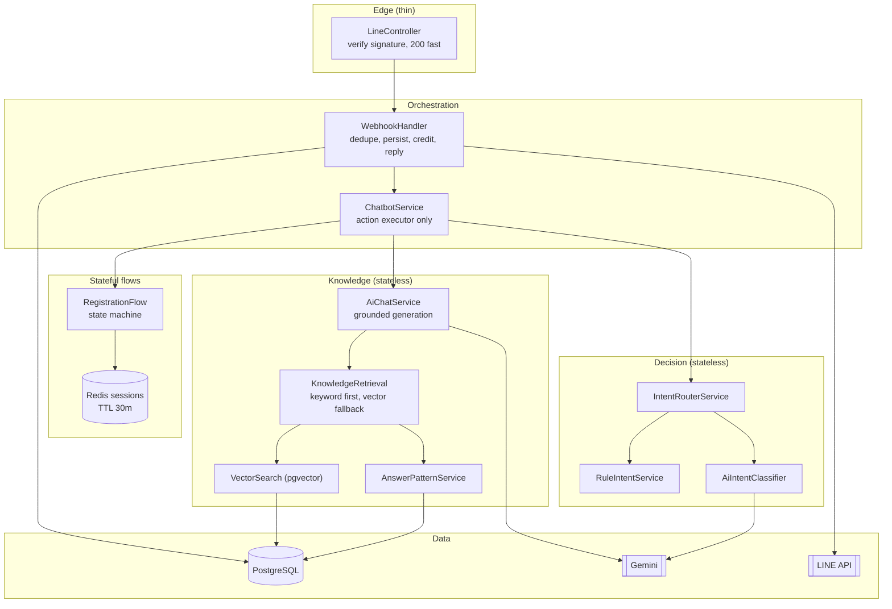

# AI Chatbot — Architecture Review & System Design

> Companion docs: [architecture.html](./architecture.html) (endpoint + ERD + data shapes, open in a browser) · [line-message-e2e-current.md](./line-message-e2e-current.md) (field-level current flow) · [service-flow.md](./service-flow.md) (flow + dependency diagrams) · [erd-database.md](./erd-database.md)
>
> Original review: 2026-07-06 · **§1 and §6 refreshed against the code on 2026-08-15.** §5, §7, §8 remain the *target* design and roadmap, annotated with what has since shipped.

---

## 1. Current Project Understanding

### 1.1 Stack

NestJS 11 (Fastify adapter) · TypeScript · Prisma 7 + PostgreSQL with pgvector · **multi-provider AI** (Gemini `@google/genai`, OpenAI, Anthropic) behind one adapter interface · LINE Messaging API (raw `fetch`) · socket.io admin gateway (**JWT-guarded**) · Redis/ioredis (**in use**: sessions, chat context, rate limits, bans, spam counters, provider-setting cache) · **BullMQ** (`line-events` queue + in-process worker) · Mongoose (still connected at boot, still **unused by any model**).

### 1.2 Module / Service Map

| Module | Services | Responsibility |
|---|---|---|
| `LineModule` | `LineController`, `LineConversationController`, `LineWebhookService`, `LineService`, `LineEventsProcessor`, `LineSignatureGuard` | Webhook ingress → queue → worker: persist, orchestrate, reply; admin conversation API |
| `ChatbotModule` | `ChatbotService`, `IntentRouterService`, `RuleIntentService`, `StickerIntentService`, `ReplyTemplateService`, `UserSessionService`, `LoadContextService` (+ registers `RegistrationFlowService`, `RegisterParser`, `RegisterValidator`) | Orchestration: guard → session → route → action → reply, plus Redis session/context |
| `AiModule` (`chatbot/ai.module.ts`) | `AiChatService`, `AiIntentClassifierService`, `KnowledgeRetrievalService`, `AnswerPatternService`, `AnswerPatternCacheService`, `SemanticSearchService`, `RetrievalQueryPlannerService` | Hybrid retrieval (cache → DB → pgvector), bounded agentic second pass, grounded answering |
| `AiProviderModule` | `AiProviderService`, `UsersAiProviderService`, `AdminAiProviderService`, `AiProviderSettingsService`, `AdminAiProviderSettingsService`, `AiModelCatalogService`, `EmbeddingService`, 3 adapters | Provider/model selection per scope and per admin, with a Redis-cached setting |
| `AdminModule` | `AdminAnswerPatternController` + service | Knowledge CRUD with embed-on-write and a reindex endpoint |
| `AuthModule` / `AdminAuthModule` | `AdminAuthService`, `AdminJwtService`, `AdminAuthController` | Hand-rolled HS256 admin JWT + `AdminGuard(...roles)` |
| `AbuseModule` / `RateLimitModule` | `BanService`, `SpamDetectorService`, `RateLimitService`, `AiBudgetService` | Strikes/bans, spam heuristics, fixed-window limits, AI budget gate |
| `RegistrationModule` | `RegistrationService`, `RegistrationController` | Member creation (bcrypt, generated username/password), plus an **unvalidated public REST endpoint** |
| `NotificationModule` | `NotificationService`, `NotificationGateway` | socket.io `/admin` namespace, emits `CONTACT_ADMIN`, rejects sockets without an admin JWT |
| `CreditServiceModule` | `CreditService` | Global `CreditWallet` — reserve call is currently commented out |
| `UsersModule` | `UsersService` | Member listing for the dashboard |
| `PaymentsModule`, `PipelineModule` | — | Empty stubs (controllers with no routes) |
| `PrismaModule` / `RedisModule` / `EmbeddingModule` | `PrismaService`, `REDIS_CLIENT`, `EMBEDDING_ADAPTER` | Infrastructure providers |

### 1.3 Role of each key piece

- **`LineController` (webhook)** — receives `POST /api/line/webhooks`, verifies the signature through `LineSignatureGuard`, applies ingress limiting, enqueues events in BullMQ keyed by `webhookEventId`, and returns HTTP 200 immediately.
- **`LineEventsProcessor`** — the BullMQ worker: serializes work per user via an in-memory promise tail, drops stale events (>50s), runs ban/burst/hourly/spam checks, claims the event in `ProcessedLineWebhookEvent`, and releases the claim if processing throws so BullMQ can retry.
- **`LineWebhookService`** — upserts `LineMember` (fetching the LINE profile on first contact), upserts the 1:1 `LineConversation`, appends `LineChatHistory` rows (USER / ADMIN / SYSTEM), drives the chatbot, replies, applies the response's `contextPolicy`, and serves the admin conversation/message endpoints.
- **`ChatbotService`** — the action executor. Rejects empty/over-long text before any AI call, loads the session, asks `IntentRouterService` for a `RouteDecision`, then `switch (decision.action)`. Also re-routes through `resolveLowConfidence()` when a grounded answer reports `INSUFFICIENT_CONTEXT`, and gates registration behind `CAN_REGISTER`.
- **`IntentRouterService`** — decision policy: CANCEL always wins → active `REGISTER` session continues (unless a ≥0.9 non-register rule interrupts) → rule ≥0.9 wins unless it maps to `ANSWER_KNOWLEDGE` → **knowledge retrieval decides** → `LOW_CONFIDENCE` falls to the BUSINESS/GENERAL classifier. The old "classify intent first with an LLM" path is no longer used.
- **`RuleIntentService`** — deterministic keyword/menu matching (Thai + English): cancel words, menu `1`/`2`, register keywords, how-to-register, contact-admin. Pure function, no I/O.
- **`AiIntentClassifierService`** — `classifyLowConfidence()` is the live method: one call returning `{classification, confidence, response?}`; a `GENERAL` verdict may carry the answer itself (saving one call), and any parse failure or exhausted budget defaults to `BUSINESS` confidence 0 (hand to a human rather than guess). `analyze()` and its prompt remain as dead code.
- **`RegistrationFlowService` + `RegistrationService`** — session state machine (`WAITING_REGISTER_FORM → SEND_REGISTER_FORM → CURRENT_REGISTER`) driven by `RegisterParser` (labeled + inferred fields, Thai bank aliases) and `RegisterValidator`; `RegistrationService.register()` enforces phone/bank uniqueness and creates the `Member` with a generated username and random password. The session is cleared on success so PII does not linger in Redis.
- **`UserSessionService`** — Redis-backed `chat:session:<userId>` state with a configurable sliding TTL (default 30 minutes), self-healing on corrupt/mismatched values. There is no distributed per-user lock yet.
- **`LoadContextService`** — Redis list `chat:context:<conversationId>`; stores at most three delivered turns, redacts passwords/bank numbers/phones before writing, and never throws (the reply has already been sent).
- **`AnswerPatternService` + `AnswerPatternCacheService`** — one weighted lexical scorer used by both the RAM snapshot (refreshed every 240s, never queried on the request path) and the authoritative DB lookup, so cache and DB can never score differently.
- **`KnowledgeRetrievalService`** — now the **single retrieval entry point**: cache → DB → embedding per pass, hybrid merge/rank, `decide()` into `DIRECT | RAG | LOW_CONFIDENCE`, plus one bounded agentic second pass through `RetrievalQueryPlannerService` (follow-up rewrites are done without an LLM; rewritten queries can never answer verbatim).
- **`AiChatService`** — `answerKnowledge` (verbatim on `DIRECT`, grounded generation on `RAG`, `INSUFFICIENT_CONTEXT` sentinel on weak evidence), `answerGeneral` (small talk, never claims business status), `answerImage` (JSON safety classification with a blocked-answer regex layer), `answerFallback` (returns the configured fallback without calling any provider). Prompts/tone/fallback come from the active `AiSetting` row with hard-coded defaults.
- **AI provider layer** — `UsersAiProviderService` → `AiProviderService.generate('USER')` reads the Redis-cached `AiProviderSetting` and dispatches to the Gemini/OpenAI/Anthropic adapter; admins get their own per-member provider/model with role-based allow lists. Every external call first passes `AiBudgetService.tryConsume()`.
- **Prisma/PostgreSQL** — persistence for members, payments, chat history, knowledge + vectors, AI settings, admin accounts, credits, webhook claims. See [erd-database.md](./erd-database.md).

### 1.4 Message flow (summary)

```
LINE user → POST /api/line/webhooks        (signature verified, ingress-limited)
  → BullMQ line-events (jobId = webhookEventId) → HTTP 200 {ok:true}
  → LineEventsProcessor   (per-user ordering, stale/ban/burst/hourly/spam, DB claim)
  → LineWebhookService.saveIncomingEvent   (LineMember/Conversation/History)
  → LoadContextService.load                (≤ 6 recent messages)
  → ChatbotService.handleTextMessage
      → UserSessionService.get             (sliding TTL)
      → IntentRouterService.resolve        (rule → session → retrieval → low-confidence classifier)
      → action executor (register flow | knowledge | general chat | templates | handoff)
  → LineService.replyText (reply token, global reply limit)
  → LineWebhookService.saveSystemReplyMessage + contextPolicy (append | clear | skip)
```

Full sequence + per-scenario diagrams: [service-flow.md](./service-flow.md) · field-level detail: [line-message-e2e-current.md](./line-message-e2e-current.md).

### 1.5 Drift between CLAUDE.md and code

`CLAUDE.md` was refreshed on 2026-08-15 to match the router above. What the older text got wrong, for the record:

- `CHECK_STATUS` action and the `needsBusinessData` / `needsKnowledgeSearch` classifier flags never existed in code; the live classifier returns `{classification: 'BUSINESS' | 'GENERAL', confidence, response?}`.
- `ANSWER_GENERAL` / `DEFAULT` as documented actions — the real enum is in `types/chat.types.ts`, and `START_AI_CHAT`, `CONTINUE_AI_CHAT`, `FALLBACK` are unreachable branches no router path returns.
- The AI classifier is no longer the second stage of routing; **knowledge retrieval is**, and the LLM only sees the message after retrieval reports `LOW_CONFIDENCE`.
- Docs said `RegistrationService.start()`; the actual entry is `RegistrationFlowService`.

---

## 2–4. Diagrams

- End-to-end flows and the service dependency diagram: **[service-flow.md](./service-flow.md)**
- Database ERD with notes on suspicious relations: **[erd-database.md](./erd-database.md)**

---

## 5. Best-Practice Target Architecture

The current layering (controller → chatbot orchestrator → router → executors) is fundamentally sound. The target is the same shape with sharper boundaries — not more layers.


```mermaid
flowchart TD
    subgraph Edge["Edge (thin)"]
        WH["LineController<br/>verify signature, 200 fast"]
    end
    subgraph Orchestration
        ORC["WebhookHandler<br/>dedupe, persist, credit, reply"]
        CB["ChatbotService<br/>action executor only"]
    end
    subgraph Decision["Decision (stateless)"]
        IR["IntentRouterService"]
        RI["RuleIntentService"]
        AIC["AiIntentClassifier"]
    end
    subgraph Flows["Stateful flows"]
        REG["RegistrationFlow<br/>state machine"]
        SES[("Redis sessions<br/>TTL 30m")]
    end
    subgraph Knowledge["Knowledge (stateless)"]
        KR["KnowledgeRetrieval<br/>keyword first, vector fallback"]
        AP["AnswerPatternService"]
        VS["VectorSearch (pgvector)"]
        GEN["AiChatService<br/>grounded generation"]
    end
    subgraph Data
        PG[("PostgreSQL")]
        GEM[["Gemini"]]
        LINE[["LINE API"]]
    end

    WH --> ORC --> CB --> IR
    IR --> RI
    IR --> AIC --> GEM
    CB --> REG --> SES
    CB --> GEN --> KR
    KR --> AP --> PG
    KR --> VS --> PG
    GEN --> GEM
    ORC --> LINE
    ORC --> PG
```

### 5.1 Ideal module responsibilities

| Piece | Responsibility | Must NOT do |
|---|---|---|
| `LineController` | Verify signature, hand body to handler, return 200 | Orchestrate credit/persistence/chatbot |
| Webhook handler service | Dedupe by `webhookEventId` + `lineMessageId`, persist in/out messages, credit reserve/refund, send reply | Intent logic |
| `ChatbotService` | Session load → route → dispatch action → reply string | Talk to Gemini, Prisma, or LINE directly |
| `IntentRouterService` | Pure decision policy over rule/session/AI signals | Execute anything |
| `RuleIntentService` | Deterministic matching, incl. every menu option the default message offers | LLM calls |
| `AiIntentClassifierService` | Classify only, timeout + validated JSON, low temperature | Answer users, trigger business actions |
| `RegistrationFlowService` | The only multi-step state machine; owns its session shape | Direct DB writes (delegates to `RegistrationService`) |
| `KnowledgeRetrievalService` | **Single** retrieval entry: keyword-first, vector-fallback, one threshold set | Exist in parallel with a duplicate in `AiChatService` |
| `AiChatService` | Prompt building + grounded generation + fallback | Retrieval scoring logic |
| Shared `GeminiClient` provider | One configured `GoogleGenAI` instance, timeouts, error mapping | Three ad-hoc `new GoogleGenAI(...)` as today |

### 5.2 Stateless vs stateful

**Stateless (keep them so):** rule intent, router, AI classifier, knowledge retrieval, answer generation, reply templates, LINE client. All derive output from input + DB reads.

**Stateful:**
- **Conversation session** (flow/step/data) — Redis, keyed by LINE user ID.
- **Admin-handoff status** — belongs on `LineConversation.status` in PostgreSQL (durable, dashboard-visible), *not* in the chat session. A `status = 'admin'` conversation should mute the bot until an admin closes it.
- **Chat history** — already in PostgreSQL, correct.

### 5.3 Sessions with Redis + TTL

```
Key      chat:session:{lineUserId}
Value    JSON { flow, step, data, updatedAt }
TTL      30 min, sliding (reset on every write)
Delete   on complete / cancel / handoff-resolution
Lock     SET chat:lock:{lineUserId} "1" NX PX 10000
         → if held, reply "กำลังดำเนินการ กรุณารอสักครู่" or drop; release after handling
```

- Keep the existing `get/set/clear` interface; make it `async` and swap the `Map` for Redis. Callers barely change.
- Sliding TTL means an abandoned register form self-cleans — this *is* the orphan-session fix; no cron needed.
- The NX lock serializes double-taps from the same user (the current `Map` has a read-modify-write race).
- Don't store anything in the session you can't afford to lose; completed registrations are already in PostgreSQL.

### 5.4 Mid-flow digressions

Keep it to **one level** — no digression stack (over-engineering for a LINE bot):

1. `CANCEL` always clears — already correct.
2. During `REGISTER`, a high-confidence informational rule (`REGISTER_HOW_TO`, knowledge question) → answer it, **keep the register session ACTIVE**, and append a resume hint ("ตอบคำถามแล้วครับ ส่งข้อมูลสมัครต่อได้เลย"). Current code answers but gives no resume hint.
3. During `REGISTER`, `CONTACT_ADMIN` → today this **overwrites the register session and loses the user's form data**. Instead: keep the register session, set `LineConversation.status = 'admin'`, notify; when the admin closes, the form data is still there (or TTL expires it naturally).
4. Low-confidence input during a flow stays in the flow (current behavior is correct — treat it as form input).

### 5.5 AnswerPattern + AnswerPatternVector working together

- `AnswerPattern` = the admin-authored source of truth (question examples, keywords, canonical answer). `AnswerPatternVector` = a derived 1:1 index, cascade-deleted, written on admin create/update/reindex and queried for semantic fallback.
- **Write path:** on `AnswerPattern` create/update (admin CRUD), embed `title + description + questionExamples` and upsert the vector row with `embeddingModel` recorded. Re-embed all rows when the model changes (the column exists for exactly this).
- **Read path:** keyword scoring first (cheap, deterministic, Thai-substring aware — the existing `AnswerPatternService` is good). Only when the top keyword score is weak, embed the query once and run pgvector cosine top-5 with a similarity floor (~0.6; tune on real Thai traffic). Both paths return `KnowledgeItem[]` and both resolve to the same `AnswerPattern.answer` text — the vector is a recall mechanism, never a content source.
- Route **all** of this through `KnowledgeRetrievalService` and delete the duplicated logic inside `AiChatService`.

### 5.6 Avoiding Gemini hallucinations

Already good: grounded prompt with "answer only from this context, else emit the fallback verbatim"; strong single match bypasses the LLM entirely; classifier failures degrade to `UNKNOWN`. Keep and add:

1. **No context ⇒ no generation.** Never call Gemini for knowledge answers with an empty context (already true — preserve this invariant when implementing vector search; a low-similarity match is *not* context).
2. Direct-answer path (verbatim admin answer) stays the preferred outcome — deterministic and free.
3. Classifier: `temperature: 0`, strict JSON schema validation, 3–5s timeout.
4. Never put user PII (phone, bank account) into prompts; the register flow correctly never touches the LLM — keep it that way.
5. Log which `AnswerPattern` IDs backed each answer (needed to debug "why did the bot say that").
6. Maintain a small golden set of Thai Q→expected-pattern pairs and run it as a test whenever patterns or prompts change.

### 5.7 Where admin-editable content lives

| Content | Home | Status |
|---|---|---|
| Knowledge Q&A | `AnswerPattern` | ✅ already DB, needs CRUD API |
| System prompt / tone / fallback | `AiSetting` | ✅ already DB; enforce a single active row |
| Structural flow messages (menu, register form, validation errors) | Code (`ReplyTemplateService`) | ✅ keep in code — they're coupled to flow logic; moving them to DB is over-engineering |
| Registration on/off | `CAN_REGISTER` env | Acceptable; move to `AiSetting`-style config row only if admins need to toggle it without a deploy |

---

## 6. Current Gaps / Risks — refreshed 2026-08-15

Ordered by severity. Items resolved since the July review are listed at the end.

**Build**
0. **The working tree does not compile.** `ConversationSession.requireAdmin: boolean` was added as a required field but no call site supplies it — `tsc --noEmit` fails in `chatbot.service.ts` (×3), `registration-flow.service.ts`, and two spec files. Either pass `requireAdmin: false` everywhere or make the field optional until the handoff feature lands.

**Security**
1. **No global guard.** Nothing registers `APP_GUARD`, so `@Public()` is inert metadata and any route that forgets `@AdminGuard()` is silently open to the internet.
2. **Open surfaces today:** `POST /registration/register` (`body: any`, creates a real `Member` and returns a plaintext password), `GET /api/admin/answer-patterns` and `POST /api/admin/answer-patterns` (class guard commented out, create marked `@Public()`), `POST /api/abuse/bans` (anyone can ban any LINE user).
3. **Credentials in chat history.** The register-success reply contains the plaintext password and is persisted verbatim into `LineChatHistory.text` by `saveSystemReplyMessage`.
4. Internal error messages are relayed to end users (`getRegistrationErrorMessage` returns raw `error.message`).
5. The socket.io gateway now requires an admin JWT, but still runs with `cors.origin: '*'` and broadcasts the raw session object to every connected admin.

**Sessions / handoff**
6. **No per-user distributed lock.** Ordering is an in-memory `Map` in `LineEventsProcessor`, correct for exactly one process; a second instance breaks it.
7. `CONTACT_ADMIN` still does not mute the bot: nothing reads the `CONTACT_ADMIN` session, `LineConversation.status` is never written, and during registration the handoff session overwrites the register session and loses form data.

**Intent routing**
8. Menu option **2** answers with the fallback message: `RULE_MAP` maps it to action `GENERAL_QUESTION`, but `answerGeneralDecision()` needs `decision.generatedResponse`, which only the AI path ever sets.
9. Menu option **3** is offered in `defaultMessage()` but has no rule → costs a retrieval pass plus up to two LLM calls to reach `CONTACT_ADMIN`.
10. Dead code around routing: `AiIntentClassifierService.analyze()`, `fromAi()`, `AI_MAP`, `classifierPrompt`, actions `START_AI_CHAT` / `CONTINUE_AI_CHAT` / `FALLBACK`, session flows `GENERAL_QUESTION` and `CHECK_STATUS`, `RegisterStep.PENDING_REGISTER`, and ~9 unused reply templates.

**Knowledge / vector**
11. **Vector index coverage is operational, not automatic** — the migration must be applied and historical patterns reindexed via `POST /api/admin/answer-patterns/reindex`, otherwise semantic recall returns nothing.
12. `reindex()` embeds row by row with no batching or budget guard; on a large knowledge base it will burn the AI budget and take a long request.
13. Still no golden evaluation set, so retrieval-quality regressions are invisible.

**Webhook / delivery**
14. Reply tokens are single-use and expire in about a minute; slow AI work can trip the second stale check and drop the reply **after** the AI budget was already spent.
15. **Credit accounting is disabled**: `reserveLineReplyCredit()` is commented out in `line-webhook.service.ts`, so `CreditWallet` never moves.
16. `ProcessedLineWebhookEvent` has no retention job; `LineConversation.unreadCount` has no reset path.

**Coupling / hygiene**
17. `LineConversationController` duplicates three `LineController` endpoints one-for-one; `ChatbotModule` re-provides registration internals instead of importing `RegistrationModule`'s exports.
18. No correlation ID across webhook → worker → AI logs; debugging one message means grepping several loggers.
19. Boot-time dead weight: the Mongoose connection is **required** at bootstrap (`MONGO_URI`, `asPromise()`) although no model uses it; `main.ts` hardcodes `app.listen(8080)` while logging the configured `PORT`.
20. `AnswerPattern.tenantId` exists but is never read or written — a multi-tenant promise nothing enforces.

**Closed since the July review**
- ✅ LINE signature verification, ingress limiting, BullMQ queue + retry, and three-layer idempotency are live.
- ✅ Sessions and chat context moved to Redis with sliding TTL and PII redaction.
- ✅ Retrieval consolidated into `KnowledgeRetrievalService` (the duplicate path inside `AiChatService` is gone) with cache → DB → pgvector hybrid ranking and a bounded agentic second pass.
- ✅ Admin JWT auth, role-scoped `AdminGuard`, guarded conversation endpoints, and knowledge CRUD with embed-on-write.
- ✅ One shared provider layer replaced the three ad-hoc `GoogleGenAI` instances, with request timeouts and per-user/global AI budgets.
- ✅ Abuse controls: bans with strike escalation, burst/hourly limits, spam heuristics.

---

## 7. Recommended Final Flow

Target behavior per scenario (differences from today in **bold**):

| Scenario | Flow |
|---|---|
| Normal message | Verify signature → **dedupe by `lineMessageId`** → persist → no session → rule match or classifier → answer → persist reply. **If `conversation.status = 'admin'`, bot stays silent.** |
| Register start | `REGISTER` intent → create Redis session (TTL 30m) `SEND_REGISTER_FORM` → send form template. |
| Register continue | Active session wins routing → **acquire user lock** → parse + merge fields → missing → re-ask; complete + valid → create member → **push credentials via one-time channel or masked message, don't persist plaintext** → delete session. |
| Digression during register | High-confidence informational intent → answer it → session stays ACTIVE, TTL slides → **append resume hint**. |
| Knowledge question | `ANSWER_KNOWLEDGE` → keyword scoring → strong single match ⇒ verbatim admin answer; several ⇒ grounded Gemini; weak ⇒ **pgvector cosine top-5 with similarity floor** ⇒ grounded Gemini. |
| No knowledge found | Below floor everywhere ⇒ `AiSetting.fallbackMessage`, **never generate** — optionally auto-suggest contact-admin. |
| Contact admin | Rule (incl. **menu "3"**) or AI → set `LineConversation.status = 'admin'` **in DB** → socket notify → template reply → bot muted for that conversation → **register data preserved** → admin closes ⇒ status `open`. |
| Cancel | Any point: clear Redis session, confirm. (Already correct.) |
| Session expiry | TTL lapses silently; next message starts fresh. If it parses like register-form data with no session, reply "เซสชันหมดอายุแล้ว พิมพ์ 'สมัคร' เพื่อเริ่มใหม่". |

---

## 8. Refactor Roadmap

Each phase is shippable on its own; order = risk-reduction per unit of effort.

### Phase 1 — Minimal fixes (security + correctness, no re-architecture)
- Add integration coverage for `x-line-signature` (HMAC-SHA256 over raw body; implementation is already active).
- Guard the admin/conversation endpoints and `POST /registration/register` (a static bearer token is enough to start); remove the duplicate conversation controller; validate the webhook + registration bodies with the already-present `nestjs-zod`.
- Re-enable credit `reserve` or remove the orphan `refund`.
- Add rule for menu `3` → `CONTACT_ADMIN`; wire menu `2` → `START_AI_CHAT` (or delete the dead actions and prompt properly).
- Delete sessions on registration completion and after contact-admin; stop echoing raw `error.message` to users.
- Stop persisting the plaintext password into chat history (mask before `saveSystemReplyMessage`).
- Dedupe webhook events by `webhookEventId` and `lineMessageId` (both unique/skip-if-seen paths are now active).
- `main.ts`: listen on configured `PORT`; drop the Mongoose bootstrap (unused) — deleting it removes a whole failure mode.
- Verify vector migration/reindex coverage and tune the similarity floor using real Thai queries.

### Phase 2 — Session concurrency hardening
- Per-user `SET NX PX` lock in `ChatbotService.handleTextMessage`.
- Add integration tests for duplicate/redelivered events and multi-worker ordering.

### Phase 3 — Digression handling
- Preserve register session across `CONTACT_ADMIN` (move handoff state to `LineConversation.status`; bot mutes while `'admin'`).
- Resume hints after answered digressions; expiry courtesy message (§7).
- Persist each `RouteDecision` (or structured-log it) — this is also the Phase 6 observability seed.

### Phase 4 — AnswerPatternVector operations
- Apply `20260725000000_add_answer_pattern_vectors` and verify the HNSW index.
- Run the guarded AnswerPattern reindex endpoint for historical rows; monitor failed rows and `embeddingModel` coverage.
- Consolidate retrieval into `KnowledgeRetrievalService`; delete the duplicate path in `AiChatService`.

### Phase 5 — Admin dashboard / content management
- CRUD APIs: `AnswerPattern` (triggers re-embedding), `AiSetting` (enforce single active), conversation takeover open/close.
- Real auth (JWT + admin table — also gives `Payment.approveBy` something to reference).
- Restrict the socket.io gateway origin; emit handoffs to the namespace with conversation context instead of the raw session blob.

### Phase 6 — Observability, logging, testing
- Structured logs with a correlation ID per webhook event; count Gemini calls/tokens/latency per reply (credit costs money — measure it).
- Health endpoint (DB + Redis + LINE token check); alert on classifier failure rate and fallback-message rate (a rising fallback rate = knowledge gaps).
- Unit tests: `RuleIntentService`, `IntentRouterService` policy table, `RegisterParser` (Thai labeled/unlabeled/mixed input), `AnswerPatternService` scoring, plus the golden-set retrieval test (§5.6).
- E2E: webhook → reply with LINE + Gemini mocked.
- Update `CLAUDE.md` to match reality (remove `CHECK_STATUS`/flags or implement them).

**Deliberately not recommended** (over-engineering at this scale): microservices, an event bus, a digression stack, CQRS, moving reply templates to the DB, LangChain-style orchestration, a separate vector database — pgvector in the existing PostgreSQL is exactly right.
