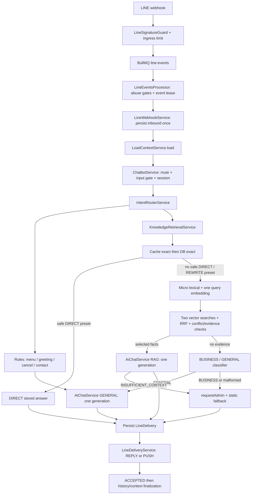

# AI chatbot — architecture และ flow การทำงานปัจจุบัน

อัปเดตจาก source ใน working tree: 2026-09-20

เอกสารนี้อธิบายการทำงานจริงของ core LINE/AI/RAG: function รับข้อมูลอะไร เรียก service ใด เปลี่ยน state อะไร และคืนผลลัพธ์ให้ใคร รวม schema และ data contracts ไม่ครอบคลุมรายละเอียดภายใน registration

รายงานวิเคราะห์ P0–P5, ผลทดสอบ และข้อเสนอแก้ไขอยู่ที่ [core-ai-rag-audit-2026-09-20.md](core-ai-rag-audit-2026-09-20.md)

## 1. Runtime flow ที่ทำงานจริง


```mermaid
flowchart TD
  A[LINE webhook] --> B[LineSignatureGuard + ingress limit]
  B --> C[BullMQ line-events]
  C --> D[LineEventsProcessor: abuse gates + event lease]
  D --> E[LineWebhookService: persist inbound once]
  E --> F[LoadContextService.load]
  F --> G[ChatbotService: mute + input gate + session]
  G --> H[IntentRouterService]
  H --> I[Rules: menu / greeting / cancel / contact]
  H --> J[KnowledgeRetrievalService]
  J --> K[Cache exact then DB exact]
  K -->|safe DIRECT preset| L[DIRECT stored answer]
  K -->|no safe DIRECT / REWRITE preset| M[Micro lexical + one query embedding]
  M --> N[Two vector searches + RRF + conflict/evidence checks]
  N -->|selected facts| O[AiChatService RAG: one generation]
  N -->|no evidence| P[BUSINESS / GENERAL classifier]
  P -->|GENERAL| Q[AiChatService GENERAL: one generation]
  P -->|BUSINESS or malformed| R[requestAdmin + static fallback]
  O -->|INSUFFICIENT_CONTEXT| R
  I --> Q
  L --> S[Persist LineDelivery]
  O --> S
  Q --> S
  R --> S
  S --> T[LineDeliveryService: REPLY or PUSH]
  T --> U[ACCEPTED then history/context finalization]
```

Diagram greeting edge ไป GENERAL ใช้เฉพาะ greeting/acknowledgment; menu/cancel/contact มี static branch ไม่เรียกโมเดล

| ขั้น | Service entry | Input → output / side effects |
|---|---|---|
| HTTP | `LineController.handleWebhook` | `{destination,events[]}` → `{ok:true}`; raw HMAC checked, ingress Redis limit, queue jobId=webhookEventId; body ปัจจุบันเป็น TS type ไม่ใช่ runtime Zod DTO |
| Worker | `LineEventsProcessor.process/processRetry` | `Job<{event}>`; ban/burst/hourly/spam → DB claim; Promise tail แยก user ภายใน instance |
| Claim/recovery | `LineWebhookService.claimWebhookEvent` | event → owner UUID/null; 120s lease, heartbeat 30s, max 5 claims; recovery ทุก 15s |
| Inbound | `saveIncomingEvent` | event → `{conversationId,lineMemberId}`; unique lineMessageId กัน history/unread ซ้ำ; first contact เรียก profile API |
| Core | `ChatbotService.handleTextMessage` | ChatRequest → ChatResponse; mute ให้ empty/EXCLUDE; input default max1000 characters; router เป็นผู้ตัดสิน action |
| Retrieval | `KnowledgeRetrievalService.retrieve` | message + usage IDs/history → KnowledgeRetrievalResult; cache/DB exact, micro lexical, shared query vector, rank/select |
| Generation | `AiChatService.answerKnowledge/answerGeneral/answerImage` | evidence/settings/history → AiAnswerResult; preserve PendingAiUsageError; ordinary generation error คืน fallback |
| Provider | `UsersAiProviderService.generate` | AiGenerateRequest + thread IDs → settings scope USER → AiBillingService → shared provider adapter |
| Handoff | `UserSessionService.requestAdmin` | userId → DB waiting_admin + best-effort notification เมื่อเปลี่ยนสถานะ; ไม่ตั้ง mute |
| Outbox | `LineWebhookService.processEvent` | ChatResponse → upsert LineDelivery.key=webhookEventId; CLEAR context ก่อน persistence; verify lease owner |
| Delivery | `LineDeliveryService.deliver/finalize` | durable row → claim → check mute → REPLY/PUSH → ACCEPTED → unique deliveryId history + context append; repeat repair ไม่ส่งซ้ำ |
| Admin PUSH | `sendAdminMessage` → delivery | key ใช้ admin/conversation/clientRequestId ถ้ามี; mute ทุก actual attempt; accepted admin PUSH เปิด waiting_admin เป็น open ใน transaction |

REPLY ใช้ token เมื่อ deadline timestamp+50s ยังไม่ผ่าน; invalid token แบบชัดเจนจึง fallback PUSH ได้ ambiguous REPLY acceptance เป็น UNKNOWN; PUSH ใช้ retryKey คงเดิม, retry สูงสุด 8 attempts และหยุดเมื่อ key อายุใกล้ 23h; delivery recovery ทุก 5s อ่านสูงสุด 20 rows ไม่อ้างว่า ledger success = LINE delivered เพราะเป็นคนละสถานะ

### จำนวน model operations

| Scenario | Query embedding | Generation |
|---|---:|---:|
| Exact approved DIRECT (cache/DB) | 0 | 0 |
| Greeting/acknowledgment | 0 | 1 |
| Exact preset renderMode=REWRITE | 1 | 1; unified retrieval รวม MicroKnowledge |
| Hybrid/vector RAG | 1 | 1 |
| LOW → BUSINESS | 1 ตามเส้นทางค้นปกติ | 1 classifier |
| LOW → GENERAL | 1 ตามเส้นทางค้นปกติ | 2: classifier แล้ว answer |
| Missing reference | 0 | 0, CLARIFY |
| RAG sentinel | 1 หรือ 0 ตาม retrieval | 1 แล้ว handoff, ไม่วน classifier |
| Image | 0 | 1 safety JSON + answer |
| Menu/contact/cancel/sticker deterministic | 0 | 0 |

ปัจจุบันไม่มี multi-query agentic search หรือ LLM rewrite loop `resolveRetrievalQuery` เป็นฟังก์ชัน deterministic ที่หา explicit “รุ่น X/model X” จากข้อความ/history ล่าสุด; reference ไม่ชัดจะ CLARIFY


## 2. Data shapes และ ownership

```ts
ChatRequest = {
  userId: string; text: string;
  lineMemberId?: string; conversationId?: string; turnId?: string;
  recentMessages?: {role: 'user'|'assistant'; text: string;
    source: 'USER'|'SYSTEM'|'RULE'|'KNOWLEDGE'|'AI'|'REGISTRATION';
    createdAt: number}[];
};
KnowledgeItem = {
  source: 'ANSWER_PATTERN'|'MICRO_KNOWLEDGE'; id: string;
  title?: string; category?: string|null; content: string; answer?: string;
  score: number; renderMode?: 'DIRECT'|'REWRITE';
  metadata?: {rawScore?: number; vectorSimilarity?: number;
    tenantId?: string|null; language?: string; active?: boolean;
    entityKey?: string|null; topicKey?: string|null; safeDirect?: boolean;
    matchTypes?: string[]; [key: string]: unknown};
};
KnowledgeRetrievalResult = {
  route: 'DIRECT'|'RAG'|'LOW_CONFIDENCE';
  matchType: 'EXACT'|'KEYWORD'|'EMBEDDING'|'HYBRID'|'NONE';
  items: KnowledgeItem[]; selectedItems: KnowledgeItem[];
  topScores: number[]; scoreGap: number|null; fallbackReason?: string;
};
RouteDecision = {
  action: string; intent: string; confidence: number; source: string;
  reason?: string; resolvedQuery?: string;
  retrieval?: KnowledgeRetrievalResult; businessFallback?: boolean;
  fallbackReason?: string;
};
AiAnswerResult = {text: string; isFallback: boolean; insufficientContext?: boolean};
ChatResponse = {
  text: string; source: 'SYSTEM'|'RULE'|'KNOWLEDGE'|'AI'|'REGISTRATION';
  contextPolicy: 'INCLUDE'|'EXCLUDE'|'CLEAR';
};
AiGenerateRequest = {
  systemInstruction?: string;
  messages: {role: 'user'|'assistant'; text: string; images?: unknown[]}[];
  temperature?: number; maxOutputTokens?: number;
};
```

Shapes ด้านบนย่อเพื่ออ่าน flow; enum/optional fields ฉบับเต็มอยู่ [chat.types.ts](../src/modules/chatbot/types/chat.types.ts) และ [ai-provider.types.ts](../src/ai-provider/types/ai-provider.types.ts)

- Knowledge scope: trusted `KNOWLEDGE_TENANT_ID` (ไม่ตั้ง=null), `KNOWLEDGE_LANGUAGE` (th)
- AiSetting scope: trusted `AI_SETTING_TENANT_ID` แยกต่างหาก (ไม่ตั้ง=null); ไม่ fallback ข้าม tenant
- Company/billing ใช้ CompanyService ใน deployment single-company; tenant UUID สองตัวข้างต้นยังไม่ใช่ multi-tenant user identity mapping
- Context Redis: `chat:context:<conversationId>`, TTL30m, 3 delivered turns/6 messages; redaction ก่อนเก็บ, truncate ข้อความละ4000 code points; provider helper เลือกย้อนหลังไม่เกิน6000 characters และไม่เริ่มด้วย orphan assistant turn
- Session Redis: `chat:session:<userId>` workflow TTL sliding; `chat:control:<userId>` mute แยก key


## 3. Database ปัจจุบัน

Source: [schema.prisma](../prisma/schema.prisma), [wallet.schema.prisma](../prisma/models/admin/wallet.schema.prisma), [usage.prisma](../prisma/models/admin/usage.prisma) — Prisma schema เป็นหลายไฟล์ ไม่ใช่ schema.prisma ไฟล์เดียว

### AiSetting / aiSettings

| Field | Type/default | การใช้ |
|---|---|---|
| id | UUID PK | identity |
| tenantId | nullable UUID, default null | deployment scope ไม่มี tenant FK |
| systemPrompt | required TEXT | DEV controlled; GET/POST/PATCH responses ของ owner/admin ตัดออก |
| ownerPrompt | nullable TEXT | persona/business role |
| tone | nullable TEXT | style |
| skills | JSONB, [] | [{name,prompt}], max50, name≤100, prompt≤10000 |
| responseStyle | JSONB, adaptive/light | targetLength=short/medium/adaptive, emojiLevel=none/light/normal |
| promptVersion | integer, 1 | explicitly configurable ไม่มี auto-increment |
| fallbackMessage | nullable TEXT | static fallback |
| active | boolean, true | latest active row wins |
| createdAt | timestamp, now | creation |
| updatedAt | timestamp, now + Prisma @updatedAt | sorting; ไม่ใช่ DB trigger สำหรับ raw SQL |

Index (tenantId,active,updatedAt), ไม่มี unique-active constraint Migration 20260919000000 เพิ่ม fields/defaults, ขยาย tone เป็น TEXT และไม่ overwrite platform/fallback เดิม JSON type ใน DB ไม่ได้บังคับ object shape เอง; Zod บังคับผ่าน API

GET/POST `/api/admin/ai-settings`, PATCH/DELETE `/:id`: admin/owner/dev ผ่าน AdminGuard; sensitive field ตรวจที่ service; tenantId ถ้าส่งต้องตรง deployment; hard delete; default create systemPrompt จาก code

### Knowledge และ vector

| Table | Fields / constraints ที่สำคัญ |
|---|---|
| answerPattern | id UUID PK, tenantId UUID?, title varchar255, description text?, category/intentKey varchar100?, keywords/questionExamples text[] default[], answer text, language varchar10 default th, renderMode enum DIRECT/REWRITE (DB direct/rewrite), priority int0, active true, createdAt/updatedAt timestamp6 |
| microKnowledge | fields เหมือน pattern แต่ไม่มี renderMode; เพิ่ม entityKey/topicKey varchar50? สำหรับ fact; answer text, keyword/example arrays, language/priority/active |
| answerPatternVector | id UUID generated, answerPatternId UUID unique FK CASCADE, embedding vector(1536), embeddingModel varchar100?, active true, createdAt/updatedAt |
| microKnowledgeVector | id UUID generated, microKnowledgeId UUID unique FK CASCADE, embedding vector(1536), embeddingModel varchar100?, active true, createdAt/updatedAt |

Source rows ทั้งสองไม่มี Prisma @updatedAt และไม่มี revision/content hash; เปลี่ยน field ผ่าน Prisma ไม่เปลี่ยนเวลาโดยอัตโนมัติ ส่วน vector upsert ตั้ง updatedAt เอง

### LINE / outbox

| Table | Fields / purpose |
|---|---|
| lineMember | id UUID PK, lineUserId unique, memberId nullable FK, displayName/pictureUrl/statusMessage, lastActiveAt/profileSyncedAt, timestamps |
| lineConversation | id UUID, lineMemberId unique FK (1:1), status string default open, lastMessage/type/at, unreadCount0, timestamps |
| lineChatHistory | id UUID, conversationId/lineMemberId FK, sender/messageType enums, text?, lineMessageId unique?, deliveryId unique?, replyToken?, sticker/media/postback fields, rawEvent Json?, sentStatus, sentByAdminId?, createdAt |
| processedLineWebhookEvent | id UUID, webhookEventId unique, processedAt, status, event Json?, leaseOwner/leaseUntil?, attempts0, lastError? |
| lineDelivery | id UUID, key unique, lineUserId/conversationId/lineMemberId, adminMemberId?, text, replyToken/replyUntil?, context Json?, status PENDING, method REPLY, retryKey UUID, firstPushAt?, attempts0, nextAttemptAt, leaseOwner/leaseUntil?, lastError/acceptedAt/finalizedAt?, createdAt |

status fields ของ conversation/delivery/claim เป็น string ไม่ใช่ Prisma enums DB ไม่รับรอง legal state transitions แทน service layer

### Usage / accounting

| Table | Fields / invariants |
|---|---|
| aiProviderSettings | id UUID, scope USER/ADMIN unique, provider enum, model varchar150, timestamps |
| aiModelPricing | id UUID, provider/model, effectiveFrom/effectiveTo?, cost/credit rates แยก regular/cached/cache-write/output, longContextThresholdTokens + multipliers; unique(provider,model,effectiveFrom) |
| aiUsageEvents | id/companyId/kind/provider/model, disjoint token buckets, chargedCredit/internal costThb Decimal, pricingId?, scopeKey?, adminMemberId?/lineMemberId?/conversationId?, status/errorCode/latencyMs/providerRequestId?, createdAt |
| creditWallets | id/companyId unique, balanceCredit/reservedCredit/lifetimeTopupCredit/lifetimeSpentCredit Decimal(20,6), active, timestamps |
| creditBudgets | id/walletId, kind/scopeKey, nullable limitCredit + usedCredit/reservedCredit Decimal; unique(walletId,kind,scopeKey) |
| creditReservation | id, operationKey unique, companyId/walletId/budgetId, amountCredit Decimal, status, replay result Json?, expiresAt, timestamps |
| creditLedger | id/walletId, type, amountCredit/balanceAfterCredit Decimal, kind?, usageEventId unique?, idempotencyKey unique, note?, createdAt |

Billing: quote active pricing → reserve wallet+budget ใน serializable transaction → provider นอก transaction → settle usage/debit/replay/result/release holds พร้อมกัน; result ที่ SETTLED replay ได้โดยไม่เรียก provider ซ้ำ Scope embedding QUERY/DOCUMENT แยกกันที่ EmbeddingService; ordinary LINE generation และ classifier ใช้ LINE_AI_REPLY และ fingerprint request แยก logical calls

Expired HELD ไม่ได้ auto-refund: unresolved-list path เปลี่ยนเป็น UNKNOWN เพื่อ review acceptance ก่อน release ไม่อ้างว่า expiry cleanup ทำงาน background อัตโนมัติ


## 4. Knowledge write และ AiSetting prompt flow

### Document indexing

AdminKnowledgeMicroService.create → canonical buildMicroKnowledgeDocument → EmbeddingService.embedDocument (DOCUMENT scope, rate/billing) → transaction create source + vector upsert → response

PATCH: read source → merge fields/keyword operations → embed merged document → transaction patch source + vector upsert

Reindex: read rows → sequential embed each → upsert vector → {indexed,failed:[{id,reason}]}

AnswerPattern ทำลักษณะเดียวกันแต่ refresh cache หลัง CRUD; admin service นี้ไม่ใส่ tenant predicate ขณะที่ MicroKnowledge ใช้ deployment scope ทั้งสอง source upsert vector โดยไม่ตรวจ revision ส่วน only-active/priority update ยังเรียก embedding ใหม่

Canonical document รวม title/description/category/intent/keywords/questionExamples/answer; micro เพิ่ม entity/topic ไม่มีการใช้ AiSetting ทำ embedding

### Final prompt

load newest active AiSetting in scope → normalize optional/legacy JSON → bounded history → compose:
`systemPrompt → ownerPrompt → tone → skill → responseStyle → promptVersion → modeRules → historyMessage → currentMessage → ragContext`

ส่งผ่าน provider systemInstruction ที่ adapters map เป็น system/instructions ตาม provider; skill เป็น bullet strings, responseStyle เป็น named values, history/RAG เป็น JSON; escape &<> ป้องกัน structural tag breakout โดยข้อความ untrusted ยังเป็นเนื้อหาใน prompt

Applied: RAG, GENERAL, image final answer. Not applied: deterministic rule/DIRECT/static fallback, embedding, retrieval, BUSINESS/GENERAL classifier. ไม่มี extra LLM call เพื่อ compose prompt

DIRECT คืนข้อความ curated ตาม DB เป๊ะ จึงไม่ได้รับ owner tone/emojiStyle; REWRITE จะไม่ใช้ exact fast path แต่ไหลต่อผ่าน micro lexical และ vector retrieval ก่อนส่ง evidence รวมให้ LLM ทั้งนี้ admin DTO ปัจจุบันยังไม่ expose renderMode เป็น field จึงตั้ง renderMode ผ่าน DTO นี้ไม่ได้


## 5. Function flow: ingress, worker และ delivery

Source: [line.controller.ts](../src/modules/line/line.controller.ts), [processor](../src/modules/line/line-events.processor.ts), [webhook service](../src/modules/line/line-webhook.service.ts), [delivery service](../src/modules/line/line-delivery.service.ts)

| Function | รับเข้า → ทำงาน/เรียกต่อ → คืนผล |
|---|---|
| LineSignatureGuard.canActivate | request.rawBody + x-line-signature → HMAC SHA256 ด้วย channel secret และ timingSafeEqual → true หรือ UnauthorizedException |
| LineController.handleWebhook | body.events → ตัด event ไม่มี webhookEventId, consume ingress limit, queue.add แต่ละ event → {ok:true}; เกิน limit โยน503 |
| LineEventsProcessor.onModuleInit / onModuleDestroy | ตั้ง/ยกเลิก recovery timer15s |
| recover | ถ้าไม่กำลัง recovery → recoverableWebhookEvents → retryQueue.add ด้วย recovery jobId → void |
| process | job → processQueuedJob(false); transient provider failure → enqueue retry queue → void |
| processRetry | job → processQueuedJob(true); non-retryable error → UnrecoverableError |
| processQueuedJob | job.source.userId → ต่อ Promise tail ใน Map ต่อ user → processInOrder; finally ล้าง tail ที่จบ |
| processInOrder | passesAbuseChecks → claimWebhookEvent → ถ้า claim สำเร็จ ตั้ง heartbeat30s → processEvent → finishWebhookEvent; error finish ด้วย RETRY แล้ว rethrow |
| passesAbuseChecks | user/event/isRetry → BanService; initial attempt ตรวจ burst/hourly/SpamDetectorService → boolean; retry ข้าม counters หลัง ban check |
| claimWebhookEvent | event → insert ถ้าใหม่; atomic update RETRY/expired PROCESSING ที่ attempts<5 → owner UUID/null |
| renewWebhookLease | webhookEventId+owner → ต่อ120s เฉพาะ PROCESSING ที่ยังเป็น owner |
| finishWebhookEvent | eventId+owner+error? → COMPLETED หรือ RETRY, clear owner, next lease10s, lastError |
| recoverableWebhookEvents | now → expired attempts≥5 เป็น FAILED; เลือก expired RETRY/PROCESSING ที่ attempts<5 ไม่เกิน20 → event[] |
| processEvent | event+owner? → ถ้ามี delivery แล้วเรียก deliver และจบ; saveIncomingEvent → load history → handleText/Image/Sticker → CLEAR context ถ้ากำหนด → transaction verify owner + upsert outbox → deliver |
| saveIncomingEvent | event → toChatMessage; ถ้า lineMessageId มีแล้วคืน IDs เดิม; findOrCreateLineMember → transaction upsert conversation/increment unread/create USER history/update lastActiveAt → IDs; duplicate race คืน IDs ของ committed row |
| findOrCreateLineMember | lineUserId → DB lookup; ถ้าไม่มี getProfile จาก LINE แล้ว upsert profile → LineMember |
| toChatMessage / toMessageEventChatMessage | typed LINE event → normalized text/image/sticker/postback metadata หรือ null |
| sendAdminMessage | conversationId+body+adminId → load conversation/member → upsert durable admin delivery ด้วย clientRequestId หรือ UUID → deliver |
| resumeBot | conversationId → lookup conversation/member → sessions.resume → DB status=open → context.clear → {status:'open'} |
| LineDeliveryService.onModuleInit / onModuleDestroy | ตั้ง/ยกเลิก recovery timer5s |
| recover | อ่าน pending due / sending expired / accepted unfinished สูงสุด20 → deliver ทีละ row |
| deliver | deliveryId → ACCEPTED เรียก finalize; ไม่เช่นนั้น atomic claim SENDING120s → mute check → REPLY ถ้าใช้ token ได้ → accept; ถ้าต้อง PUSH บันทึก method/firstPushAt, admin mute แล้ว pushText(retryKey) → accept |
| finishAttempt | id+owner+state patch → conditional update เฉพาะ leaseOwner/status ของ attempt |
| accept | row+owner → transaction SENDING→ACCEPTED; admin delivery เปิด waiting_admin→open → finalize; finalization error คง ACCEPTED |
| finalize | row → transaction upsert SYSTEM/ADMIN history โดย deliveryId, update preview เฉพาะไม่เก่ากว่าปัจจุบัน → appendTurn ถ้า INCLUDE → finalizedAt |
| LineService.replyText | token+text → rate gate + LINE reply HTTP → boolean หรือ LineDeliveryError |
| LineService.getImageContent | LINE messageId → download พร้อม timeout/size/type checks → {mediaType,data} |
| LineAdminService.pushText | userId+text+retryKey → LINE push HTTP ด้วย retry key → void; accepted retry recognized ตาม transport logic |

Delivery error branches: expired SENDING/REPLY → UNKNOWN; PUSH retryable → PENDING พร้อม backoff; definitive rejected → FAILED; ambiguous outcome → UNKNOWN เมื่อไม่ retry ต่อ Text ว่างไม่สร้าง delivery

## 6. Function flow: routing และคำตอบ

Source: [ChatbotService](../src/modules/chatbot/chatbot.service.ts), [IntentRouterService](../src/modules/chatbot/intent-router.service.ts), [AiChatService](../src/modules/chatbot/aichat.service.ts)

| Function | รับเข้า → ทำงาน/เรียกต่อ → คืนผล |
|---|---|
| handleTextMessage | ChatRequest → isMuted, get session, trim/length gate → router.resolve → switch action → ChatResponse |
| RuleIntentService.detect | text → deterministic menu/keyword rules → {intent,confidence,source:'RULE',reason}; ไม่เรียก DB/provider |
| IntentRouterService.resolve | input/session/history/usage IDs → cancel → active workflow boundary → greeting → high-confidence rule → retrieval; missing info→CLARIFY, conflict/error→CONTACT_ADMIN, DIRECT/RAG→ANSWER_KNOWLEDGE, LOW→resolveLowConfidence |
| resolveLowConfidence | input/history/usage IDs → classifyLowConfidence → GENERAL_QUESTION หรือ CONTACT_ADMIN(businessFallback=true) |
| retrievalSource | retrieval.matchType + selected metadata → EMBEDDING/DATABASE/CACHE source |
| logDecision | decision/retrieval → diagnostic log แล้วคืน decision เดิม |
| classifyLowConfidence | input/context → budget.tryConsume; provider.generate ด้วย classifier prompt → strip JSON fence + parse/validate BUSINESS/GENERAL/confidence/reason → analysis; error/budget→BUSINESS confidence0; PendingAiUsageError rethrow |
| handleImageMessage | ImageChatRequest → mute check → answerImage → aiResponse(source AI) |
| handleStickerMessage | hints/text → StickerIntentService.resolve → greeting/thanks/unknown template หรือส่ง TEXT กลับเข้า handleTextMessage |
| response | text/source/contextPolicy → ChatResponse ไม่มี I/O |
| aiResponse | AiAnswerResult + source → ChatResponse; isFallback=true→EXCLUDE ไม่เช่นนั้น INCLUDE |
| contactAdminResponse | userId+businessFallback → requestAdmin; true→answerFallback + SYSTEM/CLEAR; false→contactAdmin template + RULE/CLEAR |
| answerKnowledge | message/context.retrieval? → ใช้ retrieval เดิมหรือ retrieve; safe DIRECT ANSWER_PATTERN ที่ไม่ REWRITE และ answer ไม่ว่าง → stored text; selectedItems มี→generateFromKnowledge; ไม่พบ→configured fallback |
| answerGeneral | message/context → getActiveAiSetting → toAiProviderMessages → composeAiAnswerPrompt(ragContext=[]) → generateText |
| answerFallback | getActiveAiSetting → {text:fallbackMessage,isFallback:true}; ไม่เรียก provider |
| answerImage | image/context → settings+budget → bounded history + image → compose image rules → provider.generate → parseImageAnalysisResponse + isSafeImageAnalysis → answer/fallback |
| getActiveAiSetting | trusted tenant → Prisma findFirst(active, updatedAt desc) → trim strings, parse skills/style defaults → AiRuntimeSetting; DB error ใช้ code defaults |
| generateText | messages/systemInstruction/fallback/context → budget gate → provider.generate → trimmed text; empty/error→fallback; PendingAiUsageError rethrow |
| generateFromKnowledge | selected items/message/setting/history → buildKnowledgeSystemInstruction → budget → provider.generate temperature0 → sentinel/empty/error/success แยก AiAnswerResult |
| buildKnowledgeSystemInstruction | items/message/settings/history → composeAiAnswerPrompt พร้อม KNOWLEDGE_RULES และ sentinel instruction → string |
| isInsufficientContext | model text → strip fence/quotes, trim, uppercase → เทียบ INSUFFICIENT_CONTEXT เป็น boolean |

Action executor:
- CANCEL_SESSION → clear workflow → cancelled template, CLEAR
- START_AI_CHAT → askAiChatQuestion template, CLEAR
- CONTINUE_AI_CHAT / GENERAL_QUESTION → answerGeneral → aiResponse
- CLARIFY → “ช่วยอธิบายเพิ่มเติมหน่อยได้มั้ยครับ”, RULE/INCLUDE
- ANSWER_KNOWLEDGE → answerKnowledge; insufficientContext=true จึง contactAdminResponse(true), ไม่เช่นนั้น aiResponse
- CONTACT_ADMIN → contactAdminResponse; FALLBACK → answerFallback, SYSTEM/EXCLUDE
- Default/empty → default menu, CLEAR
- Registration actions เป็น call boundary ไป RegistrationFlowService; ไม่อธิบาย implementation ในเอกสารนี้

## 7. Function flow: retrieval และคะแนน

Source: [retrieval](../src/modules/chatbot/knowledge/knowledge-retrieval.service.ts), [matcher](../src/modules/chatbot/knowledge/answer-pattern.service.ts), [semantic](../src/modules/chatbot/knowledge/semantic-search.service.ts)

| Function | รับเข้า → ทำงาน/เรียกต่อ → คืนผล |
|---|---|
| resolveRetrievalQuery | current+history6 messages → หา reference และ explicit รุ่น/model; ไม่กำกวมคืน original หรือ query เติมรุ่น; ไม่พบ/หลายรุ่น→missingReference=true |
| retrieve | message/context → runRetrieval → logRetrieval → KnowledgeRetrievalResult |
| runRetrieval | resolved query → cached lexical + directResult → DB lexical + directResult → parallel micro lexical/semantic → noise filters → rank → conflicts → read failure gate → selectContexts → result |
| eligible | KnowledgeItem → active/scope/language/answer/nonfinite score checks → boolean |
| directResult | candidate[] → conflict check → เลือกเฉพาะ safeDirect ANSWER_PATTERN ที่ไม่ใช่ REWRITE เป็น DIRECT; REWRITE/ไม่มี direct candidate → undefined เพื่อให้ unified retrieval ทำงานต่อ |
| rank | lexical[]+vectors[] → sort แต่ละ list ด้วย raw signal → dedupe source:id ต่อ list → sum 1/(60+rank) → sort RRF/priority/key → merged[] |
| selectContexts | ranked[] → เก็บ whole items ไม่เกิน3/12000 characters → selectedItems |
| conflicts | items → explicit conflicting flag; pairwise same fact scope + polarity/numeric template checks; conditional assertions ข้าม → boolean |
| assertion / sharedQuestion | answer→normalized polarity; questionExamples สอง items→normalized intersection → comparison helpers |
| key / raw / tieBreak | item→source:id; metadata field→finite number/default0; priority/key→sort order |
| result | candidates/selected/route/reason → infer matchType, topScores, scoreGap → KnowledgeRetrievalResult |
| logRetrieval | query/result → logs top5 candidates, raw lexical/vector/RRF, selected markers; ไม่เปลี่ยนผล |
| AnswerPatternService.findMatches | query→DB active+scope สูงสุด500 priority/updatedAt desc → findMatchesFromPatterns |
| findMatchesFromPatterns | query+rows/layer/source → scope filter, normalize/tokenize, score + exact flag → ambiguity guard → sort → top20 KnowledgeItem[] |
| isExactMatch | normalized query + questionExamples → full equality และไม่ใช่ broad DIRECT word |
| tokenize / contains | split whitespace tokens length>1; substring needle length≥2 → token[]/boolean |
| scoreKeywords | best full5/token4/contains3/partial1.5 + additional-hit bonus0.5 cap1 → number |
| scoreQuestionExamples | best exact5/contains2.5/token overlap≥0.5 times2 → number |
| scoreAnswerPattern | keyword+example+intent2+title1+category1+description0.5 → raw score |
| tokenOverlapRatio | query tokens/example tokens → fraction of query tokens present in example |
| toKnowledgeItem | source row/score/exact/layer → content/answer/renderMode + metadata(rawScore/safeDirect/scope) |
| MicroKnowledgeService.findMatches | query → active+scope DB rowsสูงสุด500 → shared findMatchesFromPatterns source MICRO_KNOWLEDGE |
| cache.onModuleInit / onModuleDestroy | load snapshot + timer240s / clear timer |
| cache.getAll | snapshot age≤TTL→entries; expired→start refresh แล้วคืน[] |
| cache.refresh / doRefresh | share in-flight promise → read scoped active500 rows → replace entries+loadedAt; DB failureเก็บ snapshot/timeเดิม |
| SemanticSearchService.search | query/context → embedQuery หนึ่งครั้ง → parallel pattern/micro vector.search → map rows→KnowledgeItem[] with cosine metadata |
| vector.search | values/model/limit/scope → parameterized pgvector cosine SQL + active/model/scope filters → typed row[] |
| vector.upsert | db/tx+sourceId+values/model/active → INSERT ON CONFLICT sourceId UPDATE vector/model/active/updatedAt → void |
| toVectorLiteral | number[] → PostgreSQL vector literal string |
| AnswerPatternVectorRepository.coverage | LEFT JOIN pattern/vector → per-row active/model/updatedAt coverage rows |

Matcher ตัด raw score<2; hybrid layer ตัด lexical<3 และ cosine<0.6 ตาม default configuration; เฉพาะ exact DIRECT short-circuit ที่ไม่ผ่าน hybrid floor ส่วน exact REWRITE ต้องเข้าชั้น hybrid. RRF top1 หนึ่ง list=1/61, top1สอง lists=2/61; score เป็นอันดับไม่ใช่ probability ไม่มีการเทียบ RRF กับ cosine threshold

## 8. Function flow: context, settings และ indexing

Source: [context](../src/modules/chatbot/context/load-context.service.ts), [session](../src/modules/chatbot/user-session.service.ts), [composer](../src/modules/chatbot/prompt/ai-setting-prompt.composer.ts), [admin settings](../src/modules/admin/ai-setting/admin-ai-setting.service.ts)

| Function | รับเข้า → ทำงาน/เรียกต่อ → คืนผล |
|---|---|
| LoadContextService.load | conversationId → Redis LRANGE3 turns → parse/validate → user+assistant pairs → recentMessages สูงสุด6; Redis error→[] |
| appendTurn | conversation/event/userText/response/time → prepareText ทั้งสองข้อความ; INCLUDE+nonempty เท่านั้น → Lua dedupe eventId/sort time/trim3 turns/expire30m → boolean; failureไม่ throw |
| clear | conversationId → Redis DEL context key → boolean |
| prepareText | value → redactPii → truncate4000 codepoints → text |
| parseTurn / isStoredChatTurn / isChatResponseSource | JSON → validated version1 stored turn หรือ null; invalid entriesถูกข้าม |
| toAiProviderMessages / selectNewestMessagesWithinBudget | recentMessages+current → เลือก suffix≤6/6000 chars ลบ orphan assistant ที่ต้น → append user current → provider messages |
| UserSessionService.get | userId → GETEX ต่อ workflow TTL → parse/validate identity+shape → workflow หรือ undefined; corrupt keyถูกลบ |
| set / clear | userId+session → validate matching user/store bounded TTL; clear→DEL workflow |
| isMuted / mute / resume | read control ADMIN/PAUSE→boolean; SET EX mode ด้วย TTL config; DEL mute key |
| requestAdmin | userId → updateMany conversation status≠waiting_admin → waiting_admin; ถ้า changed notifyAdminRequired best effort |
| toWorkflow / isConversationSession / positiveInteger | ตัด legacy fields, validate workflow shape, normalize TTL config |
| AdminAiSettingController.list/create/update/remove | JWT/role guard + Zod query/body/param validation ตาม route → service พร้อม authenticated actor |
| AdminAiSettingService.list | tenant-scoped findMany → toResponse ต่อ row → settings[] |
| create | assertCanWriteSystemPrompt + assertTenant → explicit field mapping/defaults → DB create → toResponse |
| update | field/tenant checks → scoped existence read → explicit partial data → DB update → toResponse |
| remove | scoped deleteMany → {deleted:true}; ไม่พบ→404 |
| assertCanWriteSystemPrompt | systemPrompt present + actor.role≠dev →403 |
| assertTenant | requested tenant ถ้าระบุไม่ตรง deployment →403 |
| toResponse | DEV→row; owner/admin→row without systemPrompt |
| aiSettingTenantId / knowledgeScope | ConfigService trusted values → validated normalized UUID/null และ knowledge language |
| parseAiSkills / parseAiResponseStyle | JSON unknown → Zod validation → parsed value หรือ defaults |
| composeAiAnswerPrompt | setting/history/current/items/modeRules → deterministic sections → systemInstruction |
| formatSkills / formatResponseStyle | typed JSON → explicit bullet/key-value strings |
| toRagContext | selected items → source/id/title/category/entity/topic/content/answer; ไม่ส่ง score/debug fields |
| safeJson / escapeUntrusted / section | JSON serialize, escape &<> → wrap named section → string |

Knowledge admin controllers delegate list/count/create/update/remove/reindex; mutation ใช้ dev/owner guard:
- list/count → DB rows / {total,active}; MicroKnowledge ใส่ trusted tenant; AnswerPattern service ปัจจุบันไม่ใส่
- create → build canonical document → embedDocument → transaction source create+vector upsert → source row
- update → load row → patchKeywords/merge fields → embedDocument → transaction patch+vector → source row
- patchKeywords → normalize remove/add, dedupe, max100; conflict input ถูก validate โดย DTO
- remove → deleteMany source; vector ถูก cascade → {deleted:true}
- reindex → read scope rows → embed/upsert ทีละ row → {indexed,failed:[{id,reason}]}
- AnswerPattern create/update/remove รอ cache.refresh ก่อนคืนผล; MicroKnowledge ไม่มี in-memory snapshot
- buildAnswerPatternDocument/buildMicroKnowledgeDocument รวมข้อความตาม field order คงที่ก่อน embedding; micro เพิ่ม entityKey/topicKey

## 9. Function flow: provider, embedding และ accounting

Source: [provider](../src/modules/ai/ai-provider.service.ts), [embedding](../src/modules/ai/embeding/embedding.service.ts), [billing](../src/modules/usage/billing/ai-billing.service.ts), [credit](../src/modules/usage/credit-point/credit.service.ts)

| Function | รับเข้า → ทำงาน/เรียกต่อ → คืนผล |
|---|---|
| AiProviderSettingsService.get | scope → readCache ที่ผ่าน validation; miss→loadDatabaseSetting→writeCache → runtime {scope,provider,model} |
| UsersAiProviderService.generate | request+usage context → settings.get(USER) → billing.runBilled(kind LINE_AI_REPLY) พร้อม callback generateWith → AiGenerateResponse |
| AiProviderService.generate | scope+request → settings.get → generateWith |
| generateWith | providerName/model/request → configured adapter lookup → generateWithRetry; ไม่มี configuration→503 |
| generateWithRetry | adapter/model/request → retry transient error ภายใน attempts/time budget; success→normalized response, exhausted→throw last error |
| createProviderMap / positiveNumber | adapter registry→map ไม่ให้ชื่อซ้ำ; retry config→positive value/default |
| EmbeddingService.embedQuery / embedDocument | text/context → embed ด้วย RETRIEVAL_QUERY/RETRIEVAL_DOCUMENT และ scope แยก |
| embed | trim nonempty → budget gate → runBilledEmbedding พร้อม adapter.embed callback → {values,model,usage,...} |
| embedding.idempotencyKey | turnId/task/normalizedText → SHA256 fingerprint key; ไม่มี turnId→undefined |
| AiBillingService.runBilled | params→idempotencyKey→replay; miss→pricing.createQuote→runMetered→AiGenerateResponse |
| runBilledEmbedding | params→replay(EMBEDDING); miss→createEmbeddingQuote→runMetered; validate quoted model/nonzero input usage |
| runMetered | quote→reserveAiCredit→provider callback นอก txพร้อม heartbeat→meter/quote calculation→record→result; provider failure record failed แล้ว throw |
| record | reservation/call/outcome → CreditService.recordAiUsage รวม attribution/result; ถ้า record success outcome ล้มเหลว→markReservationUnknown แล้ว throw PendingAiUsageError; ถ้า record failed outcome ล้มเหลว→releaseAiCredit |
| assertQuotedModel / assertMeteredResponse | requested vs actual provider/model/token counters → validation หรือ exception |
| reportedBy / toJson / toErrorCode | raw result/error → normalized usage metadata/JSON/error-code เพื่อ persistence |
| generation.idempotencyKey / replay | turn/request fingerprint หรือ explicit key → findSettledAiResult → cached provider payload หรือ undefined |
| AiPricingService.createQuote / createEmbeddingQuote | model+request/token estimate+time → requireActivePricing + reserve calculation → quote |
| findActivePricing / requireActivePricing | effectiveFrom≤time<effectiveTo (null=open), newest effectiveFrom → pricing row; ratesไม่ครบ→503 |
| calculate / calculateQuote | pricing+disjoint token buckets → Decimal cost/chargedCredit/pricingId |
| reservationCredit / rateMultipliers / total / perMillion | estimated input/outputและlong-context tier → Decimal amounts; reserve rounding up, actual rounding6 digits |
| CreditService.reserveAiCredit | kind/scope/amount/operationKey → ensureWallet/Budget → serializable check replay/wallet/budget → create/reuse hold + increment reserved → CreditHold |
| findSettledAiResult | operationKey+kind → SETTLED result JSON validation → replay value/undefined |
| recordAiUsage | hold+usage+cost+result → serializable transaction validate HELD, insert usage, release reserved, charge wallet, update budget, insert unique DEBIT, persist result+status → settlement |
| releaseAiCredit | hold → release HELD/UNKNOWN once และลด wallet/budget reservations → void |
| keepReservationAlive / markReservationUnknown | id → extend HELD expiry / HELD→UNKNOWN |
| listUnresolvedReservations | company → expired HELD→UNKNOWN → unresolved rows ไม่เกิน100 |
| releaseUnknownReservation | company+id→scoped UNKNOWN lookup→releaseAiCredit→{released:true} |
| getWallet / listBudgets / setBudgetLimit | company wallet/scope→snapshot/list/update persistent budget; capต่ำกว่า committed usage+holds ถูกปฏิเสธ |
| ensureWallet / ensureBudget / runSerializable / findSettledUsage | upsert defaults, serializable retry, duplicate-settlement lookup → internal accounting helpers |

Provider acceptance, billing settlement และ LINE delivery acceptance เป็นคนละ state. Successful model result ต้อง settle ก่อนคืนออกจาก billed call; LINE delivery ถูก persist และส่งในขั้นถัดไป

## 10. ตัวอย่างข้อมูลเดินผ่าน core

ตัวอย่างเชิงโครงสร้าง ไม่ใช่ผลประเมินโมเดล:

1. ลูกค้าส่ง “หมอน Cloud ซักได้ไหม” → webhook event มี message.id และ webhookEventId คนละ key
2. saveIncomingEvent คืน conversationId/lineMemberId; turnId ใช้ webhookEventId; load context คืน recentMessages
3. router.resolve รับ input+session+history+IDs → retrieval พบ approved questionExamples ตรง → {route:'DIRECT',selectedItems:[pattern],matchType:'EXACT',...}
4. router คืน {action:'ANSWER_KNOWLEDGE',retrieval,...}; Chatbot ส่ง retrieval เดิมเข้า answerKnowledge ไม่ค้นซ้ำ
5. answerKnowledge คืน {text:pattern.answer,isFallback:false}; aiResponse เปลี่ยนเป็น {text,source:'KNOWLEDGE',contextPolicy:'INCLUDE'}
6. processEvent สร้าง LineDelivery.context={conversationId,eventId,userText,response,createdAt}; deliver ส่ง text
7. accept/finalize เก็บ SYSTEM history แล้ว appendTurn ใส่ context สำหรับคำถามต่อไป

ถ้า retrieval เป็น LOW: classifier คืน {classification:'GENERAL',confidence,...} → router GENERAL_QUESTION → answerGeneral เรียกอีกหนึ่ง generation; BUSINESS→requestAdmin+fallback, CLEAR. ถ้า RAG ส่ง INSUFFICIENT_CONTEXT → contactAdminResponse(true) โดยไม่กลับเข้า classifier
