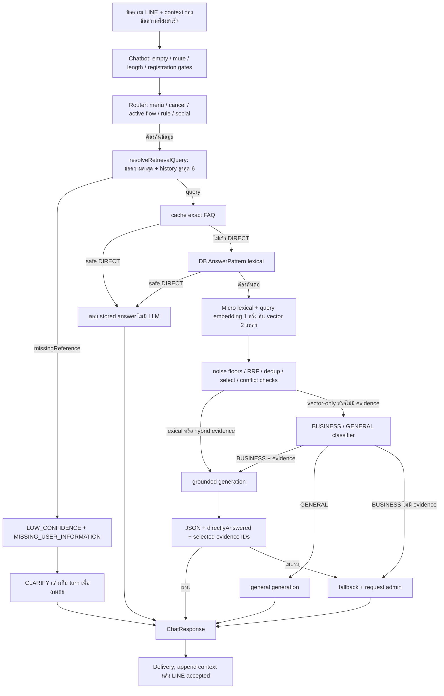

# Chatbot / RAG audit — 1 ตุลาคม 2026

## 1. สรุปผล

**โครงสร้างหลักใช้ต่อได้ แต่ยังรับรองไม่ได้ว่าตอบถูกสินค้า ครบทุกคำถาม และไม่ยืนยันข้อมูลธุรกิจเกินหลักฐานทุกครั้ง** จุดเร่งด่วนอยู่ที่การระบุสิ่งที่ลูกค้าพูดถึง, DIRECT shortcut, การตรวจคำตอบ, ข้อมูลส่วนตัว และลำดับข้อความเมื่อมีหลาย worker ไม่จำเป็นต้องเปลี่ยนเป็น agent framework เพื่อแก้ปัญหาเหล่านี้

ตรวจ source ทุกไฟล์ใน `src/modules/chatbot` รวม **50 ไฟล์ / 7,696 บรรทัด** รวม tests และ fixtures พร้อมตามเส้นทางที่เกี่ยวข้องไปยัง LINE worker/delivery, admin knowledge, vector repositories, text utilities, schema และ migrations ผลตรวจอิง **working tree ปัจจุบัน** ไม่ใช่ roadmap

| งานตรวจ | ผลที่รันจริง |
| --- | --- |
| Tests เดิมของ chatbot | 177 เคส: ผ่าน 162 / ไม่ผ่าน 15; 16 suites: ผ่าน 10 / ไม่ผ่าน 6 |
| Tests audit ใหม่ | **80 เคส: ผ่าน 39 / ไม่ผ่าน 41** |
| Production build | ผ่าน `bun run build` |
| TypeScript รวม tests | ไม่ผ่าน: composer test ยังส่ง `historyMessages` ที่ contract ปัจจุบันไม่มี |
| Lint โมดูลเดิม | ไม่ผ่าน: type/stringification, formatting และ unused import |
| Lint ไฟล์ audit ใหม่ | ผ่านหลังแก้เฉพาะไฟล์ audit |
| Formatting ของ test/config ใหม่ และลิงก์ Markdown ภายในรายงาน | ผ่าน |
| Live LLM / LINE / PostgreSQL + pgvector / Redis จริง | **ไม่ได้รัน** |

**39/80 ไม่ใช่ accuracy ของโมเดลหรืออัตราตอบถูกของระบบจริง** ชุดใหม่เน้นกรณีเสี่ยง มีทั้ง deterministic reproduction, จำลองโมเดลตอบผิด, ข้อเสนอ UX และ boundary probes หลายเคสไม่ผ่านจากสาเหตุเดียวกัน จึงไม่ใช่ 41 บั๊กอิสระ

ข้อค้นพบเด่น:

1. คุยเรื่องรุ่น A แล้วถาม “ราคาเท่าไหร่” สามารถได้ราคา **รุ่น B** จาก DIRECT โดยไม่เรียก LLM เลย — C14, M01
2. อ้าง evidence ID ถูกต้อง แต่ตอบตัวเลขผิดหรือผิดสินค้า ตัวตรวจปัจจุบันยังยอมรับ — C07, C08 เป็น **fault injection** ไม่ใช่คำตอบที่ได้จากโมเดลจริง
3. คำถามหลายส่วนอาจถูกตัดหลักฐานทิ้ง และคำตอบที่ตอบเพียงส่วนเดียวก็ผ่านได้ — C10, C38, C39
4. ชื่อ/ที่อยู่ในข้อความแทรกระหว่างสมัครสามารถไปถึง embedding/provider boundary — C29; เก็บใน context ได้ด้วย — S04
5. Worker สอง instance ประมวลผลสอง event ของคนเดียวกันทับกันได้ — S09; instance เดียวเรียงได้ — S10

### สิ่งที่ส่งมอบ

- [กรณีทดสอบครบ 80 เคส: input → process → output → expected](audit-artifacts/chatbot-2026-10-01/cases.md)
- [ผลดิบ รวม selected evidence และ provider requests จำลอง](audit-artifacts/chatbot-2026-10-01/cases.json)
- [รายการไฟล์ที่ตรวจ พร้อม hash และจำนวนบรรทัด](audit-artifacts/chatbot-2026-10-01/files.md)
- [ผล verification และ baseline failures](audit-artifacts/chatbot-2026-10-01/verification.json)
- [ชุดทดสอบที่รันซ้ำได้](../test/audit/chatbot-core-2026-10-01.audit.ts)
- [Jest config แยกสำหรับ audit](../test/jest-chatbot-audit.json)

`git diff --check` ยังรายงาน trailing whitespace เดิมใน router/retrieval สองจุด ซึ่งรักษา user changes ไว้ ไม่ได้แก้รวมใน audit

งานนี้เพิ่ม tests และเอกสาร ยังไม่ได้แก้ production logic ไม่ได้เปลี่ยนฐานข้อมูลหรือ deploy

## 2. วิธีตรวจและข้อจำกัดของหลักฐาน

### 2.1 ส่วนที่ใช้ implementation จริง

`ChatbotService`, router, rule matching, query planner, lexical/BM25 scoring, fusion/context selection, prompt composer, grounded JSON/citation validation, session logic และ service ที่ระบุในแต่ละ test ใช้โค้ดจริง

Database/Redis ใช้ fixtures และ mocks; semantic search ได้ vector candidates/คะแนนที่กำหนดไว้; provider ส่ง **raw scripted response** เข้า validator จริง ชุดใหม่ override provider stub เพื่อไม่ให้ legacy harness เติม `evidenceIds` หรือ `directlyAnswered` ให้คำตอบโดยอัตโนมัติ

M01–M05 ส่งคำตอบที่ระบบสร้างจริงจากเทิร์นก่อนเป็น history ของเทิร์นถัดไป ตาม INCLUDE/CLEAR และจำกัด 6 messages โดยจำลองว่า delivery สำเร็จแล้ว **ไม่ได้ส่ง LINE และไม่ได้ทดสอบ Redis Lua จริง** S09–S10 ใช้ worker class จริงสอง instance/หนึ่ง instance กับ claim/process boundary จำลอง ไม่ใช่การ kill/restart process หรือ distributed load test

### 2.2 อ่านผลอย่างไร

- **Deterministic:** ผลมาจากโค้ดและข้อมูล fixture ที่ระบุ เช่น wrong DIRECT, missingReference, selected contexts, cache race
- **Fault injection:** ป้อนคำตอบโมเดลผิดโดยตั้งใจเพื่อดูว่าตัวตรวจสกัดได้หรือไม่ ไม่ได้วัดว่าโมเดลจริงจะผิดบ่อยเท่าไร
- **Policy/UX:** ระบุพฤติกรรมที่ควรตกลง เช่น แทรกถามค่าส่งระหว่างสมัครแล้วควรรักษาขั้นตอนเดิมหรือไม่
- **Boundary probe:** ป้อน input/config ผิดปกติ เช่น S07 มี history ยาวเกินปกติ ไม่ใช้สรุปว่า production เกิดเคสนี้ตามเส้นทางมาตรฐาน
- **Static finding:** อ่าน source/callers พบเงื่อนไขเสี่ยง แต่ยังไม่มี integration test จริงรองรับทุกกรณี

ข้อมูลทั้งหมดที่สร้างใหม่เป็นข้อมูลสมมติ ไม่มีลูกค้าจริง ไม่มี credentials จริง ไม่เปิดไฟล์ `.env` ไม่เรียก paid provider และไม่ส่งข้อความ LINE มี guard ปฏิเสธ fetch/http/https ที่ไม่คาดหมายในชุดใหม่

### 2.3 Working tree ที่ต้องรับรู้

มี user changes เดิมสามไฟล์และรักษาไว้ทั้งหมด:

- `intent-router.service.ts`: whitespace
- `retrieval-query-planner.service.ts`: comment
- `knowledge-retrieval.service.ts`: whitespace และ **comment `isUsableKnowledge(item)` ใน `eligible()` ออก**

S08 จึงสะท้อน working tree นี้โดยเฉพาะ ไม่ควรนำไปอ้างว่า commit ก่อนแก้ guard มีพฤติกรรมเดียวกัน

## 3. Input ไปถึงคำตอบอย่างไร และ RAG อยู่ตรงไหน



`runRetrieval()` เป็นผู้ทำงานค้นจริง: cache → DB → semantic → merge → เลือกหลักฐาน → ส่งผลให้ router จึงมีผลต่อคำตอบ ไม่ใช่แค่ tracking

`resolveRetrievalQuery()` ไม่ดึงราคาและไม่ตอบลูกค้า ผลคือ `{query, missingReference}`:

- `query`: คำที่จะใช้ค้น lexical และสร้าง query embedding
- `missingReference: true`: หยุดก่อนค้นและให้ router ขอรายละเอียด
- `LOW_CONFIDENCE`: route ของ retrieval เมื่อยังไม่มีหลักฐานที่ใช้ตอบได้
- `MISSING_USER_INFORMATION`, `RETRIEVAL_ERROR`, `CONFLICTING_CANDIDATES`: เหตุผลที่ router ใช้เลือก CLARIFY หรือ handoff
- `NO_SEARCH_RESULTS`: ในเส้นทางนี้ใช้เมื่อ query ไม่มีข้อความหลัง normalize; ไม่เท่ากับทุกกรณีที่ค้นแล้วไม่พบ

**การส่ง 6 messages ให้ generation ไม่แก้ query ที่ค้นผิดก่อนหน้านั้น** โดยเฉพาะ DIRECT ไม่มี generation และไม่ได้ใช้ history ตอนตอบ หลักฐานที่ถูกตัดทิ้งก่อน generation ก็ไม่มีให้โมเดลใช้อ้างอิง

| เส้นทาง | Query embedding | Generation/classifier calls ตาม flow ปกติ |
| --- | --- | --- |
| Menu / cancel / clarify / safe DIRECT | 0 | 0 |
| Lexical/hybrid RAG | 1 | 1 grounded generation |
| Vector-only BUSINESS → RAG | 1 | 1 classifier + 1 grounded generation |
| Low confidence BUSINESS | 1 เมื่อมาถึง semantic | 1 classifier แล้ว static fallback |
| Low confidence GENERAL | 1 เมื่อมาถึง semantic | 1 classifier + 1 general generation |
| Whole-message social | 0 | 1 general generation |

จำนวนนี้ไม่รวม retry ของ provider/billing; embedding เป็น model call อีกประเภทหนึ่ง แม้ไม่ถูกนับใน `providerCalls` ของ generation spy

## 4. ตัวอย่างที่ทดสอบจริง

Log ด้านล่างเป็นสรุปค่าที่ spy บันทึกจากโค้ดจริงและ fixture ไม่ใช่ production log จากลูกค้า

### 4.1 ถามราคาต่อจากสินค้าก่อนหน้า — ตอบผิดชิ้นได้

**M01, C14 — deterministic, P1**

```text
KB A: approved question = "หมอนรุ่น A ทำจากอะไร"
      answer = "รุ่น A ทำจากผ้าฝ้าย"
KB B: approved question = "ราคาเท่าไหร่"
      answer = "รุ่น B ราคา 890 บาท"

Turn 1 ลูกค้า: หมอนรุ่น A ทำจากอะไร
       ระบบ: รุ่น A ทำจากผ้าฝ้าย
       contextPolicy: INCLUDE

Turn 2 ลูกค้า: ราคาเท่าไหร่
       history: มีทั้งคำถาม/คำตอบของรุ่น A
       planner: {query:"ราคาเท่าไหร่", missingReference:false}
       selected: B
       retrieval: DIRECT
       output: รุ่น B ราคา 890 บาท
       generation calls รวมสองเทิร์น: 0
```

สาเหตุ: ไม่มีคำใน FOLLOW_UP → ใช้ข้อความเดิม → `directAllowed` เป็น true → generic approved question ตรงกับ B → ตอบทันที `BROAD_DIRECT_QUERIES` กันคำ “ราคา” แต่ไม่กันประโยคนี้

**ผลที่ต้องการ:** ระบุ A ให้ได้จากบริบท; ถ้าไม่แน่ใจให้ถามรุ่น และแม้ระบุ A ได้ ราคาปัจจุบันต้องอ่านจากแหล่งข้อมูลที่ยืนยันสถานะจริงตามกติกาโปรเจกต์ ห้ามแก้แค่ bind A แล้วตอบราคาจาก vector แทน

### 4.2 ระบุคำว่า “ตัวนี้” ช่วยบางกรณี แต่เปลี่ยนรุ่นแล้วยังถามซ้ำ

**Q02 ผ่าน:** `สนใจ รุ่น A` → `ตัวนี้ราคาเท่าไหร่` ได้ `รุ่น a\nตัวนี้ราคาเท่าไหร่`

**M04 ไม่ผ่าน:** คุย A → เปลี่ยนเป็น B → `ตัวนี้ซักได้ไหม` ได้ `missingReference:true` เพราะ planner รวบรวม model ทั้ง history แล้วเจอ A และ B ไม่พิจารณาว่าลูกค้าเลือก B ล่าสุดแล้ว

**Q10 ไม่ผ่าน:** ลูกค้าพูด “หมอนโนวา” แต่ assistant เสนอ “รุ่น B” ด้วย → planner จับ model B เพียงรายการเดียวและ bind ไป B ทั้งที่ไม่ได้เป็นตัวเลือกที่ลูกค้ายืนยัน

การตัด history เหลือ 6 ช่วยจำกัดงาน/ข้อมูล แต่ไม่ได้ทำให้การแก้คำอ้างอิงถูกโดยอัตโนมัติ

### 4.3 หลักฐานครบ แต่คำตอบตอบเพียงข้อเดียว

**C09 ผ่าน / C10 ไม่ผ่าน — C10 เป็น fault injection, P1/P2**

```text
Input: ถามทั้งค่าส่งและระยะเวลาคืนสินค้า
Selected: fee = 40 บาท, returns = ภายใน 7 วันเมื่อยังไม่ใช้งาน
Raw model (ตั้งใจป้อน):
{"askedAbout":"คำถามของลูกค้า","directlyAnswered":true,
 "decision":"ANSWER","answer":"ค่าส่ง 40 บาท",
 "evidenceIds":["ANSWER_PATTERN:fee"]}
Validation: ผ่าน
Output: ค่าส่ง 40 บาท
ส่วนที่หายไป: ระยะเวลาและเงื่อนไขคืนสินค้า
```

`directlyAnswered` เป็นการประเมินของโมเดลตัวเดียวกัน ไม่ได้ตรวจ coverage อิสระ มีเพียง ID ที่ถูกต้องจึงไม่พอ ส่วน C09 ป้อนคำตอบครบและระบบรับได้ตามคาด

### 4.4 หลายคำถามแต่หลักฐานถูกตัดออกก่อนตอบ

**C38 — deterministic selection + scripted abstention, P2**

```text
Input: ค่าส่งเท่าไหร่ คืนสินค้าได้กี่วัน เปิดร้านกี่โมง และรับประกันกี่ปี
KB: มีข้อมูลครบทั้ง 4 เรื่อง
Selected: hours, returns, warranty
Dropped: fee
เหตุผล: MAX_RAG_CONTEXTS = 3
Scripted model: INSUFFICIENT_CONTEXT
Output: fallback + handoff
```

**C39:** “วัสดุอะไรและส่งใช้กี่วัน” มี vector candidates สอง topic ที่ตั้งใจให้ตรงทั้งคู่ แต่ `related()` เห็น topic ต่างกันและ `selectContexts()` ตัดตัวที่สองเมื่อไม่มี KEYWORD → เหลือ material เรื่องเดียว **คะแนน vector เป็น fixture; ไม่ใช่หลักฐานว่า embedding จริงค้นสองชิ้นนี้ได้**

ควรเลือกตามความครอบคลุมคำถามภายใต้ budget รวม ไม่ถือว่า topic ต่างจากอันดับหนึ่งต้องไม่เกี่ยวกับคำถามเสมอไป และไม่ควรเพิ่ม top-k อย่างเดียวโดยไม่มี relevance gate

### 4.5 ID ถูก แต่ข้อเท็จจริงผิด

**C07/C08/C28 — fault injection, P1**

| หลักฐาน | Raw answer ที่ป้อน | ผลจริงของ validator |
| --- | --- | --- |
| ค่าจัดส่งมาตรฐาน 40 บาท | ค่าส่ง 999 บาท + ID fee ถูก | รับและส่งตอบ |
| หมอนโนวาซักมือได้ | หมอนลูน่าซักเครื่องได้ + ID nova ถูก | รับและส่งตอบ |
| ตรวจยอดเงินได้ในหน้าสมาชิก | ยอดเงินบัญชีคุณคือ 5000 บาท + ID balance ถูก | รับและส่งตอบ |

C12 (ID นอก selected) และ C13 (`directlyAnswered:false`) fallback ได้ถูกต้อง จุดที่ขาดคือการตรวจความหมายและข้อเท็จจริง ไม่ใช่การตรวจ ID ไม่มีอยู่

### 4.6 ตัดสินใจ GENERAL ด้วยความมั่นใจต่ำ

**C06 — fault injection, P1**

```text
Input: สินค้ารุ่น Z ราคาเท่าไหร่
Evidence: ไม่มี
Classifier ที่ป้อน: GENERAL, confidence=0.01
Router: GENERAL_QUESTION
General model ที่ป้อน: รุ่น Z ราคา 999 บาทครับ
Output: รุ่น Z ราคา 999 บาทครับ
```

router ใช้ classification แต่ไม่ได้ใช้ confidence เป็น gate การเพิ่ม threshold ลดความเสี่ยงบางส่วนแต่ไม่รับประกันความถูกต้อง เพราะ confidence จากโมเดลไม่ได้ calibrated ต้องวัดจากชุดข้อมูล และคำถามธุรกิจที่ไม่มีหลักฐานต้องไม่หลุดไป free-form answer เพียงเพราะ label ผิด

### 4.7 สมัครสมาชิกแล้วแทรกคำถามที่มีชื่อ/ที่อยู่

**C29/S04 — deterministic boundary checks, P1**

```text
Session: REGISTER
Input: สมัครยังไง ชื่อ: AUDIT_NAME นามสกุล: AUDIT_SURNAME ที่อยู่: AUDIT_ADDRESS
Rule: REGISTER_HOW_TO → ค้น knowledge
Observed embedding input / provider messages: ยังมีชื่อและที่อยู่จำลอง
Model: INSUFFICIENT_CONTEXT
Final output: fallback
```

การ fallback หลัง generation ไม่ย้อนการส่งข้อมูลไปยัง provider ได้ `redactPii()` mask email/phone/ID/password/account บางรูปแบบ แต่ไม่ครอบคลุมชื่อและที่อยู่ ส่วน C30 ยืนยันว่า email/phone รูปแบบที่รองรับถูก redact แล้ว

### 4.8 Cache ถูก refresh หลังแก้ข้อมูล แต่ยังได้ snapshot เก่า

**S03 + C26 — deterministic, P2**

```text
เริ่ม SELECT cache ก่อน admin commit → query ค้าง
admin commit คำตอบใหม่ → เรียก refresh อีกครั้ง
refresh ครั้งหลัง join promise เดิม
SELECT เดิมเสร็จ → เก็บ answer เก่า, reads=1
DIRECT ใช้ cache เก่าได้โดยไม่ถาม DB
```

TTL 240 วินาทีจำกัดความสดในสภาวะปกติ แต่ refresh failure ยืดเวลาที่แก้ไขยังไม่ถูกอ่านได้; cache หมดอายุจะคืน [] เพื่อ fallback DB จุดนี้ทำถูกแล้ว การตอบเก่าจาก cache ภายใน TTL ต้องแยกจาก bug ที่ post-write refresh ไม่อ่านหลัง commit จริง

### 4.9 ลูกค้าส่งสองข้อความติดกันเมื่อมีหลาย worker

**S09 ไม่ผ่าน / S10 ผ่าน — worker instances + mocked boundary, P1 ก่อน scale out**

```text
event first: user=same-user, กำลังประมวลผล ยังไม่ปล่อย gate
event second: user=same-user, webhookEventId คนละค่า
2 instances: starts ก่อน first เสร็จ = [first, second]
1 instance : starts ก่อน first เสร็จ = [first]
```

`userProcessingTails` เป็น Map ใน process ขณะที่ event claim ป้องกัน event เดิมซ้ำ จึงยังไม่ป้องกันคนเดียวกันคนละ event ทับกัน ผลกระทบที่เป็นไปได้คือ history ยังไม่มีคำตอบแรก, session แข่งเขียน หรือส่งตอบสลับลำดับ ยังไม่ได้วัดเหตุการณ์นี้ด้วย queue/DB จริง

## 5. รายการ P0–P5

ระดับเป็นลำดับทำงานตามผลกระทบของโปรเจกต์นี้ ไม่ใช่ CVSS และไม่ได้หมายความว่าทุกข้อเป็นช่องโหว่ความปลอดภัย

### P0 — เหตุฉุกเฉินที่ต้องหยุดใช้งานทันที

**ยังไม่มี P0 ที่ยืนยันจาก audit นี้** ไม่พบหลักฐานใหม่ของการยึดระบบ, ข้าม tenant ใน chatbot retrieval, หรือ double debit จากชุดนี้ และไม่ได้ทดสอบ billing ledger แบบครบวงจร จึงไม่รับรองว่าระบบทั้งหมดไม่มี P0

หากพบข้อมูลลูกค้าจริงรั่วหรือเรียกการเงินผิดสิทธิ์ระหว่างตรวจ live ต้องยกระดับตามผลจริง ไม่ควรกำหนด P0 จาก fixture เพียงอย่างเดียว

### P1 — ความถูกต้อง/ข้อมูลส่วนตัว/ลำดับข้อความ ต้องแก้ก่อนขยายการใช้งาน

| ID | ปัญหาและหลักฐาน | จุดแก้ขั้นต่ำ | เกณฑ์รับงาน |
| --- | --- | --- | --- |
| P1-01 | ผูก follow-up ผิดชิ้น หรือ DIRECT generic FAQ ข้ามบริบท — Q03–05, Q10, C14, M01 | แยก explicit entity/ellipsis/ambiguous; ห้าม DIRECT ถ้าคำถามต้องพึ่ง history หรือ entity ไม่ตรง; ใช้ตัวเลือกล่าสุดของลูกค้า | A → “ราคาเท่าไหร่” ไม่ตอบ B; assistant suggestion ไม่ทับ user choice; ไม่รู้ต้องถาม |
| P1-02 | SKU เสียเอกลักษณ์: A กับ A+ normalize เหมือนกัน; BM25 ทิ้ง A/B — Q20, C32, S01 | แยก normalization สำหรับ full-text ออกจาก exact/entity identity; เก็บ SKU symbols/case ตาม catalog contract | A/A+/A-1/B ไม่ชนใน exact; full-text ภาษาไทยยังผ่าน |
| P1-03 | DIRECT ยืนยัน stock ปัจจุบันจาก KB; generation ก็ไม่มี independent live-fact gate — C27/C28 | route ราคาปัจจุบัน/stock/account/status ไป authoritative service หากมี; ถ้ายังไม่มีให้ fallback โดยระบุว่าไม่ทราบ; แยก static policy ออกจาก mutable fact | ไม่ตอบ inventory/balance ปัจจุบันจาก vector หรือ FAQ snapshot แม้ approved |
| P1-04 | ชื่อ/ที่อยู่สมัครหลุดเข้า embedding/messages/context — C29/S04 | แยก registration fields ออกจาก informational question ก่อน provider; ไม่เอา raw registration payload ไป generic chat; sanitize context/log ที่ boundary | synthetic name/address/phone/ID ทุกช่องไม่อยู่ใน provider payload/context/log; informational question ยังถามได้ |
| P1-05 | Citation membership + model self-report ไม่รับรอง factual correctness — C07/C08/C28 | สำหรับข้อมูลสำคัญใช้ authoritative structured value หรือ curated rendering; ตรวจ entity และตัวเลขพร้อมหน่วย/เงื่อนไขที่ตรวจได้; ถ้าไม่ยืนยันให้ abstain | valid ID + wrong value/entity ไม่ถูกส่งเป็นคำตอบยืนยัน; ไม่ reject การ paraphrase ที่ถูกต้องทั้งหมด |
| P1-06 | GENERAL label confidence ต่ำพา business ไป free-form answer — C06 | ใช้ business-domain/evidence policy ร่วม classifier; uncertain classification ไม่อนุญาต unsupported business answer; calibrate threshold ด้วย Thai eval | confidence ต่ำ/label ผิดไม่ทำให้ถามราคา Z แล้วแต่งราคา |
| P1-07 | เรียงข้อความได้เฉพาะ instance เดียว — S09/S10 | serialize ต่อ user/conversation ข้าม main/retry/recovery ด้วยกลไกเดิมของ DB/queue ที่มี ownership+lease; แยกจาก event dedup | DB/queue integration: สอง workers สอง events คนเดียวกันไม่ overlap; คนละ user ยัง parallel; crash/retry ไม่ค้างและไม่ส่งซ้ำ |

Source หลัก: [planner](../src/modules/chatbot/knowledge/retrieval-query-planner.service.ts) บรรทัด 48–77; [retrieval](../src/modules/chatbot/knowledge/knowledge-retrieval.service.ts) 87–147, 195–218; [matcher](../src/modules/chatbot/knowledge/answer-pattern.service.ts) 28, 145–182; [normalization/redaction](../src/utils/text.utils.ts) 2–24; [answer validator](../src/modules/chatbot/aichat.service.ts) 397–440; [router](../src/modules/chatbot/intent-router.service.ts) 245–258; [LINE ordering](../src/modules/line/line-events.processor.ts) 49, 104–125

P1-05 ไม่ควรตีความว่าต้องเรียก LLM judge เพิ่มทุกข้อความ ตัวเลขที่ปรากฏในเอกสารไม่ได้แปลว่า claim ที่ใช้ตัวเลขนั้นถูก ใช้ validators เฉพาะ facts ที่มี schema ชัด และประเมิน general groundedness แบบ offline เพิ่มเติม

### P2 — ความครบถ้วนและพฤติกรรมที่ลูกค้าเจอได้ตามปกติ

| ID | ปัญหาและหลักฐาน | แนวทาง lean | เกณฑ์รับงาน |
| --- | --- | --- | --- |
| P2-01 | Multi-question coverage ขาด: hard cap 3 และ unrelated-vector gate; partial answer ผ่าน — C10/C38/C39 | แยกประเด็นเฉพาะเมื่อจำเป็น เลือก evidence ครบแต่ละประเด็นภายใต้ character/token budget; ถ้าตอบบางส่วนต้องบอกส่วนที่ไม่ทราบตาม policy ที่ตกลง | 2 และ 4 ประเด็นไม่หายเงียบ; แยกคำถามหลายข้อจากเงื่อนไขของข้อเดียว |
| P2-02 | รวบทุก model ใน history ทำให้เลือก B ล่าสุดแล้วยัง ambiguous; comparison ที่ระบุสองรุ่นถูก clarify — Q08/Q11/M04 | latest explicit user reference ก่อน history เก่า; แยก comparison กับ unresolved pronoun | “เลือก B” → “ตัวนี้” ใช้ B; “A กับ B ต่างกันอย่างไร” ค้นทั้งสองได้ |
| P2-03 | ตัวเลขหลัง assistant statement ถูกเดาว่าเป็นคำตอบ; topic switch หลัง CLARIFY ถูกนำไปต่อคำถามเก่า — Q12/Q14 | เก็บ pending clarification/slot เล็ก ๆ พร้อม TTL เมื่อระบบถามจริง หรือใช้ turn metadata แทนเทียบข้อความสำเร็จรูป | “2” ไม่มี pending slot ไม่เดา; หลัง clarify ถามเวลาเปิดร้านต้องเปลี่ยนเรื่องได้ |
| P2-04 | “ไม่ต้องติดต่อแอดมิน ค่าส่ง…” ยัง handoff; greeting ใน sticker กลบคำถาม — C15/S02 | command match ให้แคบและแยกข้อความที่มีสาระ; ส่ง sticker text ที่เป็นคำถามเข้า text router | negative handoff ไม่เปลี่ยนสถานะ; sticker “ขอบคุณครับ ค่าส่งเท่าไหร่” ตอบค่าส่ง |
| P2-05 | Active registration รับคำถามค่าส่งเป็นข้อมูลสมัคร; informational menu clear workflow; label ยกเลิกบัง cancel — C20–22 | กำหนด allowlist informational interruption และ preserve REGISTER; reserve control captions; ยังรักษา explicit menu postback policy | คุยแทรกที่อนุญาตกลับไป step เดิม; cancel deterministic; ไม่ใช้ broad AI routing กับทุก registration input |
| P2-06 | Cache post-write refresh joins pre-write SELECT; worker อื่นอาจถือ menu snapshot เดิม — S03/C26 + static menu review | ใช้ forced refresh แบบที่ RichMenuReplyCache มีแล้ว; สำหรับหลาย process มี version/TTL invalidation ขนาดเล็ก | หลัง save/disable/delete เมื่อ refresh สำเร็จไม่ตอบ snapshot ก่อน commit; worker อื่นเห็นการแก้ภายใน freshness SLA |
| P2-07 | snapshot vector แย่งทั้ง 3 evidence slots เพราะ guard ถูก comment — S08 | เปิด eligibility policy ก่อน rank/select กลับคืนหลังตรวจเจตนาการแก้เดิม; คง answer boundary defense | snapshots ไม่กิน slots; valid fact ยังถูกเลือก;ไม่ตีความว่า snapshot ทั้งหมดตอบลูกค้าหลุด เพราะ AiChat ยังกรองอีกชั้น |
| P2-08 | Conflict detector ตรวจได้เฉพาะรูปประโยคแคบ — C40 ผ่าน/C41 ไม่ผ่าน; DIRECT ไม่อ่าน micro exceptions | กำหนด source authority/version และ keyed facts สำหรับข้อมูลที่ชนกัน; validate ตอน publish; ใช้ REWRITE ถ้าต้องรวม exceptions | ค่าส่ง 40 vs ค่าจัดส่ง 80 fact เดียวกันไม่ถูกเลือกตามลำดับ; เงื่อนไขคนละแบบไม่ถูกตีว่า conflict โดยอัตโนมัติ |
| P2-09 | Sensitive text ใน KB ถูกส่งเข้า system prompt — C31 | ตรวจ/ปฏิเสธข้อมูลต้องห้ามตอน ingest; redact อีกชั้นก่อนส่ง provider; คง authorization ของ admin | password/email fixture ไม่อยู่ใน RAG payload; ไม่มี claim ว่ามี customer exploit เพราะเคสนี้ต้องมี sensitive KB ก่อน |
| P2-10 | Tests เดิมบางส่วนยืนยันพฤติกรรมเก่าหรือบั๊ก ทำให้ผ่านไม่ได้และปิดบัง regression | ปรับ fixtures/expectations ให้ contract ปัจจุบัน; แยก characterization กับ acceptance; raw response tests ห้าม harness เติม field ให้ | baseline ผ่านด้วยเหตุผลที่ถูกต้อง และ red tests ของ bug ที่ยังไม่แก้ไม่ถูกเปลี่ยนให้ยอมรับ bug |

Source: [context selection/conflict](../src/modules/chatbot/knowledge/knowledge-retrieval.service.ts) 221–228, 287–381; [router order](../src/modules/chatbot/intent-router.service.ts) 61–111; [chatbot session handling](../src/modules/chatbot/chatbot.service.ts) 124–177, 220–232; [sticker](../src/modules/chatbot/sticker-intent.service.ts) 43–55; [cache](../src/modules/chatbot/knowledge/answer-pattern-cache.service.ts) 48–76; [composer](../src/modules/chatbot/prompt/ai-setting-prompt.composer.ts) 57–77

P2-05 เป็นการตัดสินใจ product policy บางส่วน ปัจจุบันมีเจตนาให้เมนูมี precedence จึงไม่ควรสลับทุกเมนูไปอยู่ท้าย router โดยไม่ทบทวน tests/postbacks ส่วน preservation ของ informational digression ต้องนิยามว่าอนุญาตเรื่องใด ไม่ควรเปิด registration payload ให้ AI ทั้งก้อน

### P3 — ความทนทาน ประสิทธิภาพ และความสามารถตรวจสอบ

| ID | ข้อค้นพบ | งานที่เหมาะสม |
| --- | --- | --- |
| P3-01 | `AI_MAX_MESSAGE_LENGTH` แปลง Number แต่ไม่ validate; NaN ทำให้ guard ไม่ทำงาน — C45 | parse เป็น positive bounded integer ตอน boot ด้วย validation pattern เดียวกับ knowledge config |
| P3-02 | Output text ไม่มี channel-length gate ส่วนกลาง; C43 ป้อน 6,000 ตัวอักษรแล้วยังออกเป็น AI response; DIRECT answer DTO อนุญาต 50,000 ตัวอักษร | validate ตอน publish/direct และที่ delivery; เลือก split ที่คงเงื่อนไขหรือ safe fallback; ห้าม slice ตัดข้อยกเว้นสุ่ม |
| P3-03 | AP/Micro lexical อ่านสูงสุด 500 แถวตาม priority/updatedAt; exact ที่เกิน cap อาจหาไม่เจอ; cache และ DB ทำ BM25 ซ้ำ | วัดจำนวน records/latency ก่อน; ทำ indexed exact lookup สำหรับ question examples หรือ cache tokenized corpus; ไม่โหลดทั้ง KB ทุก turn เมื่อโต |
| P3-04 | RRF candidate ที่อ่อนแต่ติดหลาย lists แซงตัวที่ตรงมากใน list เดียว; exact REWRITE ไม่ได้ถูกตรึงอันดับหลัง fusion | รักษา feature exact/entity เพื่อ selection และ calibrate ด้วย relevance labels; ไม่ใช้ RRF score เป็น probability; ยังไม่ต้องเพิ่ม reranker ถ้า eval ไม่ชี้ความจำเป็น |
| P3-05 | `resolvedQuery` ใน route เป็น input เดิม; retrieval summary log ก็พิมพ์ input เดิมแม้ rewrite แล้ว | ให้ retrieval result มี query ที่ใช้จริงและ rewrite reason เพียงแห่งเดียว; แยก originalInput/resolvedQuery ใน trace แบบ redact |
| P3-06 | source/type contract มี renderMode แต่ admin DTO ไม่รับ field นี้; existing test ยืนยันว่าถูก strip | รองรับค่า enum ที่ถูกต้องใน create/update DTO + persistence หรือถอด feature ที่ไม่ใช้หลังตัดสินใจ; ทดสอบผ่าน HTTP validation |
| P3-07 | cancel เมื่อไม่มี flow ตอบ “ยกเลิกรายการแล้วครับ” — C23 | ใช้ “ไม่มีขั้นตอนที่กำลังทำอยู่” หรือ “ออกจากขั้นตอนสนทนาแล้ว” ตาม state; ไม่สื่อว่ายกเลิกคำสั่งซื้อจริง |
| P3-08 | Main/retry event idempotency ไม่แทน persistence key ของ postback; existing test เรียก saveIncomingEvent ซ้ำแล้ว history/unread เพิ่มสองครั้ง | ทดสอบ crash หลัง inbound commit ก่อน event finish กับ DB จริง; ถ้ายืนยันให้ใช้ event-derived durable uniqueness สำหรับ postback โดยไม่เปลี่ยน LINE message ID semantics |

LINE จำกัด text message ที่ 5,000 UTF-16 code units; default output token limit ช่วยลดโอกาส แต่ไม่ทดแทนข้อกำหนดความยาว และ DIRECT ไม่ผ่าน token limit — [LINE Messaging API reference](https://developers.line.biz/en/reference/messaging-api/nojs/#text-message)

C43 เป็น provider fault injection จึงยังไม่พิสูจน์ว่าโมเดลที่ตั้ง max tokens ปัจจุบันจะตอบยาวเท่านี้จริง P3-08 เป็นช่องว่างของ persistence function ที่ทดสอบแยก ไม่ใช่ข้อสรุปว่าทุก duplicate webhook จะเกิด unread ซ้ำ เพราะชั้น event claim ยังทำงาน

### P4 — ทำให้ lean และอ่านง่าย โดยคง invariants

| ID | ส่วนที่ลดความซ้ำ/ความอ้อมได้ | สิ่งที่ต้องรักษา |
| --- | --- | --- |
| P4-01 | กำหนดบทบาท prompt: DB = persona/tone/owner settings; code = output schema, evidence contract, immutable safety/mode rules; dedup ประโยคตามความหมาย | อย่าลบกฎ live facts/PII/evidence เพียงเพราะ DB รุ่นหนึ่งมีแล้ว; DB fallback ต้องยังปลอดภัย |
| P4-02 | `isUsableKnowledge` ซ้ำระหว่าง matcher/retrieval/answer | ใช้ policy helper เดียว; filter ก่อน selection และ validate ก่อนส่งตอบเป็นคนละ boundary ที่มีเหตุผล ควรคงทั้งสอง |
| P4-03 | `GENERAL_QUESTION` session/START_AI_CHAT/CONTINUE_AI_CHAT บางทางมี state แต่ routing ใช้ REGISTER เป็นหลัก | trace postback, existing Redis payloads และ external callers ก่อนรวม; อย่าลบเพียงเพราะชื่อดูเก่า |
| P4-04 | `CHECK_STATUS`/`CONTACT_ADMIN` อยู่ใน session union/validator แต่ durable handoff อยู่ใน conversation แยกแล้ว | ทำ compatibility cleanup หลังยืนยันว่าไม่มี writer/reader ที่ใช้อยู่ และพิจารณา TTL ของ session เก่า |
| P4-05 | Grounded JSON contract ประกาศทั้ง Zod, provider schema และตัวอย่าง prompt; `askedAbout` optional ใน Zod แต่ required ใน native schema | รวม constants/contract ให้ตรวจสอดคล้องใน test เดียว; ไม่สร้าง schema framework ใหม่เพื่อ object เดียว |
| P4-06 | Generic fallback/remap และ reason strings กระจายหลายชั้น | ใช้ typed reasons เฉพาะที่ router ต้อง branch; แยก diagnostic score ออกจาก confidence; ไม่รวม router กับ orchestrator |
| P4-07 | `ChatbotModule` import RegistrationModule แต่ประกาศ RegistrationFlowService/RegisterParser/RegisterValidator ซ้ำ | ตรวจ exports และ lifetime แล้วใช้ exported providers; ลดการสร้าง service instance ซ้ำ ไม่เปลี่ยน workflow |
| P4-08 | `this.logger.warn` สำหรับ session ธรรมดาและ `[object Object]`; log title จาก KB ไม่ผ่าน redaction | ใช้ structured allowlist เฉพาะ flow/step/status, redacted query และ IDs; ไม่ serialize session.data เพื่อแก้ lint |

ส่วนที่ควรคงไว้แม้ดูเป็นชั้นเพิ่ม: single retrieval entry point, semantic adapter, bounded delivered history, scoped SQL filters, shared billing/provider wrapper, PendingAiUsageError propagation, delivery idempotency และการแยก waiting_admin จาก admin mute

### P5 — ปรับคุณภาพระยะต่อไปเมื่อ P1/P2 นิ่ง

1. ทำ eval dataset ภาษาไทยที่มี expected entity, expected fact IDs, required subquestions และ allowed fallback เหมือน cases ใน audit แล้วเพิ่มตัวอย่างธุรกิจจริงที่ anonymize
2. ทดสอบจริงกับ PostgreSQL/pgvector และ Redis แยกจาก unit; แยก retrieval recall ออกจากคุณภาพ generation; replay โดย fix data/model/prompt version
3. Live model evaluation หลายรอบสำหรับคำถามกำกวม/หลายข้อ/prompt injection วัดค่าใช้จ่ายและ latency ภายใต้งบที่กำหนด ไม่ใช้ single run เป็นหลักฐานความสมบูรณ์
4. Review context truncation: Q18 เป็นข้อจำกัดที่ตั้งใจ, Q17 เป็น false-positive privacy heuristic/UX proposal และ S06 เป็น token parsing defect ไม่ใช่การส่ง email เต็ม; S07 ใช้ assistant history เกิน 6,000 ตัวอักษรซึ่งเกิน stored-message cap 4,000 จึงเป็น boundary robustness probe ไม่ใช่ bug ของ normal loader path
5. แก้เอกสารลิงก์หาย: `mvp-line-rag-billing-flow.md`, `service-flow.md`, `core-text-reply-refactor.md` และ historical report links ที่ current-flow อ้างแต่ไม่มีใน tree; ข้อความอ้าง Mongo/ผลเทสเก่าเป็นประวัติ ไม่ใช่สถานะปัจจุบัน
6. การรองรับหลาย tenant ยังเป็น future scope: chatbot retrieval filter ดี แต่ admin knowledge list/mutate ใช้ global IDs และ LINE scope ปัจจุบันเป็น null โดยตั้งใจ ห้ามเปิด multi-company จาก config อย่างเดียว ต้อง audit ownership ตั้งแต่ admin/API ถึง cache/provider settings ก่อน ไม่ได้ยืนยัน cross-tenant exploit ใน deployment ปัจจุบัน

## 6. เทียบแนวทาง RAG ที่เหมาะกับโปรเจกต์นี้

| มิติ | ปัจจุบัน | ข้อเสนอ |
| --- | --- | --- |
| Hybrid retrieval | มี lexical + vector + RRF; embed query ครั้งเดียวใช้สอง source | คงไว้; เพิ่ม identity/coverage correctness ก่อนเปลี่ยนอัลกอริทึม |
| Ranking vs answerability | แยก RRF score จาก intent confidence แล้ว | วัดความเกี่ยวข้องและความครบถ้วนต่างหาก ไม่แปลง rank เป็น % เชื่อมั่น |
| Contextual query | มี deterministic planner แต่ fixed phrases และ model-prefix bias | resolver เล็กที่ใช้ explicit user choice; ambiguous → clarify; semantic rewrite เฉพาะเคสที่ eval ยืนยันว่าคุ้ม |
| Evidence | namespace refs, selected-only IDs, malformed output fail closed | เพิ่ม per-question coverage และ structured facts ที่ตรวจได้ |
| Abstention | classifier error, retrieval error, invalid refs, INSUFFICIENT_CONTEXT → fallback/handoff | คงไว้ และลด false handoff ที่เกิดจาก retrieval ตัดหลักฐานผิด |
| Data freshness | vector derived from source, model filter, cache TTL | live facts ต้อง authoritative lookup; forced invalidation หลังแก้ข้อมูล |
| Privacy | phone/email/ID/password/account patterns และ bounded context | แยก registration fields; sanitize KB and logs; ไม่รับรอง regex ว่าครอบคลุม PII ทุกชนิด |
| Prompt injection | prompt precedence + escape tag + instructions + response validation | คง layered controls; tag escaping ป้องกันโครงสร้างแตกได้ แต่ไม่พิสูจน์ semantic injection resistance |
| Runtime reliability | event/delivery IDs, billing wrappers, local per-user ordering | ต้องเพิ่ม distributed per-conversation ordering และ integration tests |

RRF เป็นการรวม **อันดับ** ของหลายผลค้น ไม่ใช่ตัววัดว่าหลักฐานตอบคำถามได้ครบ การใช้ RRF ในโค้ดจึงเหมาะกับหน้าที่ ranking; ข้อเสนอเรื่อง entity/coverage เป็นการอนุมานจากผล audit นี้ — [Microsoft: Hybrid search ranking](https://learn.microsoft.com/en-us/azure/search/hybrid-search-ranking)

ควรวัด retrieval quality, groundedness, relevance และ completeness แยกกัน เพราะตอบอิงเอกสารถูกแต่ตอบผิดคำถาม/ไม่ครบได้ ชุดนี้จงใจแยก selection probes กับ raw-output fault injection ตามหลักนั้น — [Microsoft: RAG evaluators](https://learn.microsoft.com/en-us/azure/foundry/concepts/evaluation-evaluators/rag-evaluators)

การป้องกัน prompt injection ต้องหลายชั้น ทั้ง input separation, จำกัดสิทธิ์, output validation และ testing; C42 พิสูจน์เพียงว่า tag ที่ป้อนถูก escape ไม่ใช่ว่าโมเดลจริงจะไม่เชื่อคำสั่งแทรก — [OWASP: LLM Prompt Injection Prevention](https://cheatsheetseries.owasp.org/cheatsheets/LLM_Prompt_Injection_Prevention_Cheat_Sheet.html)

## 7. แผนแก้ที่เล็กและตรวจรับได้

### รอบ A — ป้องกันตอบผิดชิ้น/ข้อมูลหลุด

- แยก entity normalization จาก text normalization; bind latest explicit user entity และ block unsafe DIRECT
- ปิดเส้นทาง KB → ยืนยันราคา/stock/status ปัจจุบันหากไม่มี authoritative data
- ตัด registration fields ก่อน embedding/generation/context และลด logging ที่ไม่จำเป็น
- ตรวจ GENERAL authorization ด้วย business/evidence policy
- เปิด eligibility guard ก่อน selection กลับคืนโดยรักษา answer guard

**Gate:** C14/M01/C32/C27/C29/S04/S08 ผ่านตาม intent; fault-injection C06/C07/C08/C28 ต้องไม่ปล่อยคำตอบยืนยันผิด และ control cases C01/C02/C05/C09/C18/C19 ยังผ่าน

### รอบ B — ครบคำถามและคุยต่อได้

- ใช้ล่าสุดที่ลูกค้าเลือกแทนทุก entity ใน history; แยก comparison จาก ambiguous pronoun
- ให้ evidence selection ครอบคลุมแต่ละประเด็นภายใต้ budget เดียว
- ระบุ policy ตอบบางส่วน/ถามเพิ่ม/ส่งแอดมินให้ชัด โดยไม่ถามสิ่งที่ลูกค้าบอกแล้ว
- แก้ negative command, sticker mixed question และ informational interruptions

**Gate:** Q08/Q10/Q11/Q14/M04/C10/C38/C39/C15/S02; ทดสอบทั้ง 1/2/4 ประเด็น, มีหลักฐานครบ/ขาดหนึ่งส่วน/มีเงื่อนไขขัดกัน

### รอบ C — ความสดและ worker reliability

- Forced post-write refresh reuse pattern เดิม; freshness SLA สำหรับหลาย process
- Distributed per-user/conversation order รวม retry/recovery
- Real DB tests ของ postback persistence, updated/disabled knowledge และ vector reindex

**Gate:** S03/S09 พร้อม integration บนสอง workers, crash/retry, คนละ user ไม่ block กัน และ ledger/delivery ไม่ซ้ำ

### รอบ D — ลดความซ้ำเมื่อ behavior นิ่ง

- เก็บ cleanup ของ provider registration/session unions/prompt contract และ diagnostic fields เป็น PR เล็กแยกจาก semantic fixes
- ทำ baseline ให้เขียวด้วย fixtures ที่ถูก contract ปัจจุบัน
- เพิ่ม performance/retrieval benchmark แล้วจึงเลือก indexed exact lookup/cache tokenization/reranker ตามผลวัด

สิ่งที่ยังไม่จำเป็นจากหลักฐานนี้: agent orchestration framework, multi-agent answer loop, knowledge graph, LLM judge ทุก turn, rewrite ทุกข้อความ, chain of retries เพื่อบังคับให้ได้ ANSWER การเพิ่มชั้นเหล่านี้จะเพิ่มค่าใช้จ่ายและจุดผิดก่อนแก้ปัญหาหลักที่พิสูจน์แล้ว

## 8. Tests เดิมที่ไม่ผ่านหมายถึงอะไร

| กลุ่ม | จำนวนเคสไม่ผ่าน | วิเคราะห์ |
| --- | --- | --- |
| core-chat-e2e | 3 | expectation เก่าว่า fallback ไม่ request admin และ history ซ้ำใน system prompt; current source เปลี่ยนแล้ว |
| core-rag-review | 4 | duplicate evidence/vector overwrite และ phone/email leakage expectations เก่าที่ไม่ตรง source ปัจจุบัน; name/address ยังมีช่องว่างตามชุดใหม่ |
| prompt composer | 1 | ส่ง field `historyMessages` เก่าและคาด history ใน prompt; ทำให้ typecheck fail ด้วย |
| retrieval-fusion | 1 | vector-only ปัจจุบันผ่าน classifier ก่อน; fixture/expectation เดิมไม่ตรง |
| knowledge-retrieval | 1 | test cap 3 ใช้คำตอบซ้ำที่ตอนนี้ถูก dedup เหลือ 1; ควรใช้สาม facts คนละข้อมูล |
| grounded-evidence | 5 | recorded/raw ANSWER fixtures ไม่ส่ง `directlyAnswered` ที่ contract ปัจจุบันบังคับ |

รวม 15 ไม่ควรแก้ production ให้ย้อนพฤติกรรมเพื่อให้ tests เก่าเขียว บาง tests ชื่อ `observes...` ตั้งใจบันทึก bug แล้ว assert ว่า bug ต้องเกิด จึงควรแยกจาก acceptance ที่ต้องไม่เกิด bug

## 9. วิธีรันซ้ำ

```bash
# Offline audit ใหม่: exit 1 ขณะยังมี findings ที่ expectation ไม่ผ่าน
bun run test --config test/jest-chatbot-audit.json --runInBand

# Baseline chatbot เดิม
bun run test --runInBand --testPathPatterns=modules/chatbot

# Production compilation และ typecheck รวม tests
bun run build
bunx tsc --noEmit

# ตรวจ lint โดยไม่แก้ source เดิม
bunx eslint 'src/modules/chatbot/**/*.ts' test/audit/chatbot-core-2026-10-01.audit.ts
```

รัน audit จะเขียน `cases.json` ใหม่; `cases.md` ในรายงานนี้เป็น snapshot ของรอบที่บันทึกไว้ Tests ใหม่อยู่นอก default `src/**/*.spec.ts` และใช้ config แยก จึงไม่เปลี่ยน baseline CI แบบเงียบ ๆ หลังแก้ bug ควรย้าย acceptance cases ที่ตกลงแล้วเข้า regular suite

## 10. สิ่งที่ยังไม่ยืนยันและความเสี่ยงก่อน deploy

- ยังไม่ได้ประเมินโมเดลจริงกับ DB prompt/settings/KB ของธุรกิจ จึงไม่รายงาน live answer accuracy หรือสรุปว่า prompt injection สำเร็จจริง
- Mocked semantic scores ไม่พิสูจน์ recall/threshold ของ embeddings จริง ต้องมี labeled Thai queries และ real pgvector run
- ไม่ได้ benchmark latency/throughput หรือวัดค่าใช้จ่ายจริง; call counts ใช้ตรวจ control flow เท่านั้น
- ไม่ได้ตรวจ wallet/ledger/reservation reconciliation ทั้งระบบ; ตรวจเพียงเส้นทางเรียก shared boundary และ PendingAiUsageError ใน tests ที่มี
- การตรวจ LINE สอง worker ยังเป็น in-process simulation ของสอง instances ต้องทดสอบ queue/lease/DB crash จริงก่อนรับรอง ordering
- Guard ที่ user comment ออกยังอยู่ตามเดิม; ไม่มี migration, production fix หรือ deployment ในงาน audit นี้
- ไม่มีหลักฐานพอให้รับรองว่า “perfect” เป้าหมายที่ตรวจรับได้คือไม่มี wrong-entity/unsupported-live-fact/PII leakage ในชุด safety cases ที่กำหนด และมี coverage/abstention/latency metrics บนข้อมูลจริงติดตามต่อเนื่อง

**ลำดับที่แนะนำ:** P1-01/02/03/04 ก่อน → P1-05/06 และ P2 multi-question → cache/ordering โดย P1-07 เป็น gate ก่อนรันหลาย workers → cleanup P4/P5 หลังพฤติกรรมถูกต้องแล้ว
