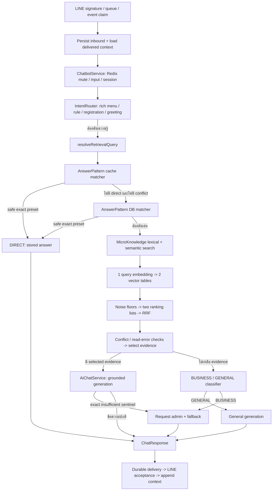

# Core chatbot / RAG review — 24 September 2026

ตรวจ working tree ปัจจุบัน ไม่ใช่เฉพาะ HEAD และไม่ใช่การรับรองว่าระบบ production ใช้โค้ดชุดนี้แล้ว

ขอบเขตหลัก: อ่าน production source ครบ **30 ไฟล์ / 3,880 บรรทัด** ใน `src/modules/chatbot` ยกเว้น test, fixture และ audit harness; ตาม dependency ที่จำเป็นออกไปดู LINE ingress/delivery, embedding, vector SQL, knowledge writers, schema/migrations และ provider boundary เพื่ออธิบาย flow ได้ครบ ส่วนเทสต์ใช้เป็นเครื่องมือพิสูจน์หลังตรวจ source ไม่ใช้แทนการอ่าน source

งานนี้เพิ่มรายงานและ characterization tests เท่านั้น ไม่แก้ production logic, schema, ข้อมูล หรือไฟล์เดิมของผู้ใช้ ไม่เรียก LINE/AI จริง ไม่ตรวจ billing correctness ทั้งระบบ

## ข้อสรุป

โครงสร้าง hybrid retrieval **มีพื้นฐานที่ถูกต้อง**: ค้นผ่าน entry point เดียว, ใช้ scorer เดียวกันกับทั้งสองแหล่ง, embed query ครั้งเดียวแล้วค้น vector สองตาราง, กรอง scope, รวมอันดับด้วย RRF, ส่งเฉพาะ selected evidence ให้ grounded generation และส่ง retrieval เดิมจาก router ไปยัง answer service

แต่ยังรับรองว่า “หาถูกและตอบถูก” ไม่ได้ มีทั้งบั๊ก control flow, privacy, fallback และข้อจำกัด recall/selection ที่ทำซ้ำได้ รวมถึงยังไม่มีผลประเมิน embedding/corpus จริงในรอบนี้ การมี test ผ่านด้วย cosine ที่กำหนดเองไม่ได้พิสูจน์ semantic relevance ของโมเดลจริง

**แก้คำอธิบายจากการสนทนาก่อนหน้า:** RRF ใช้ลำดับแทนขนาดคะแนนตามการออกแบบ จึงไม่ใช่ defect โดยตัวมันเอง และระบบไม่จำเป็นต้องมี relevance gate สองชั้นเสมอไป หาก candidate thresholds ถูก calibrate และคัดหลักฐานได้ดีพอ สิ่งที่ขาดคือหลักฐานการวัดความเกี่ยวข้อง/ความเพียงพอ ไม่ใช่ข้อบังคับว่าต้องเพิ่ม `if` หลัง RRF ทุกระบบ

## 1. Flow ปัจจุบันตั้งแต่ข้อความจนถึงคำตอบ



ข้อยกเว้นสำคัญของภาพ:

- cache หรือ DB `directResult()` คืน conflict ได้ทันที จึงมีทางออกก่อนขั้นค้นถัดไปด้วย
- สาขา `missingReference` ตั้งใจให้หยุดแล้ว CLARIFY แต่โค้ดปัจจุบันไม่มี `return` จึงยังค้นต่อ (R01)
- conflict และ retrieval error ไป CONTACT_ADMIN โดยไม่เข้า classifier
- provider error / empty generation / generation-budget rejection คืน fallback ธรรมดา ไม่เข้า handoff (R04)
- การ append context เกิดหลัง LINE accepted; context เก็บสูงสุด 3 turns / 6 messages, TTL 30 นาที
- ความสำเร็จในการสร้าง ChatResponse ไม่ได้พิสูจน์การส่ง LINE สำเร็จ เทสต์รอบนี้ไม่ได้รัน HTTP → queue → database → delivery จริง

**ใครเรียก retrieve:** `IntentRouterService.resolve()` เรียกเพื่อเลือกเส้นทาง แล้ว `ChatbotService` ส่ง `decision.retrieval` เข้า `AiChatService.answerKnowledge()`; `context.retrieval ?? await retrieve(...)` ทำให้ flow ปกติไม่ค้นซ้ำ ส่วน AiChat ค้นเองได้เมื่อ caller ไม่ส่งผลเดิมมา

## 2. AnswerPattern และ MicroKnowledge ค้นอย่างไร

### Lexical matching

ทั้งคู่ใช้ [AnswerPatternService](../src/modules/chatbot/knowledge/answer-pattern.service.ts) ตัวเดียวกัน:

| สัญญาณ | คะแนน |
| --- | ---: |
| keyword ตรงทั้งข้อความ | 5 |
| keyword ตรง token ที่แบ่งด้วยช่องว่าง | 4 |
| keyword เป็น substring ของข้อความ | 3 |
| keyword ครอบ token ของข้อความ | 1.5 |
| keyword ที่ match เพิ่มหลังตัวแรก | +0.5 ต่อคำ สูงสุด +1 |
| questionExample ตรงทั้งข้อความ | 5 |
| questionExample ครอบข้อความหรือกลับกัน | 2.5 |
| token overlap ของ example ≥ 0.5 | 2 × overlap |
| intentKey | +2 |
| title | +1 |
| category | +1 |
| description | +0.5 |

สูตรคือ `bestKeyword + multiKeywordBonus + bestExample + intent + title + category + description` ไม่ใช่บวกทุก keyword/example เข้าด้วยกัน และ `answer`, `entityKey`, `topicKey` **ไม่ได้ใช้คิดคะแนน lexical**

ขั้นตอนจริง:

1. โหลด active + tenant + language สูงสุด 500 แถวต่อแหล่ง เรียง priority/updatedAt ก่อนทราบว่าตรง query หรือไม่
2. normalize เป็น lowercase, เปลี่ยน punctuation เป็นช่องว่าง, รวมช่องว่าง; ไม่ได้ตัดคำไทย
3. คำนวณคะแนน ตัดต่ำกว่า 2 ทิ้ง
4. เรียง exact example ก่อน; exact ใช้ priority, non-exact ใช้คะแนนแล้ว priority
5. คืนไม่เกิน 20 รายการต่อแหล่ง
6. ใน fusion ตัด lexical ที่ raw score < 3 อีกรอบ

ความหมาย: แถวที่มีเพียงข้อมูลใน `answer` จะไม่ถูก lexical search พบ แม้ข้อมูลนั้นตอบคำถามได้ ต้องอาศัย vector; แถวลำดับเกิน 500 ก็ไม่มีโอกาสเข้า lexical scorer

### DIRECT

DIRECT ใช้ได้เฉพาะ AnswerPattern ที่ questionExample ตรงกับข้อความหลัง normalize, ไม่ใช่ broad query ที่ห้ามไว้, snapshot < 500, ไม่มี exact answer ต่างกันในชุดที่สแกน และ renderMode ไม่ใช่ REWRITE ถ้า query ถูก rewrite จะปิด DIRECT

MicroKnowledge ไม่มีสิทธิ์ DIRECT ตาม policy ปัจจุบัน แม้ questionExample จะตรงทั้งหมด ส่วน keyword match อย่างเดียวก็ไม่ทำให้ AnswerPattern เป็น DIRECT

DIRECT อ่านเพียง AnswerPattern: ไม่เรียก embedding, ไม่อ่าน micro และไม่เรียก generation ดังนั้น preset ต้องสมบูรณ์ในตัวเอง ถ้าธุรกิจใช้ micro เป็นข้อยกเว้นที่ต้อง override preset การออกแบบ DIRECT ปัจจุบันไม่รองรับ policy นั้น

### Vector

[SemanticSearchService](../src/modules/chatbot/knowledge/semantic-search.service.ts) เรียก `embedQuery()` ครั้งเดียว แล้วใช้ vector/model เดียวกันค้น AnswerPatternVector และ MicroKnowledgeVector พร้อมกัน อย่างละไม่เกิน 20 แถว

SQL ใช้ `1 - cosine distance` เป็น similarity; ตรวจ active ทั้ง source และ vector, embeddingModel, tenant และ language; ผลอ่าน `answer` ปัจจุบันจาก source table ที่ JOIN มา ไม่ได้อ่านข้อความจาก vector เอง การ normalize ความยาวเวกเตอร์ไม่ใช่ requirement เพิ่มสำหรับ cosine operator นี้

embedding document มี title/description/category/intent/keywords/examples/answer; micro เพิ่ม entityKey/topicKey จึงมีข้อมูล semantic มากกว่า lexical scorer

ทุก query ที่ **มาถึง fusion** จะพยายาม embed แม้ lexical พบข้อมูลชัดแล้ว แต่ไม่ได้แปลว่าทุกข้อความลูกค้าจ่าย embedding: mute/rule/menu/greeting/DIRECT/empty-input และ error บางทางออกก่อน รวมทั้ง replay หรือ budget rejection อาจไม่เกิด provider call ใหม่

## 3. รวมอันดับและเลือกหลักฐานก่อน LLM

มี **2 ranking lists** ไม่ใช่ 4:

- lexical = DB AnswerPattern + MicroKnowledge เรียง rawScore
- vector = vector ของทั้งสองแหล่ง เรียง similarity

ทั้งสอง list มีได้สูงสุด 40 รายการก่อนรวม ใช้ identity `source:id` จึงไม่ชนกันเมื่อ id เหมือนแต่คนละตาราง เอกสารเดียวกันที่ได้จากทั้งสองช่องรวมเป็นรายการเดียว:

```text
RRF(item) = Σ 1 / (60 + rank_in_channel)
rank เริ่มที่ 1
```

ตัวอย่าง lexical อันดับ 1 เพียงช่องเดียว = 1/61 ≈ 0.01639; เอกสาร lexical อันดับ 2 + vector อันดับ 1 = 1/62 + 1/61 ≈ 0.03252

ในขนาด list ปัจจุบัน เอกสารที่อยู่ทั้งสองช่องมีคะแนนอย่างน้อย 2/100 = 0.02 จึงชนะเอกสารช่องเดียวแม้อยู่ลำดับ 1 ข้อสังเกตนี้เป็นผลของสูตรกับขนาด list ไม่ใช่การคำนวณผิด และต้องวัดว่าการให้รางวัลการพบซ้ำช่วยหรือเสียคุณภาพบน corpus นี้

- rawScore/vectorSimilarity ยังเก็บอยู่ใน metadata ไม่ได้สูญหาย แต่ไม่ถูกนำมาบวกโดยตรงใน final score
- tie-break ใช้ priority แล้ว `source:id`; เมื่อ priority เท่ากัน source name มีผลจริง
- ข้อมูล content/answer ของแถวที่พบทั้งสองช่องใช้ค่าจาก vector read ที่ประมวลผลทีหลัง; ยังไม่มี content version/hash ผูกคะแนนกับ snapshot เดียวกัน
- จำกัด merged เป็น top 20 แต่ตรวจ conflict บน merged ทั้งหมด
- เลือกตามอันดับสูงสุด 3 รายการ โดยผลรวม title + content + answer ไม่เกิน 12,000 UTF-16 code units
- เกินงบจะ `continue` ข้ามทั้งรายการ ไม่ตัดกลางประโยค; การไม่ตัดเงื่อนไขกลางทางมีเหตุผล แต่หลักฐานอันดับแรกอาจหายไป
- ไม่ dedup คำตอบซ้ำที่คนละ id/source และไม่มี source quota
- งบ 12,000 ไม่รวม JSON keys/escaping, metadata บางช่อง, settings, history และ current input จึงไม่ใช่เพดาน token ของ request ทั้งชุด

หลังเลือก ถ้ามีอย่างน้อยหนึ่งรายการ route เป็น RAG ไม่มี reranker หรือ adequacy validation เพิ่ม แต่มี floor ก่อน fusion อยู่แล้ว จึงไม่ควรกล่าวว่า “ไม่มีเกณฑ์ไม่เจอเลย”

## 4. ส่งอะไรเข้า LLM

[AiChatService](../src/modules/chatbot/aichat.service.ts) ส่ง selected items ไปยัง [prompt composer](../src/modules/chatbot/prompt/ai-setting-prompt.composer.ts) เป็น JSON ใน `<ragContext>`:

```text
source, id, title, category, entityKey, topicKey, content, answer
```

ไม่ส่ง RRF score ให้โมเดลตัดสินความมั่นใจ มี mode rules บังคับตอบจากหลักฐาน ไม่เดาเมื่อไม่เพียงพอ และตอบ sentinel `INSUFFICIENT_CONTEXT`; grounded temperature = 0

history ถูกจำกัดอีกชั้นที่ 6 messages / 6,000 characters และเอา assistant ที่ไม่มี user นำหน้าออก แต่ current input กับ history ถูกส่งซ้ำทั้งใน system prompt และ role messages ไม่มี usedIds/citations หรือ post-generation check ยืนยันว่าทุกข้อกล่าวอ้างรองรับโดย evidence

escape tag ในข้อมูลและแยก instruction/data เป็นมาตรการที่ดี แต่ไม่ใช่การพิสูจน์ว่าป้องกัน semantic prompt injection ได้ทั้งหมด; temperature 0 ก็ไม่รับประกัน groundedness

## 5. Findings ที่ยืนยันได้ / เงื่อนไขผลกระทบ

ระดับ: P1 = correctness/privacy/ข้อกำหนดสำคัญ; P2 = reliability/recall/operational impact; P3 = cost/observability หรือ policy ที่ต้องยืนยัน ไม่พบหลักฐานเพียงพอให้สรุป P0 และไม่ถือว่าเป็น security certification

| ID | ระดับ | ผลตรวจและผลกระทบ | หลักฐาน |
| --- | --- | --- | --- |
| R01 | P1 | **missingReference ไม่มี return**: ผล `this.result(...)` ถูกทิ้ง คำถาม “อันนี้…” ที่ไม่มี antecedent ยังเข้า DIRECT/RAG ได้ แทน CLARIFY | `knowledge-retrieval.service.ts:90`; เทสต์เดิมล้ม 2 เคส; เทสต์ใหม่พิสูจน์ DIRECT ที่ข้ามการถามเพิ่ม |
| R02 | P1 | **Registration PII หลุดผ่าน informational digression**: active REGISTER + ข้อความ “สมัครยังไง เบอร์โทร: …” ได้ REGISTER_HOW_TO แล้วส่งข้อความเต็มเข้า embedding และ generation การ redact เฉพาะ log/เก็บ history ไม่ป้องกัน current input | `intent-router.service.ts:87`, `chatbot.service.ts:212`, `aichat.service.ts:304`; เทสต์ใหม่ใช้เบอร์สมมติ |
| R03 | P1 | **Sentinel รั่ว**: `INSUFFICIENT_CONTEXT.` ไม่ตรง equality จึงส่งเป็นคำตอบปกติและ INCLUDE context | `aichat.service.ts:398`; audit เดิมทำซ้ำได้ |
| R04 | P2 | **Fallback สัญญาส่งแอดมินโดยไม่มี handoff**: error/empty/budget ของ generation และ unsafe image ไม่ตั้ง insufficientContext; chatbot จึงคืน fallback โดยไม่ requestAdmin | `aichat.service.ts:327`, `chatbot.service.ts:220`, `constants/ai-chat.constants.ts:15`; audit เดิม |
| R05 | P1 ตาม AGENTS | **waiting_admin ไม่ mute AI**: requestAdmin เปลี่ยน DB status แต่ isMuted อ่านเฉพาะ Redis; turn ถัดไปตอบ AI ต่อได้ และ mute ของ admin reply หมดอายุตาม TTL | `user-session.service.ts:88,102`; เทสต์ใหม่ + LINE delivery source ยืนยัน; docs ปัจจุบันระบุพฤติกรรมนี้ว่า intentional จึงเป็นข้อขัดกันระหว่าง policy กับ implementation ต้องตัดสินความหมาย handoff ให้ตรงก่อนแก้ |
| R06 | P2 | **Cache conflict บล็อก authoritative DB**: directResult ตรวจ conflict ก่อนหา safe exact และคืนทันที แม้ DB ปัจจุบันมีคำตอบถูกต้องแล้ว; ยังเกิดจาก low-ranked conflict ใน cache/DB/merged ได้ | `knowledge-retrieval.service.ts:133,158,182`; เทสต์ใหม่และ audit เดิม |
| R07 | P2 | **Cache หลัง admin write อาจยังเก่า**: refresh หลัง commit ไป join refresh ที่อ่านก่อน commit ได้; หลาย process ไม่มี distributed invalidation ส่วน cache ปกติมี TTL 240s | `answer-pattern-cache.service.ts:58`, `admin-knowledge-pattern.service.ts:122`; เทสต์ใหม่จำลอง overlapping read พิสูจน์ snapshot เก่า |
| R08 | P2 | **Lexical recall ถูกตัดก่อนค้นที่ 500 แถว**; พอ snapshot ครบ 500 จะปิด DIRECT เพราะพิสูจน์ exact uniqueness ไม่ครบ เป็น guard ที่สมเหตุผลแต่มีผลต่อ cost/recall | `answer-pattern.service.ts:84,163`, `micro-knowledge.service.ts:21`; เทสต์ใหม่แถวที่ 501 + audit เดิม |
| R09 | P2 | **Thai substring false positive**: “นอนไม่หลับควรไปหาหมอนะ” match keyword/title “หมอน” ได้ 4 คะแนน จึงผ่าน floor 3; answer-only facts กลับค้น lexical ไม่พบ | `answer-pattern.service.ts:180,243`; audit เดิมและเทสต์ใหม่ |
| R10 | P2 | **Embedding budget rejection กลายเป็น retrieval error + handoff** แม้มี lexical evidence; lexical-only degradation เป็นข้อเสนอที่ต้องกำหนดความปลอดภัย ไม่ใช่ของที่มีอยู่ | `embedding.service.ts:81`, `knowledge-retrieval.service.ts:116,167`; เทสต์ใหม่ใช้ EmbeddingService จริงและ assert adapter/billing ไม่ถูกเรียก |
| R11 | P2 | **Evidence ซ้ำกิน slot / evidence ยาวถูกข้าม** ทำให้ข้อเท็จจริงเสริมหลุด แม้ corpus มีข้อมูลนั้น; top-3 และ no-source-quota ไม่ใช่ defect ในตัวเอง แต่มี counterexample ของ selection | `knowledge-retrieval.service.ts:258`; เทสต์ใหม่และ audit เดิม |
| R12 | P2 | **Follow-up planner ผูกกับรุ่นสินค้า** ไม่เข้าใจบริการ/โปรโมชั่น/สาขา; หลังคืน return ให้ถูก จะถามเพิ่มทุกครั้งที่พบคำอ้างอิงแต่ไม่มี `รุ่น X/model X` แม้ history อาจชัด; regex ต้องมีช่องว่างหลัง “รุ่น” | `retrieval-query-planner.service.ts`; เป็นข้อจำกัดที่ยืนยันจาก source ไม่อ้างว่าใช้ได้กับทุก business |
| R13 | P2 | **PII redaction ไม่ครอบคลุมตามข้อกำหนดกว้าง**: email ยังถูกเก็บใน AI context; ชื่อ/ที่อยู่/เลขเอกสารไม่มี detector และ current input ไม่ผ่าน redactor | `utils/text.utils.ts:11`, `context/load-context.service.ts:171`; เทสต์ใหม่ใช้ email โดเมน .invalid |
| R14 | P2 เมื่อใช้งาน API นี้ | **Admin DTO ไม่รับ renderMode และ create ไม่ตั้ง tenant ของ knowledge**: REWRITE ใน request ถูก strip; create ปกติได้ DIRECT + null tenant แม้ retrieval ถูกตั้ง tenant เฉพาะ ทำให้ pattern ใหม่อาจมองไม่เห็น ขณะที่ micro writer ตั้ง tenant ให้ | `admin/knowledge/dto/admin-answer-pattern.dto.ts`, `admin-knowledge-pattern.service.ts:49`; renderMode พิสูจน์ด้วย schema test; tenant เป็น conditional integration finding |
| R15 | P3 | **Exact preference ถูกทิ้งระหว่าง rank**: exact REWRITE คะแนน 5 แพ้ non-exact คะแนน 6; เป็น policy ไม่สอดคล้องระหว่าง matcher และ fusion ไม่ใช่ข้อพิสูจน์ว่าคำตอบสุดท้ายผิดเสมอ | `answer-pattern.service.ts:116`, `knowledge-retrieval.service.ts:215`; เทสต์ใหม่ |
| R16 | P3 | **Sticker greeting กลืน business question**: “สวัสดีครับ จัดส่งวันไหน” ใน sticker text ได้ greeting template โดยไม่ค้น แตกต่างจาก text greeting ที่ตรวจทั้งข้อความ | `sticker-intent.service.ts:45`; เทสต์ใหม่ |
| R17 | P3 | **Observability/input guard**: console.log menu reply ดิบ; warn session ทุก turn; Number(config) ยอม NaN; error/conflict route ข้าม logDecision; title ใน retrieval log ไม่ redact | `intent-router.service.ts:61`, `chatbot.service.ts:36,58`; source และ audit เดิม |

### ประเด็นที่ไม่ควรยกระดับเป็น defect โดยไม่มีข้อมูลเพิ่ม

- RRF vs weighted RRF, reranker, top-3 vs top-8, หรือการกัน slot ให้ AnswerPattern: ต้องวัดกับ task จริง ไม่จำเป็นต้องใช้ทุกอย่าง การบังคับ source quota อาจดัน AnswerPattern ที่ไม่เกี่ยวขึ้นมา
- `vector >= 0.6` ไม่ได้แปลว่าเกี่ยวข้องแน่นอน และไม่ได้แปลว่า noise แน่นอน ต้องวัด model/corpus นี้ ข้อกล่าวว่า classifier “แทบไม่ทำงาน” ยังไม่มี traffic distribution รองรับ
- ไม่มี gate หลัง fusion ไม่ใช่ข้อผิดโดยตัวมันเอง ถ้าจะเพิ่ม ต้องตรวจ relevance ของ evidence ที่ส่งจริง ไม่ใช่เพียง max score ของ candidate สักตัวแล้วปล่อยรายการไม่เกี่ยวทั้งหมดผ่าน
- DIRECT ไม่อ่าน micro: ใช้ได้เมื่อ preset เป็นคำตอบครบถ้วน; ใช้ไม่ได้เมื่อธุรกิจคาดให้ micro override หรือเพิ่มข้อยกเว้นทุกครั้ง ต้องกำหนด ownership ของข้อเท็จจริง
- Conflict detection เป็น heuristic ไม่ใช่เครื่องพิสูจน์ความขัดแย้งทั้งหมด: ตรวจเฉพาะหัวข้อ/subject + negation/numeric template บางรูปแบบ, ข้ามข้อความมีคำบอกเงื่อนไข และ ambiguousExact เพียงปิด DIRECT ไม่ได้บังคับ handoff เสมอ
- การย้าย conflict ไปตรวจเฉพาะ top-3 อย่างเดียวอาจซ่อนข้อยกเว้นสำคัญที่อันดับ 4 ควรกรอง relevance/subject/topic ก่อน แล้วคง relevant conflicts แม้เกินจำนวน context ปกติ
- การผ่าน tests ด้าน escape tag ไม่พิสูจน์ว่า LLM จะไม่เชื่อคำสั่งโจมตี ต้องทดสอบกับโมเดลจริงและไม่ให้ผลโมเดลมีอำนาจทำธุรกรรม
- HNSW มีอยู่ใน migrations และ SQL ใช้ cosine ordering ที่เหมาะสม แต่ยังไม่ได้ EXPLAIN หรือเปรียบเทียบ ANN กับ exact scan บน DB จริง; จึงไม่กล่าวว่าระบบใช้ index ผิดหรือ recall ผ่านแล้ว

## 6. เทียบกับเอกสารอ้างอิง

| หัวข้อ | ระบบนี้ | ข้อประเมิน |
| --- | --- | --- |
| Hybrid / RRF | สองช่องและสูตร 1/(60+rank) | ตรงแนวทางรวมอันดับใน [Microsoft RRF documentation](https://learn.microsoft.com/en-us/azure/search/hybrid-search-ranking); raw scores คนละชนิดไม่ควรบวกตรง ๆ |
| Retrieval evaluation | มี deterministic tests แต่ยังไม่ได้วัด corpus จริงในรอบนี้ | แยก recall ของ retrieval ออกจาก groundedness ของคำตอบ; [Anthropic Contextual Retrieval](https://www.anthropic.com/engineering/contextual-retrieval) วัด recall และทดลอง reranking/context size กับชุดข้อมูล ไม่ถือว่าค่าเดียวเหมาะทุกระบบ |
| Context ในเอกสาร | embedding รวม title/category/keywords/answer; micro มี entity/topic | มีบริบทประกอบอยู่แล้ว เหมาะกับ facts สั้น; อย่าเพิ่ม contextualization/chunking โดยไม่วัดว่าข้อมูลสั้นเดิมต้องการหรือไม่ |
| Vector search | PostgreSQL + pgvector, model/scope filters | [pgvector](https://github.com/pgvector/pgvector#filtering) อธิบายว่าการกรองกับ approximate index มีผลต่อ recall; ทดสอบ exact comparison และ iterative scans ตาม version/config ที่ใช้งานจริง |
| Prompt injection | แยก sections, escape tag, untrusted-data rules | สอดคล้องส่วนหนึ่งกับ [OWASP LLM Prompt Injection Prevention](https://cheatsheetseries.owasp.org/cheatsheets/LLM_Prompt_Injection_Prevention_Cheat_Sheet.html); ต้องมี output validation และการจำกัดสิทธิ์ร่วมด้วย |

ไม่มีข้ออ้างว่า BM25/pg_trgm/reranker จะทำให้ดีขึ้นโดยอัตโนมัติ สำหรับไทยต้องเลือก tokenization และวัดคำติดกัน/คำกำกวมด้วย `pg_trgm` เป็น character similarity ไม่ใช่ตัวเข้าใจ semantic หรือคำไทยแทนให้ทั้งหมด

## 7. ข้อเสนอเรียงตามความจำเป็น

1. **แก้ correctness/privacy ก่อนจูนคะแนน**: คืน missingReference return; แยกข้อมูลสมัคร/PII ออกจาก query และ prompt รวมภาพตาม policy; ทำ structured abstention หรือ final sentinel guard; ทำให้ fallback text ตรงกับ handoff ที่เกิดจริง
2. **ตกลง state ของ handoff**: waiting_admin คือแค่ “ขอคนมาดูแต่ AI ยังตอบ” หรือ “ส่งต่อแล้วหยุด AI จน release”; AGENTS กับ docs/source ตอนนี้คนละแบบ อย่าแก้ด้วย TTL โดยไม่กำหนดความหมาย
3. **แก้การค้นและ freshness**: authoritative exact lookup ที่ไม่ผูกกับ snapshot 500, cache invalidation หลังเขียนที่ไม่ join pre-write read, version ของ evidence/index; แก้ renderMode/tenant ใน admin writer ที่เป็นต้นทางข้อมูล
4. **ทำ relevance dataset ก่อนเลือก threshold**: ใช้ corpus ของธุรกิจจริง, queries ที่คาดหวัง evidence ids และคำถามที่ควรไม่เจอ; แยกชุดปรับค่ากับชุดประเมิน ไม่ใช้ cosine สมมติเพื่อตัดสินค่า production
5. **ทดลอง selection ทีละอย่าง**: relevance-filtered pool, content dedup ที่รักษาเงื่อนไข/วันที่/source, ลด conflict นอกเรื่อง, evidence budget ตาม tokens, reranker ถ้าผล eval แสดงประโยชน์ ไม่บังคับ AnswerPattern slot ถ้าไม่เกี่ยว
6. **รองรับ follow-up ตามธุรกิจ**: ใช้ context ล่าสุดที่เกี่ยวข้องและ redact แล้วช่วยสร้าง standalone query; ไม่จำเป็นต้องเพิ่ม entity schema ทันที แต่ต้องแยกการเปลี่ยนหัวข้อ/หลาย antecedents และทดสอบ general business ที่ไม่มีรุ่น
7. **สังเกตต้นทุนและคุณภาพ**: บันทึก candidate/selected/used evidence ids, content version, query rewrite, stage latencies, fallback reason และ call counts; history ปัจจุบันซ้ำใน prompt กับ messages ควรทดลองลดโดยรักษาการแยก trust

ตัวอย่างชุดประเมินที่ควรมี (ต้องผูกกับ expected IDs จาก corpus จริง):

| กลุ่ม | Query / บริบท | สิ่งที่วัด |
| --- | --- | --- |
| exact preset | “เปลี่ยนวันนัดหมายได้ไหม” | DIRECT ถูกแถว ไม่มี competing answer |
| Thai paraphrase | “เลื่อนนัดไปวันอื่นได้หรือเปล่า” | recall ของข้อกำหนดเลื่อนนัด |
| multi-fact | “ส่งต่างจังหวัดกี่วัน ต้องสั่งก่อนกี่โมง” | evidence ครบทั้ง SLA และ cutoff |
| hard negative | “นอนไม่หลับควรไปหาหมอนะ” | ไม่ดึงหมอนเป็น business evidence |
| out of domain | “วันนี้ฝนจะตกไหม” | false-positive retrieval / unwanted handoff |
| business without models | history โปรโมชั่นส่งฟรี → “อันนี้ถึงวันไหน” | follow-up resolution |
| ambiguous follow-up | history มีสองโปร → “อันนี้ใช้ได้ไหม” | clarify ไม่เลือกเอง |
| exceptions/conflicts | กฎคืนสินค้า + ข้อยกเว้นสินค้าสั่งทำ | coverage/abstention ไม่ซ่อนข้อยกเว้น |
| lifecycle | deactivate/update/delete/reindex ระหว่างค้น | ไม่ใช้ stale preset/vector |
| privacy/adversarial | ข้อความสมัครผสมคำถาม, คำสั่งปลอมใน evidence | ไม่ส่ง PII และไม่เชื่อคำสั่งจากข้อมูล |

วัด Recall@20, Precision@3, nDCG@3 หรือ MRR, evidence coverage สำหรับหลายข้อเท็จจริง, no-answer precision/recall, unsupported-claim rate, handoff rate แยกสาเหตุ, latency และจำนวน provider calls ต่อ turn โดย DIRECT / RAG / GENERAL คิดแยกกัน

ปัจจุบัน call path ทั่วไปคือ DIRECT = 0, RAG = 1 embedding + 1 generation, LOW_CONFIDENCE→GENERAL = 1 embedding + 1 classifier + 1 generation ดังนั้น hourly limit นับ calls ไม่ใช่ messages และไม่ควรสรุปว่าทุกคนได้เพียง 20 ข้อความต่อชั่วโมง

## 8. Internal verification และขอบเขตหลักฐาน

เพิ่ม [core-rag-review-2026-09-24.audit.spec.ts](../src/modules/chatbot/audit/core-rag-review-2026-09-24.audit.spec.ts) **17 characterization tests** ใช้ real chatbot/retrieval/matcher/router/prompt services และ mock infrastructure/provider boundaries รวมถึง cache, vector repositories, budget และ embedding service ใน harness ปกติ; เคส budget ใช้ EmbeddingService จริงเพื่อไม่ทดสอบผิดสาเหตุเหมือน audit เดิม

ชื่อ `observes` = ยืนยันพฤติกรรมปัจจุบันที่เป็นปัญหาหรือข้อจำกัด **ไม่ใช่ acceptance test ว่าควรทำเช่นนั้น** เมื่อแก้ bug ต้องเปลี่ยน assertion ให้เป็นพฤติกรรมที่ต้องการ

ผลรันล่าสุด ไม่มี live LINE/provider call และไม่มีการแก้ database:

- ชุดใหม่: 17 tests ผ่าน
- ชุด chatbot เดิมก่อนเพิ่ม: 161 ผ่าน / 2 ล้ม / 163 รวม; failures เป็น missingReference guard
- `npm test -- --runInBand --silent --testPathPatterns=modules/chatbot`: **178 ผ่าน / 2 ล้ม / 180 รวม**, 13 suites ผ่าน / 2 suites ล้ม / 15 รวม
- สอง failures: `core-chat-e2e.audit.spec.ts` เคส ambiguous follow-up และ `knowledge/test/knowledge-retrieval.service.spec.ts` เคสอ้างถึงของเดิมแบบไม่รู้ว่าอันไหน ทั้งคู่เกิดก่อนเพิ่มเทสต์รอบนี้และตรงกับ R01 ไม่แก้ test ให้ยอมรับ regression
- `npx --no-install tsc -p tsconfig.json --noEmit`: ผ่าน หลังแก้ type ของ mock ในไฟล์ที่เพิ่ม
- `npx --no-install eslint src/modules/chatbot/audit/core-rag-review-2026-09-24.audit.spec.ts`: ผ่าน
- ไม่รัน lint `--fix` ทั้ง repo, build, whole-repo test หรือ live E2E เพราะงานนี้เพิ่มเฉพาะเอกสารและ audit tests ไม่มี production implementation change

ไม่ยืนยันในรอบนี้: real embedding distribution, ความถูกต้องของภาษาไทยจาก LLM จริง, live corpus recall, production settings, actual HNSW query plan, Redis restart/TTL จริง, cross-process concurrency, HTTP signature→queue→delivery เต็มเส้น, billing reconciliation และ 17 billing failures จากรายงานเก่า ไม่มี production fix จึงยังไม่ควรตีความว่าพร้อม deploy เพื่อปิด findings

## 9. Source inventory — ทุก production file ใน chatbot

| ไฟล์ (relative to src/modules/chatbot) | สิ่งที่ตรวจ |
| --- | --- |
| `chatbot.module.ts` | DI / exports / orchestration boundary |
| `ai.module.ts` | retrieval/provider wiring |
| `chatbot.service.ts` | text/image/sticker, session, handoff, context policy |
| `intent-router.service.ts` | menu/rule/session precedence, retrieval routes, classifier |
| `rule-intent.service.ts` | deterministic rules, legacy digits |
| `ai-intent-classifier.service.ts` | budget, schema validation, failure fallback |
| `aichat.service.ts` | DIRECT, generation inputs, sentinel, fallback |
| `user-session.service.ts` | session validation/TTL, Redis mute, DB handoff |
| `sticker-intent.service.ts` | greeting/thanks vs user text |
| `image-analysis.policy.ts` | structured image classification / output filtering |
| `reply-template.service.ts` | user-visible promises, menu captions, registration templates |
| `knowledge/knowledge-retrieval.service.ts` | complete retrieval/fusion/selection/conflicts |
| `knowledge/answer-pattern.service.ts` | complete scoring/exact/caps |
| `knowledge/answer-pattern-cache.service.ts` | TTL, refresh coalescing, snapshots |
| `knowledge/micro-knowledge.service.ts` | scoped read, shared scorer |
| `knowledge/semantic-search.service.ts` | single embed, parallel vector lookup, metadata |
| `knowledge/retrieval-query-planner.service.ts` | bounded follow-up rewriting |
| `knowledge/knowledge-scope.ts` | trusted config parsing / ownership filters |
| `context/ai-provider-context.ts` | provider history selection and bounds |
| `context/load-context.service.ts` | delivered turns, redaction, Lua dedup/TTL |
| `prompt/ai-setting-prompt.composer.ts` | precedence, escaping, rag payload |
| `menu/rich-menu-reply-cache.service.ts` | keys/labels, forced refresh, 200-row cache; no TTL/distributed refresh (scale/recovery limitation) |
| `intent/intent.maps.ts` | all declared intent→action mappings |
| `intent/intent.utils.ts` | rule decision construction |
| `constants/ai-chat.constants.ts` | grounded/general rules, default fallback |
| `constants/knowledge-routing.constants.ts` | RRF, floors, caps, sentinel |
| `constants/low-confidence-classifier.prompt.ts` | BUSINESS/GENERAL contract |
| `types/chat.types.ts` | route/evidence/context/result contracts |
| `types/ai-runtime.types.ts` | settings/prompt shape |
| `types/session.types.ts` | workflow states |

ขอบเขตเพิ่มเติมที่อ่านเฉพาะเกี่ยวข้อง: LINE controller/webhook/delivery, text redactor, rate-budget gate, embedding service/adapter/document builders/vector repositories, UsersAiProviderService, admin pattern/micro writers/DTO/controller, Prisma schema และ vector migrations

## 10. Documentation drift

- รายงาน 23 กันยายนไม่ตรง working tree แล้ว: guard missingReference เคยมี return แต่ตอนตรวจนี้ไม่มี ทำให้ผลเทสต์เดิมไม่ใช่ 38/38 อีกต่อไป
- audit เดิม C06 mock EmbeddingService ให้สำเร็จแล้วปฏิเสธ budget ที่ classifier จึงพิสูจน์สาเหตุ embedding budget ไม่ได้; ชุดใหม่นี้แยกสาเหตุแล้ว
- C16 เดิมกล่าวว่า menu label “ยกเลิก” ทำให้ออกจาก registration ไม่ได้ แต่ RICH_MENU_REPLY ล้าง active session อยู่แล้ว และผู้ใช้ยืนยันไม่มีเมนูดังกล่าว จึงไม่จัดเป็น defect ปัจจุบันในรายงานนี้
- `docs/erd-database.md` ยังกล่าวว่า AnswerPattern.tenantId ไม่มีใครอ่าน ทั้งที่ retrieval/filter อ่านจริง; admin writer ที่ไม่ scope เป็นอีกเรื่องหนึ่ง
- `docs/line-message-e2e-current.md` อธิบายว่า waiting_admin ยังให้ AI ทำงานและ mute หมดอายุได้ ซึ่งตรง source แต่ขัด AGENTS ที่กำหนด durable handoff จน explicit release; diagram ยังบอกว่า chatbot ตรวจ waiting_admin ทั้งที่ actual gate อ่าน Redis
- `docs/mvp-line-rag-billing-flow.md` และ `docs/service-flow.md` ที่ AGENTS อ้างไม่มีใน tree ที่ตรวจ รวมถึงลิงก์บางส่วนจาก current-flow doc จึงใช้ source เป็นหลัก
