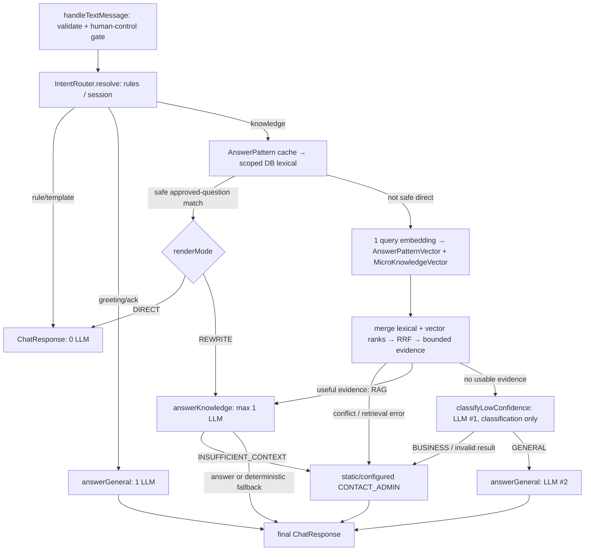

# ผล refactor core text reply flow

อัปเดต 13 กันยายน 2026 — ใช้คำขอ implementation ล่าสุดในไฟล์แนบเป็นเป้าหมาย แทนแผน unified response / second search ก่อนหน้า ขอบเขตเริ่ม `ChatbotService.handleTextMessage()` จนได้ `ChatResponse` ยังไม่ deploy หรือส่ง LINE จริง

## 1. Flow ที่ลงมือทำ



Human-controlled session ถูก mute ก่อนเข้า router ยกเว้น cancel ที่รองรับ คง CANCEL → active REGISTER → greeting/ack → strong rule → retrieval ตามของเดิม การแทรกถามวิธีสมัครจะส่ง retrieval result เข้า answer layer ครั้งเดียว เมนู 2 คืน template เริ่มถามและเมนู 3 ไป admin แบบ deterministic; เมนู 2 ระหว่าง REGISTER ไม่เขียนทับ session สมัคร

## 2. จำนวน generative LLM calls ต่อเส้นทาง

| เส้นทาง | Logical generation calls | หมายเหตุ |
|---|---:|---|
| Empty/too long, mute, rules, registration, menu | 0 | templates / business flow เดิม |
| Safe AnswerPattern DIRECT | 0 | stored answer ไม่ rewrite |
| Safe AnswerPattern REWRITE | 1 | ใช้ answerKnowledge หนึ่งครั้ง ไม่ embedding |
| Semantic AnswerPattern / MicroKnowledge / mixed | สูงสุด 1 | RAG แล้วจบ; ไม่มี planner/assessor |
| Greeting/ack | สูงสุด 1 | answerGeneral โดยตรง ไม่ classifier |
| LOW_CONFIDENCE → BUSINESS | สูงสุด 1 | classifier แล้ว static/configured handoff |
| LOW_CONFIDENCE → GENERAL | สูงสุด 2 | classifier + answerGeneral; **เส้นทางเดียวที่ใช้สอง calls** |
| RAG → INSUFFICIENT_CONTEXT | สูงสุด 1 | durable handoff เดิม ไม่ย้อนกลับ classifier |
| RAG provider error/empty/budget denial | สูงสุด 1 | configured deterministic fallback เดิม; ไม่ generate เพิ่ม |
| Unresolved follow-up | 0 | static clarification ไม่สร้าง state machine |
| Detected source conflict / retrieval unavailable | 0 | static/configured handoff |

Budget denial อาจทำให้จำนวน call ต่ำกว่าตาราง ไม่ใช่เพิ่ม stage ชดเชย ทั้งหมดนับที่ `UsersAiProviderService.generate`; provider/network retry เป็น infrastructure concern ตามคำขอล่าสุด และยังอาจมี HTTP attempts มากกว่าจำนวน logical calls **ไม่มีการเพิ่ม global hard cap หรือ stage ที่สาม** Embedding เป็นอีกประเภทหนึ่ง ปกติ 0 หรือ 1 query embedding ต่อ retrieval

## 3. จุด generation ทั้งหมดที่เข้าถึงจาก handleTextMessage

1. `AiIntentClassifierService.classifyLowConfidence` → `UsersAiProviderService.generate`: ใช้เฉพาะไม่มี usable knowledge; JSON classification/confidence/reason ไม่มีคำตอบลูกค้า Zod strict validation ผิดรูป/exception/budget denial → BUSINESS fallback
2. `AiChatService.answerGeneral` → private `generateText` → shared generate: greeting/ack หนึ่ง call หรือหลัง LOW → GENERAL เป็น call ที่สอง ใช้ AiSetting systemPrompt/tone เดียวกัน
3. `AiChatService.answerKnowledge` → private `generateFromKnowledge` → shared generate: preset rewrite หรือ RAG ไม่เกินหนึ่ง call เมื่อใช้แล้วห้ามเข้าข้อ 1 ซ้ำ

`answerFallback` อ่าน settings และคืนข้อความ literal เท่านั้น `answerImage` มี generate อีกจุดในไฟล์เดียวกัน แต่ไม่เข้าถึงจาก handleTextMessage และไม่ได้เปลี่ยน image policy/shared retries/billing

## 4. Retrieval สองแหล่งและตำแหน่งตัดสิน route

`KnowledgeRetrievalService.retrieve`:

1. Resolve explicit model references แบบ deterministic จากประวัติ delivered สูงสุด 6 messages; ถ้าอ้างหลายรุ่น/ไม่มีรุ่นที่ระบุชัด ให้ clarification
2. `AnswerPatternCacheService.getAll` → matcher → `directResult`; cache หมด TTL จะไม่คืน snapshot เก่ามา direct
3. ไม่พบ safe preset → `AnswerPatternService.findMatches` อ่าน DB แบบ scoped; DB success แทน cache แม้คืนว่าง
4. ไม่พบ safe preset → MicroKnowledge DB lexical และ SemanticSearch โดยไม่มี generative planner
5. `SemanticSearchService.search` เรียก `EmbeddingService.embedQuery` **ครั้งเดียว** แล้วส่ง object `embedding.values` และ model เดียวกันเข้า `AnswerPatternVectorRepository.search` และ `MicroKnowledgeVectorRepository.search` ด้วย Promise.all
6. Eligibility → rank/fuse → ตรวจ conflict ก่อนตัด pool → selectedItems
7. `directResult` ตัดสิน DIRECT/REWRITE preset ส่วนปลาย `retrieve` คืน RAG เมื่อมี selectedItems มิฉะนั้น LOW_CONFIDENCE; `IntentRouter.resolve` ตัดสิน clarification / handoff / ANSWER_KNOWLEDGE / classifier

ไม่มีการค้น vector เพื่อส่ง preset ตรงจาก cosine แม้ค่า .99 และ MicroKnowledge exact question ก็ยังเป็น RAG เท่านั้น

## 5. คะแนนและ ranking ที่ใช้จริง

รักษา lexical weights เดิมสำหรับ keyword/example/title/category/intent/description แต่ **เลิก priority bonus ที่เพิ่ม relevance** ใช้ priority เฉพาะ tie-break ขั้นคัด candidate เก็บ `rawScore` และ `vectorSimilarity` แยก metadata; ไม่ normalize lexical หาร 5 แล้ว Math.max กับ cosine

- Lexical noise floor: `KNOWLEDGE_LEXICAL_CANDIDATE_MIN_SCORE`, default **3**
- Vector noise floor: `KNOWLEDGE_VECTOR_CANDIDATE_MIN_SIMILARITY`, default **0.6**
- ค่าเริ่มต้นยังต้อง tune จาก corpus ไทยของร้าน ไม่ใช่ calibrated confidence; config ที่ไม่ใช่ตัวเลข/นอกช่วงถูก reject
- รวม lexical จากทั้งสอง source เป็น ranking list เดียว และ vector จากทั้งสอง source เป็น ranking list เดียว (embedding model เดียว)
- แต่ละ list sort ด้วย raw signal ของตนเอง, priority แล้ว source:id เป็น tie-break
- `RRF(item) = Σ 1 / (60 + rank)` โดย rank เริ่ม 1; item ที่อยู่ทั้ง lexical/vector ได้สอง contributions
- dedupe ด้วย `(source, id)` ภายใน trusted scope เดียวกัน ไม่ใช้ id เปล่า ไม่ merge คนละ source เพราะข้อความเหมือนกัน
- final rank: RRF descending → priority → source:id; metadata เก็บ provenance/matchTypes และ raw signals ไว้
- `topScores`/`scoreGap` เป็น diagnostics ของ ranking ไม่สั่ง final intent; router ไม่ใช้ topScores[0] เป็นความมั่นใจในการตอบอีก
- ไม่มี threshold .6 เทียบ RRF และไม่มี threshold .95 ที่อนุญาต semantic DIRECT

ตัวอย่าง candidate ที่อยู่ที่หนึ่งในสอง lists ได้ `2/61 ≈ 0.03279` ยังเข้า RAG ได้เพราะผ่าน candidate eligibility ก่อน fuse ไม่ใช่ถูกตัดว่า score < .6

## 6. Cosine คำนวณตรงไหน

SQL ใน [AnswerPatternVectorRepository](../src/modules/ai/embeding/answer-pattern-vector.repository.ts) และ [MicroKnowledgeVectorRepository](../src/modules/ai/embeding/micro-knowledge-vector.repository.ts) ใช้:

```sql
(1 - (vector."embedding" <=> query_vector::vector))::float8 AS "score"
ORDER BY vector."embedding" <=> query_vector::vector
```

SemanticSearch เก็บค่าเป็น metadata.vectorSimilarity โดยไม่ถือว่า cosine .82 = โอกาสตอบถูก 82% Queries ทั้งสอง join source record และกรอง source/vector active, embeddingModel, tenantId และ language ก่อน LIMIT

## 7. Direct eligibility, conflicts และ context limits

DIRECT ต้องเป็น AnswerPattern ที่มี answer ไม่ว่าง, ผ่าน active/scope/language, normalized whole-question เท่ากับ curated questionExample, ไม่เป็น broad query ที่กันไว้ เช่น ราคา/price/สินค้า และไม่มี competing preset ที่ขัดกัน การตรง keyword อย่างเดียวไม่ผ่าน

ตรวจ competing exact answers ทั้ง scanned set ก่อน top-20 truncation; คำตอบต่างกันทำให้หมดสิทธิ์ DIRECT แต่ไม่ถูกเหมาว่าเป็น conflict; snapshot ที่ชน scan cap 500 ไม่อนุญาต direct เพราะพิสูจน์ uniqueness ไม่ได้ เมื่อมีหลาย presets ตอบเหมือนกันเลือกตามลำดับ deterministic; REWRITE ถูกส่งไป RAG route พร้อม preset เดียวและใช้หนึ่ง generation

Conflict detector ไม่ใช้ “category เดียว + คะแนนใกล้ + answer ต่างกัน” อีก ใช้กรณีที่ตรวจได้ชัด:

- competing AnswerPatterns ที่มี approved question เดียวกันแต่คำตอบต่างกัน: ไม่ DIRECT ให้ค้น/คัดหลักฐานต่อ; หากเนื้อหาเป็นข้อมูลคนละส่วนยังเข้า RAG ได้ ไม่ถือเป็น conflict เพียงเพราะ answer ต่างกัน
- same-subject assertion ที่ข้อความเหมือนกันแต่ขัดกันตรง polarity ที่รองรับ (เช่น ปลอกซักได้ / ปลอกซักไม่ได้)
- same entity/topic fact ที่รูปข้อความเดียวกันแต่ numeric value ต่างกัน เช่น รับประกัน 7 วัน / รับประกัน 14 วัน

ข้อความที่มีตัวบ่งชี้เงื่อนไข เช่น ถ้า/เมื่อ/กรณี/if/when ไม่ใช้ simple polarity/numeric comparator ตัดสินว่า conflict เพราะอาจเป็นคนละ conditional case; grounded prompt ต้องตรวจความหมายต่อและคืน sentinel ถ้ายังขัดกันจริง

ปลอกซักได้ + ไส้ห้ามซัก เป็นข้อมูลประกอบกัน ไม่ conflict ส่วนข้อมูลคนละ entity ไม่ถูกถือว่าขัดกันเพียงเพราะประโยคคล้าย

| Limit | ค่า / ตำแหน่ง |
|---|---|
| Preset cache/DB scan | 500 records ใน cache/matcher service |
| Micro lexical scan | 500 records ใน MicroKnowledgeService |
| Vector rows | 20 ต่อ source ผ่าน MAX_RETRIEVAL_CANDIDATES |
| Final candidate pool | 20 หลัง dedupe/ranking |
| Selected contexts | 3 ผ่าน MAX_RAG_CONTEXTS |
| Selected evidence text | 12,000 characters ผ่าน MAX_RAG_EVIDENCE_CHARACTERS |
| Recent model context | 6 messages / 6,000 characters จาก converter เดิม |
| Retrieval query embeddings | สูงสุด 1; ไม่มี second pass |

Constants สำหรับ candidate/context/RRF อยู่ [knowledge-routing.constants.ts](../src/modules/chatbot/constants/knowledge-routing.constants.ts) ไม่ truncate fact กลางข้อความ เพราะอาจตัดคำว่า “ห้าม” หรือข้อยกเว้น เลือก records ที่ทั้งก้อนอยู่ในงบแทน

## 8. ไฟล์ที่แก้และเหตุผล

| กลุ่มไฟล์ | เหตุผล |
|---|---|
| chatbot.service.ts | GENERAL เรียก answerGeneral; RAG insufficient จบด้วย handoff ไม่ classifier; menu digression รักษา REGISTER session |
| intent-router.service.ts | คง ordering; retrieval error/conflict/clarification ใช้ deterministic policy; เลิกส่ง generatedResponse/ใช้ retrieval rank เป็น confidence |
| ai-intent-classifier.service.ts + low-confidence-classifier.prompt.ts | classify-only strict JSON; ลบ analyze legacy |
| aichat.service.ts | DIRECT ตรวจ safe preset; REWRITE/RAG ใช้ call เดียว; ระบุ source type ใน grounding prompt |
| rule-intent.service.ts + intent.maps.ts + intent.utils.ts | menu 2/3 deterministic; เหลือ RULE_MAP/fromRule ไม่มี AI_MAP/fromAi |
| types/chat.types.ts + knowledge-routing.constants.ts | source MICRO_KNOWLEDGE/renderMode/CLARIFY; ลบ types/stages ของ legacy planner; เพิ่ม named noise/rank/context limits |
| knowledge-retrieval.service.ts | เปลี่ยน planner/multi-pass/max-score pipeline เป็น cache → DB → joint vector → RRF → evidence |
| retrieval-query-planner.service.ts | เหลือ pure resolveRetrievalQuery ไม่มี Injectable/AI dependencies/generation |
| answer-pattern.service.ts + answer-pattern-cache.service.ts | scope/freshness/specific exact eligibility; reuse matcher สำหรับ micro; priority tie-break |
| semantic-search.service.ts | embed ครั้งเดียว + สอง source types |
| knowledge-scope.ts ใหม่ | trusted deployment tenant/language config และ row eligibility |
| micro-knowledge.service.ts ใหม่ | scoped lexical read ของ schema MicroKnowledge เดิม |
| micro-knowledge-vector.repository.ts ใหม่ | scoped raw pgvector query |
| answer-pattern-vector.repository.ts | เพิ่ม optional scope argument/metadata สำหรับ customer path; legacy admin callers ไม่เปลี่ยน signature เดิม |
| ai.module.ts | wire micro providers; ถอน generative planner provider |
| text-reply-flow.spec.ts + cache spec ใหม่ | tests ใช้ real runtime services และ spy shared provider; SQL bindings/vector reuse/failure/session tests |
| ai-provider.service.spec.ts | แก้ constructor fixture แบบเก่าให้ใช้ adapter registry ปัจจุบัน; ไม่แก้ provider runtime/retry |
| current-flow docs 3 ไฟล์ + รายงานนี้ | อัปเดต flow จริง; แผนก่อนหน้าติดป้าย historical เพื่อไม่สับสน |

## 9. สิ่งที่อ่านแล้วตั้งใจคงไว้

- `UsersAiProviderService`, `AiProviderService`, `EmbeddingService`, `AiBudgetService`, shared provider types/config: billing/rate/retry boundaries เดิม ใช้ abstractions เหล่านี้ต่อ
- `UserSessionService`, `ReplyTemplateService`, context converter, session/runtime-setting types: registration/handoff/context storage เดิม ไม่สร้าง state machine ใหม่
- `chatbot.module.ts`: dependency wiring ส่วนนี้เพียงพอ ไม่แก้
- Prisma `AnswerPattern`, `MicroKnowledge`, vectors และ migration ที่ผู้ใช้เพิ่ม: ใช้ตามเดิม ไม่เปลี่ยน dimensions ไม่สร้าง migration ซ้ำ ไม่ apply DB migration ในงานนี้
- LINE ingress/BullMQ/delivery/lease/spam/rate infrastructure, image/sticker policies และ unrelated billing/admin runtime: ไม่แก้
- working-tree changes เดิมของผู้ใช้ใน schema/richMenu และการลบ CLAUDE.md: คงไว้ ไม่ถือว่าเป็นงานที่สร้างในรอบนี้

## 10. Legacy ที่ถอดพร้อมหลักฐาน callers

ค้นด้วย `rg` ทั่ว `src`, `test`, Prisma และ repository ก่อนลบ โดยไม่นับ generated/build output เป็น runtime caller:

- `fromAi` มีเพียง declaration; `AI_MAP` และ `AI_CONFIDENCE_THRESHOLD` ใช้โดย fromAi เท่านั้น
- `AiIntentClassifierService.analyze` ไม่มี `.analyze(...)` caller; `classifierPrompt`, `VALID_INTENTS`, `AI_CLASSIFIER_FALLBACK`, `AiIntentAnalysis` อยู่ใน legacy chain นี้เท่านั้น
- ลบไฟล์ `intent/intent.constants.ts`, `constants/ai-intent.constants.ts`, `constants/classifier.prompt.ts`, `constants/AnalyzePrompt.ts` หลังถอน callers
- RetrievalQueryPlannerService ถูก inject เฉพาะ KnowledgeRetrievalService และลงทะเบียน AiModule; ถอด generative class/plan loop แล้วเก็บ pure context helper ในไฟล์เดิม
- ถอด generatedResponse branch และ post-RAG executeLowConfidenceDecision; resolveLowConfidence เหลือ caller เดียวใน router หลัง retrieval LOW เท่านั้น
- legacy .95/.6 constants ยังมี admin embedding diagnostic callers จึงคงไว้พร้อม comment ว่าไม่ใช่ customer policy; **ไม่ลบเพียงเพราะ router เลิกใช้**

## 11. Verification

ผลตรวจที่รันจริง: core tests **57/57 ผ่าน** (text flow 56 + cache freshness 1). ชุด core spy ที่ `UsersAiProviderService.generate` โดยไม่ mock router/AiChat/classifier จึงตรวจการแอบเพิ่ม generation stage ได้ ไม่ใช่แค่ทดสอบ mocked answer method

| Check | ผล |
|---|---|
| `npm test -- --runInBand` | ทั้ง repo: **149 ผ่าน / 17 ไม่ผ่าน**, 12 suites ผ่าน / 3 ไม่ผ่าน; core ใหม่ทั้ง 57 ผ่าน |
| `tsc --noEmit --incremental false -p tsconfig.json` | ผ่าน รวม test TypeScript |
| `npm run build` | ผ่าน |
| ESLint เฉพาะ TypeScript ที่แก้/เพิ่มทั้งหมด | ผ่าน ไม่มี error/warning |
| `git diff --check` | ผ่าน |
| Actual LINE/AI calls, live DB / HTTP E2E | ไม่ได้รัน; tests mock external boundaries |

17 failures อยู่ใน billing/pricing suites ที่ไม่ได้แก้ runtime/fixtures ในงานนี้:

- `ai-billing.ten-events.spec.ts`: 4 failures — mock Prisma ไม่มี creditReservation.findUnique
- `ai-billing.service.spec.ts`: 11 failures — mock ไม่มี createQuote/findSettledAiResult และคาด old billing contract
- `ai-pricing.service.spec.ts`: 2 failures — คาดว่า unpriced model ยังใช้ได้ แต่ runtime ปัจจุบัน throw ServiceUnavailableException

จึง **ไม่ได้อ้างว่า full repository suite ผ่าน** การแก้ billing tests/expectations ต้องแยกงาน ไม่เปลี่ยน accounting behavior เพื่อให้ test ผ่าน ข้อจำกัดนี้ไม่ใช่การเพิ่ม LLM calls ใน active text flow

## 12. ข้อจำกัดและสิ่งที่ต้องยืนยันก่อน deploy

- ไม่ได้ apply migration หรือทดสอบ against clean PostgreSQL จริง; tests ตรวจ SQL/parameters และ model compatibility ผ่าน TypeScript แต่ยังไม่ใช่ pgvector integration test ต้องใช้ migration ที่มีอยู่และ generate client ให้ตรง schema ใน deployment
- รอบนี้เพิ่ม micro retrieval reader เท่านั้น ยังไม่มี micro admin CRUD/document-indexing workflow; ต้องมี populated vectors model/dimension เดียวกับ query ก่อน semantic micro จะได้ผล ไม่มีการแอบเรียก indexing ระหว่าง customer query
- **Scope ค่าเริ่มต้นอ่าน tenantId=null เท่านั้น** สำหรับ standalone เดิม ถ้าข้อมูลมี non-null tenantId ให้ตั้ง KNOWLEDGE_TENANT_ID ที่ deployment เป็น tenant ของ site นั้น; เมื่อกำหนดแล้วไม่ปน null/global records ภายหลัง SaaS ต้องแทน deployment scope ด้วย authenticated company mapping ไม่เปิด tenantId จาก customer input
- Cache freshness ยังมี TTL 240 วินาที; update/archive ต้องใช้ existing refresh path ข้อมูลเก่าภายใน TTL และ vector lifecycle ยังเป็นภาระของ writer/indexer ไม่ได้ออกแบบ migration/versioning ใหม่
- Noise floors/RRF weights/scan cap/context limit ยังไม่มีผล Thai production holdout; tests เป็น realistic synthetic queries ไม่ใช่หลักฐานความแม่นยำใน corpus ลูกค้าจริง
- Conflict detection แบบ deterministic ครอบคลุม explicit cases ข้างต้น ไม่ใช่ semantic theorem prover สำหรับ free text ทุกแบบ ข้อเท็จจริงควรใช้ entity/topic/subject/เงื่อนไขให้ชัด; grounded prompt สั่งคืน sentinel หากอ่านแล้วพบขัดแย้ง ห้ามเลือกว่าข้อไหนจริง
- Follow-up resolver รองรับ explicit `รุ่น Cloud`/`model Cloud` เมื่อมี candidate entity เดียวใน history เท่านั้น รูปอ้างอิงที่ไม่ชัดจะถามเพิ่ม ไม่เลือกจาก score gap
- Micro/AnswerPattern ที่เกี่ยวข้องแต่ไม่อยู่ top-3 อาจทำให้ LLM ตอบ sentinel; ต้อง tune retrieval recall/coverage จากข้อมูลจริงโดยคงเพดาน generation
- admin embedding health/search ยังแสดง legacy score bands .95/.6 และยังตรวจ AnswerPattern เป็นหลัก; ไม่ใช่ simulator ของ customer routing ใหม่ เพราะงานนี้จำกัด unrelated admin scope
- Starter HTTP E2E imports AppModule พร้อม live infrastructure และไม่ mock LINE/AI boundaries จึงไม่ได้รันในงานนี้ ไม่มี live LINE/AI calls จาก tests ที่รัน
- ไม่มีการเปลี่ยนราคา/เครดิต/ledger/retry infrastructure เพื่อแก้ test failures นอก scope
