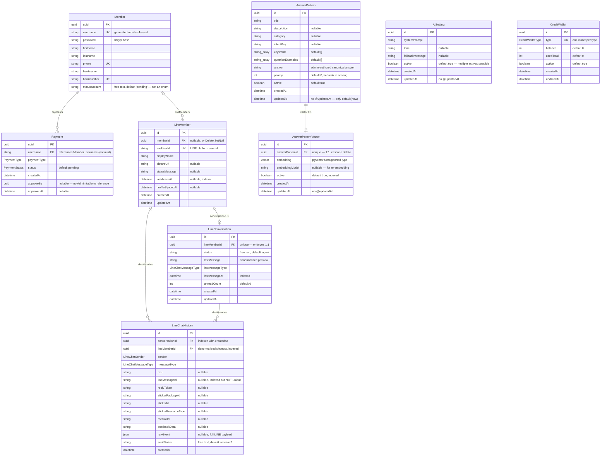

# Database ERD

> Source: `prisma/schema.prisma` (PostgreSQL, Prisma 7). Companion docs: [ai-chatbot-architecture.md](./ai-chatbot-architecture.md) · [service-flow.md](./service-flow.md)

## Entity-Relationship Diagram

## Enums

| Enum | Values | Used by |
|---|---|---|
| `PaymentType` | `QRcode`, `Slip` | `Payment.paymentType` |
| `PaymentStatus` | `pending`, `success`, `fail`, `reject` | `Payment.status` |
| `CreditWalletType` | `LINE_MESSAGE`, `AI_USAGE`, `ADMIN_AI_QUERY` | `CreditWallet.type` |
| `LineChatSender` | `USER`, `ADMIN`, `AI`, `SYSTEM` (db-mapped lowercase) | `LineChatHistory.sender` |
| `LineChatMessageType` | `TEXT`, `IMAGE`, `STICKER`, `POSTBACK` (db-mapped lowercase) | `LineChatHistory.messageType`, `LineConversation.lastMessageType` |

## Relations Summary

| Relation | Cardinality | On delete | Notes |
|---|---|---|---|
| `Member` → `Payment` | 1 : N | default (restrict) | FK is `username`, **not** `uuid` |
| `Member` → `LineMember` | 1 : N (optional) | `SetNull` | LINE profile can exist before linking to a Member |
| `LineMember` → `LineConversation` | 1 : 1 | default | `lineMemberId` unique |
| `LineMember` → `LineChatHistory` | 1 : N | default | denormalized alongside `conversationId` — convenient, consistency not DB-enforced |
| `LineConversation` → `LineChatHistory` | 1 : N | default | composite index `(conversationId, createdAt)` fits pagination |
| `AnswerPattern` → `AnswerPatternVector` | 1 : 1 | `Cascade` | vector is a derived index of the pattern |

## Missing / Suspicious — findings

1. **`AnswerPatternVector` has no migration.** `prisma/migrations/` ends at `20260621001000_add_user_line_chat_sender`; nothing creates the `vector` extension, the table, or any ANN index. Schema and database have drifted — a fresh deploy from migrations will not have this table. Needs a hand-written migration (`CREATE EXTENSION IF NOT EXISTS vector`, table DDL, HNSW/ivfflat index), since Prisma can't generate DDL for `Unsupported("vector")`.
2. **`Payment.approveBy` is a dangling UUID** — there is no Admin/Staff table to reference. Either add one (also needed for dashboard auth) or document what it points to.
3. **`Payment` → `Member` joins on `username`**, a business-visible field, instead of the immutable `uuid` PK. Works because `username` is unique, but renaming a user breaks history semantics. `Payment` also lacks an **amount/currency** and any slip reference — unusual for a payment record.
4. **Free-text status columns**: `Member.statusaccount` (`'pending'`), `LineConversation.status` (`'open'`), `LineChatHistory.sentStatus` (`'received'`) are strings, while `Payment.status` is a proper enum. Inconsistent; typos become silent states. `LineConversation.status` is the natural home for the admin-takeover flag (`open`/`admin`/`closed`) — worth making an enum when that lands.
5. **`LineChatHistory.lineMessageId` is indexed but not unique** — the schema anticipates webhook dedupe, but nothing enforces or checks it. A partial unique index (where not null) would make redelivery idempotent at the DB level.
6. **No session/conversation-state table** — chat sessions live only in process memory (see architecture doc §6); fine once Redis holds them, but worth stating that the DB intentionally does not persist flow state.
7. **Multiple active `AiSetting` rows are possible**; code picks `findFirst(active, orderBy updatedAt desc)`. A partial unique index on `active = true` (or a singleton row convention) would remove the ambiguity.
8. **`updatedAt` without `@updatedAt`** on `AiSetting`, `AnswerPattern`, `AnswerPatternVector` — the column never updates unless set manually, which breaks the "newest active setting wins" ordering above.
9. **Credentials at rest**: `Member.password` is bcrypt-hashed (good), but the register-success chat reply containing the *plaintext* password is persisted into `LineChatHistory.text` (see architecture doc §6, finding 2). A data-model-adjacent leak worth fixing at the application layer.
10. **`CreditWallet` is global** (unique per type, no tenant/member FK) — correct for a single-OA deployment; becomes a remodel if multi-tenant is ever planned.
