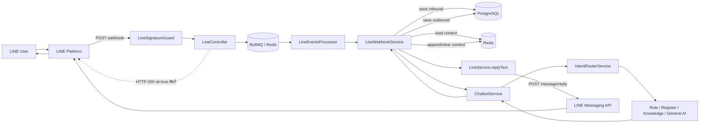
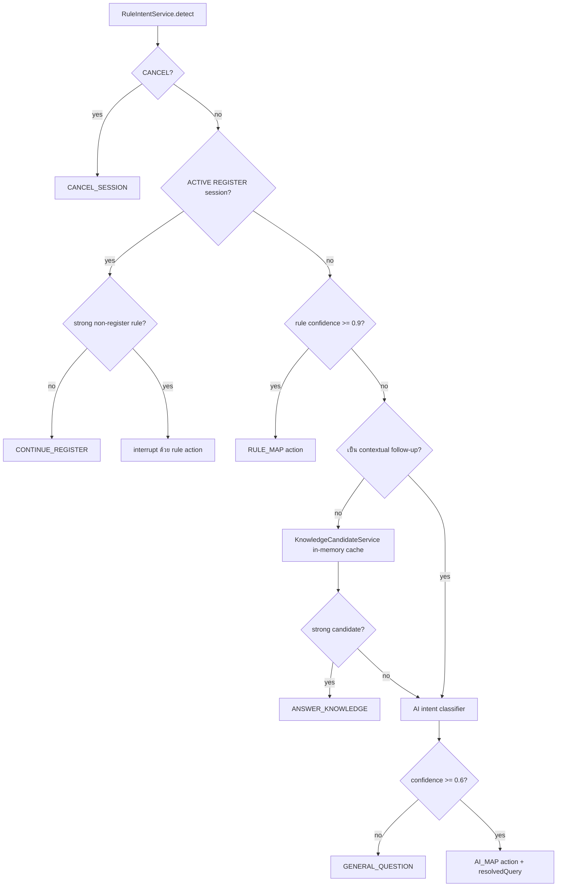

# LINE Message End-to-End Flow (Current Implementation)

> อ้างอิงโค้ดปัจจุบัน ณ 2026-07-15 หลังถอด `ChatProcessingLockService` ออก
>
> แผนภาพสำหรับเปิดใน diagrams.net: [`line-message-e2e.drawio`](./line-message-e2e.drawio)

เอกสารนี้อธิบายเส้นทางของข้อความจาก LINE user ตั้งแต่ HTTP input เข้ามา จนคำตอบออกกลับไปยัง LINE รวมทั้งจุดตรวจสอบ จุด drop จุด retry และข้อมูลที่อ่าน/เขียนใน PostgreSQL/Redis

## 1. ภาพรวมสั้นที่สุด



จุดสำคัญ: response ของ webhook กับข้อความตอบลูกค้าเป็นคนละ output

- HTTP output: `LineController` ตอบ LINE Platform เป็น `200 { "ok": true }` หลัง enqueue
- Chat output: worker ทำงานแบบ async แล้ว `LineService` เรียก LINE Reply API ด้วย `replyToken`

## 2. Input จาก LINE

### 2.1 HTTP request

```http
POST /api/line/webhooks
Content-Type: application/json
X-Line-Signature: <base64 HMAC-SHA256>
```

Body หลัก:

```ts
type LineWebhookBody = {
  destination: string;
  events: LineWebhookEvent[];
};
```

Event ที่ type รองรับใน DTO:

| Event | ข้อมูลสำคัญ | ผลในระบบ |
|---|---|---|
| text message | `userId`, `message.text`, `replyToken` | บันทึก inbound → chatbot → reply |
| image message | `message.id`, `replyToken` | บันทึก `[image]` แต่ไม่เรียก chatbot และไม่ reply |
| sticker message | package/sticker IDs | บันทึก `[sticker]` แต่ไม่เรียก chatbot และไม่ reply |
| postback | `postback.data` | บันทึก postback แต่ไม่เรียก chatbot และไม่ reply |
| follow/unfollow | source/timestamp | ผ่าน queue แต่ `toChatMessage()` คืน `null`; ไม่บันทึก chat และไม่ reply |

## 3. HTTP ingress: ก่อนเข้า queue

### 3.1 Raw body

`main.ts` เปิด `fastify-raw-body` เฉพาะ `/api/line/webhooks` เพราะ signature ต้องคำนวณจาก byte เดิมที่ LINE ส่งมา ไม่ใช่ JSON ที่ parse แล้ว

### 3.2 `LineSignatureGuard`

Input:

- `request.headers['x-line-signature']`
- `request.rawBody`
- `LINE_CHANNEL_SECRET`

การตรวจ:

1. สร้าง HMAC-SHA256 จาก raw body
2. decode signature จาก Base64
3. ตรวจความยาว
4. เทียบด้วย `timingSafeEqual`

Output:

- ผ่าน: `true` → เข้า controller
- ไม่ผ่าน/ไม่มี header/raw body: HTTP `401 Invalid LINE signature`

### 3.3 `LineController.handleWebhook()`

เริ่มจาก filter event:

```ts
Boolean(event.webhookEventId) &&
event.deliveryContext?.isRedelivery !== true
```

ดังนั้น event ต่อไปนี้ถูกตัดทันที:

- ไม่มี `webhookEventId`
- LINE ระบุว่าเป็น redelivery

จากนั้นตรวจ global ingress rate limit ผ่าน Redis:

```text
key    = rl:line:global:ingress
limit  = LINE_GLOBAL_INGRESS_LIMIT_PER_SEC (default 100)
window = 1 second
amount = จำนวน events ใน request
```

ถ้าเกิน limit ระบบจะ drop events ทั้งชุดและยังตอบ `{ok:true}` เพื่อไม่ให้ LINE retry flood เดิม

ถ้า Redis มีปัญหา `RateLimitService` เป็น fail-open: อนุญาต request ต่อและ log error

### 3.4 Enqueue

แต่ละ event ถูกเพิ่มเข้า BullMQ:

```ts
queue.add(
  'process-line-event',
  { event },
  { jobId: event.webhookEventId },
);
```

`jobId = webhookEventId` เป็น dedupe ชั้นแรกของ BullMQ

หลัง enqueue ครบ controller ตอบทันที:

```json
{ "ok": true }
```

controller ไม่รอ Gemini, PostgreSQL หรือ LINE Reply API

## 4. Queue และ worker

Queue ใช้ Redis connection จาก `BullModule.forRootAsync()`

ค่าปัจจุบัน:

| ค่า | ความหมาย |
|---|---|
| `attempts: 3` | ทำได้สูงสุดสามครั้งเมื่อ job throw |
| exponential backoff `2000ms` | retry delay เริ่มราว 2 วินาทีและเพิ่มขึ้น |
| worker `concurrency: 7` | process ทำหลาย jobs พร้อมกันได้สูงสุดเจ็ดงาน |
| worker limiter `12 / sec` | worker รวมประมวลผลสูงสุด 12 jobs ต่อวินาที |
| completed retention | เก็บสูงสุด 1 ชั่วโมง/5,000 jobs |
| failed retention | เก็บ failed job 24 ชั่วโมง |

### 4.1 เรียงข้อความต่อ user ด้วย Map

`LineEventsProcessor` มี:

```ts
Map<string, Promise<void>> userProcessingTails
```

สำหรับ server/process เดียว:

```text
user A message 1 ───────────────►
user A message 2                 รอ message 1
user A message 3                                รอ message 2
user B message X ───────────────► ทำพร้อมกับ user A ได้
```

ถ้างานก่อนหน้า throw, `.catch(() => undefined)` ทำให้งานถัดไปยังเริ่มได้ ส่วน BullMQ เป็นผู้ retry งานที่ throw

ไม่มี distributed lock แล้ว เพราะ deployment นี้รัน server เดียว

### 4.2 `processInOrder()` checkpoints

ลำดับตรวจจริง:

1. **Stale check รอบแรก**
   - `Date.now() - (event.timestamp || job.timestamp)`
   - เกิน `LINE_EVENT_MAX_AGE_MS = 50_000` → log และจบ job โดยไม่ reply
2. **Ban check**
   - Redis key `ban:line:user:<userId>`
   - banned → silent drop
3. **ถ้าเป็น retry**
   - ยังตรวจ ban
   - ข้าม burst/hourly/spam เพื่อไม่คิดโทษซ้ำจาก event เดิม
4. **Per-user burst limit**
   - key `rl:line:user:<userId>:burst`
   - defaults: 10 events / 10 seconds
5. **Per-user hourly limit**
   - key `rl:line:user:<userId>:hour`
   - default: 60 events / hour
6. **Spam check เฉพาะ text**
   - ยาวเกิน `SPAM_MAX_MESSAGE_LENGTH` (default 3000)
   - URL มากกว่า 3 รายการ
   - ข้อความซ้ำถึง `SPAM_SAME_TEXT_LIMIT` (default 5) ภายใน 30 วินาที
7. **DB idempotency claim**
   - insert `ProcessedLineWebhookEvent.webhookEventId` ซึ่งเป็น unique
   - Prisma `P2002` → event เคยถูก claim แล้ว → skip
8. เรียก `LineWebhookService.processEvent(event)`

เมื่อ burst/hourly/spam ไม่ผ่าน ระบบเพิ่ม strike ใน Redis; strike 3/4/5+ ทำ temporary ban ตาม config

## 5. บันทึก inbound message

`LineWebhookService.processEvent()` เรียก `saveIncomingEvent()` ก่อนตรวจว่าเป็น text หรือไม่

### 5.1 หา/สร้าง `LineMember`

```text
find LineMember by lineUserId
├─ เจอ    → ใช้ record เดิม
└─ ไม่เจอ → GET LINE Profile API
             → upsert LineMember
```

LINE Profile API ใช้ timeout `LINE_HTTP_TIMEOUT_MS` default 8 วินาที

### 5.2 PostgreSQL transaction

ภายใน transaction เดียว:

1. upsert `LineConversation` ด้วย unique `lineMemberId`
   - update `lastMessage`, type, timestamp
   - increment `unreadCount`
2. insert `LineChatHistory`
   - `sender = USER`
   - เก็บ text/media metadata/replyToken/rawEvent
   - `sentStatus = received`
3. update `LineMember.lastActiveAt`

Output:

```ts
{
  conversationId: string;
  lineMemberId: string;
}
```

ถ้า event ไม่มี user หรือไม่สามารถแปลงเป็น chat message ได้ จะคืน `null`

## 6. เงื่อนไขเข้า chatbot

หลังบันทึก inbound แล้ว ต้องผ่านครบสามเงื่อนไข:

```ts
event.type === 'message'
event.message.type === 'text'
Boolean(event.source.userId)
```

ไม่ผ่านข้อใดข้อหนึ่ง `processEvent()` จบทันที

## 7. โหลด conversation context

ถ้ามี `conversationId`, `LoadContextService.load()` อ่าน Redis:

```text
key = chat:context:<conversationId>
LRANGE -3 -1
```

แต่ละ Redis item คือหนึ่ง complete turn:

```ts
{
  version: 1;
  eventId: string;
  createdAt: number;
  userText: string;
  assistantText: string;
  assistantSource: ChatResponseSource;
}
```

แปลงเป็นสูงสุดหก `ChatContextMessage` ตามลำดับเวลา:

```text
user → assistant → user → assistant → user → assistant
```

ถ้า Redis อ่านไม่ได้หรือ JSON เสีย จะ log และคืน `[]`; context failure ไม่ทำให้ข้อความ LINE ล้ม

## 8. `ChatbotService` input/output contract

Input:

```ts
type ChatRequest = {
  userId: string;
  text: string;
  recentMessages?: ChatContextMessage[];
};
```

Output:

```ts
type ChatResponse = {
  text: string;
  source: 'SYSTEM' | 'RULE' | 'KNOWLEDGE' | 'AI' | 'REGISTRATION';
  contextPolicy: 'INCLUDE' | 'EXCLUDE' | 'CLEAR';
};
```

ก่อน routing:

| Check | Output |
|---|---|
| `text.trim()` ว่าง | default menu, `SYSTEM`, `CLEAR` |
| ยาวเกิน `AI_MAX_MESSAGE_LENGTH` default 1000 | message-too-long template, `SYSTEM`, `EXCLUDE` |
| ปกติ | โหลด session แล้วเข้า `IntentRouterService` |

## 9. Session กับ context เป็นคนละอย่าง

| ชนิด | Redis key | ใช้ทำอะไร | TTL |
|---|---|---|---|
| session | `chat:session:<userId>` | state machine เช่นกำลังกรอกสมัคร | default 30 นาที; read แล้วต่อ TTL |
| context | `chat:context:<conversationId>` | ประวัติ Q/A สำหรับ AI เข้าใจคำถามต่อเนื่อง | 30 นาที; ต่อ TTL เมื่อ append turn ที่ส่งสำเร็จ |

`UserSessionService.get()` ใช้ Redis `GETEX`; ถ้า JSON shape ผิดหรือ userId ไม่ตรง จะลบ session ทิ้ง

## 10. Intent routing ตาม priority จริง

`IntentRouterService.resolve()` ทำตามลำดับนี้:



### 10.1 Deterministic rules

| Input | Intent | Action |
|---|---|---|
| `ยกเลิก`, `cancel`, `ออก` | CANCEL | CANCEL_SESSION |
| `1` | REGISTER | START_REGISTER |
| `2` | GENERAL_QUESTION | GENERAL_QUESTION |
| `สมัคร`, `สมัครสมาชิก`, `register` | REGISTER | START_REGISTER |
| ข้อความมี `สมัครยังไง`/`วิธีสมัคร`/`เปิดยูสยังไง` | REGISTER_HOW_TO | ANSWER_KNOWLEDGE |
| ข้อความมี `ติดต่อแอดมิน`/`คุยกับเจ้าหน้าที่`/`แจ้งปัญหา` | CONTACT_ADMIN | CONTACT_ADMIN |
| อื่น ๆ | UNKNOWN confidence 0.4 | ไป cache/classifier ต่อ |

ข้อสังเกตตามโค้ดปัจจุบัน:

- default menu แสดงตัวเลือก `3` แต่ rule ไม่มี input `3`; จึงไหลไป classifier
- action `START_AI_CHAT` และ `CONTINUE_AI_CHAT` มีใน type/switch แต่ router ปัจจุบันไม่คืนสอง action นี้
- input `2` ถูกส่งเป็นคำถาม general AI โดยตรง ไม่ได้ตอบ template “ต้องการถามอะไร”

### 10.2 Contextual follow-up

ถ้ามี context และข้อความขึ้นต้น/มีคำอย่าง `แล้ว`, `อันนี้`, `อันนั้น`, `ตัวนี้`, `เมื่อกี้`, `it`, `this`, `that` ระบบจะข้าม raw knowledge cache และให้ classifier rewrite เป็น `standaloneQuery`

ตัวอย่าง:

```text
history:  "แพ็กเกจ Pro ราคาเท่าไร" → "500 บาทครับ"
input:    "แล้วรายเดือนล่ะ"
rewrite:  "แพ็กเกจ Pro แบบรายเดือนราคาเท่าไร"
```

`standaloneQuery`/`resolvedQuery` ใช้ค้น knowledge ส่วนข้อความเดิมใช้สร้างคำตอบ

## 11. Action execution

| Action | Service ที่เรียก | Side effects | ChatResponse |
|---|---|---|---|
| CANCEL_SESSION | `UserSessionService.clear` + template | ลบ session | RULE / CLEAR |
| START_REGISTER | `RegistrationFlowService.start` | สร้าง REGISTER session | REGISTRATION / CLEAR |
| CONTINUE_REGISTER | `RegistrationFlowService.handle` | parse/validate/update session; อาจสร้าง Member | REGISTRATION / CLEAR |
| GENERAL_QUESTION | `AiChatService.answerGeneral` | AiSetting read + Gemini call | AI / INCLUDE ถ้าสำเร็จ, EXCLUDE ถ้า fallback |
| ANSWER_KNOWLEDGE | `AiChatService.answerKnowledge` | DB search; อาจ Gemini/embedding | KNOWLEDGE / INCLUDE ถ้าสำเร็จ, EXCLUDE ถ้า fallback |
| CONTACT_ADMIN | session + `NotificationService` | Redis session และ socket `CONTACT_ADMIN` | RULE / CLEAR |
| START_AI_CHAT | session + template | branch มีอยู่แต่ปัจจุบัน unreachable | RULE / CLEAR |
| CONTINUE_AI_CHAT | general AI | branch มีอยู่แต่ปัจจุบัน unreachable | AI |
| default | template | ไม่มี | SYSTEM / CLEAR |

Registration มี PII จึงตอบด้วย `contextPolicy=CLEAR` เสมอ ไม่เอา form/credentials เข้า AI context

## 12. General AI path

```text
AiChatService.answerGeneral
→ load active AiSetting จาก PostgreSQL
→ สร้าง systemInstruction (prompt + tone + safety rules)
→ toGeminiContents(recentMessages, current input)
→ AiBudgetService.tryConsume(userId)
→ Gemini generateContent
→ {text, isFallback}
```

`toGeminiContents()`:

- เลือก context ใหม่สุดไม่เกิน 6 messages
- รวมไม่เกิน 6,000 characters
- map `assistant` เป็น Gemini role `model`
- ไม่ยอมให้ history เริ่มด้วย assistant ที่ไม่มี user คู่ก่อนหน้า
- append current input เพียงครั้งเดียว

Gemini answer timeout default 12 วินาที; error/empty/budget exceeded คืน fallback และ `isFallback=true`

## 13. Knowledge path

```mermaid
flowchart TD
    Q[original message + retrievalQuery] --> S[load AiSetting]
    S --> D[AnswerPatternService.findMatches retrievalQuery]
    D --> H{พบ matches?}
    H -- yes --> V{top score >= 5 และ gap >= 2?}
    V -- yes --> A[คืน admin answer verbatim ไม่เรียก Gemini]
    V -- no --> G[Gemini grounded ด้วย matches + history]
    H -- no --> E[EmbeddingService.embed retrievalQuery]
    E --> STUB[SemanticSearchService ปัจจุบันคืน []]
    STUB --> F[fallbackMessage]
    G --> R{Gemini สำเร็จและมี text?}
    R -- yes --> OK[answer isFallback=false]
    R -- no --> F
```

### 13.1 Routing cache vs answer DB search

- `KnowledgeCandidateService`: cache ใน RAM, ใช้เฉพาะตัดสินว่า “น่าจะเป็น knowledge question ไหม”; ไม่สร้างคำตอบ
- `AnswerPatternService`: query active patterns จาก PostgreSQL สูงสุด 500 rows, ให้คะแนนจริง และคืน top 5

### 13.2 Direct answer

ถ้า top pattern:

- source เป็น `ANSWER_PATTERN`
- score อย่างน้อย 5
- นำอันดับสองอย่างน้อย 2 คะแนน

ระบบคืน `pattern.answer` ตามที่ admin เขียนโดยไม่เสีย Gemini generation call

### 13.3 Grounded answer

ถ้ามีหลาย pattern หรือ match ไม่ขาด ระบบส่ง pattern เป็น system instruction และบังคับ Gemini ตอบจากข้อมูลนั้นเท่านั้น

### 13.4 Vector fallback ปัจจุบัน

`EmbeddingService` เรียก Gemini embedding ด้วย `RETRIEVAL_QUERY` และ timeout 8 วินาที แต่ `SemanticSearchService.search()` ยังเป็น stub:

```ts
const vector = await embeddingService.embed(input);
return [];
```

ดังนั้น knowledge miss ตอนนี้เสีย embedding call แล้วจบที่ fallback; `AnswerPatternVector` ยังไม่ถูก query ในเส้นทางนี้

## 14. AI budget

ทุก external AI call ผ่าน `AiBudgetService`:

```text
global key = rl:ai:global            default 30 / second
user key   = rl:ai:user:<userId>     default 60 / hour
```

หนึ่งข้อความอาจใช้หลาย AI calls:

- classifier 1 call
- answer generation 1 call
- knowledge miss อาจมี embedding 1 call

ถ้า budget ไม่ผ่าน caller ใช้ safe fallback แทน

## 15. ก่อนส่ง output กลับ LINE

`LineWebhookService` ได้ `ChatResponse` แล้วตรวจ stale รอบสอง:

```ts
Date.now() - event.timestamp > 50_000
```

เหตุผลคือ event อาจยังใหม่ตอนเข้า worker แต่หมดอายุหลังรอ DB/Gemini ถ้าเกินจะไม่ใช้ reply token

จากนั้น `LineService.replyText()`:

1. global reply rate limit
   - key `rl:line:global:reply`
   - default 30 / second
2. ถ้าเกิน → คืน `false`; silent drop และไม่ retry
3. ถ้าผ่าน → POST `https://api.line.me/v2/bot/message/reply`
4. body:

```json
{
  "replyToken": "...",
  "messages": [{ "type": "text", "text": "ChatResponse.text" }]
}
```

5. timeout default 8 วินาที
6. non-2xx/timeout → throw เพื่อให้ BullMQ retry
7. 2xx → คืน `true`

## 16. หลัง LINE รับ reply สำเร็จ

### 16.1 บันทึก outbound history

`saveSystemReplyMessage()` ทำ PostgreSQL transaction:

- insert `LineChatHistory`
  - `sender=SYSTEM`
  - `messageType=TEXT`
  - `sentStatus=sent`
  - `rawEvent.source=line_webhook_auto_reply`
- update `LineConversation.lastMessage*`

ถ้าบันทึก outbound ล้ม ระบบ catch และ log แต่ไม่ throw เพราะ LINE ได้ข้อความไปแล้ว; retry จะเสี่ยงตอบซ้ำ

### 16.2 Context policy

ทำหลัง LINE reply สำเร็จเท่านั้น:

| Policy | Redis operation | ความหมาย |
|---|---|---|
| INCLUDE | `RPUSH`, `LTRIM -3 -1`, `EXPIRE 1800` | จำ user+assistant turn ล่าสุด |
| EXCLUDE | ไม่มี | ไม่จำรอบนี้ แต่ context เดิมยังอยู่ |
| CLEAR | `DEL chat:context:<conversationId>` | ล้างความจำ AI ของ conversation |

ก่อนเก็บ INCLUDE:

- redact password/passcode
- redact เลขบัญชีที่มี label
- redactเบอร์โทรไทย
- ตัดแต่ละข้อความไม่เกิน 4,000 characters

context append/clear error จะ log และคืน false ไม่ทำให้ job retry เพราะ reply ถูกส่งแล้ว

## 17. Retry และ idempotency matrix

| จุดที่เกิดเหตุ | สิ่งที่ระบบทำ | Retry? | ข้อมูลที่อาจเขียนแล้ว |
|---|---|---|---|
| signature ไม่ผ่าน | HTTP 401 | LINE อาจ retry ตาม platform | ไม่มี |
| enqueue Redis/BullMQ ล้ม | request throw ก่อน `{ok:true}` | LINE อาจส่ง webhook ใหม่ | อาจมีบาง event ใน batch enqueue สำเร็จแล้ว |
| controller ingress limit เกิน | ตอบ `{ok:true}` และ drop | ไม่ | rate counter |
| stale ก่อน process | complete job แบบไม่ reply | ไม่ | ไม่มี claim/inbound |
| banned/rate/spam | silent drop; rate/spam อาจ add strike | ไม่ | Redis counters/strike |
| duplicate DB claim | skip | ไม่ | claim เดิมมีอยู่ |
| profile/DB/chatbot/LINE HTTP throw ก่อน reply สำเร็จ | release DB claim แล้ว throw | BullMQ retry สูงสุด 3 | inbound history อาจถูกเขียนแล้ว |
| global reply limit เกิน | `replyText=false`; จบ job | ไม่ | inbound + claim |
| stale หลัง chatbot | จบ job ไม่ reply | ไม่ | inbound + claim; AI cost อาจเกิดแล้ว |
| LINE reply สำเร็จ แต่ save outbound fail | log เท่านั้น | ไม่ | ลูกค้าได้รับ reply แล้ว |
| context append/clear fail | log เท่านั้น | ไม่ | ลูกค้าได้รับ reply + outbound อาจบันทึกแล้ว |

ข้อควรระวัง: ถ้า error เกิดหลัง inbound transaction แต่ก่อน LINE reply, processor release claim แล้ว retry; schema ยังไม่มี unique constraint บน `LineChatHistory.lineMessageId` จึงมีโอกาสสร้าง inbound history ซ้ำและ increment unread ซ้ำ

## 18. Data stores และ keys ที่เกี่ยวข้อง

### PostgreSQL

| Table | Read/Write ใน flow |
|---|---|
| `ProcessedLineWebhookEvent` | claim/release idempotency |
| `LineMember` | lookup/create LINE profile, update active time |
| `LineConversation` | upsert conversation, preview, unread count |
| `LineChatHistory` | inbound USER และ outbound SYSTEM |
| `AiSetting` | prompt/tone/fallback |
| `AnswerPattern` | route cache refresh และ knowledge matching |
| `AnswerPatternVector` | มี schema แต่ current semantic path ยังไม่ query |
| `Member` | registration uniqueness/create account |

### Redis

| Key/prefix | เจ้าของ | Purpose |
|---|---|---|
| BullMQ keys | BullMQ | queue/job/retry |
| `rl:line:global:ingress` | controller | ingress rate |
| `rl:line:global:reply` | LineService | reply rate |
| `rl:line:user:*` | processor | burst/hourly |
| `rl:ai:*` | AiBudgetService | Gemini budget |
| `ban:line:user:*` | BanService | ban state |
| `strikes:line:user:*` | BanService | strike count |
| `spam:line:user:*` | SpamDetectorService | repeated-text state |
| `chat:session:*` | UserSessionService | active flow state |
| `chat:context:*` | LoadContextService | last three delivered Q/A turns |

## 19. PostgreSQL ERD เฉพาะ LINE/AI flow

```mermaid
erDiagram
    Member ||--o{ LineMember : linked_accounts
    LineMember ||--o| LineConversation : owns
    LineMember ||--o{ LineChatHistory : sends
    LineConversation ||--o{ LineChatHistory : contains
    AnswerPattern ||--o| AnswerPatternVector : has_vector

    LineMember {
      uuid id PK
      uuid memberId FK
      string lineUserId UK
      string displayName
      datetime lastActiveAt
    }
    LineConversation {
      uuid id PK
      uuid lineMemberId FK_UK
      string status
      string lastMessage
      int unreadCount
    }
    LineChatHistory {
      uuid id PK
      uuid conversationId FK
      uuid lineMemberId FK
      enum sender
      enum messageType
      string text
      string lineMessageId
      string replyToken
      json rawEvent
      string sentStatus
    }
    ProcessedLineWebhookEvent {
      uuid id PK
      string webhookEventId UK
      datetime processedAt
    }
    AiSetting {
      uuid id PK
      string systemPrompt
      string tone
      string fallbackMessage
      boolean active
    }
    AnswerPattern {
      uuid id PK
      string title
      string_array keywords
      string_array questionExamples
      string answer
      int priority
      boolean active
    }
    AnswerPatternVector {
      uuid id PK
      uuid answerPatternId FK_UK
      vector embedding
      string embeddingModel
    }
```

`ProcessedLineWebhookEvent` และ `AiSetting` เป็น standalone tables ใน flow จึงไม่มี relation line ใน Prisma schema

## 20. Debug checkpoints: จะดู input/output ตรงไหน

| ต้องการดู | ตั้ง breakpoint/log ที่ | Input | Output |
|---|---|---|---|
| payload ที่ LINE ส่ง | `LineController.handleWebhook()` | `body.events` | filtered events |
| signature | `LineSignatureGuard.canActivate()` | rawBody/header | true หรือ 401 |
| queue payload | `lineEventsQueue.add()` | `{event}` | BullMQ job |
| job จริง | `LineEventsProcessor.process()` | `job.data.event` | promise chain ต่อ user |
| drop/retry checks | `processInOrder()` | event/job.attemptsMade | allowed/skip/throw |
| inbound DB mapping | `saveIncomingEvent()` / `toChatMessage()` | LINE event | IDs หรือ null |
| context ก่อนตอบ | `LoadContextService.load()` | conversationId | `ChatContextMessage[]` |
| chatbot contract | `ChatbotService.handleTextMessage()` | `ChatRequest` | `ChatResponse` |
| routing | `IntentRouterService.resolve()` | session/input/context | `RouteDecision` |
| classifier | `AiIntentClassifierService.analyze()` | latest input/history | intent/confidence/standaloneQuery |
| knowledge matches | `AnswerPatternService.findMatches()` | retrievalQuery | scored `KnowledgeItem[]` |
| final AI | `AiChatService.generateText()` | contents/system instruction | text/isFallback |
| LINE HTTP output | `LineService.replyText()` | replyToken/text | true/false/throw |
| outbound DB | `saveSystemReplyMessage()` | IDs/text | created history row |
| context หลังตอบ | `appendTurn()` / `clear()` | ChatResponse policy | Redis success boolean |

## 21. ตัวอย่าง complete trace

User เคยถาม “แพ็กเกจ Pro ราคาเท่าไร” แล้วถามต่อ “แล้วรายเดือนล่ะ”:

```text
1. LINE Platform POST webhook พร้อม signature
2. guard verify ผ่าน
3. controller filter + global ingress ผ่าน
4. enqueue jobId=webhookEventId และตอบ HTTP 200 {ok:true}
5. worker ต่อท้าย promise ของ user นี้
6. stale/ban/burst/hourly/spam ผ่าน
7. insert ProcessedLineWebhookEvent สำเร็จ
8. save inbound USER history และ update conversation
9. load Redis context ได้ Q/A รอบก่อน
10. ChatbotService โหลด session
11. rule ไม่ match; FAQ cache match ไม่ถูกเชื่อ (มี context ค้างอยู่และ match ไม่ใช่แบบ exact)
12. classifier รับ history + latest message
13. classifier คืน ANSWER_KNOWLEDGE, confidence 0.95,
    standaloneQuery="แพ็กเกจ Pro แบบรายเดือนราคาเท่าไร"
14. AnswerPatternService ค้นด้วย standaloneQuery
15a. ถ้า match ชัด → คืน stored answer โดยตรง
15b. ถ้าหลาย match → Gemini grounded answer
15c. ถ้าไม่ match → embedding แล้ว fallback เพราะ semantic search ยัง stub
16. ChatbotService คืน {text, source=KNOWLEDGE, contextPolicy}
17. stale รอบสองผ่าน
18. global reply limiter ผ่าน
19. POST LINE Reply API
20. LINE ส่งข้อความให้ user
21. save SYSTEM history
22. ถ้า policy INCLUDE → redact และ append complete turn ใน Redis
23. Map ปลด tail เมื่อไม่มีงาน user นี้รอต่อ
```

## 22. ไฟล์หลักตามลำดับการไหล

1. `src/main.ts`
2. `src/modules/line/line-signature.guard.ts`
3. `src/modules/line/line.controller.ts`
4. `src/modules/line/line-events.queue.ts`
5. `src/modules/line/line-events.processor.ts`
6. `src/modules/line/line-webhook.service.ts`
7. `src/modules/chatbot/context/load-context.service.ts`
8. `src/modules/chatbot/chatbot.service.ts`
9. `src/modules/chatbot/intent-router.service.ts`
10. `src/modules/chatbot/rule-intent.service.ts`
11. `src/modules/chatbot/ai-intent-classifier.service.ts`
12. `src/modules/chatbot/aichat.service.ts`
13. `src/modules/chatbot/knowledge/answer-pattern.service.ts`
14. `src/modules/chatbot/knowledge/embedding.service.ts`
15. `src/modules/chatbot/knowledge/semantic-search.service.ts`
16. `src/modules/line/line-reply.service.ts`
