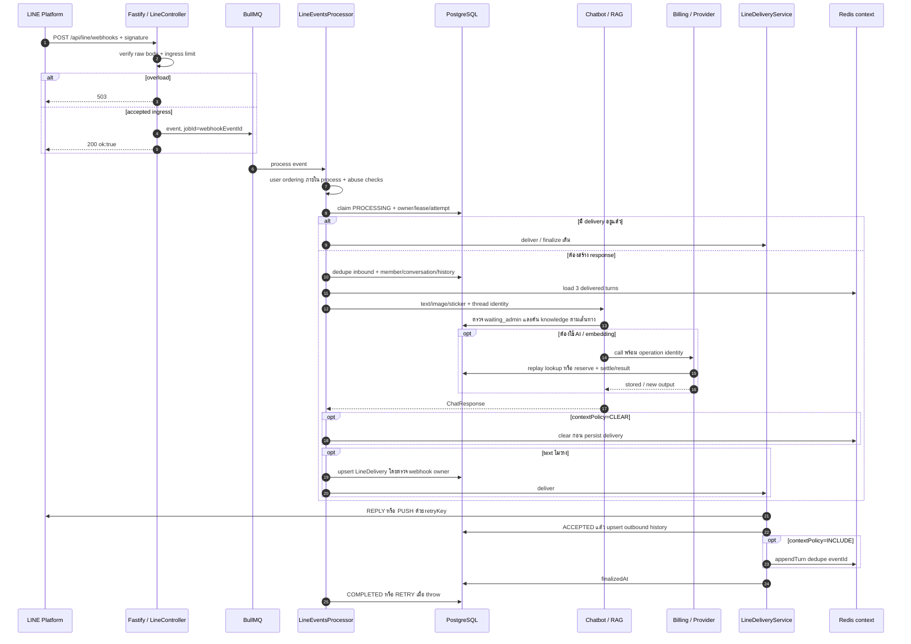
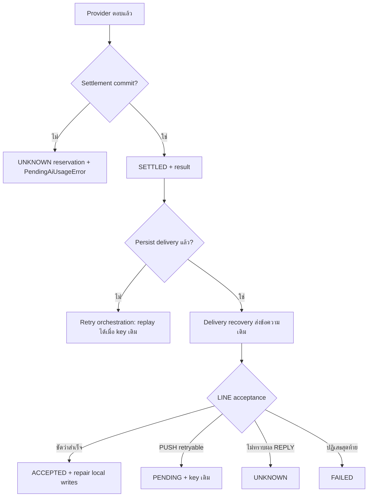

# LINE Message End-to-End — implementation ปัจจุบัน

อัปเดต **8 กันยายน 2026** จาก working tree หลังเพิ่ม durable webhook/delivery, credit reservations และ settled result replay ไฟล์นี้แทน snapshot เดิมเดือนสิงหาคม

อ่าน flow รวม auth/admin/indexing/top-up ที่ [End-to-end ทั้งระบบ](mvp-line-rag-billing-flow.md) และ dependency map ที่ [Service flow](service-flow.md) ไฟล์ architecture.html / line-message-e2e.drawio เป็นภาพประกอบเก่าที่ยังไม่ได้ปรับในงาน Markdown นี้

## 1. Request → response sequence


```mermaid
sequenceDiagram
    autonumber
    participant L as LINE Platform
    participant H as Fastify / LineController
    participant Q as BullMQ
    participant W as LineEventsProcessor
    participant DB as PostgreSQL
    participant B as Chatbot / RAG
    participant C as Billing / Provider
    participant D as LineDeliveryService
    participant R as Redis context

    L->>H: POST /api/line/webhooks + signature
    H->>H: verify raw body + ingress limit
    alt overload
        H-->>L: 503
    else accepted ingress
        H->>Q: event, jobId=webhookEventId
        H-->>L: 200 ok:true
    end
    Q->>W: process event
    W->>W: user ordering ภายใน process + abuse checks
    W->>DB: claim PROCESSING + owner/lease/attempt
    alt มี delivery อยู่แล้ว
        W->>D: deliver / finalize เดิม
    else ต้องสร้าง response
        W->>DB: dedupe inbound + member/conversation/history
        W->>R: load 3 delivered turns
        W->>B: text/image/sticker + thread identity
        B->>DB: ตรวจ waiting_admin และค้น knowledge ตามเส้นทาง
        opt ต้องใช้ AI / embedding
            B->>C: call พร้อม operation identity
            C->>DB: replay lookup หรือ reserve + settle/result
            C-->>B: stored / new output
        end
        B-->>W: ChatResponse
        opt contextPolicy=CLEAR
            W->>R: clear ก่อน persist delivery
        end
        opt text ไม่ว่าง
            W->>DB: upsert LineDelivery โดยตรวจ webhook owner
            W->>D: deliver
        end
    end
    D->>L: REPLY หรือ PUSH ด้วย retryKey
    D->>DB: ACCEPTED แล้ว upsert outbound history
    opt contextPolicy=INCLUDE
        D->>R: appendTurn dedupe eventId
    end
    D->>DB: finalizedAt
    W->>DB: COMPLETED หรือ RETRY เมื่อ throw
```

Delivery error ส่วนใหญ่ถูกจัดเป็นสถานะใน delivery service แทน throw กลับ worker ดังนั้น webhook COMPLETED ยังมี delivery PENDING/FAILED/UNKNOWN ได้ Recovery timer ทำงานแยกจาก webhook queue

## 2. Data shapes ที่เชื่อมแต่ละขั้น

| ข้อมูล | Fields สำคัญ | ผู้สร้าง → ผู้ใช้ |
| --- | --- | --- |
| LINE event | webhookEventId, timestamp, source.userId, replyToken, message.id/type/text | LINE → controller/worker |
| processedLineWebhookEvent | event JSON, status, leaseOwner/leaseUntil, attempts, lastError | claim/recovery → worker |
| SavedIncomingEvent | conversationId, lineMemberId | inbound persistence → chatbot/billing |
| LineAiUsageContext | userId, lineMemberId, conversationId, turnId | orchestration → embedding/provider/billing |
| ChatContextMessage | role, text, source, createdAt | Redis load → router/planner/answer |
| KnowledgeRetrievalResult | route, matchType, items, selectedItems, topScores, scoreGap, attempts, diagnosis, fallbackReason | retrieval → router/answer |
| AiGenerateResponse | text, provider, model, usage, providerRequestId? | provider/billing replay → caller |
| EmbeddingResult | values, model, usage, usageEstimated? | embedding adapter/replay → vector query/write |
| ChatResponse | text, source, contextPolicy | chatbot → durable delivery |
| CreditHold | id, companyId, walletId, budgetId, amountCredit | reserve → settlement |
| CreditReservation.result | kind, value | settlement transaction → replay |
| LineDelivery | key, text, IDs, replyUntil, method, retryKey, status, lease, context, acceptedAt, finalizedAt | webhook/manual API → delivery recovery |
| LineChatHistory | lineMessageId สำหรับ inbound; deliveryId สำหรับ outbound; sender/sentByAdminId/text/sentStatus | inbound/delivery finalization → admin history API |

Token usage มี inputTokens, cachedInputTokens, cacheWriteTokens, outputTokens; AiUsageEvent เก็บ counters เหล่านี้กับ pricingId/costThb/chargedCredit และ actor/thread แต่ยังไม่มี first-class stage/turn linkage ครบทุก call

## 3. Identity และ duplicate protection

```text
LINE event
  webhookEventId ── jobId / processedLineWebhookEvent primary identity
                 └─ LineDelivery.key
                 └─ billing context.turnId
  message.id ─────── LineChatHistory.lineMessageId (unique)

AI generation
  usage:turnId:fingerprint ── CreditReservation.operationKey
                           └─ CreditLedger.idempotencyKey
Embedding
  usage:embed:turnId:hash(task,text) ── reservation / ledger

Outbound
  LineDelivery.id ── LineChatHistory.deliveryId (unique)
  LineDelivery.retryKey ── LINE PUSH retry header
```

AiUsageEvent.id คือหนึ่ง billed call ไม่ใช่หนึ่ง LINE message ลูกค้าอาจได้รับหนึ่งคำตอบที่เสียหลาย calls หรือ exact/template ที่ไม่เสีย AI เลย

Generation hash รวม provider/model/request/context ที่ส่งจริง จึงอาจเปลี่ยนเมื่อ retry โหลด history/settings ใหม่ ไม่ใช่ immutable whole-turn plan ส่วน embedding key ไม่รวม model ไม่ควรเปลี่ยน embedding configuration กลางการกู้ turn แล้วคาดว่า replay เป็น vector ของ model ใหม่

## 4. Routing และ output policies

| เงื่อนไข | ผล |
| --- | --- |
| Human-controlled session | ส่ง text ว่าง; inbound ถูกเก็บแต่ไม่สร้าง auto delivery |
| CANCEL ที่รองรับ | clear session, waiting_admin → open, ตอบ template และ CLEAR context |
| Registration ปิด | คืน unavailable; active registration ถูก clear เมื่อพยายามต่อ |
| Exact conflict | handoff ไม่เลือกคำตอบขัดกันแบบสุ่ม |
| Unique exact / score≥0.95 และ clear winner | DIRECT stored answer |
| Context score≥0.6 | RAG generation สูงสุด 3 contexts |
| Low confidence | BUSINESS/GENERAL classifier |
| RAG ตอบ INSUFFICIENT_CONTEXT | กลับ classifier |
| Business / fallback ที่ต้อง staff | requiAdmin + waiting_admin + notification |
| Image | โหลด LINE media; billed analysis ตาม image policy; unsafe/invalid → fallback |
| Sticker | semantic intent/template ที่รองรับ; ไม่บังคับ embedding ทุก sticker |
| External image | ข้อความไม่รองรับ; ไม่ส่งภาพนี้ไป AI |

Chatbot ตรวจ human control ใน text/image/sticker แล้ว แต่ LINE image download เกิดใน webhook service ก่อนเข้า chatbot gate จึงอย่าใช้ “หยุด AI” แปลว่าไม่มี HTTP media call เลย

contextPolicy:
- INCLUDE: append หลัง acceptance เก็บ user+assistant เป็นหนึ่ง turn
- EXCLUDE: ส่งคำตอบได้แต่ไม่เพิ่ม AI context
- CLEAR: clear ตอนสร้าง response ก่อน persist delivery ไม่ clear ซ้ำจาก delayed repair

Redis key chat:context:conversationId เก็บ 3 turns, TTL 30 นาที, redaction password/account/phone และตัดข้อความสูงสุด 4,000 ตัวอักษร การอ่านไม่ต่อ TTL โหลดล้มคืน []; append ล้มคืน false โดยไม่ throw

## 5. Retry และ recovery ตาม state จริง

| Layer | กลไก | ผลต่อ AI/credit |
| --- | --- | --- |
| Ingress | 503 เมื่อเกิน limit; enqueue ด้วย event ID | ยังไม่มี provider call |
| Main queue | attempts=1, concurrency=10 | retryable error ที่หลุดย้าย retry queue |
| Retry queue | attempts=3, exponential 2s, concurrency=3 | DB claim และ billing identity ยังบังคับ |
| Webhook recovery | scan 15s, lease120s, heartbeat30s, claimสูงสุด5 | มี delivery แล้ว resume ส่ง ไม่ generate |
| Generation provider | default2 attempts, delay300ms, retry budget20s | hold เดียวและ final billed outcome เดียว |
| Billing transaction | P2034 สูงสุด3 attempts | retry SQL ไม่เรียก AI |
| Reservation HELD/UNKNOWN | ไม่ให้ reserve key เดิมอีก | PendingAiUsageError; ต้องรอ/ตรวจ |
| SETTLED มี result | คืน stored value | ไม่มี debit/provider ใหม่ใน billing |
| SETTLED ไม่มี result | block reserve | ไม่ reconstruct output จาก ledger |
| Delivery recovery | scan5s, lease120s | ส่งข้อความเดิม ไม่เรียก AI |
| PUSH | retry keyเดิม, retryable attempts<8, delayสูงสุด60s | ไม่เพิ่ม AI bill |
| REPLY unknown/stale SENDING | UNKNOWN ไม่ push เดาสุ่ม | acceptance ต้องตรวจ |
| ACCEPTED local-write fail | repair history/context | ไม่ resend LINE |

อายุ event >50s ใช้ PUSH; ไม่ใช่ worker drop เงื่อนไขนี้ comment เก่าใน queue constant ไม่ตรงกับการใช้งานปัจจุบัน

## 6. Failure boundaries


```mermaid
flowchart TD
    A["Provider ตอบแล้ว"] --> B{"Settlement commit?"}
    B -->|ไม่| U["UNKNOWN reservation + PendingAiUsageError"]
    B -->|ใช่| S["SETTLED + result"]
    S --> C{"Persist delivery แล้ว?"}
    C -->|ไม่| RE["Retry orchestration: replay ได้เมื่อ key เดิม"]
    C -->|ใช่| D["Delivery recovery ส่งข้อความเดิม"]
    D --> E{"LINE acceptance"}
    E -->|ชัดว่าสำเร็จ| F["ACCEPTED + repair local writes"]
    E -->|PUSH retryable| P["PENDING + key เดิม"]
    E -->|ไม่ทราบผล REPLY| N["UNKNOWN"]
    E -->|ปฏิเสธสุดท้าย| X["FAILED"]
```

ช่องว่างยังมี: provider success ก่อน settlement commit ไม่มี durable recovery payload ครบ, expired reservation ไม่มี auto refund, notification สร้างล้มไม่มี outbox retry, finalize ไม่ตรวจ appendTurn=false, และ ordering ต่อ user ยังอยู่ภายใน process เท่านั้น

## 7. Handoff → admin reply → resume

Customer ขอ staff หรือ business fallback → session ADMIN/requiAdmin + DB waiting_admin → create adminNotifications → emit socket /admin → frontend เปิด conversation จาก metadata.conversationId

Admin ส่งข้อความด้วย clientRequestId → durable PUSH → accepted ADMIN history หรือ pending delivery response บอตหยุดระหว่าง waiting_admin จากนั้น POST /api/line/conversations/:conversationId/resume-bot clear session และ context เพื่อให้บอตตอบต่อ

Notification read state กับ conversation unread/history เป็นคนละข้อมูล อย่าถือว่า mark notification read คือ delivery accepted หรือ customer read receipt

## 8. หลักฐานและ source

[System E2E](mvp-system-e2e-results-2026-09-07.md): 42/42, PostgreSQL/Redis/BullMQ/Mongo จริง แต่ provider/LINE fixtures ไม่มี live message; unit98/98, audit16/16, build/typecheck ผ่าน ไม่ได้ kill/restart worker จริงเพื่อพิสูจน์ทุก crash window

Source ที่ใช้:
- [LineWebhookService](../src/modules/line/line-webhook.service.ts)
- [LineEventsProcessor](../src/modules/line/line-events.processor.ts)
- [LineDeliveryService](../src/modules/line/line-delivery.service.ts)
- [ChatbotService](../src/modules/chatbot/chatbot.service.ts)
- [UserSessionService](../src/modules/chatbot/user-session.service.ts)
- [LoadContextService](../src/modules/chatbot/context/load-context.service.ts)
- [Schemas](../prisma/schema.prisma)
