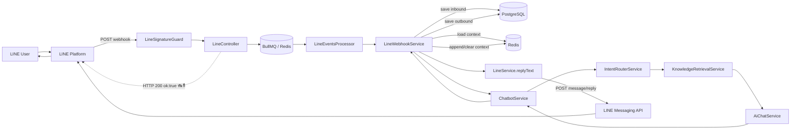
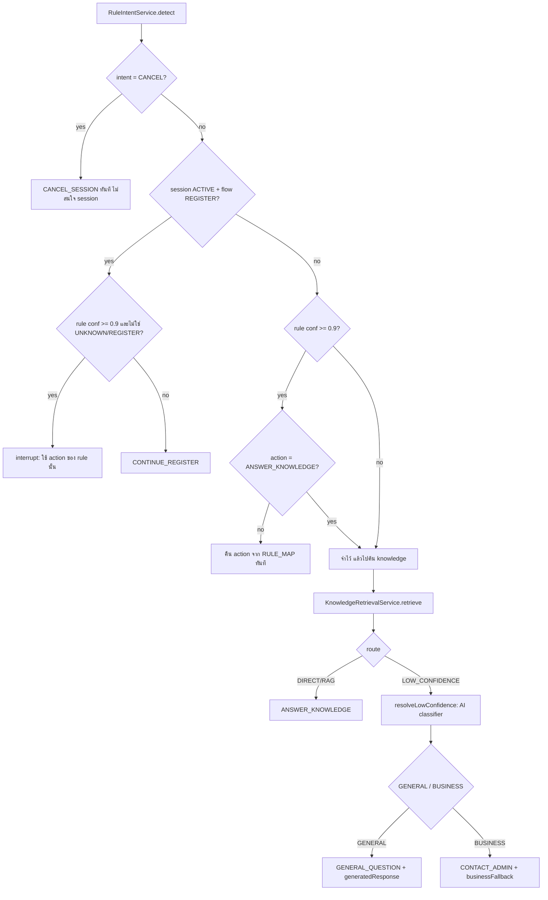
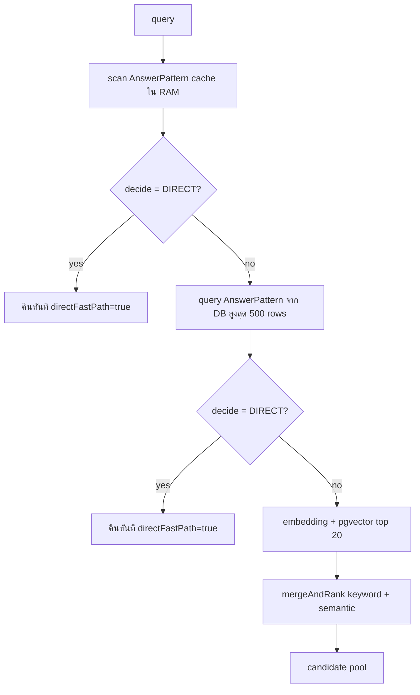
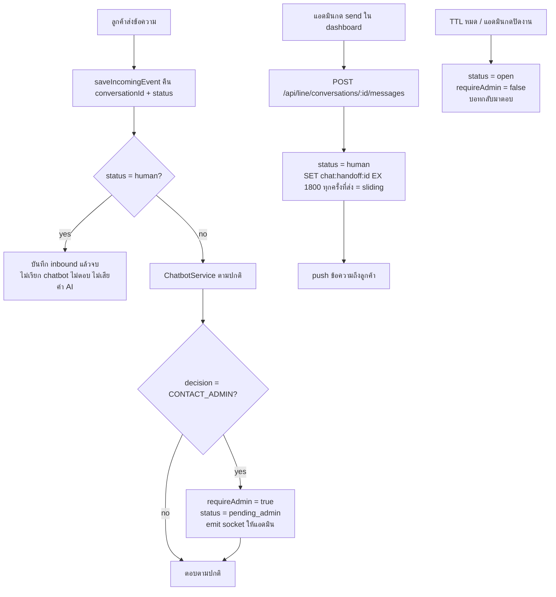

# LINE Message End-to-End Flow (Current Implementation)

> อ้างอิงโค้ดจริง ณ 2026-08-15 (working tree รวมงานที่ยังไม่ commit)
>
> แผนภาพ 4 หน้าสำหรับเปิดใน diagrams.net: [`line-message-e2e.drawio`](./line-message-e2e.drawio)
> เอกสารรวม endpoint / ERD / data shape แบบเปิดในเบราว์เซอร์: [`architecture.html`](./architecture.html)

เอกสารนี้อธิบาย 3 เรื่อง

1. **Data shapes** — type ของข้อมูลทุกจุดที่ไหลผ่านระบบ (ดูส่วนที่ 2 ถ้าต้องการดู field ของ session / message / response)
2. **Flow** — เส้นทางของข้อความจาก LINE user จนคำตอบกลับถึงลูกค้า พร้อมจุด drop / retry / cost
3. **Gaps** — สิ่งที่ยังขาด รวมถึง admin handoff (`requireAdmin`) ที่เพิ่ง**ประกาศ type ไว้แต่ยังไม่ implement** (ส่วนที่ 13)

> 🔴 **สถานะ build ปัจจุบัน: คอมไพล์ไม่ผ่าน** — `ConversationSession.requireAdmin` ถูกเพิ่มเป็น field บังคับใน
> `user-session.service.ts:23` แต่ยังไม่มี call site ไหนส่งค่ามา `tsc --noEmit` fail ที่
> `chatbot.service.ts:121`, `chatbot.service.ts:300`, `chatbot.service.ts:301`,
> `registration-flow.service.ts:27` (+ `chatbot.service.spec.ts`, `intent-router.service.spec.ts`)
> ทางออกสั้นที่สุด: ใส่ `requireAdmin: false` ที่ทุก call site หรือทำเป็น `requireAdmin?: boolean` จนกว่าจะทำ handoff จริงตามส่วนที่ 13

---

## 1. ภาพรวม


```mermaid
flowchart LR
    U[LINE User] --> LP[LINE Platform]
    LP -->|POST webhook| G[LineSignatureGuard]
    G --> C[LineController]
    C --> Q[(BullMQ / Redis)]
    C -.->|HTTP 200 ok:true ทันที| LP
    Q --> P[LineEventsProcessor]
    P --> W[LineWebhookService]
    W -->|save inbound| PG[(PostgreSQL)]
    W -->|load context| R[(Redis)]
    W --> CB[ChatbotService]
    CB --> IR[IntentRouterService]
    IR --> KR[KnowledgeRetrievalService]
    KR --> AI[AiChatService]
    AI --> CB
    CB --> W
    W --> LS[LineService.replyText]
    LS -->|POST message/reply| API[LINE Messaging API]
    API --> LP
    LP --> U
    W -->|save outbound| PG
    W -->|append/clear context| R
```

จุดที่ต้องแยกให้ชัด: **HTTP response กับข้อความตอบลูกค้าเป็นคนละ output**

| Output | ใครตอบ | ตอบเมื่อไหร่ |
|---|---|---|
| HTTP `200 {ok:true}` | `LineController` | ทันทีหลัง enqueue ไม่รอ AI/DB |
| ข้อความในแชต | `LineService.replyText()` ใน worker | หลังประมวลผลเสร็จ ใช้ `replyToken` |

---

## 2. Data shapes ทั้งหมด

### 2.1 Input จาก LINE

```http
POST /api/line/webhooks
Content-Type: application/json
X-Line-Signature: <base64 HMAC-SHA256 ของ raw body>
```

```ts
type LineWebhookBody = {
  destination: string;
  events: LineWebhookEvent[];
};

type LineWebhookEvent =
  | LineMessageEvent
  | LineFollowEvent
  | LineUnfollowEvent
  | LinePostbackEvent;
```

**field ร่วมของทุก event**

| Field | Type | ใช้ทำอะไรในระบบ |
|---|---|---|
| `type` | `'message' \| 'follow' \| 'unfollow' \| 'postback'` | เลือกเส้นทาง |
| `webhookEventId` | `string` | BullMQ `jobId` + DB idempotency claim; **ไม่มีค่านี้ = ถูก filter ทิ้งที่ controller** |
| `deliveryContext.isRedelivery` | `boolean` | มีใน type แต่โค้ดไม่ได้อ่าน (redelivery ยังเข้า queue ปกติ) |
| `timestamp` | `number` (epoch ms) | stale check 2 รอบ (50 วินาที) |
| `source` | `LineEventSource` | หา `userId` |
| `mode` | `'active' \| 'standby'` | มีใน type แต่โค้ดไม่ได้อ่าน |
| `replyToken` | `string` | ใช้ตอบกลับ (ไม่มีใน `unfollow`) |

```ts
type LineEventSource =
  | { type: 'user'; userId: string }
  | { type: 'group'; groupId: string; userId?: string }
  | { type: 'room'; roomId: string; userId?: string };
```

> ⚠️ group/room ทำให้ `userId` เป็น optional ถ้าไม่มี `userId` ระบบจะไม่บันทึกและไม่ตอบ

**message event: 3 shape ที่รองรับ**

```ts
type LineMessage =
  | { type: 'text';    id: string; text: string; quoteToken?: string }
  | { type: 'image';   id: string;
      contentProvider?: { type: 'line' }
                      | { type: 'external'; originalContentUrl: string; previewImageUrl: string } }
  | { type: 'sticker'; id: string;
      packageId: string; stickerId: string; stickerResourceType?: string;
      keywords?: string[];   // LINE ส่งมาบ้างไม่ส่งบ้าง
      text?: string;         // เฉพาะ Message Sticker
      quoteToken?: string };
```

| Event / message type | ผลลัพธ์ปัจจุบัน |
|---|---|
| `message` + `text` | บันทึก → chatbot → reply |
| `message` + `image` | บันทึก `[image]` → ดาวน์โหลดภาพ → image policy AI → reply |
| `message` + `sticker` | บันทึก → sticker rule หรือเข้า text flow → reply |
| `message` + อื่น ๆ (video/audio/file/location) | `toChatMessage()` คืน `null` → ไม่บันทึก ไม่ตอบ |
| `postback` | **บันทึกอย่างเดียว ไม่เรียก chatbot ไม่ตอบ** |
| `follow` / `unfollow` | ผ่าน queue แต่ `toChatMessage()` คืน `null` → ไม่บันทึก ไม่ตอบ |

### 2.2 Queue job

```ts
// line-events.queue.ts
const LINE_EVENTS_QUEUE = 'line-events';
const LINE_EVENT_JOB = 'process-line-event';
const LINE_EVENT_MAX_AGE_MS = 50_000;

type LineEventJobData = { event: LineWebhookEvent };
```

### 2.3 Session shape (ตอบคำถาม "session user มีอะไรบ้าง")

เก็บใน Redis key `chat:session:<lineUserId>` เป็น JSON string เดียว

```ts
interface ConversationSession<TData = Record<string, unknown>> {
  userId: string;          // ต้องตรงกับ key เสมอ ไม่ตรง = ลบทิ้ง
  flow:   'REGISTER' | 'GENERAL_QUESTION' | 'CHECK_STATUS' | 'CONTACT_ADMIN';
  step:   string;          // free-form; แต่ละ flow ตีความเอง
  status: 'ACTIVE' | 'COMPLETED' | 'CANCELLED' | 'EXPIRED';
  requireAdmin: boolean;   // ⚠ เพิ่งเพิ่ม — ยังไม่มีใครเซ็ตและไม่มีใครอ่าน (ทำให้ build พัง)
  data:   TData;           // ต้องเป็น plain object เท่านั้น (array/null = invalid)
}
```

| คุณสมบัติ | ค่า |
|---|---|
| Redis key | `chat:session:<lineUserId>` |
| TTL | `CHAT_SESSION_TTL_SEC` default **1800 วินาที (30 นาที)** |
| การต่ออายุ | `get()` ใช้ `GETEX key EX ttl` → **sliding TTL** ทุกครั้งที่อ่าน |
| Validation | ถ้า JSON เสีย / shape ผิด / `userId` ไม่ตรง → `DEL` ทิ้งแล้วคืน `undefined` |

> `isConversationSession()` **ไม่ได้ตรวจ `requireAdmin`** ดังนั้น session เก่าใน Redis ที่ไม่มี field นี้ยังอ่านผ่านตอน runtime
> ปัญหาอยู่ที่ compile time อย่างเดียว (ดูกล่องแดงด้านบนสุด)

**session ที่ถูกสร้างจริงในโค้ดปัจจุบัน**

| flow | step | data | สร้างจาก | ใช้งานจริง? |
|---|---|---|---|---|
| `REGISTER` | `WAITING_REGISTER_FORM` → `SEND_REGISTER_FORM` → `CURRENT_REGISTER` | `RegisterSessionData` | `RegistrationFlowService.start()` | ✅ มีคนอ่าน (`IntentRouterService`) |
| `CONTACT_ADMIN` | `WAITING_ADMIN` | `{}` | `ChatbotService.contactAdminResponse()` | ⚠️ **เขียนแล้วไม่มีใครอ่าน** (ดูส่วน 13) |
| `GENERAL_QUESTION` | `WAITING_QUESTION` | `{}` | `START_AI_CHAT` branch | ❌ branch unreachable |
| `CHECK_STATUS` | — | — | ไม่มีที่ไหนสร้าง | ❌ เหลือแต่ type |

**data ของ REGISTER flow**

```ts
type RegisterSessionData = Partial<{
  firstName: string;
  lastName: string;
  phoneNumber: string;   // ต้อง 10 หลัก
  bankName: string;
  bankAccount: string;   // ต้อง 10-12 หลัก
  username: string;      // RegisterAuthData
}>;

enum RegisterStep {
  WAITING_REGISTER_FORM = 'WAITING_REGISTER_FORM',
  SEND_REGISTER_FORM    = 'SEND_REGISTER_FORM',
  CURRENT_REGISTER      = 'CURRENT_REGISTER',
  PENDING_REGISTER      = 'PENDING_REGISTER',
}
```

> PII: หลังสมัครสำเร็จ `RegistrationFlowService` เรียก `clear()` ทันที เพื่อไม่ให้ข้อมูลบัญชีค้างใน Redis

### 2.4 Context shape (ความจำของ AI)

**คนละอย่างกับ session** — key คนละแบบ วัตถุประสงค์คนละอย่าง

| | session | context |
|---|---|---|
| Redis key | `chat:session:<lineUserId>` | `chat:context:<conversationId>` |
| โครงสร้าง | JSON string เดียว | Redis **List** |
| ใช้ทำอะไร | state machine (กำลังกรอกฟอร์ม) | ประวัติ Q/A ป้อนให้ AI |
| TTL | 30 นาที sliding ตอน **อ่าน** | 30 นาที ต่ออายุตอน **เขียน turn สำเร็จ** เท่านั้น |

หนึ่ง element ใน list = หนึ่ง turn ที่ส่งถึงลูกค้าสำเร็จแล้ว

```ts
type StoredChatTurn = {
  version: 1;                        // ไม่ใช่ 1 = ทิ้ง
  eventId: string;
  createdAt: number;
  userText: string;                  // redact แล้ว
  assistantText: string;             // redact แล้ว
  assistantSource: ChatResponseSource;
};
```

เก็บสูงสุด **3 turns** (`LTRIM -3 -1`) แล้วแตกเป็น message ตอนอ่าน

```ts
type ChatContextMessage = {
  role: 'user' | 'assistant';
  text: string;
  source: 'USER' | ChatResponseSource;
  createdAt: number;
};
// load() คืนสูงสุด 6 messages เรียงเวลา: user → assistant → user → assistant → user → assistant
```

**redact ก่อนเก็บ** (`prepareText()`): รหัสผ่าน/password/passcode, เลขบัญชีที่มี label, เบอร์โทรไทย (`+66`/`0` + 8-9 หลัก), ตัดที่ 4,000 ตัวอักษร

### 2.5 ChatbotService input / output

```ts
type ChatRequest = {
  userId: string;
  text: string;
  recentMessages?: ChatContextMessage[];
};

type ImageChatRequest = {
  userId: string;
  image: AiProviderImage;            // { mediaType, data(base64) }
  recentMessages?: ChatContextMessage[];   // โหลดมาแต่ image path ไม่ได้ใช้
};

type StickerChatRequest = {
  userId: string;
  packageId: string;
  stickerId: string;
  text?: string;
  keywords?: readonly string[];
  recentMessages?: ChatContextMessage[];
};

type ChatResponse = {
  text: string;
  source: 'SYSTEM' | 'RULE' | 'KNOWLEDGE' | 'AI' | 'REGISTRATION';
  contextPolicy: 'INCLUDE' | 'EXCLUDE' | 'CLEAR';
};
```

`contextPolicy` เป็นตัวสั่ง `LoadContextService` หลังส่งสำเร็จ

| ค่า | Redis operation | ใช้เมื่อ |
|---|---|---|
| `INCLUDE` | `RPUSH` + `LTRIM -3 -1` + `EXPIRE 1800` | ตอบสำเร็จจริง (ไม่ใช่ fallback) |
| `EXCLUDE` | ไม่ทำอะไร | fallback / sticker / ข้อความยาวเกิน — ไม่อยากให้ AI จำคำตอบแย่ ๆ |
| `CLEAR` | `DEL chat:context:<conversationId>` | cancel, registration (PII), default menu |

### 2.6 Routing types

```ts
type ChatIntent =
  | 'REGISTER' | 'GENERAL_QUESTION' | 'ANSWER_KNOWLEDGE'
  | 'REGISTER_HOW_TO' | 'CONTACT_ADMIN' | 'CANCEL' | 'UNKNOWN';

type ChatAction =
  | 'CANCEL_SESSION' | 'CONTINUE_REGISTER' | 'START_REGISTER'
  | 'CONTINUE_AI_CHAT' | 'START_AI_CHAT'          // unreachable ทั้งคู่
  | 'ANSWER_KNOWLEDGE' | 'GENERAL_QUESTION'
  | 'FALLBACK'                                     // unreachable
  | 'CONTACT_ADMIN' | 'DEFAULT';

type IntentSource = 'SESSION' | 'RULE' | 'CACHE' | 'DATABASE' | 'EMBEDDING' | 'AI';

type IntentResult = {           // ผลจาก rule ล้วน
  intent: ChatIntent;
  confidence: number;
  source: 'RULE';
  reason?: string;
};

type RouteDecision = {          // ผลสุดท้ายที่ ChatbotService switch
  action: ChatAction;
  intent: ChatIntent;
  confidence: number;
  source: IntentSource;
  reason?: string;
  resolvedQuery?: string;                 // query ที่ใช้ค้นจริง
  retrieval?: KnowledgeRetrievalResult;   // ส่งต่อให้ AiChatService ไม่ต้องค้นซ้ำ
  generatedResponse?: string;             // คำตอบที่ classifier สร้างมาให้เลย
  businessFallback?: boolean;             // true = ตอบ fallback ไม่ใช่ template แอดมิน
  fallbackReason?: string;
};

type LowConfidenceAnalysis = {
  classification: 'BUSINESS' | 'GENERAL';
  confidence: number;
  response?: string;              // มีเฉพาะ GENERAL
};
```

### 2.7 Retrieval types

```ts
type KnowledgeItem = {
  source: 'ANSWER_PATTERN' | 'SEMANTIC_CHUNK';
  id: string;
  title?: string;
  category?: string | null;
  content: string;                // description ?? title
  answer?: string;
  score: number;                  // normalize แล้ว 0..1
  metadata?: {
    priority?: number;
    intentKey?: string | null;
    rawScore?: number;            // คะแนน keyword ดิบก่อนหาร 5
    exactMatch?: boolean;
    matchTypes?: string[];        // ['EXACT'|'KEYWORD'|'EMBEDDING']
    retrievalLayer?: 'CACHE' | 'DATABASE';
    retrievalAttempts?: number[]; // เจอในรอบไหนบ้าง
    retrievalQueries?: string[];  // เจอด้วย query ไหนบ้าง
    duplicateKnowledgeIds?: string[];
    embeddingModel?: string;
  };
};

type KnowledgeRoute = 'DIRECT' | 'RAG' | 'LOW_CONFIDENCE';
type KnowledgeMatchType = 'EXACT' | 'KEYWORD' | 'EMBEDDING' | 'HYBRID' | 'NONE';

type KnowledgeRetrievalResult = {
  route: KnowledgeRoute;
  matchType: KnowledgeMatchType;
  items: KnowledgeItem[];          // candidate ทั้งหมด สูงสุด 20
  selectedItems: KnowledgeItem[];  // ที่เลือกใช้จริง สูงสุด 3
  topScores: number[];
  scoreGap: number | null;         // top - second
  fallbackReason?: string;         // NO_SEARCH_RESULTS | BELOW_MIN_CONTEXT_SCORE
                                   // | RETRIEVAL_ERROR | CONFLICTING_CANDIDATES
                                   // | MISSING_USER_INFORMATION
  attemptCount?: number;
  attempts?: { attempt: number; query: string; candidateCount: number; retrievalFailed: boolean }[];
  diagnosis?: 'NONE' | 'MISSING_USER_INFORMATION' | 'MISSING_KNOWLEDGE_EVIDENCE'
            | 'AMBIGUOUS_RESULTS' | 'CONFLICTING_CANDIDATES' | 'COMPLEX_QUERY' | 'RETRIEVAL_ERROR';
  rewriteStrategy?: 'NONE' | 'REWRITE' | 'EXPAND' | 'DECOMPOSE';
  plannerUsedLlm?: boolean;        // ใช้ดูว่ารอบนี้เสียเงิน planner ไหม
};

type RetrievalQueryPlan = {
  diagnosis; strategy; queries: string[]; shouldRetry: boolean; usedLlm: boolean; reason: string;
};
```

**ค่าคงที่ที่คุมพฤติกรรม** (`constants/knowledge-routing.constants.ts`)

| ค่า | Default | ความหมาย |
|---|---|---|
| `DIRECT_IMMEDIALY` | `0.95` | คะแนนขั้นต่ำที่ตอบ verbatim ได้เลย |
| `MIN_CONTEXT_SCORE` | `0.6` | ต่ำกว่านี้ไม่เอาเข้า RAG context |
| `CLEAR_WINNER_GAP` | `0.1` | ห่างจากอันดับสองเท่านี้ถึงนับว่าชนะขาด |
| `MAX_RAG_CONTEXTS` | `3` | context ที่ส่งเข้า prompt |
| `MAX_RETRIEVAL_CANDIDATES` | `20` | candidate สูงสุด + `LIMIT` ของ pgvector |
| `MAX_RETRIEVAL_ATTEMPTS` | `3` | 1 รอบแรก + rewrite ได้อีก 2 |
| `KEYWORD_SCORE_NORMALIZER` | `5` | หารคะแนน keyword ดิบให้เป็น 0..1 |
| `INSUFFICIENT_CONTEXT` | `'INSUFFICIENT_CONTEXT'` | sentinel ที่บังคับให้ LLM ตอบเมื่อข้อมูลไม่พอ |

### 2.8 AI provider types (multi-provider แล้ว ไม่ใช่ Gemini อย่างเดียว)

```ts
type AiProviderName = 'GEMINI' | 'OPENAI' | 'ANTHROPIC';

type AiProviderMessage = {
  role: 'user' | 'assistant';
  text: string;
  images?: AiProviderImage[];
};

type AiProviderImage = {
  mediaType: 'image/jpeg' | 'image/png' | 'image/webp' | 'image/gif';
  data: string;                      // base64 ไม่มี data-URL prefix
};

type AiGenerateRequest = {
  systemInstruction?: string;
  messages: AiProviderMessage[];
  temperature?: number;
  maxOutputTokens?: number;
};

type AiGenerateResponse = { text: string; provider: AiProviderName; model: string };
```

เส้นทางเรียก: `AiChatService` → `UsersAiProviderService.generate()` → `AiProviderService.generate('USER', req)` → อ่าน `AiProviderSetting` scope `USER` เพื่อเลือก provider+model → adapter ตัวจริง

`AI_GENERATION_CONFIG`: `temperature` 0.2, `maxOutputTokens` 500, timeout 12 วินาที (แต่ classifier/planner/RAG บังคับ `temperature: 0`)

Embedding: `gemini-embedding-001`, **1536 มิติ**, timeout 8 วินาที, task `RETRIEVAL_QUERY`

### 2.9 Database shapes ที่ flow นี้แตะ

```ts
LineMember       { id, memberId?, lineUserId(unique), displayName, pictureUrl?,
                   statusMessage?, lastActiveAt?, profileSyncedAt? }

LineConversation { id, lineMemberId(unique), status = "open",  // ⚠️ ไม่มีโค้ดไหนเขียน status
                   lastMessage, lastMessageType, lastMessageAt, unreadCount }

LineChatHistory  { id, conversationId, lineMemberId,
                   sender: USER|ADMIN|AI|SYSTEM,          // AI ไม่เคยถูกใช้ auto-reply เก็บเป็น SYSTEM
                   messageType: TEXT|IMAGE|STICKER|POSTBACK,
                   text?, lineMessageId?(unique), replyToken?,
                   stickerPackageId?, stickerId?, stickerResourceType?,
                   mediaUrl?, postbackData?, rawEvent(json), sentStatus }

ProcessedLineWebhookEvent { id, webhookEventId(unique), processedAt }

AnswerPattern    { id, tenantId?, title, description?, category?, intentKey?,
                   keywords[], questionExamples[], answer, language, priority, active }

AnswerPatternVector { id, answerPatternId(unique), embedding(vector 1536), embeddingModel, active }

AiSetting        { id, systemPrompt, tone, fallbackMessage, active }
```

### 2.10 Redis key map

| Key | เจ้าของ | ชนิด | TTL | ค่า |
|---|---|---|---|---|
| `chat:session:<userId>` | `UserSessionService` | string | 1800 sliding | `ConversationSession` JSON |
| `chat:context:<conversationId>` | `LoadContextService` | list | 1800 | `StoredChatTurn[]` สูงสุด 3 |
| `rl:line:global:ingress` | `LineController` | counter | 1 วินาที | default 100/วินาที |
| `rl:line:global:reply` | `LineService` | counter | 1 วินาที | default 30/วินาที |
| `rl:line:user:<id>:burst` | processor | counter | 10 วินาที | default 10 |
| `rl:line:user:<id>:hour` | processor | counter | 3600 | default 60 |
| `rl:ai:global` | `AiBudgetService` | counter | 1 วินาที | default 30 |
| `rl:ai:user:<id>` | `AiBudgetService` | counter | 3600 | default 60 |
| `ban:line:user:<id>` | `BanService` | string | ตามระดับ | `{reason, permanent, bannedAt}` |
| `strikes:line:user:<id>` | `BanService` | counter | 86400 | จำนวน strike |
| `spam:line:user:<id>:last-text` | `SpamDetectorService` | string | 30 วินาที | ข้อความล่าสุด normalize แล้ว |
| `spam:line:user:<id>:same-count` | `SpamDetectorService` | counter | 30 วินาที | จำนวนซ้ำ |
| `ai:provider-setting:v1:<scope>` | `AiProviderSettingsService` | string | ไม่มีวันหมดอายุ | `AiProviderRuntimeSetting` JSON — write-through เมื่อแก้ setting; cache miss/พังแล้วอ่าน PostgreSQL ต่อได้ |
| BullMQ keys | BullMQ | หลายชนิด | ตาม job | queue/job/retry |

---

## 3. HTTP ingress

### 3.1 Raw body

`main.ts` เปิด `fastify-raw-body` แบบ `global: false` เฉพาะ route `/api/line/webhooks` เพราะ signature คำนวณจาก byte เดิม ไม่ใช่ JSON ที่ parse แล้ว

### 3.2 `LineSignatureGuard`

1. อ่าน `x-line-signature` + `request.rawBody`; ขาดอย่างใดอย่างหนึ่ง → `401`
2. `HMAC-SHA256(rawBody, LINE_CHANNEL_SECRET)`
3. เทียบความยาวก่อน แล้ว `timingSafeEqual` (กัน timing attack)
4. ไม่ผ่าน → `401 Invalid LINE signature`

### 3.3 `LineController.handleWebhook()`

```text
filter events → Boolean(event.webhookEventId)
  ↓
global ingress limit (rl:line:global:ingress, amount = จำนวน event)
  ├─ เกิน → log warn + drop ทั้งชุด + ตอบ {ok:true} (ไม่ให้ LINE retry flood)
  └─ ผ่าน ↓
queue.add('process-line-event', {event}, { jobId: event.webhookEventId })
  ↓
return { ok: true }
```

Redis ล่ม → `RateLimitService` **fail-open** (ปล่อยผ่าน + log) เพื่อไม่ให้ระบบตายทั้งระบบ

---

## 4. Queue และ worker

| ค่า | ค่าปัจจุบัน |
|---|---|
| `attempts` | 3 |
| backoff | exponential เริ่ม 2,000 ms |
| worker concurrency | 7 |
| worker limiter | 12 jobs/วินาที |
| `removeOnComplete` | 1 ชั่วโมง / 5,000 jobs |
| `removeOnFail` | 24 ชั่วโมง |

### 4.1 เรียงข้อความต่อ user

`LineEventsProcessor` เก็บ `Map<userId, Promise<void>>` (`userProcessingTails`) ทำให้ข้อความของ user เดียวกันทำทีละอัน แต่ต่าง user ยังขนานกันได้ ถ้างานก่อนหน้า throw → `.catch(() => undefined)` ให้งานถัดไปเริ่มได้ ส่วน BullMQ เป็นคน retry

> ใช้ได้เฉพาะ **single process** ถ้าขยายเป็นหลาย instance ต้องกลับไปใช้ distributed lock

### 4.2 `processInOrder()` checkpoint ตามลำดับจริง

1. **Stale รอบแรก** — `Date.now() - (event.timestamp || job.timestamp) > 50_000` → จบ job ไม่ตอบ
2. **Ban** — `ban:line:user:<id>` มีอยู่ → silent drop
3. **ถ้าเป็น retry** (`attemptsMade > 0`) → ข้าม burst/hourly/spam (ไม่ลงโทษซ้ำจาก event เดิม)
4. **Burst** — 10 events/10 วินาที → เกิน = strike + drop
5. **Hourly** — 60 events/ชั่วโมง → เกิน = strike + drop
6. **Spam** (เฉพาะ text) — ยาวเกิน 3,000 / URL เกิน 3 / ข้อความซ้ำ 5 ครั้งใน 30 วินาที → strike + drop
7. **DB claim** — `INSERT ProcessedLineWebhookEvent(webhookEventId)`; `P2002` = เคยทำแล้ว → skip
8. `processEvent(event)` — ถ้า throw → **release claim** แล้ว throw ต่อให้ BullMQ retry

Strike 3 → ban `ABUSE_BAN_1_SEC` (300s), strike 4 → 3600s, strike 5+ → 86400s

---

## 5. บันทึก inbound

`saveIncomingEvent()` ทำงาน **ก่อน** ตรวจว่าเป็น message ที่รองรับหรือไม่ (postback จึงถูกบันทึกด้วย)

```text
ไม่มี source.userId → return null
toChatMessage(event) → null → return null
มี lineMessageId ที่เคยบันทึก → คืน row เดิม (กัน unread เพิ่มซ้ำตอน retry)
  ↓
findOrCreateLineMember: หาไม่เจอ → GET LINE Profile API (timeout 8s) → upsert
  ↓
$transaction:
  1. upsert LineConversation (unique lineMemberId) + unreadCount++
  2. insert LineChatHistory (sender=USER, sentStatus='received', rawEvent=event)
  3. update LineMember.lastActiveAt
  ↓
{ conversationId, lineMemberId }
```

ถ้าชน unique `lineMessageId` จาก 2 worker พร้อมกัน → อ่าน row ที่ commit แล้วคืนแทนการ retry

---

## 6. เงื่อนไขเข้า chatbot

```ts
event.type === 'message'
&& ['text','image','sticker'].includes(event.message.type)
&& Boolean(event.source?.userId)
```

ไม่ผ่าน → `processEvent()` จบทันที (บันทึกแล้วแต่ไม่ตอบ)

จากนั้นโหลด context: `LoadContextService.load(conversationId)` → `LRANGE key -3 -1` → สูงสุด 6 `ChatContextMessage`
Redis ล่มหรือ JSON เสีย → log + คืน `[]` (ไม่ทำให้ข้อความล้ม)

---

## 7. ChatbotService: guard ก่อน routing

| Check | ผลลัพธ์ |
|---|---|
| `text.trim()` ว่าง | default menu · `SYSTEM` · `CLEAR` |
| ยาวเกิน `AI_MAX_MESSAGE_LENGTH` (default 1000) | `messageTooLong()` · `SYSTEM` · `EXCLUDE` — **ตัดก่อนโหลด session และก่อนทุก AI call** |
| ผ่าน | โหลด session → `IntentRouterService.resolve()` |

---

## 8. Intent routing


```mermaid
flowchart TD
    A[RuleIntentService.detect] --> B{intent = CANCEL?}
    B -- yes --> C[CANCEL_SESSION ทันที ไม่สนใจ session]
    B -- no --> D{session ACTIVE + flow REGISTER?}
    D -- yes --> E{rule conf >= 0.9 และไม่ใช่ UNKNOWN/REGISTER?}
    E -- yes --> F[interrupt: ใช้ action ของ rule นั้น]
    E -- no --> G[CONTINUE_REGISTER]
    D -- no --> H{rule conf >= 0.9?}
    H -- yes --> I{action = ANSWER_KNOWLEDGE?}
    I -- no --> J[คืน action จาก RULE_MAP ทันที]
    I -- yes --> K[จำไว้ แล้วไปค้น knowledge]
    H -- no --> K
    K --> L[KnowledgeRetrievalService.retrieve]
    L --> M{route}
    M -- DIRECT/RAG --> N[ANSWER_KNOWLEDGE]
    M -- LOW_CONFIDENCE --> O[resolveLowConfidence: AI classifier]
    O --> P{GENERAL / BUSINESS}
    P -- GENERAL --> Q[GENERAL_QUESTION + generatedResponse]
    P -- BUSINESS --> R[CONTACT_ADMIN + businessFallback]
```

### 8.1 Rule table (`RuleIntentService`)

| Input (normalize แล้ว) | Intent | Confidence | Action ที่ได้ |
|---|---|---|---|
| `ยกเลิก` / `cancel` / `ออก` (ตรงทั้งข้อความ) | `CANCEL` | 1.0 | `CANCEL_SESSION` |
| `1` | `REGISTER` | 1.0 | `START_REGISTER` |
| `2` | `GENERAL_QUESTION` | 1.0 | `GENERAL_QUESTION` → **ตกไป fallback (บั๊ก)** |
| `สมัคร` / `สมัครสมาชิก` / `register` | `REGISTER` | 0.95 | `START_REGISTER` |
| มีคำว่า `สมัครยังไง` / `วิธีสมัคร` / `เปิดยูสยังไง` | `REGISTER_HOW_TO` | 0.9 | `ANSWER_KNOWLEDGE` |
| มีคำว่า `ติดต่อแอดมิน` / `คุยกับเจ้าหน้าที่` / `แจ้งปัญหา` | `CONTACT_ADMIN` | 0.95 | `CONTACT_ADMIN` |
| อื่น ๆ | `UNKNOWN` | 0.4 | ไปค้น knowledge |

> ⚠️ **บั๊กที่ยังเปิดอยู่** — `2` แมปไป action `GENERAL_QUESTION` ซึ่ง `answerGeneralDecision()` ต้องการ `decision.generatedResponse` แต่ rule ไม่เคยใส่ค่านั้น ผลคือลูกค้าได้ fallback ส่วนเมนู `3` ไม่มี rule เลย ต้องวิ่งผ่าน retrieval + LLM 2 ครั้ง

### 8.2 Low-confidence classifier

เรียกเมื่อ retrieval คืน `LOW_CONFIDENCE` เท่านั้น ใช้ prompt แยก (`low-confidence-classifier.prompt.ts`) `temperature: 0`, `maxOutputTokens: 300` คืน

```json
{ "classification": "BUSINESS" | "GENERAL", "confidence": 0.0-1.0, "response": "..." }
```

- `GENERAL` → ใช้ `response` ตอบเลย (ประหยัดอีก 1 call)
- `BUSINESS` → `CONTACT_ADMIN` + `businessFallback: true`
- parse ไม่ได้ / budget หมด → default **`BUSINESS` confidence 0** (fail-safe: ส่งต่อคนดีกว่าเดา)

---

## 9. Knowledge retrieval (ส่วนที่เปลี่ยนมากที่สุด)

### 9.1 หนึ่ง pass (`retrieveCandidatePass`)


```mermaid
flowchart TD
    Q[query] --> C[scan AnswerPattern cache ใน RAM]
    C --> C1{decide = DIRECT?}
    C1 -- yes --> OUT1[คืนทันที directFastPath=true]
    C1 -- no --> D[query AnswerPattern จาก DB สูงสุด 500 rows]
    D --> D1{decide = DIRECT?}
    D1 -- yes --> OUT2[คืนทันที directFastPath=true]
    D1 -- no --> E[embedding + pgvector top 20]
    E --> M[mergeAndRank keyword + semantic]
    M --> OUT3[candidate pool]
```

จุดที่ต่างจากเอกสารเวอร์ชันก่อน: **ถ้าไม่ใช่ DIRECT ระบบจะยิง embedding เสมอ** แล้วเอาผล keyword + semantic มา merge เป็น pool เดียว (hybrid) ไม่ใช่ short-circuit ทีละชั้นแบบเดิม

- DB สำเร็จ → ใช้ผล DB แทน cache (DB เป็น authority, cache อาจเก่า)
- แต่ละชั้นล้มเหลวได้อิสระ → ตั้ง `retrievalFailed = true` แล้วไปต่อด้วยผลที่เหลือ
- **ชั้นใดชั้นหนึ่งล้ม** และผลสุดท้ายเป็น `LOW_CONFIDENCE` → `fallbackReason: 'RETRIEVAL_ERROR'` ซึ่งทำให้ planner ถูกเรียกด้วย `allowLlm: false` (ยิง query ใหม่ก็ล้มเหมือนเดิม ไม่ต้องเสียค่า LLM)

### 9.2 `decide()` — ตัดสิน route

```text
ไม่มี candidate                                    → LOW_CONFIDENCE (NO_SEARCH_RESULTS)
exactMatch หรือ (score >= 0.95 และ gap >= 0.1)      → DIRECT       ตอบ answer verbatim
มี candidate ที่ score >= 0.6                       → RAG          ส่งเข้า LLM สูงสุด 3 ก้อน
นอกนั้น                                            → LOW_CONFIDENCE (BELOW_MIN_CONTEXT_SCORE)
```

การเรียงลำดับ: exact มาก่อนเสมอ → ถ้า exact เท่ากันใช้ `priority` → ไม่ใช่ exact ใช้ `score` แล้วค่อย `priority`

### 9.3 Second pass (agentic query planning)

`shouldPlanSecondPass()` ตรวจตามลำดับนี้ (ลำดับสำคัญ)

1. ไม่มี candidate เลย **และ** ข้อความดูเป็น small talk ชัด ๆ (`สวัสดี`, `ขอบคุณ`, `hi`…) → **ไม่ทำ**
2. เป็นคำถามต่อเนื่อง (`แล้ว`, `อันนี้`, `it`, `that`…) หรือคำถามซับซ้อน (`และ`, `and`, `?` เกิน 1 ตัว) → **ทำ**
3. route เป็น `DIRECT` → ไม่ทำ
4. route เป็น `LOW_CONFIDENCE` / ผลกำกวม (gap < 0.1) / candidate ขัดแย้งกัน → ทำ

> ข้อ 2 มาก่อนข้อ 3 โดยตั้งใจ: คำถามต่อเนื่องที่ได้ `DIRECT` ก็ยัง rewrite ต่อ เพราะคำถามอย่าง "แล้วรายเดือนล่ะ" อาจ match pattern ผิดตัวแบบมั่นใจเต็ม ๆ ได้ (`retrieve()` จึงเช็ค `!requiresQueryAnalysis` ก่อนใช้ fast path เช่นกัน)

`RetrievalQueryPlannerService.plan()` ตัดสิน 3 ทาง

| กรณี | ใช้ LLM? | ผล |
|---|---|---|
| มี follow-up marker + หา user message ก่อนหน้าเจอ | ❌ | `REWRITE` = `"<คำถามก่อนหน้า>\n<คำถามปัจจุบัน>"` |
| follow-up แต่ไม่มีประวัติ | ❌ | ไม่ retry, `MISSING_USER_INFORMATION` |
| `RETRIEVAL_ERROR` | ❌ | ไม่ retry |
| อื่น ๆ | ✅ 1 call | คืน JSON `{diagnosis, strategy, queries[], reason}` |

**Guard ของ LLM plan** (`parseLlmPlan`): ห้ามมี field เกิน, diagnosis/strategy ต้องอยู่ใน enum, `queries` ≤ 2 และแต่ละอันไม่เกิน 2,000 ตัวอักษร, `strategy: NONE` ต้องคู่กับ `queries: []`, `RETRIEVAL_ERROR` ห้ามสั่ง retry, query ที่ซ้ำของเดิม/เคยลองแล้วถูกตัดทิ้ง

query ที่ผ่านทั้งหมดถูกยิง **ขนานกัน** (`Promise.all`) แล้ว merge เข้า pool เดิม จากนั้น `decide()` อีกครั้งด้วย **`allowDirect: false`** — คำตอบจาก query ที่ AI เขียนเองต้องผ่าน LLM grounding เสมอ ห้ามตอบ verbatim

### 9.4 Conflict detection

ถ้า candidate 2 อันดับแรกคะแนนใกล้กัน (≤ 0.1) แต่ answer ต่างกัน และอยู่ `intentKey` หรือ `category` เดียวกัน → ถือว่า **ขัดแย้ง** → บังคับ `LOW_CONFIDENCE` แทนที่จะเดา
เหมือนกันเมื่อมี exact match ≥ 2 อันที่ answer ไม่ตรงกัน

### 9.5 Cache

`AnswerPatternCacheService` โหลด `AnswerPattern` เต็ม record (รวม `answer`) สูงสุด 500 rows, refresh ทุก 240 วินาที, `getAll()` **ไม่เคยยิง DB บน request path** (TTL หมด = kick refresh เบื้องหลังแล้วคืน snapshot เก่าไปก่อน), refresh ล้มเหลว = ใช้ snapshot เดิมต่อ

---

## 10. Answer generation

### 10.1 `answerKnowledge()`

```text
route DIRECT → คืน selectedItems[0].answer ตรง ๆ   ← ไม่เสีย LLM call
route RAG    → generateFromKnowledge()
               system instruction = systemPrompt + tone + คำถาม + context block
                                  + KNOWLEDGE_RULES + anti-injection + INSUFFICIENT_CONTEXT rule
               temperature 0
               ↓
               ถ้าโมเดลตอบ "INSUFFICIENT_CONTEXT" → { isFallback: true, insufficientContext: true }
               ถ้าตอบว่าง / error / budget หมด    → fallbackMessage
route LOW_CONFIDENCE → fallbackMessage
```

**INSUFFICIENT_CONTEXT loop** — เมื่อ `insufficientContext === true` `ChatbotService` จะเรียก `resolveLowConfidence()` ต่อ เพื่อให้ classifier ตัดสินใหม่ว่าเป็น GENERAL (ตอบเองได้) หรือ BUSINESS (ส่งแอดมิน) แทนที่จะทิ้ง fallback ทื่อ ๆ

### 10.2 `answerGeneral()`

โหลด `AiSetting` → `systemPrompt + tone + GENERAL_RULES` → `toAiProviderMessages(recent, input)` → budget → generate
`toAiProviderMessages()`: เลือกจากใหม่ไปเก่า ไม่เกิน 6 messages / 6,000 ตัวอักษร แล้วตัด assistant ที่ขึ้นต้นโดยไม่มี user คู่ ก่อน append input ปัจจุบัน

### 10.3 `answerImage()`

```text
LineService.getImageContent(messageId)
  → ตรวจ content-length และ byte จริง <= LINE_AI_IMAGE_MAX_BYTES (8 MB)
  → sniff media type จาก header + magic bytes (jpeg/png/gif/webp)
  ↓
AiChatService.answerImage — ไม่ส่ง conversation history เข้า prompt
  ↓ โมเดลต้องคืน JSON { classification, answer }
SAFE_GENERAL        → ผ่าน BLOCKED_ANSWER_PATTERNS อีกชั้น → ตอบ
TRANSACTION         → fallback (สลิป/โอนเงิน/เลขบัญชี)
BUSINESS_UNVERIFIED → fallback (ราคา/สต็อก/โปรโมชั่น/นโยบาย)
UNREADABLE          → fallback
JSON เสีย            → fallback
```

`contentProvider.type === 'external'` ถูกปฏิเสธก่อนถึง AI (ไม่ดาวน์โหลดไฟล์จากโดเมนภายนอก)

### 10.4 Sticker

```text
keywords/text มี thanks|thank you|ขอบคุณ|ขอบใจ|thx  → stickerThanks()    EXCLUDE
keywords/text มี hello|hi|greeting|สวัสดี|หวัดดี      → stickerGreeting()  EXCLUDE
มี text แต่ไม่เข้า 2 อันบน                            → handleTextMessage(text) ตาม flow ปกติ
ไม่มี text/keyword                                  → stickerUnknown()   EXCLUDE
```

ลำดับสำคัญ: เช็ค THANKS ก่อน GREETING

### 10.5 AI budget

ทุก external call ผ่าน `AiBudgetService.tryConsume(userId)`: global `rl:ai:global` 30/วินาที + user `rl:ai:user:<id>` 60/ชั่วโมง

**หนึ่งข้อความใช้ได้สูงสุดกี่ call**

| ขั้น | เมื่อไหร่ | จำนวน |
|---|---|---|
| embedding รอบแรก | ไม่ใช่ DIRECT | 1 |
| query planner | มี second pass และไม่ใช่ follow-up ที่แก้เองได้ | 1 |
| embedding รอบสอง | มี rewritten query | 1-2 |
| RAG generation | route RAG | 1 |
| low-confidence classifier | LOW_CONFIDENCE หรือ INSUFFICIENT_CONTEXT | 1 |

รวมกรณีแย่สุด ≈ **6 calls/ข้อความ** — คำถามที่ hit cache แบบ DIRECT ใช้ **0 call**

---

## 11. Output กลับ LINE และ post-delivery

```text
stale รอบสอง: Date.now() - event.timestamp > 50_000 → ไม่ใช้ reply token, จบ
  ↓
LineService.replyText()
  1. global reply limit (rl:line:global:reply, 30/วินาที) → เกิน = คืน false, silent drop, ไม่ retry
  2. POST https://api.line.me/v2/bot/message/reply  { replyToken, messages:[{type:'text', text}] }
  3. timeout 8 วินาที
  4. non-2xx/timeout → throw → release claim → BullMQ retry
  5. 2xx → true
  ↓ (เฉพาะเมื่อ true)
saveSystemReplyMessage(): insert LineChatHistory(sender=SYSTEM, sentStatus='sent',
                          rawEvent.source='line_webhook_auto_reply') + update conversation
                          ← ล้มเหลว = log อย่างเดียว ห้าม throw (ส่งไปแล้ว retry จะซ้ำ)
  ↓
contextPolicy: INCLUDE → appendTurn (redact + RPUSH + LTRIM + EXPIRE)
               CLEAR   → clear()
               EXCLUDE → ไม่ทำอะไร
```

> `creditService.reserveLineReplyCredit()` ถูก **comment ไว้** ที่ `line-webhook.service.ts` → ตอนนี้ระบบ credit ไม่ถูกหักจริง

---

## 12. Retry / idempotency matrix

| จุดที่เกิดเหตุ | ระบบทำอะไร | Retry? | ข้อมูลที่เขียนไปแล้ว |
|---|---|---|---|
| signature ไม่ผ่าน | HTTP 401 | LINE อาจ retry | ไม่มี |
| enqueue ล้ม | throw ก่อน `{ok:true}` | LINE อาจส่งใหม่ | บาง event ใน batch อาจ enqueue แล้ว |
| ingress limit เกิน | drop + `{ok:true}` | ไม่ | rate counter |
| stale ก่อน process | จบ job | ไม่ | ไม่มี |
| ban / burst / hourly / spam | silent drop (+strike) | ไม่ | Redis counters |
| DB claim ซ้ำ | skip | ไม่ | claim เดิม |
| throw ก่อน reply สำเร็จ | release claim + throw | ✅ สูงสุด 3 | inbound history อาจเขียนแล้ว |
| reply limit เกิน | คืน false, จบ | ไม่ | inbound + claim |
| stale หลัง chatbot | จบ ไม่ตอบ | ไม่ | inbound + claim + **ค่า AI จ่ายไปแล้ว** |
| reply สำเร็จ แต่ save outbound ล้ม | log | ไม่ | ลูกค้าได้ข้อความแล้ว |
| context append/clear ล้ม | log | ไม่ | ลูกค้าได้ข้อความแล้ว |

retry จะ reuse inbound row เดิมผ่าน unique `lineMessageId` แล้วเดินต่อเพื่อพยายามส่ง reply ใหม่

---

## 13. Gap: admin handoff (`requireAdmin`) — ประกาศ type แล้ว แต่ยังไม่ implement

> **อัปเดต 2026-08-15** — `requireAdmin: boolean` ถูกเพิ่มลง `ConversationSession` แล้ว แต่หยุดอยู่แค่นั้น:
> ไม่มีจุดไหนเซ็ตค่า ไม่มีจุดไหนอ่าน และเพราะเป็น field บังคับจึงทำให้ `tsc` fail ที่ทุก call site ที่สร้าง session
> ส่วนที่เหลือของบทนี้คือดีไซน์ที่แนะนำให้ทำต่อ (ยังไม่มีในโค้ด)

### 13.1 ปัญหาปัจจุบัน

`ChatbotService.contactAdminResponse()` เขียน session `{ flow: 'CONTACT_ADMIN', step: 'WAITING_ADMIN' }` แล้ว emit socket `CONTACT_ADMIN` ให้แอดมิน **แต่ไม่มีโค้ดไหนอ่าน session นี้เลย** — `IntentRouterService.resolve()` เช็คแค่ `flow === 'REGISTER'` ผลคือ

- ระหว่างแอดมินกำลังคุยกับลูกค้า บอทยังตอบแทรกทุกข้อความ
- session `CONTACT_ADMIN` ค้างจนหมด TTL 30 นาที และไปกิน slot ของ `flow` ทำให้ลูกค้าสมัครสมาชิกไปด้วยไม่ได้

### 13.2 ประเมินไอเดีย `requireAdmin`

| ประเด็น | ประเมิน |
|---|---|
| ทำเป็น **boolean flag แยกจาก `flow`** | ✅ **ถูกต้อง** — "ขอแอดมิน" เป็นสถานะที่เกิดพร้อมกับ REGISTER ได้ ไม่ควรไปแย่ง slot ของ `flow` |
| อยากให้ AI ตอบคำถามอื่นต่อได้ระหว่างรอ | ✅ ทำได้ และเป็นพฤติกรรมปัจจุบันอยู่แล้ว |
| เช็ค/สลับสถานะที่ endpoint ส่งข้อความของแอดมิน | ✅ ถูกที่สำหรับ **การเปลี่ยนสถานะ** แต่ **ไม่ใช่ที่สำหรับด่านกั้น** — ต้องแยก 2 จุด (ดู 13.4) |
| ใช้ boolean ตัวเดียวคุมทั้งหมด | ❌ **ไม่พอ** — มี 3 สถานะ ไม่ใช่ 2 |
| `if (requireAdmin) { requireAdmin = false; sendMessage() }` | ❌ ตรรกะกลับด้าน: ตั้ง `false` หลังแอดมินตอบ = ปล่อยให้ AI กลับมาตอบแทรกทันที ซึ่งตรงข้ามกับที่ต้องการ |

**3 สถานะที่ต้องแยกจากกัน**

```text
BOT      บอทตอบทุกอย่างตามปกติ                        (requireAdmin = false)
PENDING  ลูกค้าขอแอดมินแล้ว แจ้งเตือนแล้ว แต่ยังไม่มีคนมา   → บอทยังตอบได้  (requireAdmin = true)
HUMAN    แอดมินเข้ามาคุยแล้ว                            → บอทต้องเงียบ
```

boolean ตัวเดียวแทน 3 สถานะไม่ได้ ต้องมี state ที่สองสำหรับ HUMAN

### 13.3 เก็บ HUMAN state ไว้ที่ไหน

| ตัวเลือก | ข้อดี | ข้อเสีย |
|---|---|---|
| `ConversationSession.data.requireAdmin` (Redis) | ไม่ต้องแก้อะไร, chatbot โหลด session อยู่แล้ว | key เป็น `lineUserId` แต่ endpoint แอดมินใช้ `conversationId`; ลูกค้าพิมพ์ `ยกเลิก` = ล้าง session ทิ้ง handoff โดยไม่ตั้งใจ; หาย 30 นาที; Redis flush = หาย; dashboard มองไม่เห็น |
| **`LineConversation.status` (PostgreSQL) ← แนะนำ** | **คอลัมน์นี้มีอยู่แล้ว** (`String @default("open")`) และ **ยังไม่มีโค้ดไหนเขียนเลย**; key ตรงกับ `conversationId` ที่แอดมินใช้; ทนทาน; `listConversations()` ส่งให้ dashboard อยู่แล้ว; **ไม่ต้องแก้ Prisma schema** | ต้องอ่านจาก DB — แต่ `saveIncomingEvent()` ก็ upsert conversation อยู่แล้ว เพิ่ม `status` ใน select ได้ฟรี |

เสนอ: `status: 'open' | 'pending_admin' | 'human'` และเก็บ auto-release ไว้ที่ Redis key `chat:handoff:<conversationId>` ที่มี TTL (เช่น `ADMIN_HANDOFF_TTL_SEC` default 1800) เพื่อไม่ต้องเพิ่มคอลัมน์ timestamp ใน schema

### 13.4 Flow ที่เสนอ


```mermaid
flowchart TD
    A[ลูกค้าส่งข้อความ] --> B[saveIncomingEvent คืน conversationId + status]
    B --> C{status = human?}
    C -- yes --> D[บันทึก inbound แล้วจบ<br/>ไม่เรียก chatbot ไม่ตอบ ไม่เสียค่า AI]
    C -- no --> E[ChatbotService ตามปกติ]
    E --> F{decision = CONTACT_ADMIN?}
    F -- yes --> G[requireAdmin = true<br/>status = pending_admin<br/>emit socket ให้แอดมิน]
    F -- no --> H[ตอบตามปกติ]
    G --> H

    I[แอดมินกด send ใน dashboard] --> J[POST /api/line/conversations/:id/messages]
    J --> K[status = human<br/>SET chat:handoff:id EX 1800 ทุกครั้งที่ส่ง = sliding]
    K --> L[push ข้อความถึงลูกค้า]

    M[TTL หมด / แอดมินกดปิดงาน] --> N[status = open<br/>requireAdmin = false<br/>บอทกลับมาตอบ]
```

**จุดที่ต้องแก้จริง (4 จุด)**

1. `LineWebhookService.saveIncomingEvent()` — เพิ่ม `status` ใน return type
2. `LineWebhookService.processEvent()` — ใส่ด่านกั้นหลัง `saveIncomingEvent()`

   ```ts
   if (savedIncomingEvent?.status === 'human') {
     this.logger.debug(`conversation ${savedIncomingEvent.conversationId} is human-handled, skipping bot`);
     return;                       // inbound บันทึกแล้ว แอดมินเห็นใน dashboard
   }
   ```

3. `LineWebhookService.sendAdminMessage()` — เปลี่ยนสถานะตอนแอดมินตอบ (ตรงกับที่คิดไว้)

   ```ts
   await tx.lineConversation.update({
     where: { id: conversation.id },
     data: { status: 'human', lastMessage: body.text, ... },
   });
   await this.redis.set(`chat:handoff:${conversation.id}`, '1', 'EX', this.handoffTtlSec);
   ```

4. เพิ่ม endpoint ปล่อยงาน เช่น `DELETE /api/line/conversations/:id/handoff` → `status = 'open'` + `DEL chat:handoff:<id>` และให้ job/lazy-check คืนสถานะเมื่อ TTL หมด

**ข้อควรระวัง**

- **ห้ามลืม auto-release** ถ้าไม่มี TTL และแอดมินลืมปิดงาน ลูกค้าจะเจอบอทเงียบตลอดไป — นี่คือความเสี่ยงอันดับหนึ่งของฟีเจอร์นี้
- **race แอดมินกับบอท** — worker อาจกำลังประมวลผลอยู่ตอนแอดมินกดส่ง ทำให้มี 2 ข้อความออกไป ถ้าจะกันให้เช็คสถานะซ้ำอีกครั้งก่อน `replyText()` (จุดเดียวกับ stale check รอบสอง)
- **ตอน HUMAN ไม่ต้องตอบอะไรเลย** อย่าส่ง "แอดมินกำลังดูแลอยู่" ทุกข้อความ เพราะจะรบกวนบทสนทนาที่คนคุยอยู่
- `requireAdmin` ใน session ยังมีประโยชน์สำหรับ PENDING (badge ใน dashboard + ไม่ต้องแจ้งเตือนซ้ำ) แต่ **สถานะที่บังคับให้บอทเงียบต้องอยู่ที่ conversation ไม่ใช่ session**

---

## 14. Gap อื่นที่ยังเปิดอยู่

| # | เรื่อง | ผลกระทบ |
|---|---|---|
| 0 | **`requireAdmin` ทำให้ `tsc --noEmit` fail 5 จุด** (ดูหัวเอกสาร) | build/deploy ไม่ผ่านจนกว่าจะแก้ |
| 1 | เมนู `2` ตอบ fallback แทนที่จะเริ่มถาม-ตอบ | ลูกค้ากดเมนูแล้วเจอข้อความขอโทษ |
| 2 | เมนู `3` ไม่มี rule | เสีย LLM 2 call และผลลัพธ์ไม่แน่นอน |
| 3 | `follow` ไม่มีข้อความต้อนรับ | เพื่อนใหม่ไม่รู้ว่าต้องพิมพ์ 1/2/3 |
| 4 | `postback` บันทึกแต่ไม่ตอบ | rich menu / quick reply ในอนาคตจะเงียบ |
| 5 | dead code: `analyze()`, `fromAi()`, `AI_MAP`, `classifierPrompt`, template ~9 ตัว | สับสนตอนอ่านโค้ด |
| 6 | credit reservation ถูก comment | ระบบ credit ไม่ถูกหักจริง |
| 7 | ไม่มี golden eval set | วัดไม่ได้ว่าตอบถูก 8/10 จริงไหม |
| 8 | **ไม่มี global guard** (`APP_GUARD`) → `@Public()` เป็น metadata เปล่า และ `POST /registration/register` (`body: any`), `GET|POST /api/admin/answer-patterns`, `POST /api/abuse/bans` เปิดสาธารณะจริง | ใครก็เขียน knowledge / ban ผู้ใช้ / สร้าง member ได้ |
| 9 | `unreadCount` เพิ่มอย่างเดียว ไม่มี endpoint mark-as-read | badge ใน dashboard ไม่มีวันลด |
| 10 | `ProcessedLineWebhookEvent` ไม่มี job ล้างแถวเก่า | ตารางโตไม่จำกัด |

รายละเอียด endpoint ทุกตัว + ERD + data shape แบบเปิดในเบราว์เซอร์อยู่ที่ [`architecture.html`](./architecture.html)

---

## 15. Debug checkpoint

| อยากดู | ดูที่ | Input | Output |
|---|---|---|---|
| payload ดิบจาก LINE | `LineController.handleWebhook()` | `body.events` | filtered events |
| signature | `LineSignatureGuard.canActivate()` | rawBody + header | `true` / 401 |
| job จริง | `LineEventsProcessor.process()` | `job.data.event` | promise chain ต่อ user |
| drop/retry | `processInOrder()` | event + `attemptsMade` | allowed / skip / throw |
| inbound mapping | `toChatMessage()` | LINE event | `IncomingLineChatMessage` / null |
| context | `LoadContextService.load()` | conversationId | `ChatContextMessage[]` |
| contract chatbot | `ChatbotService.handleTextMessage()` | `ChatRequest` | `ChatResponse` |
| **สรุป routing 1 บรรทัด** | `IntentRouterService.logDecision()` | — | JSON: route, matchType, topScores, scoreGap, attemptCount, diagnosis, rewriteStrategy, plannerUsedLlm, selectedKnowledgeIds, fallbackReason |
| **สรุป retrieval** | `KnowledgeRetrievalService.retrieve()` ท้ายเมธอด | — | JSON: route, attemptCount, candidateCount, diagnosis |
| cache/DB match | `AnswerPatternService.findMatchesFromPatterns()` / `findMatches()` | query | scored `KnowledgeItem[]` + top title/score |
| semantic match | `SemanticSearchService.search()` | query | `[SemanticSearch] input=… dimension=1536` |
| plan รอบสอง | `RetrievalQueryPlannerService.plan()` | candidates + history | `RetrievalQueryPlan` |
| AI call จริง | `AiChatService.generateText()` / `generateFromKnowledge()` | messages + systemInstruction | text / fallback |
| LINE HTTP | `LineService.replyText()` | replyToken + text | true / false / throw |

---

## 16. ไฟล์ตามลำดับการไหล

| # | ไฟล์ | หน้าที่ |
|---|---|---|
| 1 | `src/main.ts` | raw body เฉพาะ webhook route |
| 2 | `src/modules/line/line-signature.guard.ts` | HMAC verify |
| 3 | `src/modules/line/line.controller.ts` | filter + ingress limit + enqueue |
| 4 | `src/modules/line/line-events.queue.ts` | ชื่อ queue + `LINE_EVENT_MAX_AGE_MS` |
| 5 | `src/modules/line/line-events.processor.ts` | ordering, abuse checks, claim |
| 6 | `src/modules/line/line-webhook.service.ts` | persist, orchestrate, reply, post-delivery |
| 7 | `src/modules/chatbot/context/load-context.service.ts` | context load/append/clear + redact |
| 8 | `src/modules/chatbot/chatbot.service.ts` | guard + switch ตาม action |
| 9 | `src/modules/chatbot/intent-router.service.ts` | rule → session → retrieval → classifier |
| 10 | `src/modules/chatbot/rule-intent.service.ts` | deterministic keyword rules |
| 11 | `src/modules/chatbot/knowledge/knowledge-retrieval.service.ts` | hybrid retrieval + decide + second pass |
| 12 | `src/modules/chatbot/knowledge/answer-pattern.service.ts` | keyword scorer (cache + DB ใช้ตัวเดียวกัน) |
| 13 | `src/modules/chatbot/knowledge/answer-pattern-cache.service.ts` | RAM snapshot 240 วินาที |
| 14 | `src/modules/chatbot/knowledge/semantic-search.service.ts` | pgvector cosine |
| 15 | `src/modules/chatbot/knowledge/retrieval-query-planner.service.ts` | agentic rewrite/expand/decompose |
| 16 | `src/modules/ai/embedding.service.ts` | budget + embed |
| 17 | `src/modules/chatbot/ai-intent-classifier.service.ts` | low-confidence BUSINESS/GENERAL |
| 18 | `src/modules/chatbot/aichat.service.ts` | grounded / general / image generation |
| 19 | `src/modules/chatbot/image-analysis.policy.ts` | parse + block คำตอบภาพ |
| 20 | `src/modules/ai/users-ai-provider.service.ts` → `ai-provider.service.ts` | เลือก provider/model |
| 21 | `src/modules/line/line-reply.service.ts` | reply/push/getImageContent |

---

## 17. ตัวอย่าง trace เต็ม

ลูกค้าถาม "แพ็กเกจ Pro ราคาเท่าไร" แล้วถามต่อ "แล้วรายเดือนล่ะ"

```text
 1. LINE POST webhook + x-line-signature
 2. guard verify ผ่าน
 3. filter webhookEventId + ingress limit ผ่าน
 4. enqueue jobId=webhookEventId → HTTP 200 {ok:true}
 5. worker ต่อท้าย promise ของ user นี้
 6. stale / ban / burst / hourly / spam ผ่าน
 7. INSERT ProcessedLineWebhookEvent สำเร็จ
 8. save inbound USER history + unreadCount++
 9. LRANGE chat:context:<conversationId> -3 -1 → ได้ Q/A รอบก่อน
10. ChatbotService: ไม่ว่าง, ไม่ยาวเกิน → GETEX session (ไม่มี)
11. rule: UNKNOWN 0.4 → ไปค้น knowledge
12. pass 1: cache ไม่ DIRECT → DB ไม่ DIRECT → embed + pgvector → merge
13. decide() → LOW_CONFIDENCE (BELOW_MIN_CONTEXT_SCORE)
14. เจอ marker "แล้ว" → planner (ไม่ใช้ LLM) สร้าง query
    "แพ็กเกจ Pro ราคาเท่าไร\nแล้วรายเดือนล่ะ"
15. pass 2 ยิงขนาน → merge → decide({allowDirect:false}) → RAG
16. generateFromKnowledge: temperature 0, context 3 ก้อน → ได้คำตอบ
17. ChatResponse { text, source:'KNOWLEDGE', contextPolicy:'INCLUDE' }
18. stale รอบสองผ่าน → reply limit ผ่าน → POST LINE Reply API → 2xx
19. save SYSTEM history + update conversation
20. redact + RPUSH turn + LTRIM -3 -1 + EXPIRE 1800
21. Map ปลด tail ของ user นี้
```
