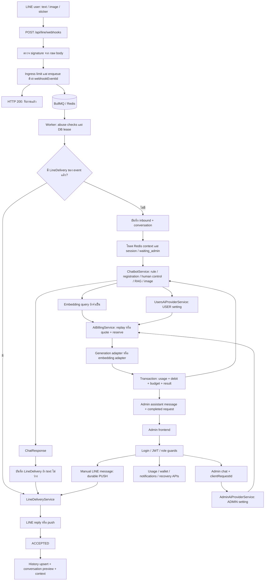
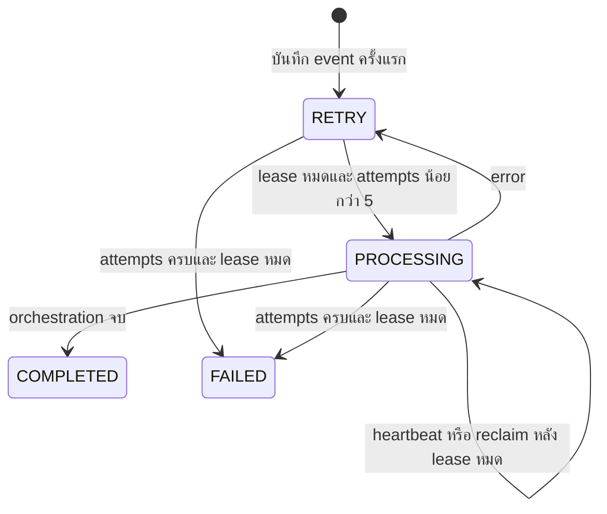
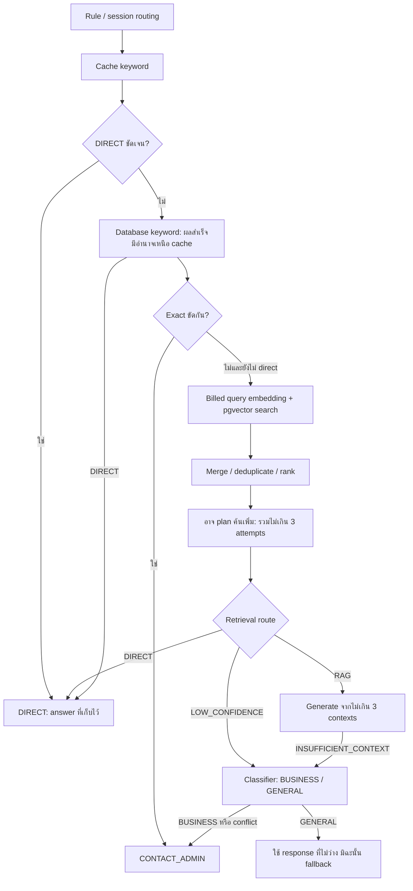
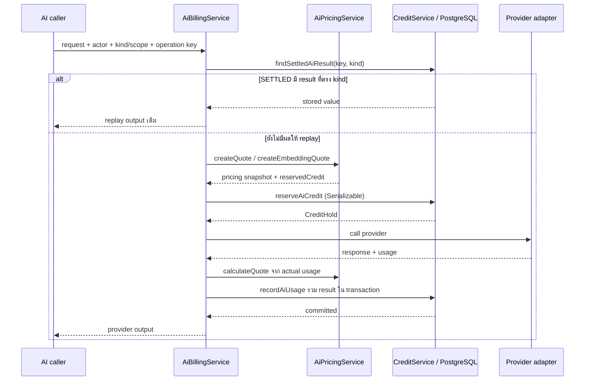
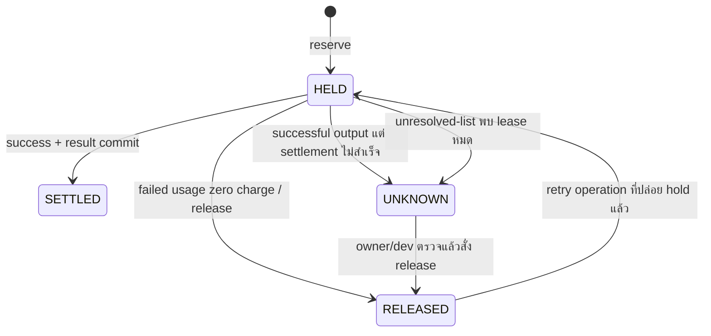
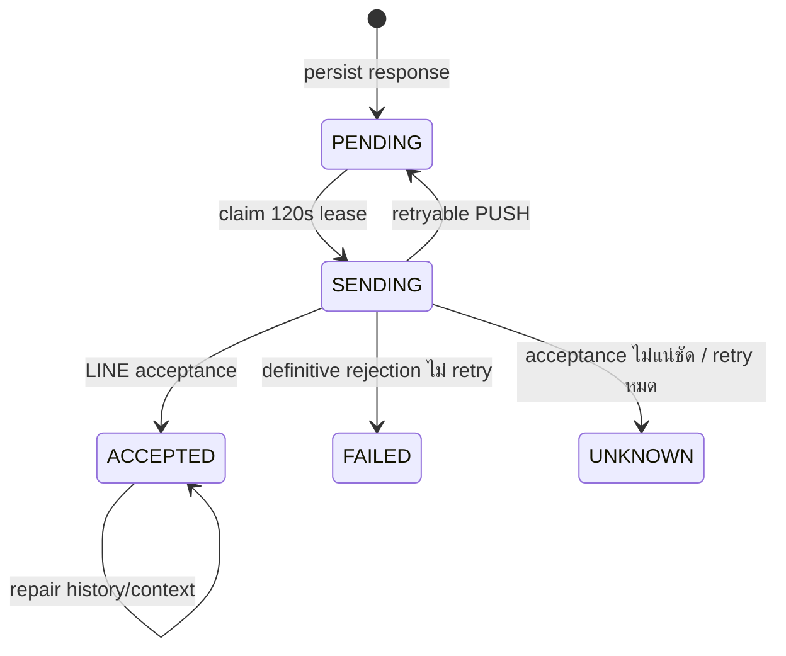
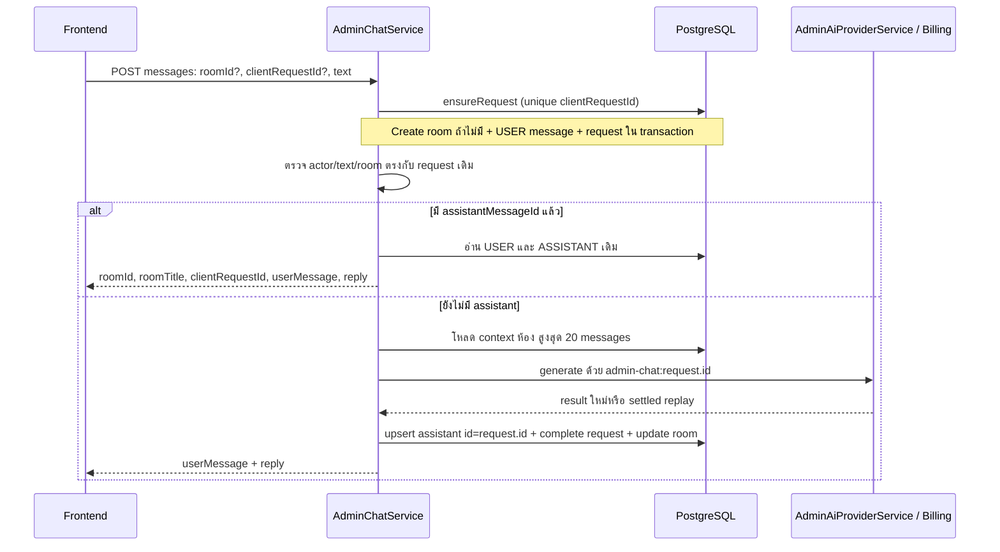
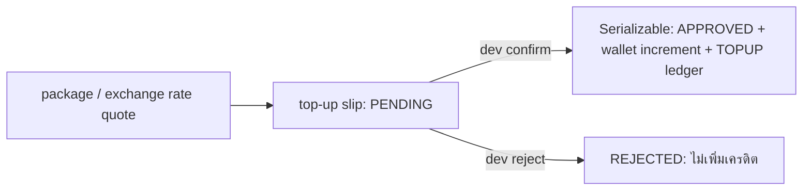

# End-to-end ปัจจุบัน: LINE, RAG, Admin, Credit และ Delivery

อัปเดตจาก working tree วันที่ **8 กันยายน 2026** รวมงานที่ยังไม่ commit เอกสารนี้แทน flow เดิมในไฟล์เดียวกัน อธิบาย runtime ที่มีอยู่จริงหลังแก้ release blockers ทั้ง 6 จุด

เอกสารประกอบ: [LINE และ data contracts](line-message-e2e-current.md) · [Service dependencies](service-flow.md) · [ผล system E2E](mvp-system-e2e-results-2026-09-07.md) · [Audit และงานที่ยังขาด](mvp-readiness-audit-2026-09-07.md)

## 1. ขอบเขตระบบและความหมายของคำว่า “สำเร็จ”

หนึ่ง deployment ใช้บริษัท/LINE OA และ wallet บริษัทส่วนกลาง ข้อความ LINE, admin AI และ embedding หัก wallet เดียวกัน โดย budget จำกัดตาม kind/scope ไม่ใช่ wallet ส่วนตัวของลูกค้า

| เหตุการณ์ | ความหมาย | ยังไม่ยืนยันอะไร |
| --- | --- | --- |
| Webhook HTTP 200 | enqueue events สำเร็จ หรือไม่มี event ที่ต้อง enqueue | AI สำเร็จหรือ LINE ได้รับคำตอบ |
| Reservation HELD | จองเครดิตใน wallet/budget แล้ว | ยังไม่ใช่ debit |
| Reservation SETTLED | usage, ยอดเงิน, ledger ถ้ามี charge และ result commit แล้ว | LINE acceptance |
| Webhook COMPLETED | orchestration จบ รวมกรณีไม่ตอบ/มี durable delivery แล้ว | delivery อาจ PENDING/FAILED/UNKNOWN |
| Delivery ACCEPTED | ระบบบันทึกว่า LINE API รับการส่งแล้ว | ผู้ใช้เปิดอ่าน |
| Delivery finalizedAt | ขั้นบันทึก local history/context ทำงานจบ | Redis context ครบแน่นอน: appendTurn อาจคืน false |

หนึ่งข้อความอาจไม่มี AI call หรือมี embedding, planner, classifier และ generation หลาย calls แต่ละ call มีการคิดเครดิตของตนเอง การส่ง LINE push ยังไม่เรียก credit billing แม้ enum มี LINE_PUSH_MESSAGE

## 2. แผนภาพรวม end to end

ลูกศรกลับ BOT/HISTORY แสดงการคืนผลไปยัง caller ของ call นั้น ไม่ใช่หนึ่ง call ส่งไปทั้งสอง flow

## 3. Login, owner bootstrap และสิทธิ์

1. POST /api/admin/auth/login รับ AdminLoginDto ผ่าน Zod validation
2. AdminAuthService หา username และ bcrypt.compare กับ hash; ไม่พบ/รหัสผิดคืน 401
3. สำเร็จคืน accessToken, tokenType=Bearer, expiresIn และ admin โดยตัด password ออก
4. AdminGuard ใช้ JWT authentication และโหลดบัญชีปัจจุบันจาก DB; role ปัจจุบันเป็นตัวกำหนดสิทธิ์ ไม่เชื่อ role ใน token อย่างเดียว บัญชีที่ถูกลบใช้ token ต่อไม่ได้
5. Admin ใช้งานห้องของตนและ API ที่เปิดให้ admin; owner/dev ตรวจห้องอื่นและจัดการ shared provider/budget ตาม decorator ของแต่ละ route

POST /api/admin/auth/owner เป็น public bootstrap ใช้ AdminBootstrap singleton ใน transaction กันสร้าง owner พร้อมกัน; ไม่ใช่ setup secret หรือการยืนยันสิทธิ์ผู้สมัครคนแรก ส่วน POST /auth/add ต้อง owner/dev และ service ไม่อนุญาตสร้าง role dev

Login ยังไม่มี rate limit/lockout และ audit trail ครบทุก authentication event ใน scope นี้

Source: [controller](../src/modules/admin/auth/admin-auth.controller.ts), [service](../src/modules/admin/auth/admin-auth.service.ts), [JWT](../src/modules/admin/auth/admin-jwt.service.ts)

## 4. Webhook → queue → durable claim

- ตรวจ HMAC-SHA256 ของ raw body ด้วย LineSignatureGuard
- กรอง event ที่ไม่มี webhookEventId; ingress เกิน limit คืน 503 ให้ upstream retry ไม่ตอบรับแล้วทิ้งทั้ง batch
- enqueue ด้วย jobId=webhookEventId; BullMQ กันซ้ำขณะ job ยัง retained และ DB claim กันซ้ำหลัง job ถูกลบ
- worker ต้องมี source.userId; เช็ก ban ทุกครั้ง ส่วน burst/hourly/spam เช็กกับ initial processing และข้ามใน retry
- งานเก่าไม่ถูกทิ้งเพราะเกิน 50 วินาทีแล้ว ค่า LINE_EVENT_MAX_AGE_MS ปัจจุบันใช้สร้าง replyUntil เพื่อเลือก reply/push
- worker ใช้ Map จัดลำดับต่อ user ภายใน process; ยังไม่ใช่ distributed ordering ข้าม replica
- claim เก็บ event, status, leaseOwner, leaseUntil, attempts, lastError ใน processedLineWebhookEvent
- claim ที่สำเร็จเป็น PROCESSING มี lease 120 วินาที ต่ออายุทุก 30 วินาที; ผู้เขียนผลต้องมี leaseOwner ตรง
- สำเร็จเป็น COMPLETED; error เป็น RETRY และเลื่อน leaseUntil 10 วินาที ตัว recovery scan ทุก 15 วินาที enqueue งาน lease หมดใหม่; ครบ 5 claims แล้วหมด leaseจะเป็น FAILED

Main queue attempts=1, concurrency=10, worker limit=12/s; retry queue attempts=3, backoff เริ่ม 2s แบบ exponential, concurrency=3 ตัวเลข queue attempts ไม่ใช่จำนวน AI bills และไม่เท่ากับจำนวน DB claims

Source: [controller](../src/modules/line/line.controller.ts), [processor](../src/modules/line/line-events.processor.ts), [queue config](../src/modules/line/line.module.ts)

## 5. Inbound, human control และ registration

LineWebhookService ตรวจ delivery ของ event ก่อน หากมีแล้วเรียกส่ง/repair ต่อโดยไม่สร้างคำตอบใหม่ หากไม่มีจึงหา/สร้าง LineMember จาก LINE profile, upsert conversation และบันทึก USER history ใน transaction

lineMessageId unique กัน inbound ซ้ำและกัน unreadCount เพิ่มซ้ำ แม้ workers ผ่าน read พร้อมกัน service จัดการ unique violation โดยอ่านแถวเดิมกลับ

| Input / session | Flow ปัจจุบัน |
| --- | --- |
| Text ว่าง / ยาวเกิน | template ระบบ; ไม่มี AI call |
| Human controlled: ADMIN / PAUSE / requiAdmin | text/image/sticker หยุดตอบ; text ยกเลิกที่รองรับยังผ่านได้ |
| CANCEL | clear session และ waiting_admin → open; ChatResponse ใช้ CLEAR |
| REGISTER active | ต่อ registration เว้นแต่ถูก interrupt ด้วย rule ที่รองรับ; ตรวจ CAN_REGISTER |
| เริ่ม REGISTER | CAN_REGISTER=false คืนข้อความปิดรับสมัคร; ไม่เริ่ม flow |
| Registration สำเร็จ | ตรวจข้อมูล/ข้อมูลซ้ำ สร้าง member พร้อม bcrypt hash และคืน credentials; ไม่เก็บ turn นี้ใน AI context |
| POST /registration/register | Zod RegisterDto → ถ้า CAN_REGISTER=false คืน 403 → RegistrationService |
| Image จาก external content provider | ส่งข้อความไม่รองรับ |
| Image จาก LINE | download → human-control/image policy → billed image analysis; SAFE_GENERAL จึงใช้ answer มิฉะนั้น fallback |
| Sticker | StickerIntentService/template และเส้นทางที่ service รองรับ; ไม่ถือว่าทุก sticker ต้องเรียก AI |
| Postback | เก็บ inbound ได้ แต่ processEvent ไม่เข้า auto AI reply |

Public registration เมื่อเปิด feature ยังไม่มี authentication/signature guard ของ LINE; feature gate ไม่ใช่การยืนยันตัวตน

UserSessionService ตรวจ waiting_admin ใน PostgreSQL ก่อนใช้ Redis ทำให้ handoff อยู่ต่อได้แม้ Redis session หมดอายุ การขอ admin เก็บสถานะแล้วเรียก notification เมื่อเปลี่ยนเข้าสู่ requiAdmin; notification error ถูก catch จึงต้องตรวจทั้ง waiting queue และ notification

## 6. Text → hybrid RAG → final answer

- KnowledgeRetrievalService ตรวจ exact answers ที่ขัดกันก่อนเลือก DIRECT; conflict route ไป handoff
- DIRECT: exact หรือ top score ≥0.95 และ gap ≥0.1 (มี candidate เดียวถือว่าชัด)
- RAG: contexts score ≥0.6 จำนวนไม่เกิน 3; keyword raw score หาร 5 แล้ว clamp 0–1
- Cosine/keyword score เป็นคะแนนจัดอันดับ ไม่ใช่เปอร์เซ็นต์ความถูกต้อง
- Semantic SQL ใช้ answerPatternVector JOIN answerPattern กรอง pattern/vector active และ embeddingModel ตรงกับ query model
- Planner ทำ follow-up rewrite จาก history ได้โดยไม่ใช้ LLM หรือใช้ billed generation วางแผน; query เพิ่มไม่ซ้ำและรวม original ไม่เกิน 3 attempts
- หลัง second pass ไม่อนุญาต DIRECT จาก query ที่ rewrite; ใช้ grounded generation หรือ fallback ตามหลักฐาน
- AiChatService คืน stored answer ของ DIRECT โดยไม่ generate; semantic DIRECT ยังเสีย query embedding credit
- GENERAL จาก classifier ใช้ response ที่ classifier สร้าง ไม่เรียก generation ซ้ำอัตโนมัติ ถ้าไม่มี generatedResponse จะ fallback
- PendingAiUsageError ถูก rethrow ผ่าน retrieval/planner/classifier/answer services; error ทั่วไปหลายจุดถูก catch แล้ว fallback จึงไม่ใช่ทุก provider error จะไป retry queue

Source: [retrieval](../src/modules/chatbot/knowledge/knowledge-retrieval.service.ts), [router](../src/modules/chatbot/intent-router.service.ts), [answer](../src/modules/chatbot/aichat.service.ts)

## 7. Provider selection และ metering

Generation รองรับ GEMINI, OPENAI, ANTHROPIC, MAXPLUS ผ่าน adapter registry ผู้ใช้ LINE ใช้ setting scope USER; admin ใช้ scope ADMIN ร่วมกันและตรวจ enabled/role รายบัญชี Request ของ admin chat ไม่เลือก model เอง

AdminAiProviderService ตรวจ aiEnabled, catalog และ setting ก่อนเข้ billing; role admin ต้องมี budget limit ส่วน owner/dev ไม่บังคับต้องมี limit แต่ยังติด wallet และ limit ที่มีอยู่

AiProviderService retry generation provider เดิมภายใน billed call: default 2 attempts รวมครั้งแรก, delay 300ms, เริ่ม retry เมื่อ elapsed <20s และ error retryable ไม่ได้เป็น hard deadline ทั้ง turn Embedding adapter ไม่ผ่าน retry loop นี้

Adapters normalize inputTokens, cachedInputTokens, cacheWriteTokens, outputTokens ตาม provider โดย output ที่รายงานอาจรวม reasoning billing ตรวจ provider/model ตรง quote และ usage มีค่าที่ bill ได้ ก่อนคำนวณ charge

Embedding ใช้ adapter ที่ตั้งไว้แยกจาก generation provider: query/task RETRIEVAL_QUERY และ document/task RETRIEVAL_DOCUMENT ถ้า provider ไม่มี token statistics adapter อาจคืน estimated usage; marker ยังไม่อยู่ใน AiUsageEvent

## 8. เครดิต: replay → quote → reserve → provider → settle

### ข้อบังคับและสูตร

availableCredit = balanceCredit − reservedCredit; ก่อน reserve ต้อง active และ available หลัง reserve **มากกว่า** minimum ซึ่งอย่างน้อย 20 credits ถ้าเท่ากับ minimum ก็ปฏิเสธ Budget เช็ก used + reserved + hold กับ limit

Pricing ต้อง active มี input rate >0; generation ต้อง output rate >0 ด้วย ส่วน embedding output rate=0 ได้ Quote ตรึง pricing row ที่ใช้ตอนเริ่ม ไม่เปลี่ยนราคากลาง call

chargedCredit = ผลรวม token แต่ละ bucket × credit rate ของ bucket × long-context multiplier ที่เข้าเงื่อนไข ÷ 1,000,000 ปัดตาม Decimal(20,6); costThb คำนวณอีกชุดจาก cost rates Cached/cache-write rate ที่ไม่ตั้งใช้ input rate ตาม pricing logic

Reserve เพิ่ม reservedCredit ของ wallet/budget และสร้างหรือเปิด RELEASED reservation เป็น HELD ใน Serializable transaction; conflict P2034 retry SQL transaction สูงสุด 3 attempts ไม่เรียก provider ใหม่

Settlement success ใน transaction เดียว:

1. ตรวจ hold เป็น HELD และ actual charge ยังอยู่ใน wallet/budget ที่อนุญาต
2. create aiUsageEvents พร้อม tokens, provider/model, pricingId, actor/thread, scope, status
3. ลด reserved ของ wallet/budget; ลด balance; เพิ่ม lifetimeSpent และ usedCredit
4. create creditLedger DEBIT เฉพาะ charge >0 พร้อม unique idempotencyKey และ balanceAfterCredit
5. เปลี่ยน reservation เป็น SETTLED และเก็บ result envelope: kind + value

### State และ error

- provider throw: บันทึก failed usage zero charge แล้วปล่อย hold; ถ้าบันทึกล้ม wrapper พยายาม release และ rethrow provider error
- provider/model/usage ไม่ผ่าน validation: failed event ไม่มี debit; ไม่ได้แปลว่า upstream ไม่คิดเงิน
- success แต่ settlement ล้ม: mark UNKNOWN และ throw PendingAiUsageError ไม่ปล่อย hold อัตโนมัติ ไม่ส่ง success answer
- HELD/UNKNOWN/SETTLED เดิมไม่ให้ reserve ซ้ำ; หาก settle ระหว่าง replay lookup กับ reserve มี replay lookup อีกครั้งหลัง PendingAiUsageError
- SETTLED เก่าที่ result ว่างยัง replay ไม่ได้; ledger/tokens ไม่สามารถ reconstruct คำตอบได้
- UNKNOWN ยังไม่มี endpoint settle จาก actual usage หรือ recovery payload ที่ครบ; owner/dev release เป็นการตัดสินใจของ operator
- replay อยู่ใน billing แต่ rate-limit/setting/catalog gates ของ outer caller อาจทำงานก่อน ไม่รับรอง retry สำเร็จเมื่อสิทธิ์/settings เปลี่ยน

Source: [billing](../src/modules/usage/billing/ai-billing.service.ts), [credit](../src/modules/usage/credit-point/credit.service.ts), [pricing](../src/modules/usage/billing/ai-pricing.service.ts)

## 9. Operation identities

| Identity | ใช้กับ | ความหมายเมื่อ retry |
| --- | --- | --- |
| webhookEventId | job, DB claim, auto delivery key, LINE turnId | event เดิม |
| lineMessageId | inbound history unique | ไม่เพิ่ม inbound/unread ซ้ำ |
| usage:turnId:fingerprint | generation | fingerprint รวม kind/provider/model/scope/config/prompt/images |
| usage:embed:turnId:fingerprint | embedding | hash task + normalized text |
| adminChatRequests.clientRequestId | HTTP admin chat | UUID ที่ frontend ต้องใช้เดิมเมื่อ retry |
| admin-chat:request.id | admin chat billing | คงที่แม้ต้องบันทึก assistant ใหม่หลัง settlement |
| LineDelivery.retryKey | LINE push | key เดิมตลอด retry ของ delivery |
| LineChatHistory.deliveryId | outbound history | upsert/repair local writes โดยไม่ส่งซ้ำ |

ถ้าไม่มี turnId/explicit key billing สร้าง usage:UUID ใหม่ ถ้า frontend ไม่ส่ง clientRequestId ทุก HTTP request ถือเป็น operation ใหม่ ข้อความเหมือนกันแต่ user ตั้งใจส่งใหม่ใช้ UUID ใหม่ได้

Idempotency ไม่ใช่ exactly-once ทั้ง conversation: generation fingerprint อาจเปลี่ยนเมื่อ context/settings เปลี่ยน; embedding key ไม่รวม model และไม่มี persisted stage plan สำหรับทุก LINE turn

## 10. Durable delivery → LINE → history/context

ChatResponse = text + source + contextPolicy; CLEAR ล้าง Redis ก่อนบันทึก delivery ถ้า text ว่างจะไม่สร้าง delivery หากมีข้อความจะ upsert key=webhookEventId และเก็บ text/replyToken/replyUntil/context ก่อนเริ่มส่ง

LineDeliveryService scan ทุก 5 วินาที สูงสุด 20 rows: PENDING ถึงเวลา, SENDING lease หมด, ACCEPTED ที่ยังไม่มี finalizedAt

- REPLY ใช้เมื่อ token และ replyUntil ยัง valid; reply=false, ไม่มี/หมดอายุ token หรือ definitive invalid-token error จึงไป PUSH
- reply timeout/unknown ไม่ push ทันที เพราะอาจส่งสำเร็จแล้ว; reclaim SENDING ที่ method REPLY เป็น UNKNOWN
- PUSH persist method/firstPushAt ก่อนส่ง ใช้ retryKey เดิม; adapter ยอมรับ 409 ที่มี accepted-request-id เป็น acceptance
- PUSH ที่ retryable กลับ PENDING เมื่อ attempts <8; delay เริ่ม 2s exponential สูงสุด 60s เมื่อ firstPushAt อายุ ≥23h เป็น UNKNOWN เพื่อไม่ retry ใกล้ key expiry
- ACCEPTED แล้วไม่กลับ PENDING เพราะ local finalization ล้ม; recovery ซ่อม history โดย unique deliveryId
- outbound sender เป็น ADMIN เมื่อมี adminMemberId มิฉะนั้น SYSTEM; conversation preview ไม่ถูก delayed repair เขียนทับข้อความใหม่กว่า
- INCLUDE เก็บ context 3 turns/6 messages TTL 30 นาทีและ dedupe eventId; EXCLUDE ไม่ append; CLEAR ไม่ล้างซ้ำจาก delayed delivery repair
- appendTurn คืน false เมื่อ Redis ล้ม แต่ finalize ยังตั้ง finalizedAt ได้ เป็นช่องว่างด้าน context recovery ที่ยังมีอยู่

Source: [delivery service](../src/modules/line/line-delivery.service.ts), [reply](../src/modules/line/line-reply.service.ts), [push](../src/modules/line/admin/line-admin.service.ts), [context](../src/modules/chatbot/context/load-context.service.ts)

## 11. Admin chat → billing → reply HTTP

ใช้ clientRequestId เดิมกับ actor/text/room อื่นคืน 409; room ที่ไม่ได้เป็นเจ้าของไม่ให้ใช้ Request คง PENDING เมื่อ AI ล้มและ retry ได้ตาม billing state หาก debit สำเร็จแต่ assistant transaction ล้ม retry ใช้ stored result แล้วเขียน assistant ต่อ

User/assistant/result persistence ไม่ใช่ transaction เดียวข้าม provider การใช้ deterministic assistant ID และ request record ช่วย repair หลัง settle; ยังไม่มี room-level distributed serialization และ pending request ไม่ได้ freeze history ของทั้ง turn

POST /api/admin/ai-providers/generate เป็น direct generation endpoint แยกจาก chat ไม่สร้าง AdminChatRequest และยังไม่มี HTTP clientRequestId contract นี้

## 12. Manual LINE, notifications และ resume

1. Admin POST /api/line/conversations/:conversationId/messages พร้อม text/clientRequestId
2. ตั้ง conversation.status=waiting_admin เพื่อหยุด bot
3. upsert LineDelivery method PUSH ด้วย key admin:actor:conversation:clientRequestId (ถ้าไม่ส่งใช้ UUID ใหม่)
4. ถ้า key เดิมแต่ text เปลี่ยนคืน 400; ส่งผ่าน delivery service เดียวกับ auto reply
5. ถ้า finalized แล้วคืน history; ถ้ายังไม่มี history คืน deliveryId, text, sentStatus เพื่อให้ frontend ดูสถานะต่อ
6. การส่ง manual ไม่เรียก AI/billing และไม่ได้ append manual text เข้า Redis context
7. Resume-bot clear session + waiting_admin กลับ open และ clear context ก่อนให้ bot กลับมารับข้อความ

NotificationService create adminNotifications พร้อม userId, type/title/message และ metadata เช่น conversationId/displayName/lastMessage/flow/step/status แล้ว emit event ADMIN_NOTIFICATION ผ่าน JWT-guarded socket namespace /admin ไปยังทุก admin socket ที่เชื่อมต่อ Frontend โหลดรายการ/read state จาก REST ได้ ไม่ต้องพึ่ง socket อย่างเดียว

## 13. Knowledge indexing และ top-up

### Document indexing

Admin DTO → buildAnswerPatternDocument → EmbeddingService.embedDocument(adminMemberId) → billed EMBEDDING/document → transaction เขียน answerPattern + vector upsert → refresh process cache → HTTP response

Query: embedQuery → billed EMBEDDING/query → vector search → candidates ส่วน preview/search/deep health บาง endpoint ใช้ embedding และเสียเครดิตได้ Coverage อ่าน index state ไม่ต้อง embed

การแก้ชื่อ raw SQL ครอบคลุม upsert/search/coverage แล้ว แต่ provider debit กับ DB write ไม่ atomic ร่วมกัน: embedding สำเร็จแล้ว vector write ล้มยังมีต้นทุน HTTP document retry ไม่มี stable turnId โดยอัตโนมัติ Update ยังอาจ embed ใหม่แม้เปลี่ยนเฉพาะ metadata

### Top-up

quote/upload ไม่ได้เพิ่ม balance การ confirm ใช้ conditional status และ unique ledger key topup:id กัน approve ID เดิมซ้ำ; ไม่ได้ตรวจว่าสลิปภาพเดียวกันถูกสร้างเป็นคนละ topup ID หรือไม่

## 14. API ที่ frontend ใช้ตาม flow

| API | สิทธิ์หลัก | ข้อมูล / การใช้งาน |
| --- | --- | --- |
| POST /api/admin/auth/login | Public | รับ JWT + admin |
| GET /api/credits/wallet | AdminGuard | balance/reserved/available/lifetime/minimum |
| GET /api/credits/reservations | owner/dev | HELD/UNKNOWN; list จะ mark expired HELD เป็น UNKNOWN |
| POST /api/credits/reservations/:id/release | owner/dev | release UNKNOWN หลังตรวจสอบ |
| GET /api/admin/ai-chat/rooms และ rooms/:roomId/messages | เจ้าของห้อง | chat history |
| GET /api/admin/ai-chat/owner/rooms และ owner/rooms/:roomId/messages | owner/dev | read-only cross-admin audit |
| GET /api/admin/ai-chat/usage/me และ /usage | ตนเอง / owner/dev | usage/budget summary |
| PATCH /api/admin/ai-chat/usage/:adminMemberId/budget | owner/dev | เปลี่ยน budget |
| GET /api/admin/embedding/config, /coverage, /usage | AdminGuard | configuration/index health/embedding events |
| POST /api/admin/embedding/backfill, /preview, /search | owner/dev | indexing/probe มีค่า embedding ตามงาน |
| GET /api/line/conversations และ messages | AdminGuard | inbox/history |
| GET /api/line/deliveries | AdminGuard | PENDING/SENDING/FAILED/UNKNOWN สูงสุด 100 |
| GET /api/line/webhooks/failed | owner/dev | RETRY/FAILED สูงสุด 100 |
| GET /api/admin/notifications และ /unread-count | AdminGuard | รายการล่าสุด / unread |
| PATCH /api/admin/notifications/:id/read, /read-all, /conversation/:conversationId/read | AdminGuard | read state |
| GET /api/admin/usage และ /account | AdminGuard | company/actor usage ตาม role |
| POST /api/admin/bill/top-up; GET /history | AdminGuard | ขอเติมและดู top-up history |
| POST /api/admin/bill/topup/:id/confirm หรือ /reject | dev | ตัดสินใจ top-up |

API ปัจจุบันยังไม่มี general paginated usage-event/credit-ledger endpoint ที่รวม LINE/admin/token filters ครบทุก dashboard และไม่มี UNKNOWN settlement settle action พร้อม actor/reason/evidence audit ครบ การมี usage summary ไม่เท่ากับมี every-event token log ส่งไป frontend แล้ว

## 15. Migration, validation และขอบเขตหลักฐาน

ใช้ migration 20260907000000_fix_mvp_release_blockers ต่อจาก rename/recovery migrations:

- สร้าง adminNotifications / lineFollowerSnapshots
- แปลง aiSettings.id BIGINT → UUID โดยรักษา settings fields; เลข id เดิมเปลี่ยนเป็น UUID ใหม่ ไม่มี FK อ้างใน schema
- เพิ่ม creditReservation.result JSONB
- สร้าง adminChatRequests พร้อม unique keys และ foreign keys ไป admin/room/messages

ต้อง deploy migrations ใน target database และ generate Prisma client ก่อนเริ่มโค้ดรุ่นนี้ การ migrate ฐานทดสอบไม่ใช่การ migrate ฐานใช้งานหลัก

ผลที่รันไว้: build/typecheck ผ่าน, unit 98/98, isolated audit 16/16, system E2E 42/42 และ clean PostgreSQL deploy 30 migrations ผ่าน Wallet fixture 1000 → 981.825, usage/debit 18.175, reserved=0

E2E ใช้ AppModule/Fastify + PostgreSQL/pgvector/Redis/BullMQ/Mongo จริง แต่ AI SDK/LINE HTTP เป็น fixtures จึงยังไม่รับรอง live pricing/tokenizer, คุณภาพ RAG ภาษาไทย, browser rendering, multi-process crash/restart หรือ distributed ordering ดู [รายงานผล](mvp-system-e2e-results-2026-09-07.md) สำหรับรายละเอียด

งานที่ยังเปิด: UNKNOWN settlement reconciliation, login/bootstrap protection, whole-turn replay เมื่อ context/settings เปลี่ยน, distributed ordering, context repair ที่ appendTurn=false, dashboard logs และ staging smoke test กับ upstream จริง
