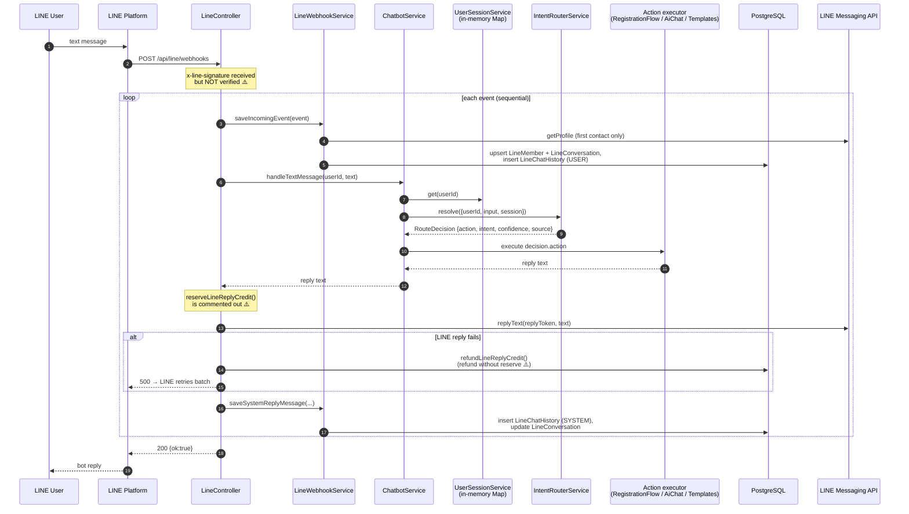
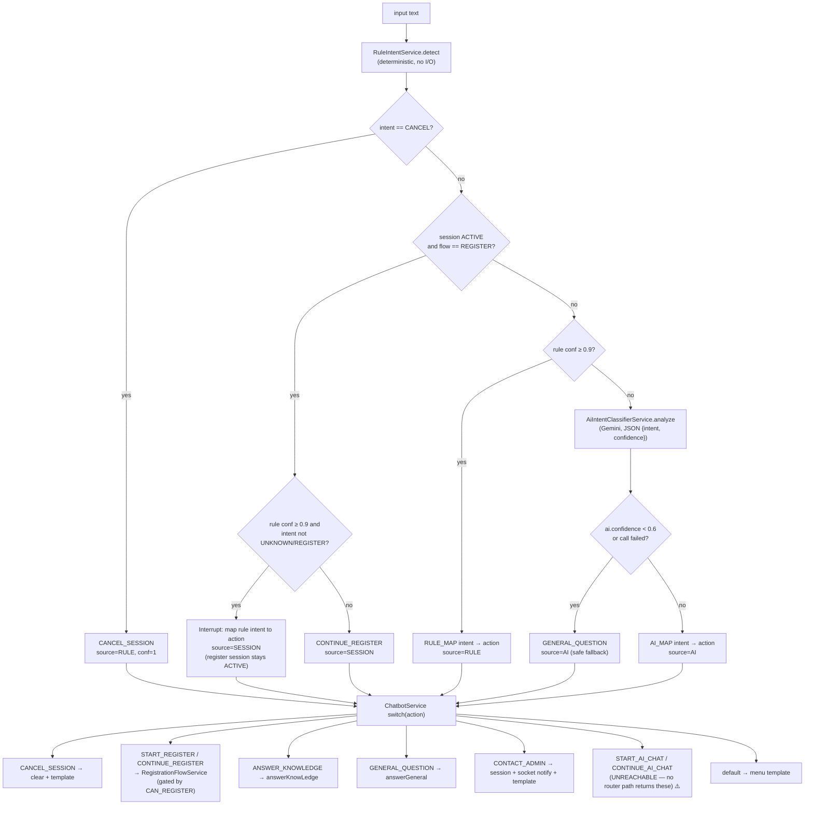
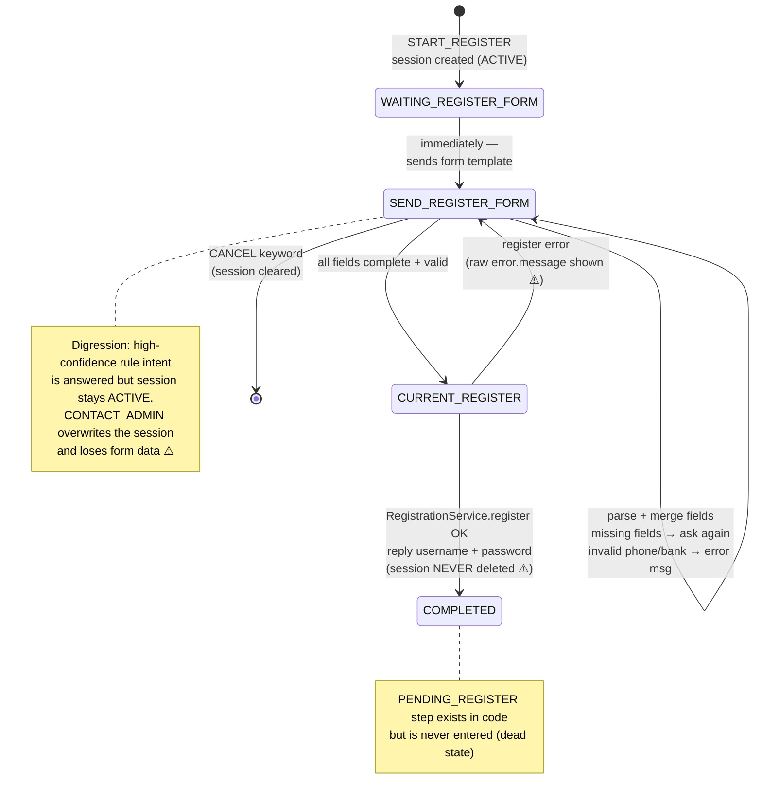
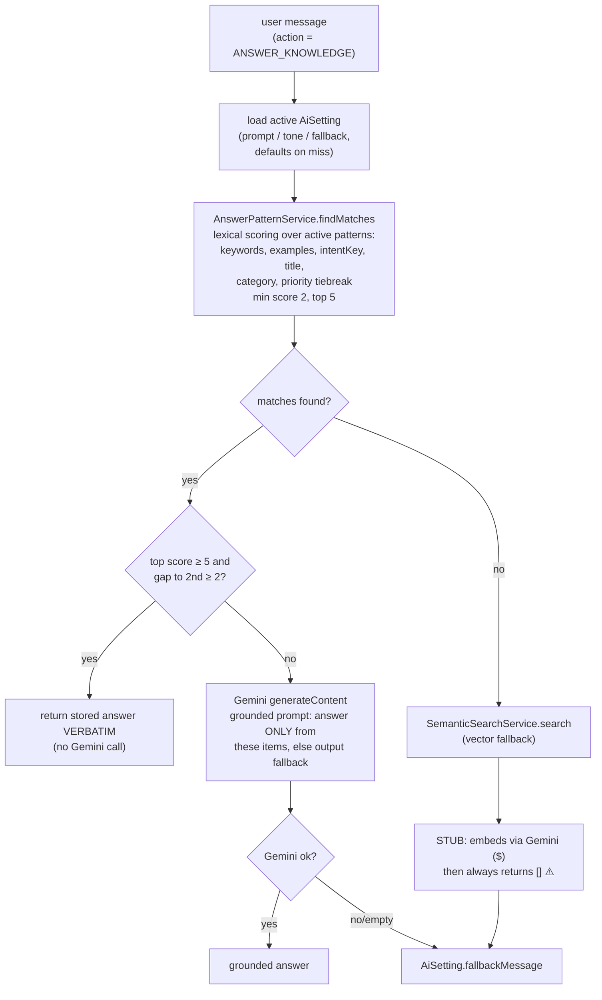
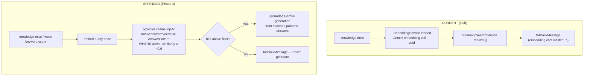
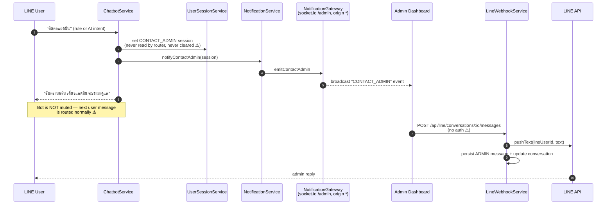
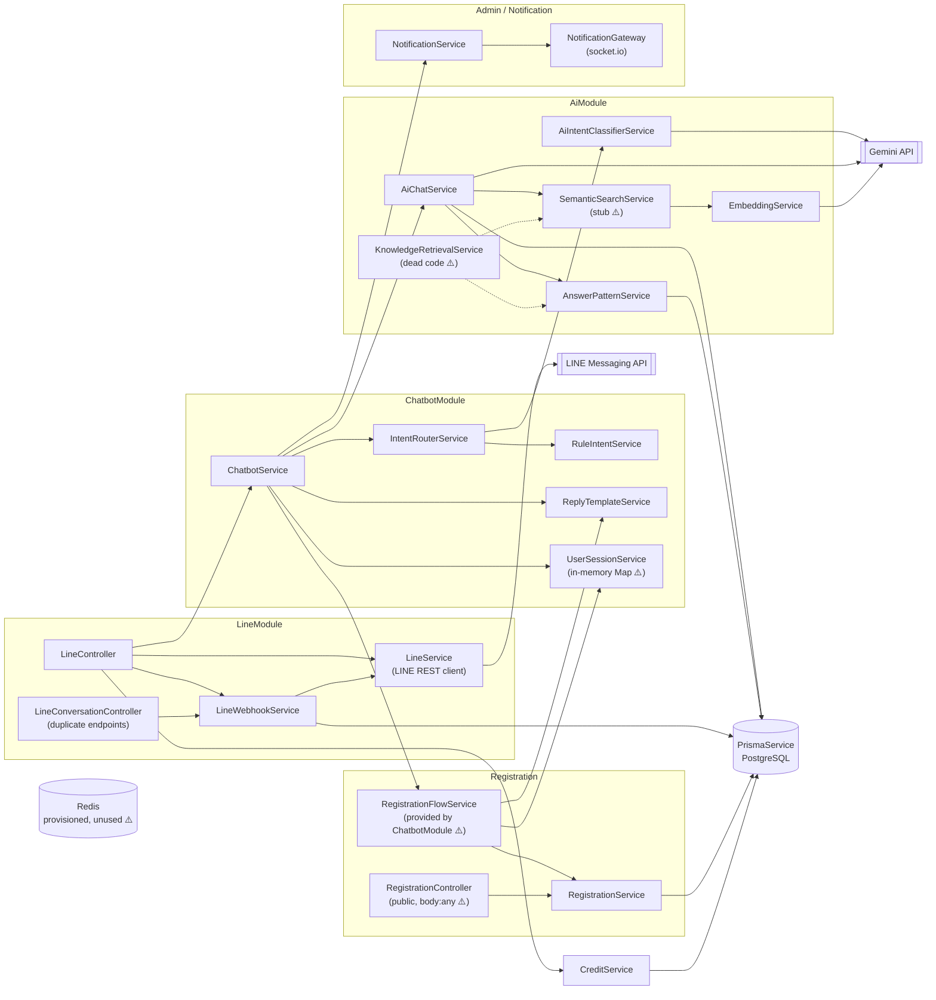

# Service Flows & Dependency Diagram

> **เอกสารนี้เป็น architecture review รุ่นเก่าและหลายส่วนไม่ตรงกับโค้ดปัจจุบันแล้ว**
> สำหรับ LINE flow ปัจจุบันที่มี signature guard, BullMQ, Redis session/context,
> idempotency และ rate limits ให้ใช้ [line-message-e2e-current.md](./line-message-e2e-current.md)

> Companion docs: [ai-chatbot-architecture.md](./ai-chatbot-architecture.md) · [erd-database.md](./erd-database.md)
>
> The diagrams below are retained as a **historical architecture-review snapshot**. Target behavior from that review is in the architecture doc §7.

---

## 1. Full LINE Message Flow

No dedupe by `lineMessageId`: a LINE redelivery re-runs the whole pipeline, including Gemini calls.

---

## 2. Intent Routing Flow

`IntentRouterService.resolve()` — the decision policy:

Known routing gaps: menu `3` (offered by the default menu) has no rule → goes to the AI classifier; menu `2` sends the literal `"2"` to `answerGeneral`.

---

## 3. Register Session Flow

Registration internals: `RegisterParser` reads labeled lines (`ชื่อ: สมชาย`, aliases in Thai/English) and infers unlabeled lines (10-digit phone, 10–12-digit account, bank-name aliases, text-only lines as first/last name). `RegistrationService.register()` checks phone/bank uniqueness, generates `mb{last4}{rand}` username + random hex password (bcrypt-stored), retries on username collision.

---

## 4. Knowledge Answer Flow

`AiChatService.answerKnowLedge()`:

`answerGeneral()` (small talk) never touches the knowledge base: system prompt + general rules (no business-status claims, don't reveal being an AI) → Gemini → text or fallback.

---

## 5. Vector Fallback Flow — current vs intended

Blockers for the intended flow: no migration exists for `AnswerPatternVector` (no `CREATE EXTENSION vector`, no table DDL, no index), and nothing ever writes embeddings (needs embed-on-write in AnswerPattern CRUD + a backfill). `KnowledgeRetrievalService` already sketches the keyword-first/vector-fallback merge but is dead code.

---

## 6. Admin / Contact Handoff Flow

Target (architecture doc §5.4/§7): handoff sets `LineConversation.status = 'admin'` in PostgreSQL, the bot mutes while that status holds, and an active register session survives the handoff.

---

## 7. Service Dependency Diagram

**Prisma access:** `LineWebhookService`, `AiChatService`, `AnswerPatternService`, `RegistrationService`, `CreditService`, `UsersService`.
**External APIs:** `LineService` → LINE; `AiIntentClassifierService`, `AiChatService`, `EmbeddingService` → Gemini (three separate `GoogleGenAI` instances — should be one shared provider).
**Unused infra:** Redis client, BullMQ, Mongoose (required at boot, used by nothing).

**Couplings that should not exist:**
- `LineController` → `CreditService` + `ChatbotService` + `LineWebhookService` + `LineService`: the controller orchestrates; move this into a webhook-handler service and keep the controller thin.
- `ChatbotModule` providing `RegistrationFlowService`/`RegisterParser`/`RegisterValidator` (registration internals): they belong in `RegistrationModule`'s exports.
- `AiChatService` → `AnswerPatternService` + `SemanticSearchService` directly, duplicating `KnowledgeRetrievalService`: retrieval should have exactly one entry point.
- `AiChatService` → Prisma for `AiSetting`: acceptable pragmatically, but a small settings accessor would keep the LLM service free of DB reads.
- `ChatbotService` → `NotificationService` (admin domain): fine as a direct call at this scale, but the handoff state itself belongs in `LineConversation.status`, not the chat session.
