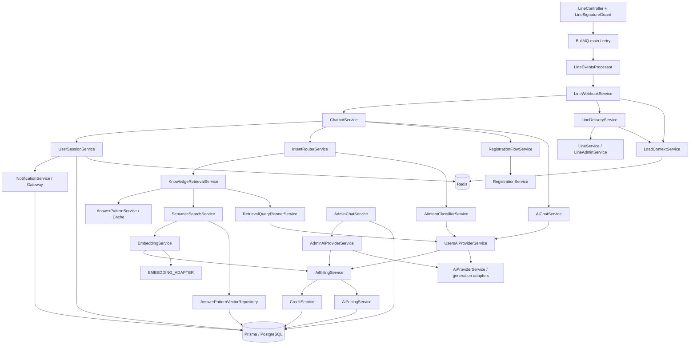

# Service Flows & Dependencies — current implementation

อัปเดต **8 กันยายน 2026** แก้จากไฟล์เดิมให้ตรง working tree หลัง recovery/replay migrations

เอกสารหลัก: [E2E ทั้งระบบ](mvp-line-rag-billing-flow.md) · [LINE field/state flow](line-message-e2e-current.md) · [ผลทดสอบ](mvp-system-e2e-results-2026-09-07.md)

## 1. Dependency map


```mermaid
flowchart TD
    LC["LineController + LineSignatureGuard"] --> Q["BullMQ main / retry"]
    Q --> EP["LineEventsProcessor"]
    EP --> WH["LineWebhookService"]
    WH --> CB["ChatbotService"]
    WH --> DL["LineDeliveryService"]
    WH --> CTX["LoadContextService"]
    CB --> SS["UserSessionService"]
    SS --> NS["NotificationService / Gateway"]
    CB --> IR["IntentRouterService"]
    CB --> REG["RegistrationFlowService"]
    REG --> RS["RegistrationService"]
    IR --> KR["KnowledgeRetrievalService"]
    IR --> IC["AiIntentClassifierService"]
    KR --> KW["AnswerPatternService / Cache"]
    KR --> SEM["SemanticSearchService"]
    KR --> PL["RetrievalQueryPlannerService"]
    SEM --> EMB["EmbeddingService"]
    SEM --> V["AnswerPatternVectorRepository"]
    CB --> AC["AiChatService"]
    AC --> UP["UsersAiProviderService"]
    IC --> UP
    PL --> UP
    ADM["AdminChatService"] --> AP["AdminAiProviderService"]
    UP --> BILL["AiBillingService"]
    AP --> BILL
    EMB --> BILL
    BILL --> CR["CreditService"]
    BILL --> PR["AiPricingService"]
    UP --> PS["AiProviderService / generation adapters"]
    AP --> PS
    EMB --> EA["EMBEDDING_ADAPTER"]
    DL --> L["LineService / LineAdminService"]
    DL --> CTX
    CR --> PG[("Prisma / PostgreSQL")]
    PR --> PG
    V --> PG
    ADM --> PG
    NS --> PG
    SS --> PG
    CTX --> REDIS[("Redis")]
    SS --> REDIS
```

Billing รับ callback ของ provider caller จึงทำ reserve ก่อน callback แล้ว settle ก่อนคืน result; dependency ไป adapter ไม่ได้แปลว่า caller ข้าม billing

## 2. Service ownership

| Service | รับผิดชอบ | Durable data / boundary |
| --- | --- | --- |
| LineController | signature/ingress/enqueue/HTTP admin inbox | queue jobId=webhookEventId |
| LineEventsProcessor | abuse, in-process ordering, lease heartbeat, retry recovery | processedLineWebhookEvent |
| LineWebhookService | reuse delivery, save inbound, orchestrate response, manual send/resume | member/conversation/history/delivery |
| LineDeliveryService | claim/send/retry/finalize | lineDelivery และ unique outbound deliveryId |
| ChatbotService | session gate, rule action, registration, image/sticker, ChatResponse policy | response ต่อ caller |
| UserSessionService | session และ human handoff | Redis + DB waiting_admin |
| LoadContextService | delivered conversation context/redaction | Redis 3 turns/TTL30m |
| KnowledgeRetrievalService | hybrid pool/ranking/planner/route | retrieval result; ไม่ส่ง LINE |
| SemanticSearchService | query embedding + pgvector candidates | answerPatternVector/answerPattern |
| AdminAnswerPatternService | document build/embed/write/cache refresh | pattern + vector transaction หลัง billing |
| UsersAiProviderService | USER provider setting → LINE_AI_REPLY | actor/thread context |
| AdminAiProviderService | ADMIN setting, enabled/catalog/budget requirement | ADMIN_AI_QUERY, scope admin ID |
| AiProviderService | registry + generation provider retry | GEMINI/OPENAI/ANTHROPIC/MAXPLUS |
| EmbeddingService | query/document task, AI rate gate, operation key | EMBEDDING/query หรือ document |
| AiBillingService | replay, quote, reserve, callback, validate, settle | result กลับหลัง commit |
| AiPricingService | active quote และ Decimal token bucket rates | aiModelPricing |
| CreditService | wallet/budget/hold/usage/ledger | Serializable settlement + result envelope |
| AdminChatService | HTTP idempotency, room ownership, history/recovery | adminChatRequests / rooms / messages |
| AdminAuthService + JWT guards | login/owner bootstrap/current-role authorization | adminMember/AdminBootstrap |
| NotificationService | handoff notification/read state | adminNotifications + socket /admin |

## 3. Main use cases

| Trigger | Call chain | Result |
| --- | --- | --- |
| Login | AuthController → bcrypt → JWT | Bearer token + safe admin |
| LINE exact | webhook → worker → chatbot → cache/DB DIRECT → delivery | ไม่มี generation; keyword directไม่เสีย embedding |
| LINE semantic DIRECT | retrieval → billed query embedding → vector search → delivery | เสีย EMBEDDING เท่านั้น |
| LINE RAG | retrieval → อาจ planner/search เพิ่ม → billed answer → delivery | หลาย usage events ต่อคำตอบ |
| Low confidence | retrieval → classifier → general response / admin | classification call มี bill หาก success |
| LINE image | media download → chatbot policy → billed image analysis → delivery | safe answer / fallback ตาม policy |
| Registration | flag + parser/validator/session → RegistrationService | member credentials; CLEAR context |
| Admin chat | request identity → history → Admin provider/billing → assistant transaction | HTTP reply หรือ replay |
| Manual LINE | admin inbox API → waiting_admin → delivery PUSH | history หรือ pending status |
| Knowledge write | document embed/bill → pattern+vector write → cache refresh | indexed article |
| Top-up | quote → PENDING → dev confirm transaction | wallet/TOPUP ledger เพิ่มเมื่อ approve |
| Notification | handoff → DB row → socket; frontend GET/mark read | staff เปิด conversation |
| Recovery | periodic scan → expired claim/delivery repair | จัดการงานที่ DB ระบุ ไม่ใช่เรียก AI ใหม่ทุกครั้ง |

## 4. Transaction boundaries และข้อจำกัด

```text
Inbound transaction:
  conversation upsert + USER history + member lastActive
  unique lineMessageId กัน duplicate unread increment

Reservation transaction:
  creditReservation HELD + wallet.reserved + budget.reserved

Provider call:
  external I/O นอก PostgreSQL transaction

Settlement transaction:
  aiUsageEvent + wallet debit + budget usage + DEBIT ledger ถ้า charge>0
  + reservation SETTLED + JSON result

Admin chat request transaction:
  room ถ้าใหม่ + USER message + adminChatRequest
Admin assistant transaction:
  assistant upsert + request COMPLETED + room update

Auto delivery transaction:
  ตรวจ webhook lease owner + upsert response delivery

LINE acceptance:
  external I/O → persist ACCEPTED → history repair transaction → Redis append
```

ไม่มี distributed transaction ครอบ provider/DB/LINE จึงแยก SETTLED, ACCEPTED, finalizedAt และ UNKNOWN ไม่รวมเป็น success flag เดียว

## 5. Frontend contracts และสิทธิ์

- Admin chat ต้องใช้ clientRequestId UUID เดิมเมื่อ retry ข้อความเดิม เพื่อให้ response และ debit เดิมกลับมา ไม่มี field นี้ถือเป็น request ใหม่
- Manual LINE มี clientRequestId เช่นกัน; HTTP response อาจยังเป็น pending delivery ต้องดู sentStatus/delivery API
- Current role โหลดจาก DB; room access จำกัดเจ้าของ owner/dev มี read-only audit routes แยก
- Shared provider/budget เปลี่ยนโดย owner/dev; confirm/reject top-up ปัจจุบันเป็น dev เท่านั้น
- General usage summary, embedding usage และ wallet เป็นคนละ API; ยังไม่มี unified paginated token/debit event API ครบทุก dashboard
- Socket notification มี JWT guard; REST notifications ใช้ reload/read state เมื่อ socket event พลาด
- Registration falseปิดทั้งเริ่ม/ต่อ LINE flow และ public registration controller แต่ endpoint public ไม่ใช่ LINE identity verification
- Direct provider generate route ไม่มี AdminChatRequest contract ของ chat

ดู route table ที่ [เอกสารหลักส่วน API](mvp-line-rag-billing-flow.md#14-api-ที่-frontend-ใช้ตาม-flow) และตรวจ decorator ใน controller เมื่อกำหนด UI role policy

## 6. Recovery responsibility

| State | ผู้จัดการ | สิ่งที่ไม่ควรตีความเกินจริง |
| --- | --- | --- |
| PROCESSING lease หมด | webhook recovery15s | ยังไม่รับรอง conversation orderingหลาย replicas |
| SETTLED มี result | billing replay | ต้องได้ keyเดิม; outer gatesอาจ blockก่อน billing |
| SETTLED legacy resultว่าง | block reserve | ไม่สามารถสร้างคำตอบเดิมจาก token counters |
| HELDหมด lease | unresolved-list mark UNKNOWN | ไม่ใช่ auto refund timer |
| UNKNOWN reservation | owner/devตรวจแล้ว release | ยังไม่มี actual-usage settle action |
| PENDING / stale PUSH | delivery recovery5s | retryเฉพาะ stored textด้วย retryKeyเดิม |
| stale REPLY / unknown acceptance | UNKNOWN | ไม่ pushซ้ำเพียงเพราะ responseหาย |
| ACCEPTEDไม่มี finalizedAt | local history/context repair | appendTurn=falseยังเป็นช่องว่าง |

## 7. Database และการปล่อยโค้ด

ชื่อ SQL ปัจจุบันเป็น lower camel ตาม mappings: answerPattern, answerPatternVector, aiSettings, adminNotifications, lineFollowerSnapshots, creditWallets, creditBudgets, creditReservation, creditLedger, aiUsageEvents, adminChatRequests, lineDelivery

Migrationล่าสุดแก้ missing tables, aiSettings BIGINT→UUID, เพิ่ม result และ request identity/FKs ต้อง migrate target DBก่อนเริ่ม appที่ใช้ generated Prisma clientใหม่ ฐานทดสอบแยกผ่าน30 migrations ไม่ได้แปลว่าฐานหลัก applyแล้ว

Validation ที่มี: unit98/98, audit16/16, system E2E42/42, build/typecheck ผ่าน โดย external provider/LINE เป็น fixtures ข้อจำกัดและหลักฐานอยู่ใน [รายงานผล](mvp-system-e2e-results-2026-09-07.md)

## 8. Source index

- [Webhook/controller](../src/modules/line/line.controller.ts) · [worker](../src/modules/line/line-events.processor.ts) · [orchestration](../src/modules/line/line-webhook.service.ts) · [delivery](../src/modules/line/line-delivery.service.ts)
- [Chatbot](../src/modules/chatbot/chatbot.service.ts) · [retrieval](../src/modules/chatbot/knowledge/knowledge-retrieval.service.ts) · [answer](../src/modules/chatbot/aichat.service.ts)
- [Admin chat](../src/modules/admin/ai-chat/admin-chat.service.ts) · [billing](../src/modules/usage/billing/ai-billing.service.ts) · [credit](../src/modules/usage/credit-point/credit.service.ts)
- [Embedding](../src/modules/ai/embeding/embedding.service.ts) · [vector repository](../src/modules/ai/embeding/answer-pattern-vector.repository.ts)
