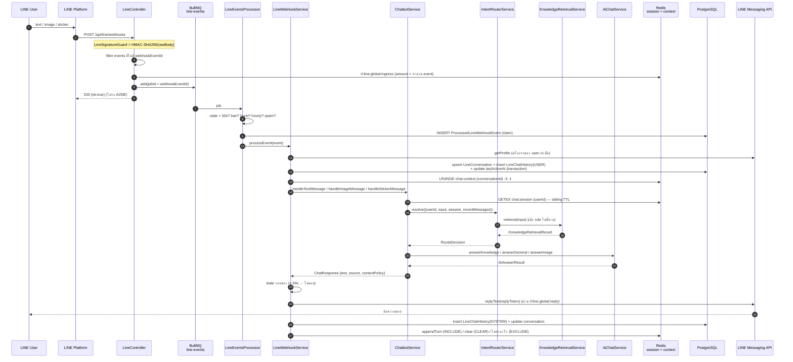
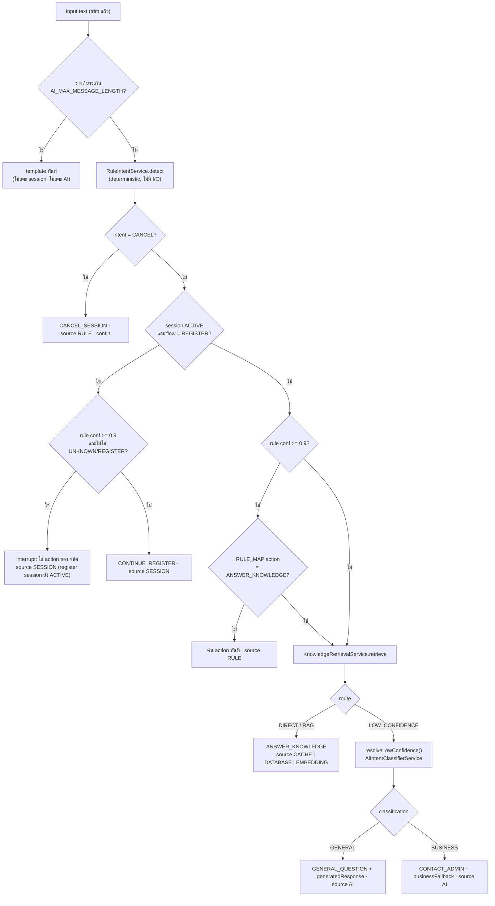
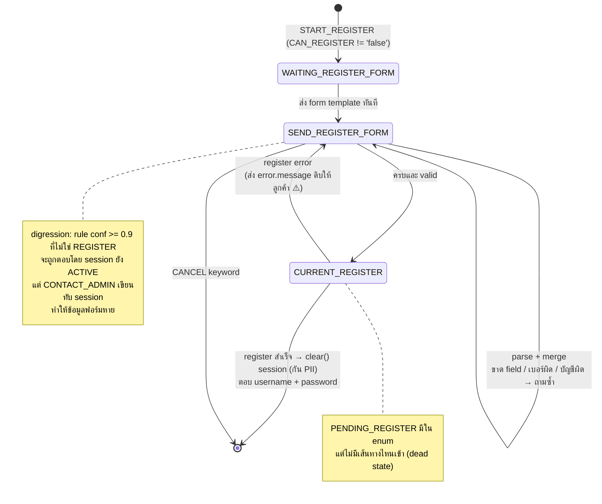
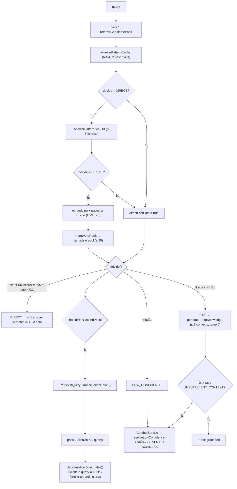
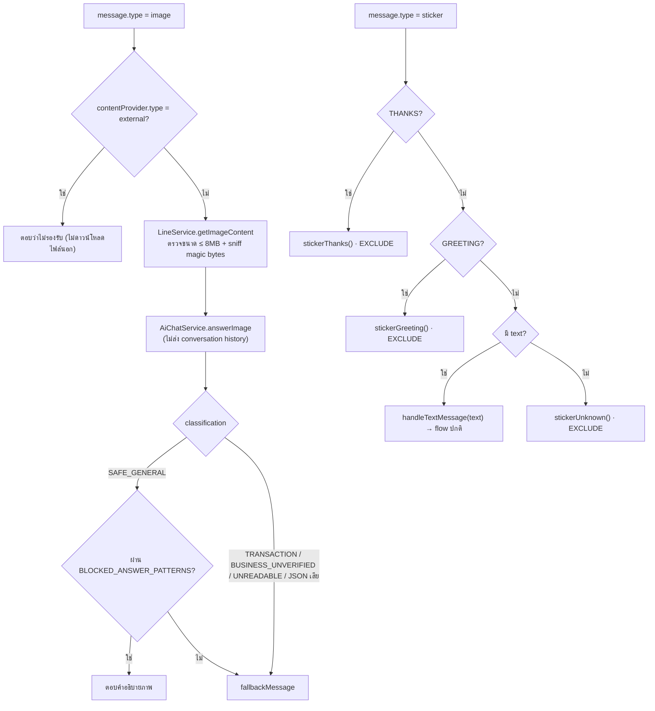
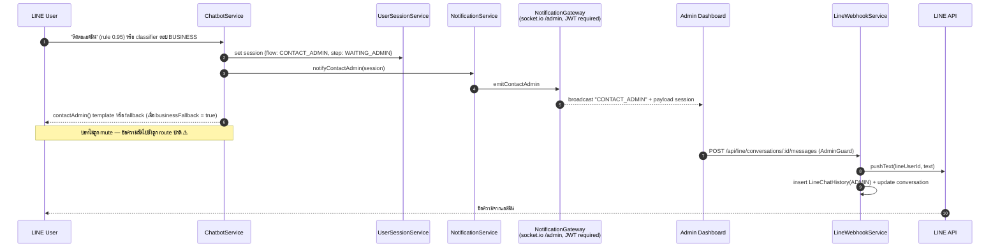
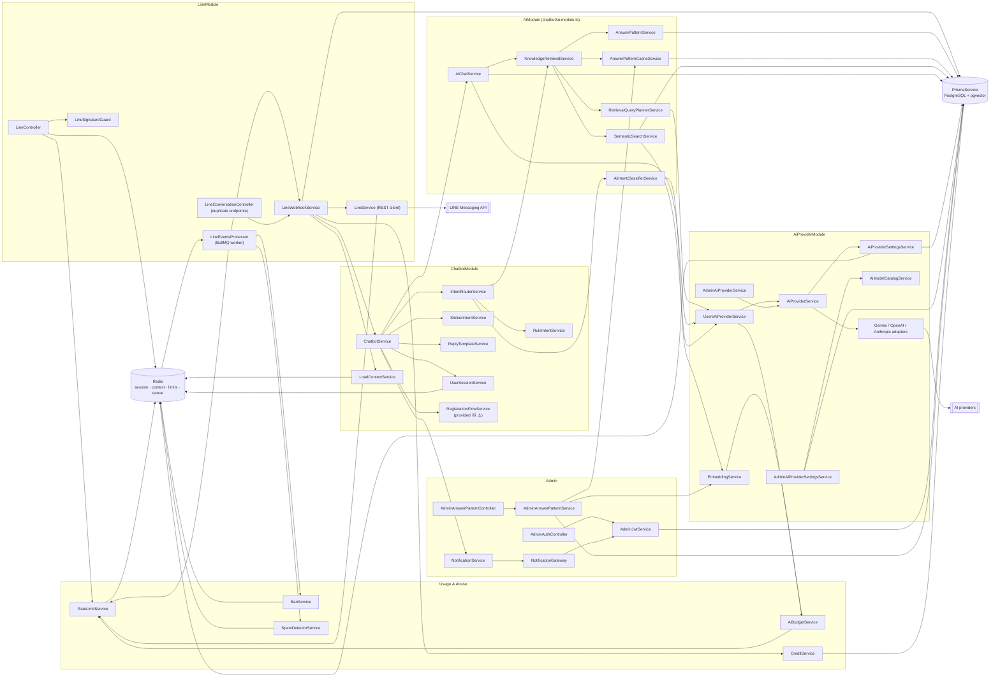

# Service Flows & Dependency Diagram

> อ้างอิงโค้ดจริง ณ 2026-08-15 (เขียนใหม่ทั้งไฟล์ — เวอร์ชันก่อนหน้าเป็น snapshot ของ architecture review เดือน ก.ค. ที่ไม่ตรงกับโค้ดแล้ว)
>
> Companion docs: [architecture.html](./architecture.html) (endpoint + ERD + data shapes) · [line-message-e2e-current.md](./line-message-e2e-current.md) (รายละเอียดระดับ field) · [erd-database.md](./erd-database.md) · [ai-chatbot-architecture.md](./ai-chatbot-architecture.md)

---

## 1. Full LINE Message Flow

```mermaid
sequenceDiagram
    autonumber
    participant U as LINE User
    participant LP as LINE Platform
    participant LC as LineController
    participant Q as BullMQ<br/>line-events
    participant WK as LineEventsProcessor
    participant LW as LineWebhookService
    participant CB as ChatbotService
    participant IR as IntentRouterService
    participant KR as KnowledgeRetrievalService
    participant AI as AiChatService
    participant RD as Redis<br/>session + context
    participant DB as PostgreSQL
    participant LA as LINE Messaging API

    U->>LP: text / image / sticker
    LP->>LC: POST /api/line/webhooks
    Note over LC: LineSignatureGuard = HMAC-SHA256(rawBody)
    LC->>LC: filter events ที่ไม่มี webhookEventId
    LC->>RD: rl:line:global:ingress (amount = จำนวน event)
    LC->>Q: add(jobId = webhookEventId)
    LC-->>LP: 200 {ok:true} (ไม่รอ AI/DB)

    Q->>WK: job
    WK->>WK: stale > 50s? ban? burst? hourly? spam?
    WK->>DB: INSERT ProcessedLineWebhookEvent (claim)
    WK->>LW: processEvent(event)
    LW->>LA: getProfile (ครั้งแรกของ user เท่านั้น)
    LW->>DB: upsert LineConversation + insert LineChatHistory(USER)<br/>+ update lastActiveAt (transaction)
    LW->>RD: LRANGE chat:context (conversationId) -3 -1
    LW->>CB: handleTextMessage / handleImageMessage / handleStickerMessage
    CB->>RD: GETEX chat:session (userId) — sliding TTL
    CB->>IR: resolve({userId, input, session, recentMessages})
    IR->>KR: retrieve(input) (เมื่อ rule ไม่ชี้ขาด)
    KR-->>IR: KnowledgeRetrievalResult
    IR-->>CB: RouteDecision
    CB->>AI: answerKnowledge / answerGeneral / answerImage
    AI-->>CB: AiAnswerResult
    CB-->>LW: ChatResponse {text, source, contextPolicy}
    LW->>LW: stale รอบสอง (> 50s → ไม่ตอบ)
    LW->>LA: replyText(replyToken) (ผ่าน rl:line:global:reply)
    LA-->>U: ข้อความตอบ
    LW->>DB: insert LineChatHistory(SYSTEM) + update conversation
    LW->>RD: appendTurn (INCLUDE) / clear (CLEAR) / ไม่ทำอะไร (EXCLUDE)
```

**Idempotency 3 ชั้น** — BullMQ `jobId = webhookEventId` · `ProcessedLineWebhookEvent.webhookEventId` unique · `LineChatHistory.lineMessageId` unique nullable
ถ้า `processEvent()` throw ก่อนตอบสำเร็จ processor จะ `releaseWebhookEvent()` แล้วโยนต่อให้ BullMQ retry (สูงสุด 3 ครั้ง)

---

## 2. Intent Routing Flow

`IntentRouterService.resolve()` — เส้นทางจริงในโค้ดปัจจุบัน (rule → session → retrieval → classifier)

```mermaid
flowchart TD
    IN["input text (trim แล้ว)"] --> GUARD{"ว่าง / ยาวเกิน<br/>AI_MAX_MESSAGE_LENGTH?"}
    GUARD -- ใช่ --> TPL["template ทันที<br/>(ไม่แตะ session, ไม่แตะ AI)"]
    GUARD -- ไม่ --> RULE["RuleIntentService.detect<br/>(deterministic, ไม่มี I/O)"]
    RULE --> C1{"intent = CANCEL?"}
    C1 -- ใช่ --> A_CANCEL["CANCEL_SESSION · source RULE · conf 1"]
    C1 -- ไม่ --> C2{"session ACTIVE<br/>และ flow = REGISTER?"}
    C2 -- ใช่ --> C3{"rule conf >= 0.9<br/>และไม่ใช่ UNKNOWN/REGISTER?"}
    C3 -- ใช่ --> A_INT["interrupt: ใช้ action ของ rule<br/>source SESSION (register session ยัง ACTIVE)"]
    C3 -- ไม่ --> A_CONT["CONTINUE_REGISTER · source SESSION"]
    C2 -- ไม่ --> C4{"rule conf >= 0.9?"}
    C4 -- ใช่ --> C5{"RULE_MAP action<br/>= ANSWER_KNOWLEDGE?"}
    C5 -- ไม่ --> A_RULE["คืน action ทันที · source RULE"]
    C5 -- ใช่ --> KR
    C4 -- ไม่ --> KR["KnowledgeRetrievalService.retrieve"]
    KR --> C6{"route"}
    C6 -- "DIRECT / RAG" --> A_KNOW["ANSWER_KNOWLEDGE<br/>source CACHE | DATABASE | EMBEDDING"]
    C6 -- LOW_CONFIDENCE --> LOWC["resolveLowConfidence()<br/>AiIntentClassifierService"]
    LOWC --> C7{"classification"}
    C7 -- GENERAL --> A_GEN["GENERAL_QUESTION + generatedResponse · source AI"]
    C7 -- BUSINESS --> A_ADM["CONTACT_ADMIN + businessFallback · source AI"]
```

**เส้นทางที่ไม่มีวันเกิด** — ไม่มี branch ไหนคืน `START_AI_CHAT`, `CONTINUE_AI_CHAT`, `FALLBACK`
และ `fromAi()` / `AI_MAP` / `AiIntentClassifierService.analyze()` / `classifierPrompt` ไม่ถูกเรียกจาก flow นี้แล้ว (เหลือไว้เป็น dead code)

**บั๊กที่ยังเปิด** — เมนู `2` → `RULE_MAP.GENERAL_QUESTION` → action `GENERAL_QUESTION` แต่ `answerGeneralDecision()` ต้องการ `decision.generatedResponse` ซึ่ง rule path ไม่เคยใส่ → ลูกค้าได้ fallback
เมนู `3` ไม่มี rule เลย ต้องวิ่งผ่าน retrieval + classifier

---

## 3. Register Session Flow

```mermaid
stateDiagram-v2
    [*] --> WAITING_REGISTER_FORM : START_REGISTER (CAN_REGISTER != 'false')
    WAITING_REGISTER_FORM --> SEND_REGISTER_FORM : ส่ง form template ทันที
    SEND_REGISTER_FORM --> SEND_REGISTER_FORM : parse + merge<br/>ขาด field / เบอร์ผิด / บัญชีผิด → ถามซ้ำ
    SEND_REGISTER_FORM --> CURRENT_REGISTER : ครบและ valid
    CURRENT_REGISTER --> [*] : register สำเร็จ → clear() session (กัน PII)<br/>ตอบ username + password
    CURRENT_REGISTER --> SEND_REGISTER_FORM : register error<br/>(ส่ง error.message ดิบให้ลูกค้า ⚠️)
    SEND_REGISTER_FORM --> [*] : CANCEL keyword
    note right of SEND_REGISTER_FORM
        digression: rule conf >= 0.9 ที่ไม่ใช่ REGISTER
        จะถูกตอบโดย session ยัง ACTIVE
        แต่ CONTACT_ADMIN เขียนทับ session
        ทำให้ข้อมูลฟอร์มหาย
    end note
    note right of CURRENT_REGISTER
        PENDING_REGISTER มีใน enum
        แต่ไม่มีเส้นทางไหนเข้า (dead state)
    end note
```

`RegisterParser` อ่านบรรทัดที่มี label (`ชื่อ: สมชาย`, alias ไทย/อังกฤษ) และเดาบรรทัดที่ไม่มี label (เบอร์ 10 หลัก, บัญชี 10–12 หลัก, alias ชื่อธนาคาร)
`RegisterValidator`: `phoneNumber` ต้องตรง `/^0\d{9}$/`, `bankAccount` ต้องตรง `/^\d{10,12}$/`
`RegistrationService.register()` เช็คซ้ำ phone/banknumber → สร้าง `mb{4 หลักท้าย}{rand}` + password hex 8 ตัว (เก็บ bcrypt) → retry ได้ 5 ครั้งเมื่อ username ชน

---

## 4. Knowledge Retrieval & Answer Flow

```mermaid
flowchart TD
    Q["query"] --> P1["pass 1: retrieveCandidatePass"]
    P1 --> C["AnswerPatternCache (RAM, refresh 240s)"]
    C --> C1{"decide = DIRECT?"}
    C1 -- ใช่ --> FAST["directFastPath = true"]
    C1 -- ไม่ --> D["AnswerPattern จาก DB (≤ 500 rows)"]
    D --> D1{"decide = DIRECT?"}
    D1 -- ใช่ --> FAST
    D1 -- ไม่ --> E["embedding + pgvector cosine (LIMIT 20)"]
    E --> M["mergeAndRank → candidate pool (≤ 20)"]
    FAST --> DEC
    M --> DEC{"decide()"}
    DEC -- "exact หรือ score>=0.95 & gap>=0.1" --> DIRECT["DIRECT → ตอบ answer verbatim (0 LLM call)"]
    DEC -- "มี score >= 0.6" --> RAG["RAG → generateFromKnowledge (≤ 3 contexts, temp 0)"]
    DEC -- "นอกนั้น" --> LOW["LOW_CONFIDENCE"]

    DEC --> PLAN{"shouldPlanSecondPass?"}
    PLAN -- ใช่ --> PL["RetrievalQueryPlannerService.plan()"]
    PL --> P2["pass 2 (ยิงขนาน ≤ 2 query)"]
    P2 --> DEC2["decide({allowDirect:false})<br/>คำตอบจาก query ที่ AI เขียนต้องผ่าน grounding เสมอ"]

    RAG --> INS{"โมเดลตอบ INSUFFICIENT_CONTEXT?"}
    INS -- ใช่ --> LOWC["ChatbotService → resolveLowConfidence()<br/>ตัดสินใหม่ GENERAL / BUSINESS"]
    INS -- ไม่ --> OUT["คำตอบ grounded"]
    LOW --> LOWC
```

**ลำดับความสำคัญของ `shouldPlanSecondPass()`** — small talk ที่ไม่มี candidate → ไม่ทำ · follow-up/complex → ทำ (มาก่อนเช็ค DIRECT โดยตั้งใจ) · DIRECT → ไม่ทำ · LOW_CONFIDENCE / gap < 0.1 / candidate ขัดแย้ง → ทำ
**Planner ไม่ใช้ LLM เมื่อ** เป็น follow-up ที่หาคำถามก่อนหน้าเจอ (rewrite เอง) หรือ `RETRIEVAL_ERROR` (ยิงใหม่ก็ล้มเหมือนเดิม)

---

## 5. Image & Sticker Flow

```mermaid
flowchart TD
    IMG["message.type = image"] --> EXT{"contentProvider.type = external?"}
    EXT -- ใช่ --> REJ["ตอบว่าไม่รองรับ (ไม่ดาวน์โหลดไฟล์นอก)"]
    EXT -- ไม่ --> DL["LineService.getImageContent<br/>ตรวจขนาด ≤ 8MB + sniff magic bytes"]
    DL --> POL["AiChatService.answerImage<br/>(ไม่ส่ง conversation history)"]
    POL --> CLS{"classification"}
    CLS -- SAFE_GENERAL --> BLK{"ผ่าน BLOCKED_ANSWER_PATTERNS?"}
    BLK -- ใช่ --> ANS["ตอบคำอธิบายภาพ"]
    BLK -- ไม่ --> FB["fallbackMessage"]
    CLS -- "TRANSACTION / BUSINESS_UNVERIFIED / UNREADABLE / JSON เสีย" --> FB

    ST["message.type = sticker"] --> S1{"THANKS?"}
    S1 -- ใช่ --> STH["stickerThanks() · EXCLUDE"]
    S1 -- ไม่ --> S2{"GREETING?"}
    S2 -- ใช่ --> STG["stickerGreeting() · EXCLUDE"]
    S2 -- ไม่ --> S3{"มี text?"}
    S3 -- ใช่ --> TXT["handleTextMessage(text) → flow ปกติ"]
    S3 -- ไม่ --> STU["stickerUnknown() · EXCLUDE"]
```

---

## 6. Admin / Contact Handoff Flow

```mermaid
sequenceDiagram
    autonumber
    participant U as LINE User
    participant CB as ChatbotService
    participant US as UserSessionService
    participant NS as NotificationService
    participant NG as NotificationGateway<br/>(socket.io /admin, JWT required)
    participant AD as Admin Dashboard
    participant LW as LineWebhookService
    participant LA as LINE API

    U->>CB: "ติดต่อแอดมิน" (rule 0.95) หรือ classifier ตอบ BUSINESS
    CB->>US: set session {flow: CONTACT_ADMIN, step: WAITING_ADMIN}
    CB->>NS: notifyContactAdmin(session)
    NS->>NG: emitContactAdmin
    NG-->>AD: broadcast "CONTACT_ADMIN" + payload session
    CB-->>U: contactAdmin() template หรือ fallback (เมื่อ businessFallback = true)
    Note over U,CB: บอทไม่ถูก mute — ข้อความถัดไปยังถูก route ปกติ ⚠️
    AD->>LW: POST /api/line/conversations/:id/messages (AdminGuard)
    LW->>LA: pushText(lineUserId, text)
    LW->>LW: insert LineChatHistory(ADMIN) + update conversation
    LA-->>U: ข้อความจากแอดมิน
```

**ช่องว่าง** — `LineConversation.status` ยังเป็น `"open"` เสมอ (ไม่มีโค้ดไหนเขียน) และไม่มีใครอ่าน session `CONTACT_ADMIN`
`ConversationSession.requireAdmin` ถูกประกาศไว้แล้วแต่ยังไม่ถูกใช้ (และทำให้ build พัง — ดู [line-message-e2e-current.md §13](./line-message-e2e-current.md))

---

## 7. Service Dependency Diagram

```mermaid
flowchart LR
    subgraph LINE["LineModule"]
        LC["LineController"]
        LCC["LineConversationController<br/>(duplicate endpoints)"]
        LEP["LineEventsProcessor<br/>(BullMQ worker)"]
        LWS["LineWebhookService"]
        LS["LineService (REST client)"]
        LSG["LineSignatureGuard"]
    end
    subgraph CHAT["ChatbotModule"]
        CB["ChatbotService"]
        IR["IntentRouterService"]
        RI["RuleIntentService"]
        SI["StickerIntentService"]
        RT["ReplyTemplateService"]
        US["UserSessionService"]
        LX["LoadContextService"]
        RF["RegistrationFlowService<br/>(provided ที่นี่ ⚠️)"]
    end
    subgraph AIM["AiModule (chatbot/ai.module.ts)"]
        ACS["AiChatService"]
        AIC["AiIntentClassifierService"]
        KRS["KnowledgeRetrievalService"]
        APS["AnswerPatternService"]
        APC["AnswerPatternCacheService"]
        SSS["SemanticSearchService"]
        RQP["RetrievalQueryPlannerService"]
    end
    subgraph PROV["AiProviderModule"]
        UAP["UsersAiProviderService"]
        AAP["AdminAiProviderService"]
        APS2["AiProviderService"]
        SET["AiProviderSettingsService"]
        ASET["AdminAiProviderSettingsService"]
        CAT["AiModelCatalogService"]
        EMB["EmbeddingService"]
        ADP["Gemini / OpenAI / Anthropic adapters"]
    end
    subgraph USAGE["Usage & Abuse"]
        RL["RateLimitService"]
        BUD["AiBudgetService"]
        BAN["BanService"]
        SPM["SpamDetectorService"]
        CS["CreditService"]
    end
    subgraph ADM["Admin"]
        AAC["AdminAuthController"]
        AJS["AdminJwtService"]
        AAPC["AdminAnswerPatternController"]
        AAPS["AdminAnswerPatternService"]
        NS["NotificationService"]
        NG["NotificationGateway"]
    end
    PR[("PrismaService<br/>PostgreSQL + pgvector")]
    RD[("Redis<br/>session · context · limits · queue")]
    LAPI[["LINE Messaging API"]]
    PAPI[["AI providers"]]

    LC --> LSG
    LC --> RL
    LC --> RD
    RD --> LEP
    LEP --> RL
    LEP --> BAN
    LEP --> SPM
    LEP --> LWS
    LCC --> LWS
    LWS --> PR
    LWS --> LS
    LWS --> LX
    LWS --> CB
    LWS --> CS
    LS --> LAPI
    LS --> RL
    CB --> IR
    CB --> US
    CB --> RT
    CB --> RF
    CB --> ACS
    CB --> SI
    CB --> NS
    IR --> RI
    IR --> KRS
    IR --> AIC
    KRS --> APS
    KRS --> APC
    KRS --> SSS
    KRS --> RQP
    APS --> PR
    APC --> PR
    SSS --> EMB
    SSS --> PR
    RQP --> UAP
    ACS --> PR
    ACS --> KRS
    ACS --> UAP
    AIC --> UAP
    UAP --> APS2
    AAP --> APS2
    APS2 --> SET
    APS2 --> ADP
    SET --> PR
    SET --> RD
    ASET --> PR
    ASET --> CAT
    EMB --> BUD
    ADP --> PAPI
    UAP --> BUD
    BUD --> RL
    RL --> RD
    BAN --> RD
    SPM --> RD
    US --> RD
    LX --> RD
    AAC --> AJS
    AJS --> PR
    AAPC --> AAPS
    AAPS --> PR
    AAPS --> EMB
    AAPS --> APC
    NS --> NG
    NG --> AJS
    CS --> PR
```

**Prisma โดยตรง:** `LineWebhookService`, `AiChatService` (อ่าน `AiSetting`), `AnswerPatternService`, `AnswerPatternCacheService`, `SemanticSearchService`, `AdminAnswerPatternService`, `AdminJwtService`, `AdminAuthService`, `AiProviderSettingsService`, `AdminAiProviderSettingsService`, `RegistrationService`, `UsersService`, `CreditService`
**Redis โดยตรง:** `UserSessionService`, `LoadContextService`, `RateLimitService`, `BanService`, `SpamDetectorService`, `AiProviderSettingsService` + BullMQ
**External:** `LineService` → LINE · adapters ทั้ง 3 + `GeminiEmbeddingAdapter` → AI providers

### สิ่งที่ยังควรจัดใหม่

- `LineConversationController` เป็น duplicate เต็ม ๆ ของ 3 endpoint ใน `LineController` — ควรเหลือชุดเดียว
- `ChatbotModule` ยัง provide `RegistrationFlowService` / `RegisterParser` / `RegisterValidator` เอง แทนที่จะ import จาก `RegistrationModule` (module boundary เบลอ)
- `AiChatService` ยังอ่าน `AiSetting` จาก Prisma เอง — แยกเป็น settings accessor เล็ก ๆ จะทำให้ service นี้ไม่ต้องรู้จัก DB
- ไม่มี global guard: route ที่ลืม `@AdminGuard()` เปิดสาธารณะเงียบ ๆ (`@Public()` เป็น metadata ที่ยังไม่มีใครอ่าน)
- ordering ต่อ user ใน `LineEventsProcessor` เป็น in-memory `Map` — ขยายเป็นหลาย instance เมื่อไหร่ต้องเปลี่ยนเป็น distributed lock
